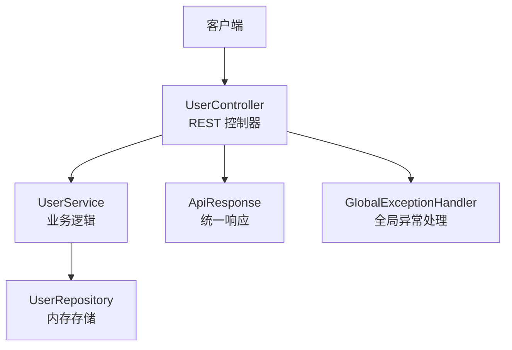
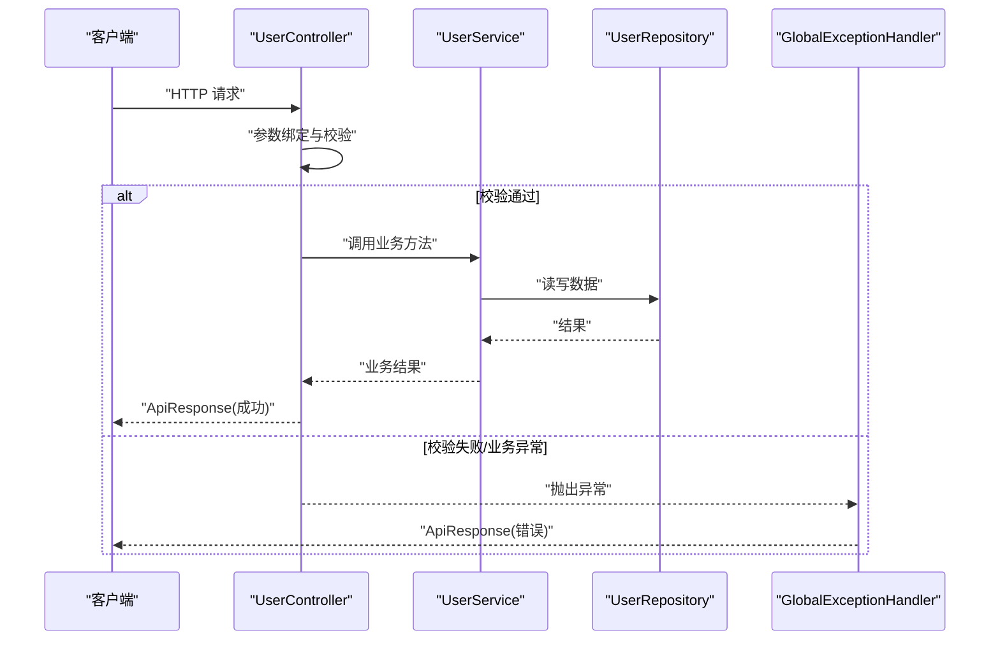
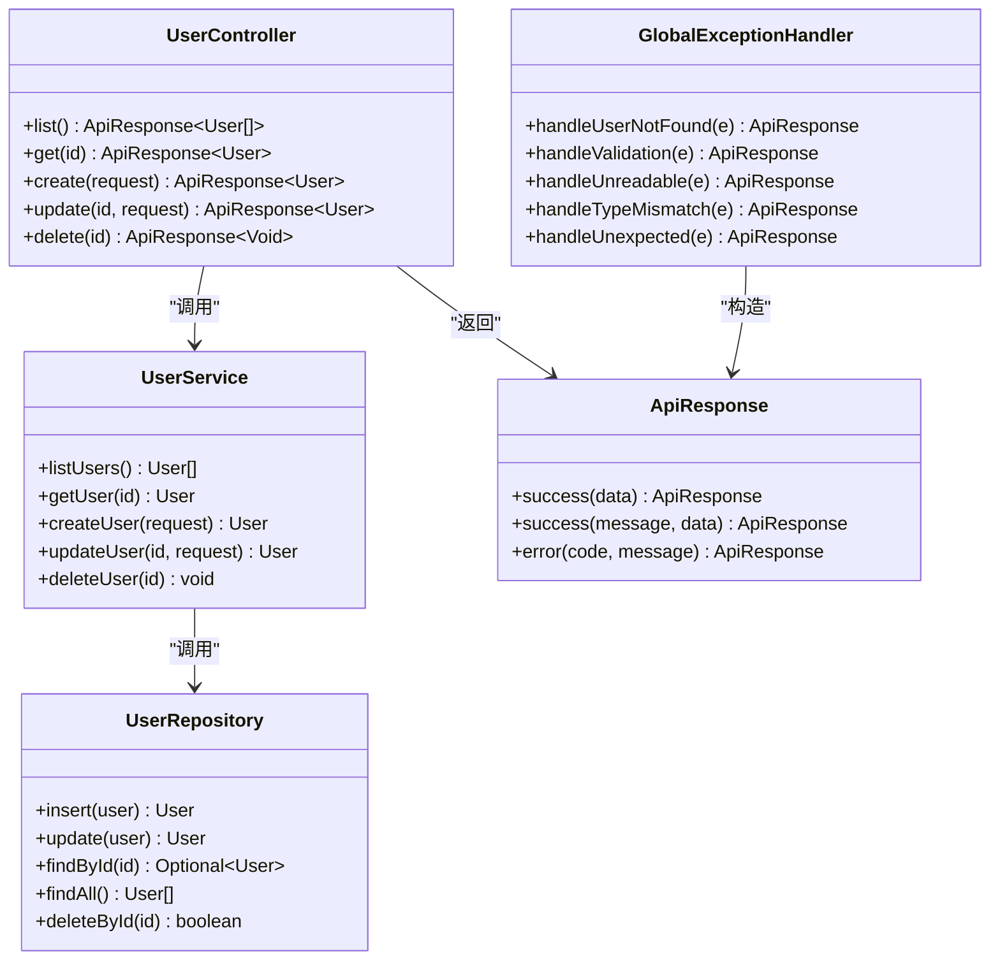

# API 接口文档

<cite>
**本文引用的文件**
- [UserController.java](file://backend/src/main/java/com/aicoding/backend/controller/UserController.java)
- [ApiResponse.java](file://backend/src/main/java/com/aicoding/backend/dto/ApiResponse.java)
- [UserRequest.java](file://backend/src/main/java/com/aicoding/backend/dto/UserRequest.java)
- [User.java](file://backend/src/main/java/com/aicoding/backend/model/User.java)
- [UserService.java](file://backend/src/main/java/com/aicoding/backend/service/UserService.java)
- [GlobalExceptionHandler.java](file://backend/src/main/java/com/aicoding/backend/exception/GlobalExceptionHandler.java)
- [UserNotFoundException.java](file://backend/src/main/java/com/aicoding/backend/exception/UserNotFoundException.java)
- [application.yml](file://backend/src/main/resources/application.yml)
</cite>

## 目录
1. [简介](#简介)
2. [项目结构](#项目结构)
3. [核心组件](#核心组件)
4. [架构总览](#架构总览)
5. [详细接口说明](#详细接口说明)
6. [依赖关系分析](#依赖关系分析)
7. [性能与可用性建议](#性能与可用性建议)
8. [故障排查指南](#故障排查指南)
9. [结论](#结论)
10. [附录](#附录)

## 简介
本接口文档面向用户管理模块的 RESTful API，覆盖用户的增删改查（CRUD）能力。所有接口统一返回 ApiResponse 格式，便于前端统一处理成功与错误场景。服务默认监听端口为 8080，基础路径为 /api/users。

## 项目结构
后端采用分层架构：控制器层暴露 HTTP 端点，服务层封装业务逻辑，仓储层提供数据访问（当前为内存实现），并通过全局异常处理器将异常转换为统一的响应体。

图表来源
- [UserController.java:24-65](file://backend/src/main/java/com/aicoding/backend/controller/UserController.java#L24-L65)
- [UserService.java:15-56](file://backend/src/main/java/com/aicoding/backend/service/UserService.java#L15-L56)
- [UserRepository.java:16-54](file://backend/src/main/java/com/aicoding/backend/repository/UserRepository.java#L16-L54)
- [ApiResponse.java:6-23](file://backend/src/main/java/com/aicoding/backend/dto/ApiResponse.java#L6-L23)
- [GlobalExceptionHandler.java:17-57](file://backend/src/main/java/com/aicoding/backend/exception/GlobalExceptionHandler.java#L17-L57)

章节来源
- [application.yml:1-11](file://backend/src/main/resources/application.yml#L1-L11)
- [UserController.java:24-65](file://backend/src/main/java/com/aicoding/backend/controller/UserController.java#L24-L65)

## 核心组件
- 统一响应体 ApiResponse：包含 code、message、data 三个字段，code=0 表示成功，非 0 表示失败；message 描述状态或错误信息；data 承载业务数据或 null。
- 请求体 UserRequest：用于新增和更新用户，包含 name、email、phone 字段，并带有校验注解。
- 用户实体 User：包含 id、name、email、phone、createdAt。
- 控制器 UserController：定义 /api/users 下的 CRUD 端点。
- 服务 UserService：实现用户查询、创建、更新、删除等逻辑，并在初始化时插入演示数据。
- 全局异常处理器 GlobalExceptionHandler：将参数校验失败、类型不匹配、用户不存在、未知异常等转换为 ApiResponse。

章节来源
- [ApiResponse.java:6-23](file://backend/src/main/java/com/aicoding/backend/dto/ApiResponse.java#L6-L23)
- [UserRequest.java:10-23](file://backend/src/main/java/com/aicoding/backend/dto/UserRequest.java#L10-L23)
- [User.java:8-14](file://backend/src/main/java/com/aicoding/backend/model/User.java#L8-L14)
- [UserController.java:24-65](file://backend/src/main/java/com/aicoding/backend/controller/UserController.java#L24-L65)
- [UserService.java:15-56](file://backend/src/main/java/com/aicoding/backend/service/UserService.java#L15-L56)
- [GlobalExceptionHandler.java:17-57](file://backend/src/main/java/com/aicoding/backend/exception/GlobalExceptionHandler.java#L17-L57)

## 架构总览
下图展示了从请求到响应的完整调用链，包括参数校验、业务处理、数据存储以及异常转换。

图表来源
- [UserController.java:34-64](file://backend/src/main/java/com/aicoding/backend/controller/UserController.java#L34-L64)
- [UserService.java:31-55](file://backend/src/main/java/com/aicoding/backend/service/UserService.java#L31-L55)
- [UserRepository.java:22-53](file://backend/src/main/java/com/aicoding/backend/repository/UserRepository.java#L22-L53)
- [GlobalExceptionHandler.java:20-56](file://backend/src/main/java/com/aicoding/backend/exception/GlobalExceptionHandler.java#L20-L56)

## 详细接口说明
以下接口均位于基础路径 /api/users。所有响应均为 ApiResponse<T>，其中：
- code：整数，0 表示成功，非 0 表示失败（如 400、404、500）。
- message：字符串，描述成功或失败原因。
- data：任意类型或 null，承载业务数据。

### 通用约定
- 内容类型：application/json
- 字符编码：UTF-8
- 版本策略：当前无显式版本前缀；如需演进，建议在 URL 中引入版本段（例如 /api/v1/users），并保持向后兼容。

### 1) 获取用户列表
- 方法：GET
- 路径：/api/users
- 请求参数：无
- 请求体：无
- 成功响应：
  - 状态码：200
  - 响应体：ApiResponse<List<User>>
  - data：用户数组
- 错误响应：
  - 状态码：500（服务器内部错误）
  - 响应体：ApiResponse<Void>

curl 示例
- curl -X GET http://localhost:8080/api/users

章节来源
- [UserController.java:34-38](file://backend/src/main/java/com/aicoding/backend/controller/UserController.java#L34-L38)
- [UserService.java:31-33](file://backend/src/main/java/com/aicoding/backend/service/UserService.java#L31-L33)
- [UserRepository.java:44-49](file://backend/src/main/java/com/aicoding/backend/repository/UserRepository.java#L44-L49)

### 2) 根据 ID 获取用户
- 方法：GET
- 路径：/api/users/{id}
- 路径参数：
  - id：Long，必需
- 成功响应：
  - 状态码：200
  - 响应体：ApiResponse<User>
- 错误响应：
  - 状态码：404（用户不存在）
  - 状态码：400（参数类型不正确，例如传入非数字）
  - 状态码：500（服务器内部错误）

curl 示例
- curl -X GET http://localhost:8080/api/users/1

章节来源
- [UserController.java:40-44](file://backend/src/main/java/com/aicoding/backend/controller/UserController.java#L40-L44)
- [UserService.java:35-38](file://backend/src/main/java/com/aicoding/backend/service/UserService.java#L35-L38)
- [GlobalExceptionHandler.java:44-49](file://backend/src/main/java/com/aicoding/backend/exception/GlobalExceptionHandler.java#L44-L49)
- [GlobalExceptionHandler.java:20-25](file://backend/src/main/java/com/aicoding/backend/exception/GlobalExceptionHandler.java#L20-L25)

### 3) 新增用户
- 方法：POST
- 路径：/api/users
- 请求头：Content-Type: application/json
- 请求体：UserRequest
  - name：必填，最大长度 50
  - email：必填，邮箱格式，最大长度 100
  - phone：可选，最大长度 20
- 成功响应：
  - 状态码：201
  - 响应体：ApiResponse<User>
- 错误响应：
  - 状态码：400（参数校验失败或请求体格式错误）
  - 状态码：500（服务器内部错误）

curl 示例
- curl -X POST http://localhost:8080/api/users \
  -H "Content-Type: application/json" \
  -d '{"name":"张三","email":"zhangsan@example.com","phone":"13800138000"}'

章节来源
- [UserController.java:46-51](file://backend/src/main/java/com/aicoding/backend/controller/UserController.java#L46-L51)
- [UserRequest.java:10-23](file://backend/src/main/java/com/aicoding/backend/dto/UserRequest.java#L10-L23)
- [UserService.java:40-43](file://backend/src/main/java/com/aicoding/backend/service/UserService.java#L40-L43)
- [GlobalExceptionHandler.java:27-42](file://backend/src/main/java/com/aicoding/backend/exception/GlobalExceptionHandler.java#L27-L42)

### 4) 更新用户
- 方法：PUT
- 路径：/api/users/{id}
- 路径参数：
  - id：Long，必需
- 请求头：Content-Type: application/json
- 请求体：UserRequest（同新增）
- 成功响应：
  - 状态码：200
  - 响应体：ApiResponse<User>
- 错误响应：
  - 状态码：400（参数校验失败、请求体格式错误或参数类型不正确）
  - 状态码：404（用户不存在）
  - 状态码：500（服务器内部错误）

curl 示例
- curl -X PUT http://localhost:8080/api/users/1 \
  -H "Content-Type: application/json" \
  -d '{"name":"张三三","email":"zhangsan@example.com","phone":"13800138000"}'

章节来源
- [UserController.java:53-57](file://backend/src/main/java/com/aicoding/backend/controller/UserController.java#L53-L57)
- [UserService.java:45-49](file://backend/src/main/java/com/aicoding/backend/service/UserService.java#L45-L49)
- [GlobalExceptionHandler.java:27-49](file://backend/src/main/java/com/aicoding/backend/exception/GlobalExceptionHandler.java#L27-L49)

### 5) 删除用户
- 方法：DELETE
- 路径：/api/users/{id}
- 路径参数：
  - id：Long，必需
- 成功响应：
  - 状态码：200
  - 响应体：ApiResponse<Void>
- 错误响应：
  - 状态码：404（用户不存在）
  - 状态码：400（参数类型不正确）
  - 状态码：500（服务器内部错误）

curl 示例
- curl -X DELETE http://localhost:8080/api/users/1

章节来源
- [UserController.java:59-64](file://backend/src/main/java/com/aicoding/backend/controller/UserController.java#L59-L64)
- [UserService.java:51-55](file://backend/src/main/java/com/aicoding/backend/service/UserService.java#L51-L55)
- [GlobalExceptionHandler.java:20-49](file://backend/src/main/java/com/aicoding/backend/exception/GlobalExceptionHandler.java#L20-L49)

## 依赖关系分析
- 控制器依赖服务层进行业务处理，服务层依赖仓储层进行数据存取。
- 全局异常处理器拦截各类异常并转换为 ApiResponse，确保响应一致性。
- 统一响应体 ApiResponse 被控制器和异常处理器共同使用。

图表来源
- [UserController.java:24-65](file://backend/src/main/java/com/aicoding/backend/controller/UserController.java#L24-L65)
- [UserService.java:15-56](file://backend/src/main/java/com/aicoding/backend/service/UserService.java#L15-L56)
- [UserRepository.java:16-54](file://backend/src/main/java/com/aicoding/backend/repository/UserRepository.java#L16-L54)
- [ApiResponse.java:6-23](file://backend/src/main/java/com/aicoding/backend/dto/ApiResponse.java#L6-L23)
- [GlobalExceptionHandler.java:17-57](file://backend/src/main/java/com/aicoding/backend/exception/GlobalExceptionHandler.java#L17-L57)

章节来源
- [UserController.java:24-65](file://backend/src/main/java/com/aicoding/backend/controller/UserController.java#L24-L65)
- [UserService.java:15-56](file://backend/src/main/java/com/aicoding/backend/service/UserService.java#L15-L56)
- [UserRepository.java:16-54](file://backend/src/main/java/com/aicoding/backend/repository/UserRepository.java#L16-L54)
- [ApiResponse.java:6-23](file://backend/src/main/java/com/aicoding/backend/dto/ApiResponse.java#L6-L23)
- [GlobalExceptionHandler.java:17-57](file://backend/src/main/java/com/aicoding/backend/exception/GlobalExceptionHandler.java#L17-L57)

## 性能与可用性建议
- 分页与过滤：当用户量增长时，建议对列表接口增加分页与筛选参数，避免一次性返回大量数据。
- 缓存：热点数据可考虑引入缓存层（如本地缓存或 Redis）以提升读取性能。
- 幂等性：更新与删除操作应保证幂等，避免重复请求导致副作用。
- 限流与熔断：在高并发场景下，建议增加限流与熔断保护。
- 日志与监控：记录关键请求与异常，配合监控系统快速定位问题。

[本节为通用建议，无需特定文件引用]

## 故障排查指南
常见错误及对应处理：
- 参数校验失败（400）：检查请求体是否符合 UserRequest 约束（name、email、phone 的长度与格式）。
- 请求体格式错误（400）：确认 Content-Type 为 application/json 且 JSON 语法正确。
- 路径参数类型不正确（400）：确保路径中的 id 为数字。
- 用户不存在（404）：检查 id 是否存在于存储中。
- 服务器内部错误（500）：查看服务端日志，定位具体异常堆栈。

章节来源
- [GlobalExceptionHandler.java:27-56](file://backend/src/main/java/com/aicoding/backend/exception/GlobalExceptionHandler.java#L27-L56)
- [UserNotFoundException.java:6-10](file://backend/src/main/java/com/aicoding/backend/exception/UserNotFoundException.java#L6-L10)

## 结论
该用户管理 API 提供了清晰的 CRUD 能力，并通过统一响应体与全局异常处理保证了前后端交互的一致性与可维护性。建议在生产环境中替换内存存储为持久化数据库，并完善分页、鉴权、审计与监控等能力。

[本节为总结性内容，无需特定文件引用]

## 附录

### 统一响应体 ApiResponse 规范
- 字段
  - code：整数，0 表示成功，非 0 表示失败（如 400、404、500）。
  - message：字符串，描述成功或失败原因。
  - data：任意类型或 null，承载业务数据。
- 取值范围
  - code：成功为 0；失败为业务相关错误码（如 400、404、500）。
  - message：可读的错误或成功提示。
  - data：根据接口不同返回相应数据结构或 null。

章节来源
- [ApiResponse.java:6-23](file://backend/src/main/java/com/aicoding/backend/dto/ApiResponse.java#L6-L23)

### 请求体 UserRequest 字段验证规则
- name
  - 必填
  - 最大长度 50
- email
  - 必填
  - 必须为合法邮箱格式
  - 最大长度 100
- phone
  - 可选
  - 最大长度 20

章节来源
- [UserRequest.java:10-23](file://backend/src/main/java/com/aicoding/backend/dto/UserRequest.java#L10-L23)

### 用户实体 User 字段说明
- id：唯一标识，Long
- name：姓名，String
- email：邮箱，String
- phone：手机号，可为空
- createdAt：创建时间，LocalDateTime

章节来源
- [User.java:8-14](file://backend/src/main/java/com/aicoding/backend/model/User.java#L8-L14)

### 版本管理与向后兼容性
- 当前未引入显式版本前缀。若未来需要演进，建议在 URL 中引入版本段（例如 /api/v1/users），并对旧版本保持兼容或提供迁移期。
- 变更原则：新增字段优先，避免破坏性修改；废弃字段需保留并标注弃用；重大变更通过新版本发布。

[本节为通用策略，无需特定文件引用]

### 最佳实践
- 请求头设置：始终设置 Content-Type: application/json。
- 参数校验：在请求体中使用校验注解，减少服务端判断成本。
- 错误处理：统一捕获并返回 ApiResponse，前端按 code 分支处理。
- 幂等设计：对更新与删除操作保证幂等，避免重复提交造成副作用。
- 安全建议：生产环境启用 HTTPS、鉴权与访问控制。

[本节为通用建议，无需特定文件引用]