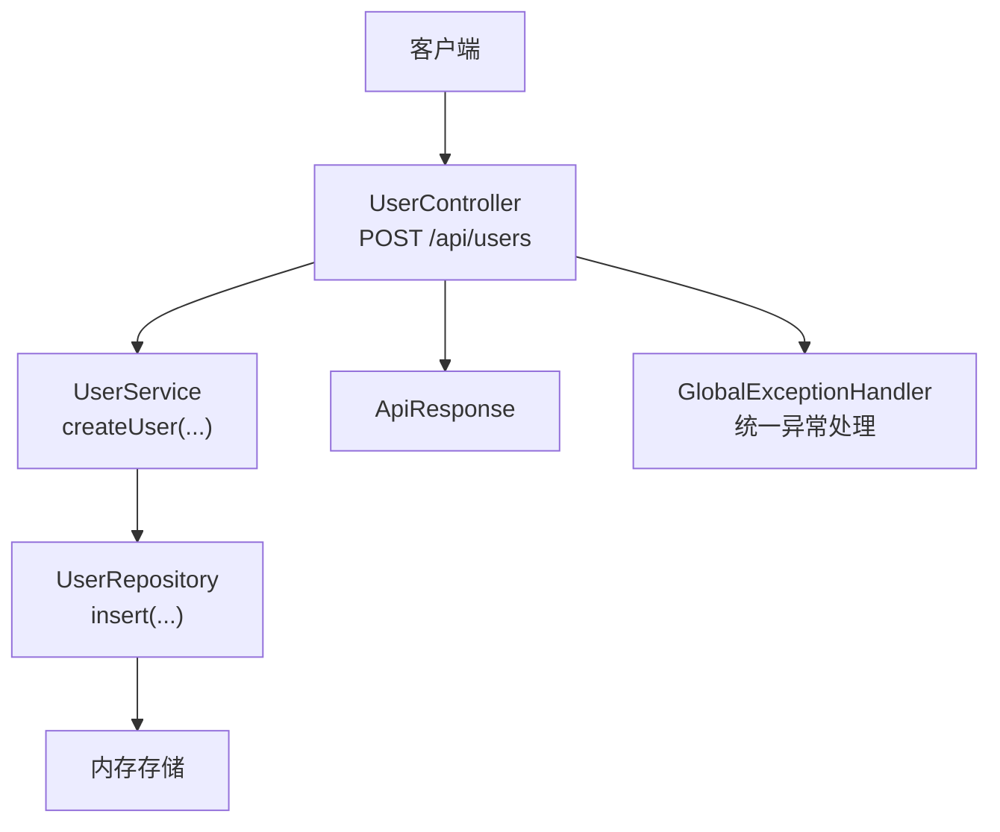
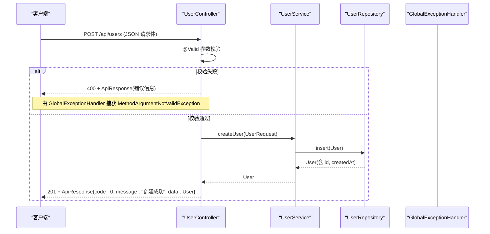
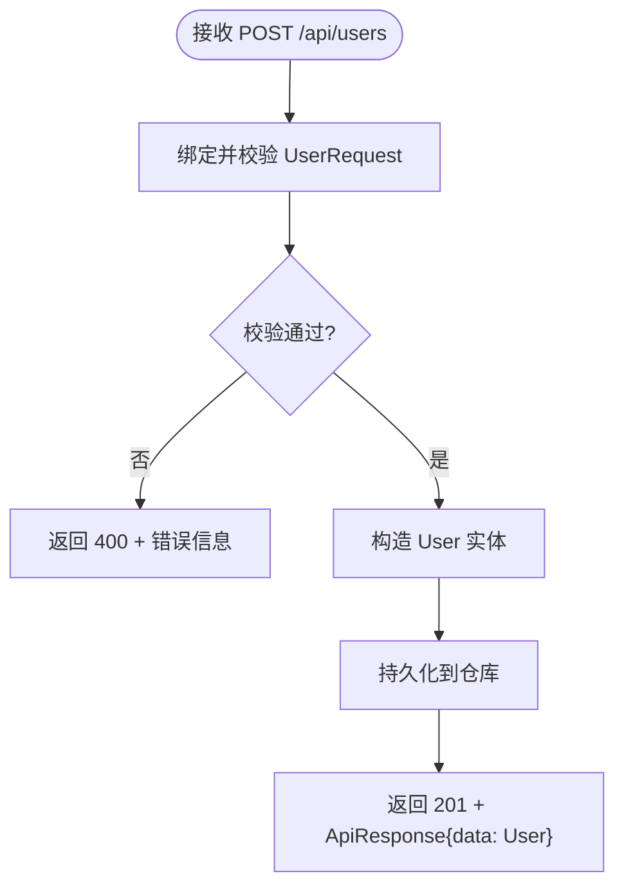
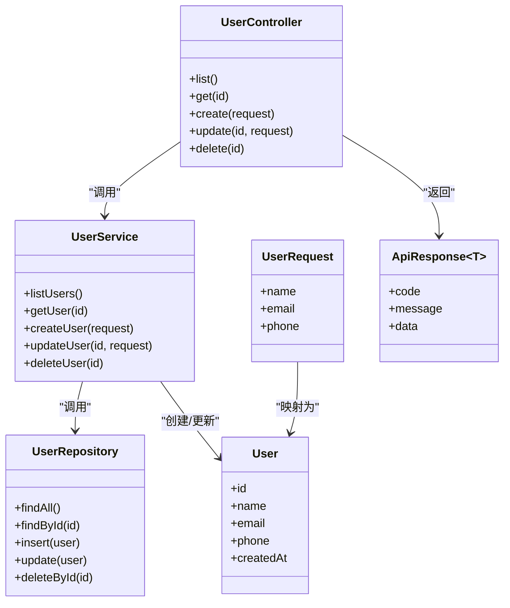

# 用户创建接口

<cite>
**本文引用的文件**
- [UserController.java](file://backend/src/main/java/com/aicoding/backend/controller/UserController.java)
- [UserRequest.java](file://backend/src/main/java/com/aicoding/backend/dto/UserRequest.java)
- [ApiResponse.java](file://backend/src/main/java/com/aicoding/backend/dto/ApiResponse.java)
- [UserService.java](file://backend/src/main/java/com/aicoding/backend/service/UserService.java)
- [User.java](file://backend/src/main/java/com/aicoding/backend/model/User.java)
- [GlobalExceptionHandler.java](file://backend/src/main/java/com/aicoding/backend/exception/GlobalExceptionHandler.java)
- [UserApiTest.java](file://backend/src/test/java/com/aicoding/backend/UserApiTest.java)
- [README.md](file://README.md)
</cite>

## 目录
1. [简介](#简介)
2. [项目结构](#项目结构)
3. [核心组件](#核心组件)
4. [架构总览](#架构总览)
5. [详细组件分析](#详细组件分析)
6. [依赖关系分析](#依赖关系分析)
7. [性能考虑](#性能考虑)
8. [故障排查指南](#故障排查指南)
9. [结论](#结论)
10. [附录：API 规范与示例](#附录api-规范与示例)

## 简介
本章节聚焦于 POST /api/users 用户创建接口的实现细节，涵盖请求体 UserRequest 的字段定义、校验规则与约束条件；说明 JSON 请求格式、响应结构与状态码（特别是 201）的使用场景；并提供错误处理说明与 curl 调用示例。

## 项目结构
后端采用 Spring Boot 分层架构：控制器负责路由与参数绑定，服务层封装业务逻辑，仓储层负责数据存取，DTO 用于请求与响应建模，异常处理器统一返回 ApiResponse。

图表来源
- [UserController.java:24-51](file://backend/src/main/java/com/aicoding/backend/controller/UserController.java#L24-L51)
- [UserService.java:40-43](file://backend/src/main/java/com/aicoding/backend/service/UserService.java#L40-L43)
- [GlobalExceptionHandler.java:17-56](file://backend/src/main/java/com/aicoding/backend/exception/GlobalExceptionHandler.java#L17-L56)

章节来源
- [README.md:92-112](file://README.md#L92-L112)

## 核心组件
- 控制器：UserController 暴露 REST 端点，包含新增用户的 POST /api/users。
- 数据传输对象：UserRequest 定义请求体字段及校验注解。
- 业务服务：UserService 将请求转换为实体并持久化。
- 模型：User 表示用户实体。
- 统一响应：ApiResponse 提供成功/失败的标准包装。
- 全局异常：GlobalExceptionHandler 将校验失败、JSON 解析错误等转为统一错误响应。

章节来源
- [UserController.java:24-51](file://backend/src/main/java/com/aicoding/backend/controller/UserController.java#L24-L51)
- [UserRequest.java:10-23](file://backend/src/main/java/com/aicoding/backend/dto/UserRequest.java#L10-L23)
- [UserService.java:40-43](file://backend/src/main/java/com/aicoding/backend/service/UserService.java#L40-L43)
- [User.java:8-14](file://backend/src/main/java/com/aicoding/backend/model/User.java#L8-L14)
- [ApiResponse.java:6-22](file://backend/src/main/java/com/aicoding/backend/dto/ApiResponse.java#L6-L22)
- [GlobalExceptionHandler.java:17-56](file://backend/src/main/java/com/aicoding/backend/exception/GlobalExceptionHandler.java#L17-L56)

## 架构总览
下图展示一次“创建用户”请求从进入控制器到返回响应的完整流程，包括参数校验、业务处理、数据持久化与异常处理。

图表来源
- [UserController.java:46-51](file://backend/src/main/java/com/aicoding/backend/controller/UserController.java#L46-L51)
- [UserService.java:40-43](file://backend/src/main/java/com/aicoding/backend/service/UserService.java#L40-L43)
- [GlobalExceptionHandler.java:27-35](file://backend/src/main/java/com/aicoding/backend/exception/GlobalExceptionHandler.java#L27-L35)

## 详细组件分析

### 请求体 UserRequest 字段定义与校验
- name
  - 类型：字符串
  - 必填：是（@NotBlank）
  - 长度限制：最大 50 字符（@Size(max=50)）
  - 业务规则：非空且不超过长度上限
- email
  - 类型：字符串
  - 必填：是（@NotBlank）
  - 格式：邮箱格式（@Email）
  - 长度限制：最大 100 字符（@Size(max=100)）
  - 业务规则：必须为合法邮箱格式且不超过长度上限
- phone
  - 类型：字符串
  - 必填：否（无 @NotBlank）
  - 长度限制：最大 20 字符（@Size(max=20)）
  - 业务规则：若提供则不超过长度上限

章节来源
- [UserRequest.java:10-23](file://backend/src/main/java/com/aicoding/backend/dto/UserRequest.java#L10-L23)

### 请求体 JSON 格式要求
- Content-Type 应为 application/json
- 请求体为对象，包含以下键：
  - name：字符串，必填，长度 ≤ 50
  - email：字符串，必填，邮箱格式，长度 ≤ 100
  - phone：字符串，可选，长度 ≤ 20
- 示例（以测试用例为依据）：
  - 创建时传入 name、email、phone
  - 更新时也使用相同结构

章节来源
- [UserApiTest.java:34-38](file://backend/src/test/java/com/aicoding/backend/UserApiTest.java#L34-L38)
- [UserApiTest.java:69-73](file://backend/src/test/java/com/aicoding/backend/UserApiTest.java#L69-L73)

### 响应结构与状态码
- 成功响应
  - HTTP 状态码：201 Created（由控制器方法上的 @ResponseStatus(HttpStatus.CREATED) 设置）
  - 响应体：统一 ApiResponse<User>
    - code：0
    - message："创建成功"
    - data：User 对象，包含 id、name、email、phone、createdAt
- 失败响应
  - 参数校验失败：HTTP 400，统一 ApiResponse，message 汇总各字段错误信息
  - JSON 解析失败：HTTP 400，message 提示“请求体格式错误”
  - 路径参数类型不匹配：HTTP 400，message 提示参数类型不正确
  - 未知异常：HTTP 500，message 提示服务器内部错误

章节来源
- [UserController.java:46-51](file://backend/src/main/java/com/aicoding/backend/controller/UserController.java#L46-L51)
- [ApiResponse.java:8-22](file://backend/src/main/java/com/aicoding/backend/dto/ApiResponse.java#L8-L22)
- [GlobalExceptionHandler.java:27-56](file://backend/src/main/java/com/aicoding/backend/exception/GlobalExceptionHandler.java#L27-L56)

### 业务流程时序图（创建用户）

图表来源
- [UserController.java:46-51](file://backend/src/main/java/com/aicoding/backend/controller/UserController.java#L46-L51)
- [UserService.java:40-43](file://backend/src/main/java/com/aicoding/backend/service/UserService.java#L40-L43)
- [GlobalExceptionHandler.java:27-35](file://backend/src/main/java/com/aicoding/backend/exception/GlobalExceptionHandler.java#L27-L35)

### 类关系图（代码级）

图表来源
- [UserController.java:24-64](file://backend/src/main/java/com/aicoding/backend/controller/UserController.java#L24-L64)
- [UserService.java:15-55](file://backend/src/main/java/com/aicoding/backend/service/UserService.java#L15-L55)
- [UserRequest.java:10-23](file://backend/src/main/java/com/aicoding/backend/dto/UserRequest.java#L10-L23)
- [User.java:8-14](file://backend/src/main/java/com/aicoding/backend/model/User.java#L8-L14)
- [ApiResponse.java:6-22](file://backend/src/main/java/com/aicoding/backend/dto/ApiResponse.java#L6-L22)

## 依赖关系分析
- 控制器依赖服务层进行业务处理，并通过统一响应对象封装结果。
- 服务层依赖仓储层完成数据操作，并在不存在时抛出业务异常。
- 全局异常处理器集中处理校验失败、JSON 解析错误、类型不匹配与未知异常，确保一致的 API 行为。
- 测试覆盖完整生命周期与参数校验失败场景，验证了 201 与 400 的行为。

章节来源
- [UserController.java:24-64](file://backend/src/main/java/com/aicoding/backend/controller/UserController.java#L24-L64)
- [UserService.java:15-55](file://backend/src/main/java/com/aicoding/backend/service/UserService.java#L15-L55)
- [GlobalExceptionHandler.java:17-56](file://backend/src/main/java/com/aicoding/backend/exception/GlobalExceptionHandler.java#L17-L56)
- [UserApiTest.java:30-112](file://backend/src/test/java/com/aicoding/backend/UserApiTest.java#L30-L112)

## 性能考虑
- 当前仓储为内存存储，适合演示与轻量场景；生产环境建议替换为数据库以实现持久化与并发安全。
- 校验在控制器层完成，避免无效请求进入业务层，减少不必要的处理开销。
- 统一响应对象减少重复包装逻辑，便于前端一致化处理。

[本节为通用指导，无需特定文件引用]

## 故障排查指南
- 400 参数校验失败
  - 现象：返回 400，message 包含字段名与错误原因（如“姓名不能为空; 邮箱格式不正确”）。
  - 可能原因：name/email 为空或不符合格式；phone 超过长度。
  - 定位：检查请求体字段是否符合 UserRequest 的校验规则。
- 400 JSON 解析失败
  - 现象：返回 400，message 为“请求体格式错误”。
  - 可能原因：Content-Type 不是 application/json；JSON 语法错误；缺少必要字段导致无法绑定。
- 404 资源不存在
  - 现象：查询或更新/删除时返回 404。
  - 可能原因：ID 不存在。
- 500 服务器内部错误
  - 现象：未知异常兜底返回 500。
  - 可能原因：未预期的运行时异常。

章节来源
- [GlobalExceptionHandler.java:27-56](file://backend/src/main/java/com/aicoding/backend/exception/GlobalExceptionHandler.java#L27-L56)
- [UserApiTest.java:99-112](file://backend/src/test/java/com/aicoding/backend/UserApiTest.java#L99-L112)

## 结论
POST /api/users 提供了标准的用户创建能力：通过 UserRequest 进行强校验，成功后返回 201 与包含新用户的 ApiResponse；失败时通过全局异常处理器返回统一的 400 错误信息。该设计清晰、可维护，便于前后端协作与扩展。

[本节为总结性内容，无需特定文件引用]

## 附录：API 规范与示例

### 端点概览
- 方法：POST
- 路径：/api/users
- 请求头：Content-Type: application/json
- 请求体：UserRequest（name、email、phone）
- 成功响应：HTTP 201，body 为 ApiResponse<User>
- 失败响应：HTTP 400/500，body 为 ApiResponse<Void>

章节来源
- [UserController.java:46-51](file://backend/src/main/java/com/aicoding/backend/controller/UserController.java#L46-L51)
- [ApiResponse.java:8-22](file://backend/src/main/java/com/aicoding/backend/dto/ApiResponse.java#L8-L22)

### 请求体字段说明
- name
  - 类型：string
  - 必填：是
  - 长度：≤ 50
  - 规则：非空
- email
  - 类型：string
  - 必填：是
  - 格式：邮箱格式
  - 长度：≤ 100
- phone
  - 类型：string
  - 必填：否
  - 长度：≤ 20

章节来源
- [UserRequest.java:10-23](file://backend/src/main/java/com/aicoding/backend/dto/UserRequest.java#L10-L23)

### 响应体结构
- 成功（201）
  - code：0
  - message："创建成功"
  - data：User 对象
    - id：long
    - name：string
    - email：string
    - phone：string?
    - createdAt：时间戳
- 失败（400/500）
  - code：非 0
  - message：错误描述
  - data：null

章节来源
- [ApiResponse.java:8-22](file://backend/src/main/java/com/aicoding/backend/dto/ApiResponse.java#L8-L22)
- [User.java:8-14](file://backend/src/main/java/com/aicoding/backend/model/User.java#L8-L14)

### 请求与响应示例（基于测试）
- 请求体示例（创建）
  - name: "测试用户"
  - email: "tester@example.com"
  - phone: "13800000000"
- 成功响应
  - HTTP 状态码：201
  - body.code：0
  - body.message："创建成功"
  - body.data：包含 id、name、email、phone、createdAt 的用户对象

章节来源
- [UserApiTest.java:34-48](file://backend/src/test/java/com/aicoding/backend/UserApiTest.java#L34-L48)
- [UserApiTest.java:40-41](file://backend/src/test/java/com/aicoding/backend/UserApiTest.java#L40-L41)

### curl 命令示例
- 创建新用户
  - 方法：POST
  - URL：http://localhost:8080/api/users
  - 头部：Content-Type: application/json
  - 请求体：包含 name、email、phone 的 JSON 对象
- 参考 README 中的 curl 示例

章节来源
- [README.md:104-112](file://README.md#L104-L112)