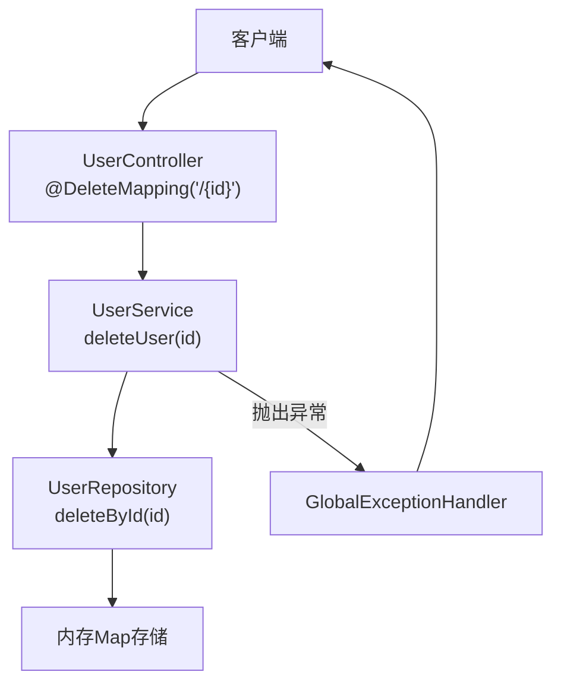
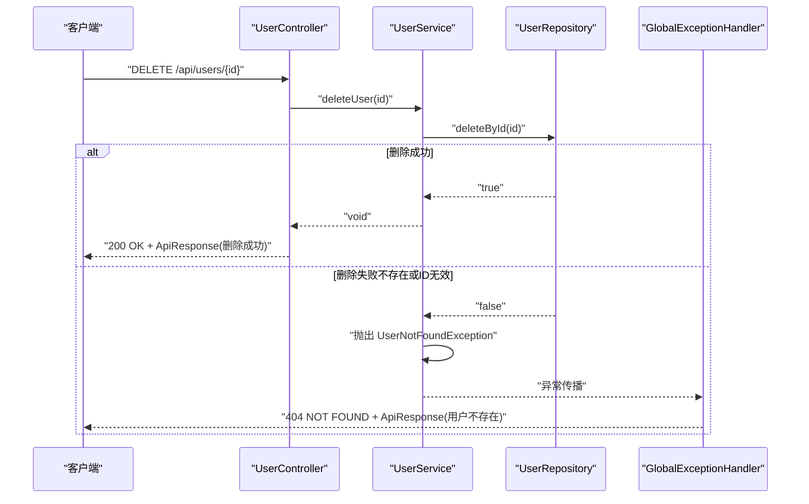
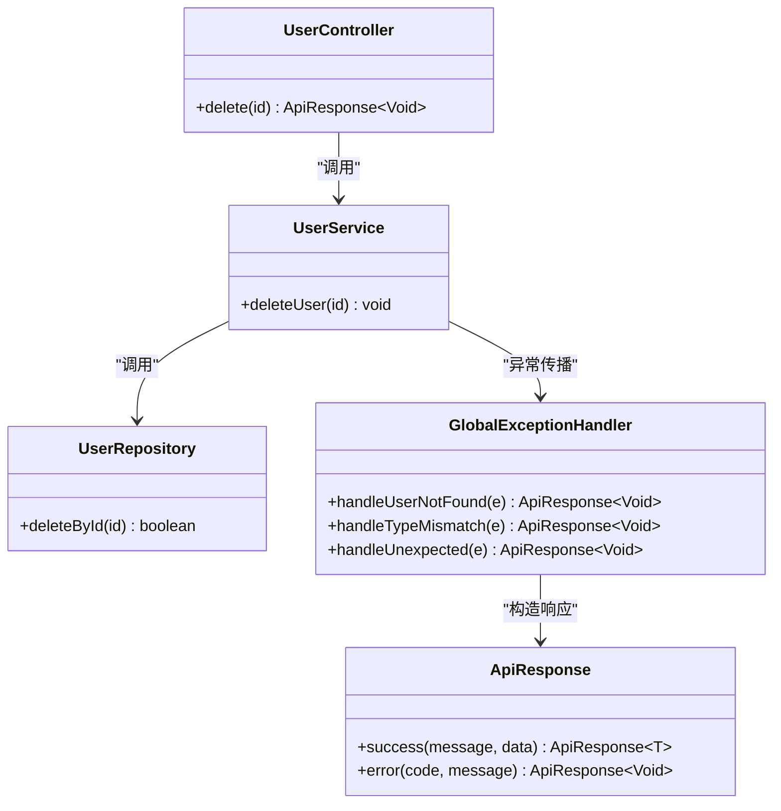
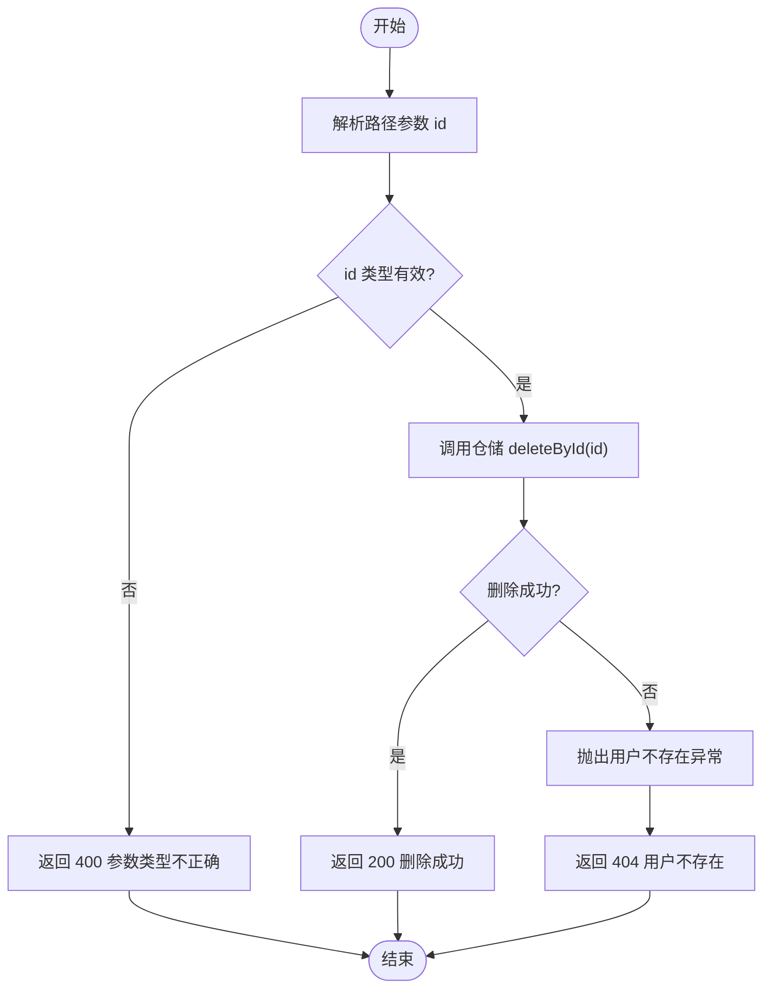

# 用户删除接口

<cite>
**本文引用的文件**
- [UserController.java](file://backend/src/main/java/com/aicoding/backend/controller/UserController.java)
- [UserService.java](file://backend/src/main/java/com/aicoding/backend/service/UserService.java)
- [UserRepository.java](file://backend/src/main/java/com/aicoding/backend/repository/UserRepository.java)
- [User.java](file://backend/src/main/java/com/aicoding/backend/model/User.java)
- [ApiResponse.java](file://backend/src/main/java/com/aicoding/backend/dto/ApiResponse.java)
- [GlobalExceptionHandler.java](file://backend/src/main/java/com/aicoding/backend/exception/GlobalExceptionHandler.java)
- [UserNotFoundException.java](file://backend/src/main/java/com/aicoding/backend/exception/UserNotFoundException.java)
- [application.yml](file://backend/src/main/resources/application.yml)
- [user.ts](file://frontend/src/api/user.ts)
</cite>

## 目录
1. [简介](#简介)
2. [项目结构](#项目结构)
3. [核心组件](#核心组件)
4. [架构总览](#架构总览)
5. [详细组件分析](#详细组件分析)
6. [依赖关系分析](#依赖关系分析)
7. [性能考虑](#性能考虑)
8. [故障排查指南](#故障排查指南)
9. [结论](#结论)
10. [附录](#附录)

## 简介
本文件面向后端与前端开发者，详细说明 DELETE /api/users/{id} 接口的实现细节、参数校验、存在性检查、幂等性与安全性、请求与响应格式、业务逻辑（含数据持久化与关联数据处理）、不可逆性与数据恢复机制、错误处理以及 curl 调用示例。该接口用于按用户 ID 删除用户记录。

## 项目结构
本项目采用典型的分层架构：
- 控制器层：接收 HTTP 请求并路由到服务层
- 服务层：封装业务规则与事务边界
- 仓储层：负责数据访问（当前为内存存储，便于演示）
- 模型与 DTO：定义实体与统一响应结构
- 异常处理：全局统一异常捕获与响应格式化
- 配置：应用端口与日志级别

图表来源
- [UserController.java:59-64](file://backend/src/main/java/com/aicoding/backend/controller/UserController.java#L59-L64)
- [UserService.java:51-55](file://backend/src/main/java/com/aicoding/backend/service/UserService.java#L51-L55)
- [UserRepository.java:51-53](file://backend/src/main/java/com/aicoding/backend/repository/UserRepository.java#L51-L53)
- [GlobalExceptionHandler.java:20-25](file://backend/src/main/java/com/aicoding/backend/exception/GlobalExceptionHandler.java#L20-L25)

章节来源
- [application.yml:1-11](file://backend/src/main/resources/application.yml#L1-L11)

## 核心组件
- 控制器：提供 REST 端点映射与基本入参绑定
- 服务：实现删除的业务流程与存在性校验
- 仓储：提供删除操作与返回是否成功
- 异常处理器：将业务异常转换为统一响应
- 统一响应：对外暴露 code/message/data 结构

章节来源
- [UserController.java:24-64](file://backend/src/main/java/com/aicoding/backend/controller/UserController.java#L24-L64)
- [UserService.java:15-55](file://backend/src/main/java/com/aicoding/backend/service/UserService.java#L15-L55)
- [UserRepository.java:16-53](file://backend/src/main/java/com/aicoding/backend/repository/UserRepository.java#L16-L53)
- [ApiResponse.java:6-22](file://backend/src/main/java/com/aicoding/backend/dto/ApiResponse.java#L6-L22)
- [GlobalExceptionHandler.java:17-56](file://backend/src/main/java/com/aicoding/backend/exception/GlobalExceptionHandler.java#L17-L56)

## 架构总览
下图展示一次删除请求从进入控制器到仓储层执行删除的完整调用链，以及异常路径的统一处理。

图表来源
- [UserController.java:59-64](file://backend/src/main/java/com/aicoding/backend/controller/UserController.java#L59-L64)
- [UserService.java:51-55](file://backend/src/main/java/com/aicoding/backend/service/UserService.java#L51-L55)
- [UserRepository.java:51-53](file://backend/src/main/java/com/aicoding/backend/repository/UserRepository.java#L51-L53)
- [GlobalExceptionHandler.java:20-25](file://backend/src/main/java/com/aicoding/backend/exception/GlobalExceptionHandler.java#L20-L25)

## 详细组件分析

### URL 路径参数与类型校验
- 路径参数：/api/users/{id}，id 类型为 Long
- 类型不匹配时（例如传入非数字），由全局异常处理器返回 400 错误，提示“参数类型不正确”
- 空值与非法值在仓储层 deleteById 中会直接返回 false，随后在服务层抛出“用户不存在”异常

章节来源
- [UserController.java:59-64](file://backend/src/main/java/com/aicoding/backend/controller/UserController.java#L59-L64)
- [GlobalExceptionHandler.java:44-49](file://backend/src/main/java/com/aicoding/backend/exception/GlobalExceptionHandler.java#L44-L49)
- [UserRepository.java:51-53](file://backend/src/main/java/com/aicoding/backend/repository/UserRepository.java#L51-L53)

### 删除前存在性检查
- 服务层通过仓储层的 deleteById 返回值判断是否存在
- 若返回 false，则抛出 UserNotFoundException，由全局异常处理器转为 404 响应

章节来源
- [UserService.java:51-55](file://backend/src/main/java/com/aicoding/backend/service/UserService.java#L51-L55)
- [UserNotFoundException.java:6-10](file://backend/src/main/java/com/aicoding/backend/exception/UserNotFoundException.java#L6-L10)
- [GlobalExceptionHandler.java:20-25](file://backend/src/main/java/com/aicoding/backend/exception/GlobalExceptionHandler.java#L20-L25)

### 幂等性与安全性
- 幂等性：对同一 id 重复发起删除请求，首次成功后后续请求均返回“用户不存在”，符合幂等语义（多次相同请求结果一致）
- 安全性：
  - 建议在生产环境增加鉴权与授权校验（如基于角色的访问控制），确保仅授权用户可删除他人数据
  - 建议增加防重放与速率限制，避免恶意批量删除
  - 建议在审计日志中记录删除操作的关键信息（操作人、时间、目标ID）

[本节为通用安全建议，不直接引用具体代码]

### 业务逻辑与数据持久化策略
- 当前仓储层使用内存 Map 存储，进程重启后数据丢失
- 删除操作为即时物理删除，无软删除标记
- 关联数据处理：当前未实现级联删除；若未来引入订单、评论等关联表，应在数据库层面或事务中处理外键约束与级联删除策略

章节来源
- [UserRepository.java:13-15](file://backend/src/main/java/com/aicoding/backend/repository/UserRepository.java#L13-L15)
- [UserRepository.java:51-53](file://backend/src/main/java/com/aicoding/backend/repository/UserRepository.java#L51-L53)

### 不可逆性与数据恢复机制
- 当前删除为不可逆操作，无法通过接口恢复
- 建议方案：
  - 引入软删除字段（如 deleted_at），并在查询时过滤已删除记录
  - 建立定期备份与快照机制，支持误删恢复
  - 保留操作审计日志，便于追溯与回滚

[本节为通用设计建议，不直接引用具体代码]

### 请求与响应格式
- 请求方法：DELETE
- 请求路径：/api/users/{id}
- 路径参数：id（Long），必须为正整数
- 成功响应：HTTP 200，统一响应体包含 code=0、message="删除成功"、data=null
- 失败响应：
  - 404：用户不存在
  - 400：参数类型不正确（例如 id 为非数字）
  - 500：服务器内部错误（兜底）

章节来源
- [UserController.java:59-64](file://backend/src/main/java/com/aicoding/backend/controller/UserController.java#L59-L64)
- [ApiResponse.java:6-22](file://backend/src/main/java/com/aicoding/backend/dto/ApiResponse.java#L6-L22)
- [GlobalExceptionHandler.java:20-56](file://backend/src/main/java/com/aicoding/backend/exception/GlobalExceptionHandler.java#L20-L56)

### 前端集成参考
- 前端 API 模块提供了 deleteUser(id) 函数，调用 /users/{id} 的 DELETE 请求
- 注意：后端路径为 /api/users/{id}，前端需根据实际网关或基础路径进行适配

章节来源
- [user.ts:25-28](file://frontend/src/api/user.ts#L25-L28)

## 依赖关系分析

图表来源
- [UserController.java:59-64](file://backend/src/main/java/com/aicoding/backend/controller/UserController.java#L59-L64)
- [UserService.java:51-55](file://backend/src/main/java/com/aicoding/backend/service/UserService.java#L51-L55)
- [UserRepository.java:51-53](file://backend/src/main/java/com/aicoding/backend/repository/UserRepository.java#L51-L53)
- [GlobalExceptionHandler.java:20-56](file://backend/src/main/java/com/aicoding/backend/exception/GlobalExceptionHandler.java#L20-L56)
- [ApiResponse.java:6-22](file://backend/src/main/java/com/aicoding/backend/dto/ApiResponse.java#L6-L22)

## 性能考虑
- 当前为内存存储，删除操作时间复杂度 O(1)，适合演示与低并发场景
- 生产环境替换为数据库后，建议：
  - 为 id 建立索引以加速查找与删除
  - 在高并发下考虑分布式锁或乐观锁防止竞态条件
  - 结合连接池与事务隔离级别优化吞吐与一致性

[本节为通用性能建议，不直接引用具体代码]

## 故障排查指南
- 404 用户不存在：检查 id 是否正确，确认用户是否已被删除
- 400 参数类型不正确：确认 id 为合法数字
- 500 服务器内部错误：查看服务端日志定位异常堆栈
- 前端调用失败：核对基础路径与跨域配置，确认网关转发正确

章节来源
- [GlobalExceptionHandler.java:20-56](file://backend/src/main/java/com/aicoding/backend/exception/GlobalExceptionHandler.java#L20-L56)

## 结论
DELETE /api/users/{id} 实现了按 ID 删除用户的标准 REST 接口，具备清晰的参数校验、存在性检查与统一的异常响应。当前实现为内存存储且为物理删除，适用于演示与轻量场景。生产环境应引入持久化、鉴权、审计、软删除与备份恢复机制，以提升安全性与可维护性。

## 附录

### 请求与响应示例
- 请求示例（curl）
  - 删除用户：curl -X DELETE http://localhost:8080/api/users/1
- 成功响应示例
  - HTTP 200
  - 响应体：{"code":0,"message":"删除成功","data":null}
- 失败响应示例
  - 用户不存在：HTTP 404，{"code":404,"message":"用户不存在: id=...","data":null}
  - 参数类型不正确：HTTP 400，{"code":400,"message":"参数类型不正确: id","data":null}
  - 服务器内部错误：HTTP 500，{"code":500,"message":"服务器内部错误: ...","data":null}

章节来源
- [application.yml:1-3](file://backend/src/main/resources/application.yml#L1-L3)
- [UserController.java:59-64](file://backend/src/main/java/com/aicoding/backend/controller/UserController.java#L59-L64)
- [GlobalExceptionHandler.java:20-56](file://backend/src/main/java/com/aicoding/backend/exception/GlobalExceptionHandler.java#L20-L56)
- [ApiResponse.java:6-22](file://backend/src/main/java/com/aicoding/backend/dto/ApiResponse.java#L6-L22)

### 流程图：删除逻辑

图表来源
- [UserController.java:59-64](file://backend/src/main/java/com/aicoding/backend/controller/UserController.java#L59-L64)
- [UserService.java:51-55](file://backend/src/main/java/com/aicoding/backend/service/UserService.java#L51-L55)
- [UserRepository.java:51-53](file://backend/src/main/java/com/aicoding/backend/repository/UserRepository.java#L51-L53)
- [GlobalExceptionHandler.java:20-49](file://backend/src/main/java/com/aicoding/backend/exception/GlobalExceptionHandler.java#L20-L49)