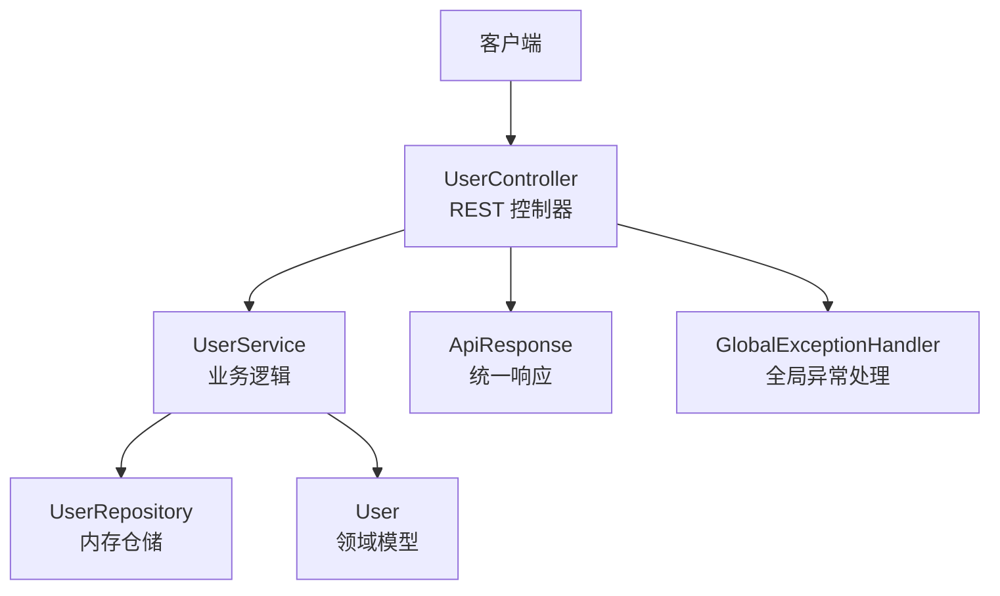
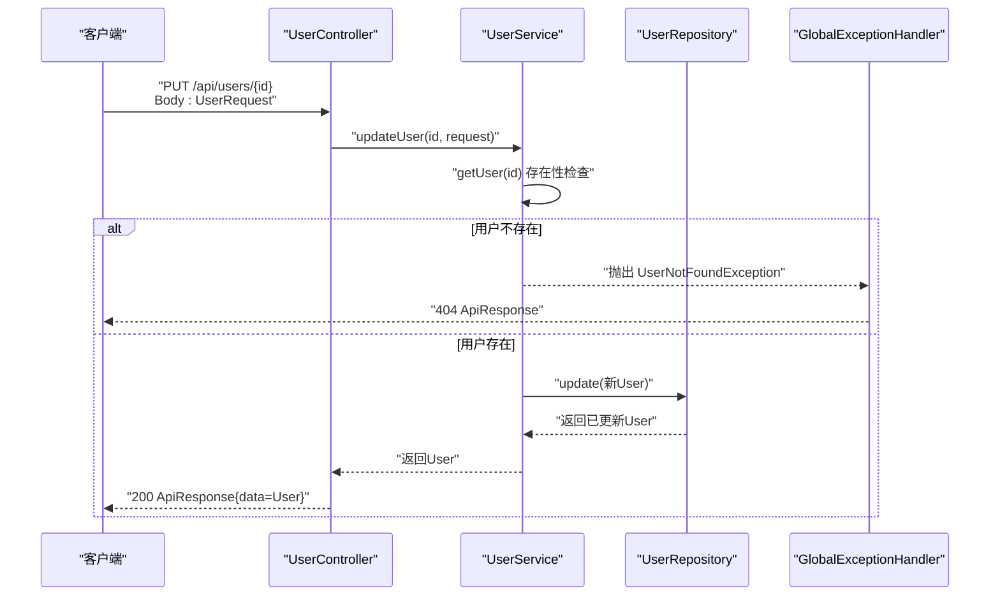
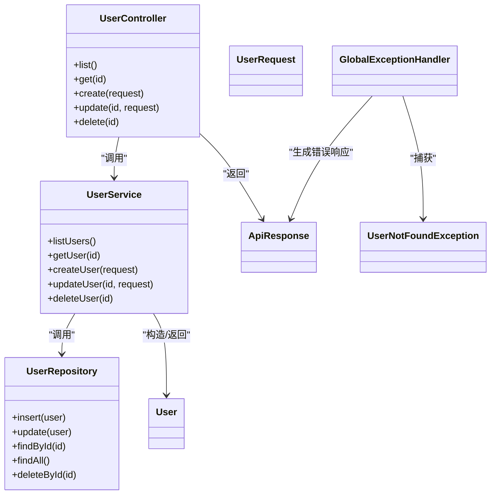

# 用户更新接口

<cite>
**本文引用的文件**
- [UserController.java](file://backend/src/main/java/com/aicoding/backend/controller/UserController.java)
- [UserService.java](file://backend/src/main/java/com/aicoding/backend/service/UserService.java)
- [UserRepository.java](file://backend/src/main/java/com/aicoding/backend/repository/UserRepository.java)
- [UserRequest.java](file://backend/src/main/java/com/aicoding/backend/dto/UserRequest.java)
- [User.java](file://backend/src/main/java/com/aicoding/backend/model/User.java)
- [ApiResponse.java](file://backend/src/main/java/com/aicoding/backend/dto/ApiResponse.java)
- [GlobalExceptionHandler.java](file://backend/src/main/java/com/aicoding/backend/exception/GlobalExceptionHandler.java)
- [UserNotFoundException.java](file://backend/src/main/java/com/aicoding/backend/exception/UserNotFoundException.java)
- [application.yml](file://backend/src/main/resources/application.yml)
- [UserApiTest.java](file://backend/src/test/java/com/aicoding/backend/UserApiTest.java)
</cite>

## 目录
1. [简介](#简介)
2. [项目结构](#项目结构)
3. [核心组件](#核心组件)
4. [架构总览](#架构总览)
5. [详细组件分析](#详细组件分析)
6. [依赖关系分析](#依赖关系分析)
7. [性能考虑](#性能考虑)
8. [故障排查指南](#故障排查指南)
9. [结论](#结论)
10. [附录](#附录)

## 简介
本章节面向 PUT /api/users/{id} 用户更新接口的实现与使用，重点说明：
- URL 路径参数 id 的验证与存在性检查机制
- 请求体数据校验规则，以及与创建接口的差异
- 完整请求示例与响应格式
- 部分更新与全量更新的语义区别
- 错误处理策略（如用户不存在、参数非法等）
- 使用 curl 调用该接口的示例

## 项目结构
后端采用典型的分层架构：控制器层接收请求并路由到服务层；服务层负责业务逻辑与领域对象组装；仓储层提供数据存取能力。统一响应体 ApiResponse 与全局异常处理器 GlobalExceptionHandler 贯穿各层，保证一致的返回结构与错误语义。

图表来源
- [UserController.java:24-57](file://backend/src/main/java/com/aicoding/backend/controller/UserController.java#L24-L57)
- [UserService.java:15-49](file://backend/src/main/java/com/aicoding/backend/service/UserService.java#L15-L49)
- [UserRepository.java:16-53](file://backend/src/main/java/com/aicoding/backend/repository/UserRepository.java#L16-L53)
- [ApiResponse.java:6-23](file://backend/src/main/java/com/aicoding/backend/dto/ApiResponse.java#L6-L23)
- [GlobalExceptionHandler.java:17-56](file://backend/src/main/java/com/aicoding/backend/exception/GlobalExceptionHandler.java#L17-L56)

章节来源
- [UserController.java:24-57](file://backend/src/main/java/com/aicoding/backend/controller/UserController.java#L24-L57)
- [application.yml:1-11](file://backend/src/main/resources/application.yml#L1-L11)

## 核心组件
- 控制器 UserController：定义 REST 端点，包括 GET、POST、PUT、DELETE，其中 PUT /{id} 用于更新用户。
- 服务 UserService：封装用户更新的业务流程，包含存在性检查与实体构造。
- 仓储 UserRepository：内存存储，提供插入、更新、查询、删除等操作。
- DTO UserRequest：承载新增/更新请求体，使用 Bean Validation 注解进行字段校验。
- 模型 User：用户领域对象，包含 id、name、email、phone、createdAt。
- 统一响应 ApiResponse：code/message/data 三字段结构。
- 异常处理 GlobalExceptionHandler：将各类异常转换为统一 ApiResponse。
- 自定义异常 UserNotFoundException：表示用户不存在。

章节来源
- [UserController.java:24-57](file://backend/src/main/java/com/aicoding/backend/controller/UserController.java#L24-L57)
- [UserService.java:15-49](file://backend/src/main/java/com/aicoding/backend/service/UserService.java#L15-L49)
- [UserRepository.java:16-53](file://backend/src/main/java/com/aicoding/backend/repository/UserRepository.java#L16-L53)
- [UserRequest.java:10-23](file://backend/src/main/java/com/aicoding/backend/dto/UserRequest.java#L10-L23)
- [User.java:8-14](file://backend/src/main/java/com/aicoding/backend/model/User.java#L8-L14)
- [ApiResponse.java:6-23](file://backend/src/main/java/com/aicoding/backend/dto/ApiResponse.java#L6-L23)
- [GlobalExceptionHandler.java:17-56](file://backend/src/main/java/com/aicoding/backend/exception/GlobalExceptionHandler.java#L17-L56)
- [UserNotFoundException.java:6-10](file://backend/src/main/java/com/aicoding/backend/exception/UserNotFoundException.java#L6-L10)

## 架构总览
下图展示一次 PUT /api/users/{id} 请求从进入控制器到持久化更新的完整调用链。

图表来源
- [UserController.java:53-57](file://backend/src/main/java/com/aicoding/backend/controller/UserController.java#L53-L57)
- [UserService.java:45-49](file://backend/src/main/java/com/aicoding/backend/service/UserService.java#L45-L49)
- [UserRepository.java:31-35](file://backend/src/main/java/com/aicoding/backend/repository/UserRepository.java#L31-L35)
- [GlobalExceptionHandler.java:20-25](file://backend/src/main/java/com/aicoding/backend/exception/GlobalExceptionHandler.java#L20-L25)

## 详细组件分析

### 端点定义与参数绑定
- 端点：PUT /api/users/{id}
- 路径参数：id（Long），由 Spring MVC 自动解析为 @PathVariable Long id
- 请求体：UserRequest，使用 @Valid 触发 Bean Validation 校验
- 返回值：ApiResponse<User>，成功时 code=0，message="更新成功"，data=更新后的用户对象

章节来源
- [UserController.java:53-57](file://backend/src/main/java/com/aicoding/backend/controller/UserController.java#L53-L57)
- [UserRequest.java:10-23](file://backend/src/main/java/com/aicoding/backend/dto/UserRequest.java#L10-L23)
- [ApiResponse.java:6-23](file://backend/src/main/java/com/aicoding/backend/dto/ApiResponse.java#L6-L23)

### URL 路径参数验证与存在性检查
- 类型不匹配：当 {id} 不是合法数字时，Spring 抛出 MethodArgumentTypeMismatchException，被全局异常处理器捕获，返回 400 及提示“参数类型不正确”。
- 存在性检查：服务层在更新前通过 getUser(id) 查询用户，若不存在则抛出 UserNotFoundException，全局异常处理器返回 404 及“用户不存在”消息。

章节来源
- [GlobalExceptionHandler.java:44-49](file://backend/src/main/java/com/aicoding/backend/exception/GlobalExceptionHandler.java#L44-L49)
- [UserService.java:35-38](file://backend/src/main/java/com/aicoding/backend/service/UserService.java#L35-L38)
- [UserNotFoundException.java:6-10](file://backend/src/main/java/com/aicoding/backend/exception/UserNotFoundException.java#L6-L10)

### 更新操作的数据验证规则
- name：必填，最大长度 50
- email：必填，邮箱格式，最大长度 100
- phone：可选，最大长度 20
- 校验失败时，全局异常处理器收集字段错误信息并以 400 返回，消息形如“字段名: 错误原因; ...”

章节来源
- [UserRequest.java:10-23](file://backend/src/main/java/com/aicoding/backend/dto/UserRequest.java#L10-L23)
- [GlobalExceptionHandler.java:27-35](file://backend/src/main/java/com/aicoding/backend/exception/GlobalExceptionHandler.java#L27-L35)

### 与创建接口的字段验证差异
- 创建接口 POST /api/users 同样使用 UserRequest 进行校验，因此字段约束一致：name、email 必填且满足长度与格式要求，phone 可选且长度限制相同。
- 差异主要体现在行为层面：
  - 创建成功后返回 HTTP 201 CREATED，而更新成功返回 HTTP 200 OK。
  - 创建会分配新 ID 并设置 createdAt；更新保留原 ID 与 createdAt。

章节来源
- [UserController.java:46-51](file://backend/src/main/java/com/aicoding/backend/controller/UserController.java#L46-L51)
- [UserController.java:53-57](file://backend/src/main/java/com/aicoding/backend/controller/UserController.java#L53-L57)
- [UserRequest.java:10-23](file://backend/src/main/java/com/aicoding/backend/dto/UserRequest.java#L10-L23)

### 更新逻辑与部分/全量更新语义
- 当前实现：每次更新都会用请求体中的 name、email、phone 覆盖现有值，同时保留原有的 id 和 createdAt。
- 语义说明：
  - 全量更新：请求体包含所有需要更新的字段，服务端直接覆盖对应字段。
  - 部分更新：当前实现不支持仅传部分字段即只更新这些字段的语义；若某字段未传入，将被视为空值或默认值覆盖。若需支持部分更新，应改为选择性合并字段。
- 注意：由于 UserRequest 中 name、email 标注为 @NotBlank，实际调用时必须提供这两个字段，否则校验失败。

章节来源
- [UserService.java:45-49](file://backend/src/main/java/com/aicoding/backend/service/UserService.java#L45-L49)
- [UserRequest.java:10-23](file://backend/src/main/java/com/aicoding/backend/dto/UserRequest.java#L10-L23)

### 请求示例
- 基本更新（全量字段）
  - 方法：PUT
  - 路径：/api/users/{id}
  - 请求体示例（JSON）：
    - name: 字符串，必填，最长 50
    - email: 字符串，必填，邮箱格式，最长 100
    - phone: 字符串，可选，最长 20
- 示例（以 id=1 为例）：
  - PUT http://localhost:8080/api/users/1
  - Body:
    - name: "张三"
    - email: "zhangsan@example.com"
    - phone: "13800138000"

章节来源
- [UserController.java:53-57](file://backend/src/main/java/com/aicoding/backend/controller/UserController.java#L53-L57)
- [UserRequest.java:10-23](file://backend/src/main/java/com/aicoding/backend/dto/UserRequest.java#L10-L23)
- [application.yml:1-3](file://backend/src/main/resources/application.yml#L1-L3)

### 响应格式
- 成功（HTTP 200）：
  - code: 0
  - message: "更新成功"
  - data: 更新后的用户对象，包含 id、name、email、phone、createdAt
- 失败：
  - 400：参数校验失败或请求体格式错误、路径参数类型不匹配
  - 404：用户不存在
  - 500：服务器内部错误

章节来源
- [ApiResponse.java:6-23](file://backend/src/main/java/com/aicoding/backend/dto/ApiResponse.java#L6-L23)
- [GlobalExceptionHandler.java:20-56](file://backend/src/main/java/com/aicoding/backend/exception/GlobalExceptionHandler.java#L20-L56)

### 错误处理说明
- 用户不存在：抛出 UserNotFoundException，返回 404 与“用户不存在”消息。
- 参数校验失败：MethodArgumentNotValidException，返回 400 与字段错误拼接消息。
- 请求体缺失或 JSON 格式错误：HttpMessageNotReadableException，返回 400 与“请求体格式错误”。
- 路径参数类型不匹配：MethodArgumentTypeMismatchException，返回 400 与“参数类型不正确”。
- 未知异常：兜底返回 500 与“服务器内部错误”。

章节来源
- [GlobalExceptionHandler.java:20-56](file://backend/src/main/java/com/aicoding/backend/exception/GlobalExceptionHandler.java#L20-L56)
- [UserNotFoundException.java:6-10](file://backend/src/main/java/com/aicoding/backend/exception/UserNotFoundException.java#L6-L10)

### curl 命令示例
- 更新用户（id=1）：
  - curl -X PUT http://localhost:8080/api/users/1 -H "Content-Type: application/json" -d '{"name":"张三","email":"zhangsan@example.com","phone":"13800138000"}'
- 更新用户但缺少必填字段（演示校验失败）：
  - curl -X PUT http://localhost:8080/api/users/1 -H "Content-Type: application/json" -d '{"email":"not-an-email"}'
- 更新不存在的用户（演示 404）：
  - curl -X PUT http://localhost:8080/api/users/99999 -H "Content-Type: application/json" -d '{"name":"张三","email":"zhangsan@example.com","phone":"13800138000"}'

章节来源
- [application.yml:1-3](file://backend/src/main/resources/application.yml#L1-L3)
- [GlobalExceptionHandler.java:20-56](file://backend/src/main/java/com/aicoding/backend/exception/GlobalExceptionHandler.java#L20-L56)

## 依赖关系分析
- 控制器依赖服务层，服务层依赖仓储层与领域模型。
- 校验依赖 Bean Validation 注解，异常处理依赖 Spring 全局异常处理器。
- 测试用例覆盖了完整的生命周期，包括更新与后续查询验证。

图表来源
- [UserController.java:24-64](file://backend/src/main/java/com/aicoding/backend/controller/UserController.java#L24-L64)
- [UserService.java:15-55](file://backend/src/main/java/com/aicoding/backend/service/UserService.java#L15-L55)
- [UserRepository.java:16-53](file://backend/src/main/java/com/aicoding/backend/repository/UserRepository.java#L16-L53)
- [UserRequest.java:10-23](file://backend/src/main/java/com/aicoding/backend/dto/UserRequest.java#L10-L23)
- [User.java:8-14](file://backend/src/main/java/com/aicoding/backend/model/User.java#L8-L14)
- [ApiResponse.java:6-23](file://backend/src/main/java/com/aicoding/backend/dto/ApiResponse.java#L6-L23)
- [GlobalExceptionHandler.java:17-56](file://backend/src/main/java/com/aicoding/backend/exception/GlobalExceptionHandler.java#L17-L56)
- [UserNotFoundException.java:6-10](file://backend/src/main/java/com/aicoding/backend/exception/UserNotFoundException.java#L6-L10)

章节来源
- [UserApiTest.java:68-84](file://backend/src/test/java/com/aicoding/backend/UserApiTest.java#L68-L84)

## 性能考虑
- 当前仓储为内存 Map，更新操作时间复杂度近似 O(1)，适合演示与轻量场景。
- 生产环境建议替换为数据库实现，关注索引设计（如按 id 查询）、连接池配置与事务边界。
- 批量更新或高并发场景下，应考虑缓存策略与一致性保障。

[本节为通用性能建议，无需特定文件引用]

## 故障排查指南
- 400 参数校验失败：检查 name、email 是否填写且符合格式，phone 长度是否超限。
- 400 请求体格式错误：确认 Content-Type 为 application/json 且 JSON 语法正确。
- 400 路径参数类型不匹配：确保 {id} 为整数。
- 404 用户不存在：确认 id 是否存在于系统中。
- 500 服务器内部错误：查看日志定位具体异常堆栈。

章节来源
- [GlobalExceptionHandler.java:20-56](file://backend/src/main/java/com/aicoding/backend/exception/GlobalExceptionHandler.java#L20-L56)

## 结论
PUT /api/users/{id} 提供了基于路径参数的用户更新能力，具备严格的参数校验与统一的异常处理。当前实现为全量覆盖式更新，若需支持部分更新，应在服务层引入选择性合并逻辑。结合统一响应体与全局异常处理，接口具备良好的可维护性与可观测性。

[本节为总结性内容，无需特定文件引用]

## 附录
- 端口与服务名：默认 8080，应用名为 aicoding-backend
- 测试用例参考：UserApiTest 展示了更新后查询验证的流程

章节来源
- [application.yml:1-11](file://backend/src/main/resources/application.yml#L1-L11)
- [UserApiTest.java:68-84](file://backend/src/test/java/com/aicoding/backend/UserApiTest.java#L68-L84)