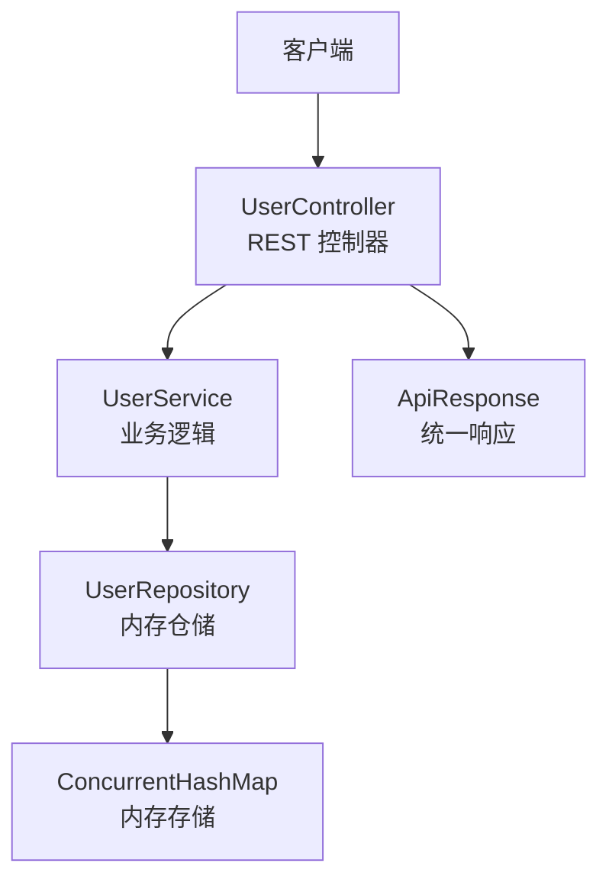
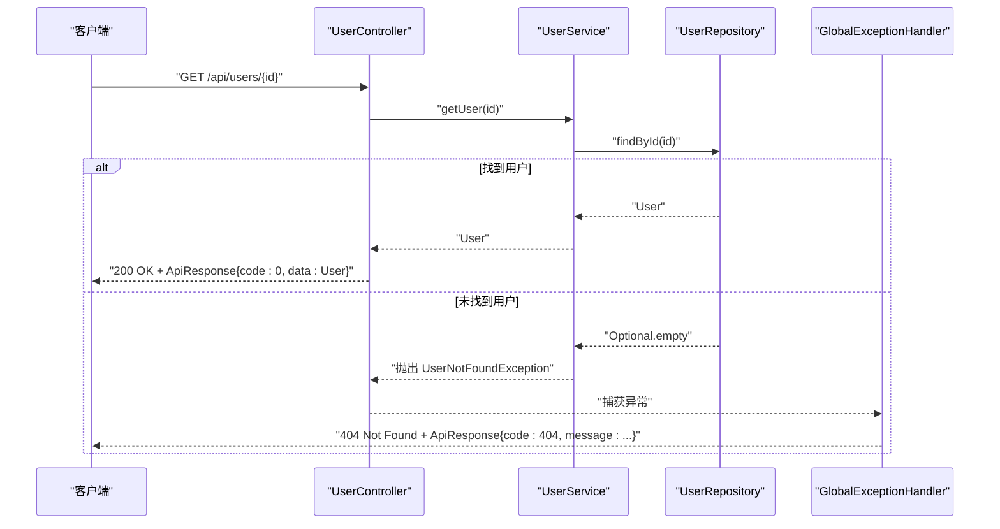
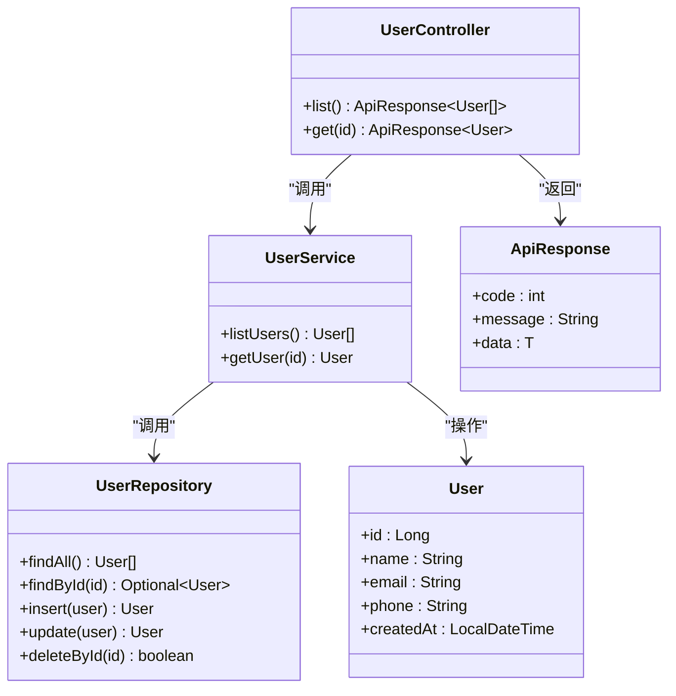

# 用户查询接口

<cite>
**本文引用的文件**
- [UserController.java](file://backend/src/main/java/com/aicoding/backend/controller/UserController.java)
- [User.java](file://backend/src/main/java/com/aicoding/backend/model/User.java)
- [ApiResponse.java](file://backend/src/main/java/com/aicoding/backend/dto/ApiResponse.java)
- [UserService.java](file://backend/src/main/java/com/aicoding/backend/service/UserService.java)
- [UserRepository.java](file://backend/src/main/java/com/aicoding/backend/repository/UserRepository.java)
- [GlobalExceptionHandler.java](file://backend/src/main/java/com/aicoding/backend/exception/GlobalExceptionHandler.java)
- [application.yml](file://backend/src/main/resources/application.yml)
</cite>

## 目录
1. [简介](#简介)
2. [项目结构](#项目结构)
3. [核心组件](#核心组件)
4. [架构总览](#架构总览)
5. [详细接口说明](#详细接口说明)
6. [依赖关系分析](#依赖关系分析)
7. [性能与可用性考虑](#性能与可用性考虑)
8. [故障排查指南](#故障排查指南)
9. [结论](#结论)
10. [附录：请求与响应示例](#附录请求与响应示例)

## 简介
本章节面向调用方，提供“用户查询接口”的完整说明，包括：
- 获取用户列表：GET /api/users
- 按 ID 查询用户：GET /api/users/{id}

文档涵盖端点功能、URL 路径参数、请求参数、响应格式、数据结构字段含义、错误码与异常处理，以及 curl 调用示例。后端服务默认监听端口为 8080。

## 项目结构
后端采用分层架构：
- Controller 层：定义 REST 路由与入参出参映射
- Service 层：业务逻辑与数据组装
- Repository 层：内存存储（演示用），提供增删改查能力
- DTO/Model：统一响应体与用户实体
- 异常处理：全局异常转换为统一 ApiResponse

图表来源
- [UserController.java:24-44](file://backend/src/main/java/com/aicoding/backend/controller/UserController.java#L24-L44)
- [UserService.java:31-38](file://backend/src/main/java/com/aicoding/backend/service/UserService.java#L31-L38)
- [UserRepository.java:19-49](file://backend/src/main/java/com/aicoding/backend/repository/UserRepository.java#L19-L49)
- [ApiResponse.java:6-23](file://backend/src/main/java/com/aicoding/backend/dto/ApiResponse.java#L6-L23)

章节来源
- [application.yml:1-11](file://backend/src/main/resources/application.yml#L1-L11)

## 核心组件
- 用户模型 User：包含 id、name、email、phone、createdAt 等字段
- 统一响应 ApiResponse：code、message、data 三字段，成功时 code=0
- 用户控制器 UserController：暴露 /api/users 相关 GET 端点
- 用户服务 UserService：封装查询逻辑，缺失用户时抛出异常
- 用户仓储 UserRepository：内存实现，支持 findAll、findById、insert、update、deleteById
- 全局异常处理器 GlobalExceptionHandler：将异常转为 ApiResponse 并设置 HTTP 状态码

章节来源
- [User.java:8-14](file://backend/src/main/java/com/aicoding/backend/model/User.java#L8-L14)
- [ApiResponse.java:6-23](file://backend/src/main/java/com/aicoding/backend/dto/ApiResponse.java#L6-L23)
- [UserController.java:24-44](file://backend/src/main/java/com/aicoding/backend/controller/UserController.java#L24-L44)
- [UserService.java:31-38](file://backend/src/main/java/com/aicoding/backend/service/UserService.java#L31-L38)
- [UserRepository.java:19-49](file://backend/src/main/java/com/aicoding/backend/repository/UserRepository.java#L19-L49)
- [GlobalExceptionHandler.java:17-56](file://backend/src/main/java/com/aicoding/backend/exception/GlobalExceptionHandler.java#L17-L56)

## 架构总览
以下序列图展示“按 ID 查询用户”的调用链路：客户端发起请求，控制器委托服务，服务通过仓储查找用户，若不存在则抛出异常并由全局异常处理器返回统一错误响应。

图表来源
- [UserController.java:40-44](file://backend/src/main/java/com/aicoding/backend/controller/UserController.java#L40-L44)
- [UserService.java:35-38](file://backend/src/main/java/com/aicoding/backend/service/UserService.java#L35-L38)
- [UserRepository.java:37-42](file://backend/src/main/java/com/aicoding/backend/repository/UserRepository.java#L37-L42)
- [GlobalExceptionHandler.java:20-25](file://backend/src/main/java/com/aicoding/backend/exception/GlobalExceptionHandler.java#L20-L25)

## 详细接口说明

### 通用约定
- 基础地址：http://localhost:8080
- 统一响应体 ApiResponse：
  - code：整数，0 表示成功，非 0 表示失败
  - message：字符串，描述信息
  - data：任意类型，成功时为具体数据，失败时为 null

章节来源
- [ApiResponse.java:6-23](file://backend/src/main/java/com/aicoding/backend/dto/ApiResponse.java#L6-L23)
- [application.yml:1-3](file://backend/src/main/resources/application.yml#L1-L3)

### 获取用户列表
- 方法：GET
- 路径：/api/users
- 功能：返回所有已注册用户列表
- 请求参数：无
- 响应体：ApiResponse<List<User>>
- 成功状态码：200
- 失败状态码：由全局异常处理器决定（如服务器内部错误 500）

用户对象字段说明（User）：
- id：Long，用户唯一标识
- name：String，用户姓名
- email：String，邮箱地址
- phone：String，手机号码（可为空）
- createdAt：LocalDateTime，创建时间

章节来源
- [UserController.java:34-38](file://backend/src/main/java/com/aicoding/backend/controller/UserController.java#L34-L38)
- [User.java:8-14](file://backend/src/main/java/com/aicoding/backend/model/User.java#L8-L14)

### 按 ID 查询用户
- 方法：GET
- 路径：/api/users/{id}
- URL 路径参数：
  - id：Long，必填，用户唯一标识
- 用户 ID 验证规则：
  - 类型必须为 Long；若传入非数字或超出范围，将触发参数类型不匹配异常，返回 400
  - 若该 ID 不存在，将返回 404
- 响应体：ApiResponse<User>
- 成功状态码：200
- 失败状态码：
  - 400：参数类型不正确（例如 /api/users/abc）
  - 404：用户不存在
  - 500：服务器内部错误

章节来源
- [UserController.java:40-44](file://backend/src/main/java/com/aicoding/backend/controller/UserController.java#L40-L44)
- [GlobalExceptionHandler.java:44-49](file://backend/src/main/java/com/aicoding/backend/exception/GlobalExceptionHandler.java#L44-L49)
- [GlobalExceptionHandler.java:20-25](file://backend/src/main/java/com/aicoding/backend/exception/GlobalExceptionHandler.java#L20-L25)

## 依赖关系分析
- Controller 依赖 Service，Service 依赖 Repository
- Repository 使用内存并发容器存储用户数据
- 全局异常处理器拦截特定异常并转换为 ApiResponse

图表来源
- [UserController.java:24-44](file://backend/src/main/java/com/aicoding/backend/controller/UserController.java#L24-L44)
- [UserService.java:31-38](file://backend/src/main/java/com/aicoding/backend/service/UserService.java#L31-L38)
- [UserRepository.java:19-49](file://backend/src/main/java/com/aicoding/backend/repository/UserRepository.java#L19-L49)
- [User.java:8-14](file://backend/src/main/java/com/aicoding/backend/model/User.java#L8-L14)
- [ApiResponse.java:6-23](file://backend/src/main/java/com/aicoding/backend/dto/ApiResponse.java#L6-L23)

章节来源
- [UserController.java:24-44](file://backend/src/main/java/com/aicoding/backend/controller/UserController.java#L24-L44)
- [UserService.java:31-38](file://backend/src/main/java/com/aicoding/backend/service/UserService.java#L31-L38)
- [UserRepository.java:19-49](file://backend/src/main/java/com/aicoding/backend/repository/UserRepository.java#L19-L49)

## 性能与可用性考虑
- 当前仓库为内存实现，适合演示与轻量场景；生产环境建议替换为数据库持久化
- 列表查询会遍历内存集合并按 id 排序，数据量较大时需考虑分页与索引
- 并发访问由 ConcurrentHashMap 保证线程安全
- 统一响应体便于前端统一处理成功与失败分支

[本节为通用指导，无需引用具体文件]

## 故障排查指南
- 400 参数类型不正确：检查路径参数是否为合法 Long，避免字母或非法字符
- 404 用户不存在：确认传入的 id 是否存在于系统
- 400 请求体格式错误：仅适用于需要请求体的接口；查询接口不涉及请求体
- 500 服务器内部错误：查看服务端日志定位具体异常

章节来源
- [GlobalExceptionHandler.java:20-56](file://backend/src/main/java/com/aicoding/backend/exception/GlobalExceptionHandler.java#L20-L56)

## 结论
本接口提供简洁的用户查询能力，遵循统一的 ApiResponse 规范，具备清晰的错误处理机制。对于演示与快速集成非常友好，生产部署时建议替换底层存储并增加必要的鉴权与限流策略。

[本节为总结性内容，无需引用具体文件]

## 附录：请求与响应示例

### 获取用户列表
- 请求
  - 方法：GET
  - URL：http://localhost:8080/api/users
  - 请求头：无特殊要求
  - 请求体：无
- 成功响应（HTTP 200）
  - 结构：ApiResponse<List<User>>
  - 字段：
    - code：0
    - message："success"
    - data：数组，元素为用户对象
- curl 示例
  - curl -X GET http://localhost:8080/api/users

章节来源
- [UserController.java:34-38](file://backend/src/main/java/com/aicoding/backend/controller/UserController.java#L34-L38)
- [ApiResponse.java:6-23](file://backend/src/main/java/com/aicoding/backend/dto/ApiResponse.java#L6-L23)

### 按 ID 查询用户
- 请求
  - 方法：GET
  - URL：http://localhost:8080/api/users/{id}
  - 路径参数：
    - id：Long，必填
- 成功响应（HTTP 200）
  - 结构：ApiResponse<User>
  - 字段：
    - code：0
    - message："success"
    - data：用户对象
- 常见错误
  - 400：参数类型不正确（例如 /api/users/abc）
  - 404：用户不存在
- curl 示例
  - 成功：curl -X GET http://localhost:8080/api/users/1
  - 类型错误：curl -X GET http://localhost:8080/api/users/abc
  - 不存在：curl -X GET http://localhost:8080/api/users/999999

章节来源
- [UserController.java:40-44](file://backend/src/main/java/com/aicoding/backend/controller/UserController.java#L40-L44)
- [GlobalExceptionHandler.java:44-49](file://backend/src/main/java/com/aicoding/backend/exception/GlobalExceptionHandler.java#L44-L49)
- [GlobalExceptionHandler.java:20-25](file://backend/src/main/java/com/aicoding/backend/exception/GlobalExceptionHandler.java#L20-L25)

### 用户对象字段说明
- id：Long，用户唯一标识
- name：String，用户姓名
- email：String，邮箱地址
- phone：String，手机号码（可为空）
- createdAt：LocalDateTime，创建时间

章节来源
- [User.java:8-14](file://backend/src/main/java/com/aicoding/backend/model/User.java#L8-L14)