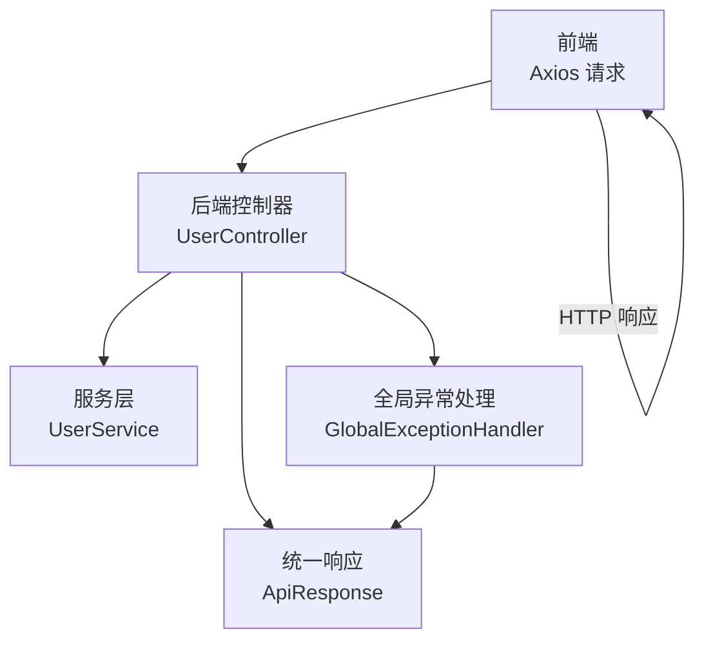
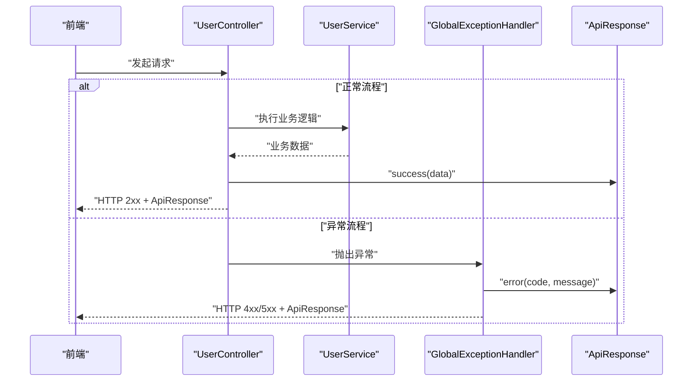
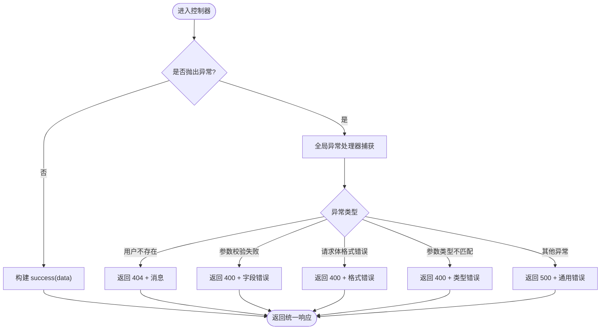
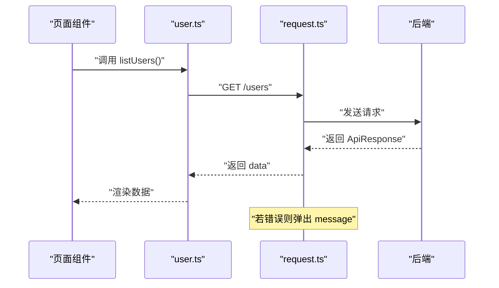
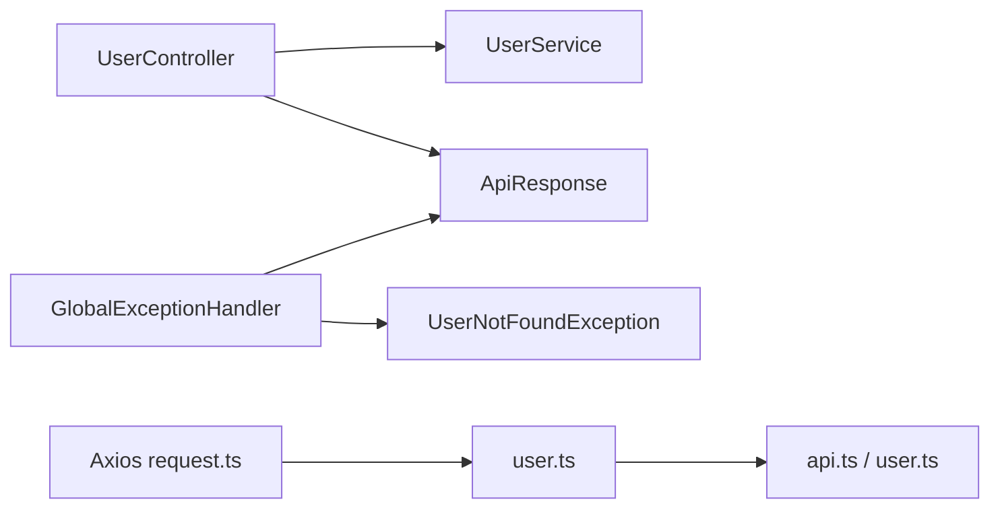

# 统一响应格式

<cite>
**本文引用的文件**
- [backend/src/main/java/com/aicoding/backend/dto/ApiResponse.java](file://backend/src/main/java/com/aicoding/backend/dto/ApiResponse.java)
- [frontend/src/types/api.ts](file://frontend/src/types/api.ts)
- [backend/src/main/java/com/aicoding/backend/controller/UserController.java](file://backend/src/main/java/com/aicoding/backend/controller/UserController.java)
- [backend/src/main/java/com/aicoding/backend/exception/GlobalExceptionHandler.java](file://backend/src/main/java/com/aicoding/backend/exception/GlobalExceptionHandler.java)
- [backend/src/main/java/com/aicoding/backend/exception/UserNotFoundException.java](file://backend/src/main/java/com/aicoding/backend/exception/UserNotFoundException.java)
- [backend/src/main/java/com/aicoding/backend/model/User.java](file://backend/src/main/java/com/aicoding/backend/model/User.java)
- [frontend/src/api/request.ts](file://frontend/src/api/request.ts)
- [frontend/src/api/user.ts](file://frontend/src/api/user.ts)
- [frontend/src/types/user.ts](file://frontend/src/types/user.ts)
</cite>

## 目录
1. [简介](#简介)
2. [项目结构](#项目结构)
3. [核心组件](#核心组件)
4. [架构总览](#架构总览)
5. [详细组件分析](#详细组件分析)
6. [依赖关系分析](#依赖关系分析)
7. [性能考虑](#性能考虑)
8. [故障排查指南](#故障排查指南)
9. [结论](#结论)
10. [附录：JSON 示例与最佳实践](#附录json-示例与最佳实践)

## 简介
本文件面向前后端协作，系统化说明后端统一响应结构 ApiResponse 的设计、字段规范、状态码约定、错误处理流程以及前端消费方式。目标是确保接口返回格式一致、错误信息友好、类型安全可维护。

## 项目结构
本项目采用前后端分离架构：
- 后端基于 Spring Boot，提供 RESTful API，统一通过 ApiResponse 封装响应体。
- 前端基于 TypeScript + Axios，定义统一的 ApiResponse 类型，并在请求拦截器中统一处理错误提示。

图表来源
- [backend/src/main/java/com/aicoding/backend/controller/UserController.java:24-65](file://backend/src/main/java/com/aicoding/backend/controller/UserController.java#L24-L65)
- [backend/src/main/java/com/aicoding/backend/dto/ApiResponse.java:1-24](file://backend/src/main/java/com/aicoding/backend/dto/ApiResponse.java#L1-L24)
- [backend/src/main/java/com/aicoding/backend/exception/GlobalExceptionHandler.java:17-56](file://backend/src/main/java/com/aicoding/backend/exception/GlobalExceptionHandler.java#L17-L56)
- [frontend/src/api/request.ts:1-26](file://frontend/src/api/request.ts#L1-L26)

章节来源
- [backend/src/main/java/com/aicoding/backend/controller/UserController.java:24-65](file://backend/src/main/java/com/aicoding/backend/controller/UserController.java#L24-L65)
- [backend/src/main/java/com/aicoding/backend/dto/ApiResponse.java:1-24](file://backend/src/main/java/com/aicoding/backend/dto/ApiResponse.java#L1-L24)
- [backend/src/main/java/com/aicoding/backend/exception/GlobalExceptionHandler.java:17-56](file://backend/src/main/java/com/aicoding/backend/exception/GlobalExceptionHandler.java#L17-L56)
- [frontend/src/api/request.ts:1-26](file://frontend/src/api/request.ts#L1-L26)

## 核心组件
- 统一响应体 ApiResponse<T>：包含 code、message、data 三个字段，提供 success/error 静态工厂方法，用于成功与失败场景的统一封装。
- 全局异常处理器 GlobalExceptionHandler：将业务异常、参数校验异常、请求体解析异常等转换为 ApiResponse 并附带合适的 HTTP 状态码。
- 前端类型与请求封装：前端定义 ApiResponse 类型，使用 Axios 拦截器统一提取 message 并弹窗提示。

章节来源
- [backend/src/main/java/com/aicoding/backend/dto/ApiResponse.java:1-24](file://backend/src/main/java/com/aicoding/backend/dto/ApiResponse.java#L1-L24)
- [backend/src/main/java/com/aicoding/backend/exception/GlobalExceptionHandler.java:17-56](file://backend/src/main/java/com/aicoding/backend/exception/GlobalExceptionHandler.java#L17-L56)
- [frontend/src/types/api.ts:1-7](file://frontend/src/types/api.ts#L1-L7)
- [frontend/src/api/request.ts:1-26](file://frontend/src/api/request.ts#L1-L26)

## 架构总览
后端控制器在正常路径下直接返回 ApiResponse；当发生异常时，由全局异常处理器捕获并返回 ApiResponse。前端通过 Axios 响应拦截器统一处理错误消息展示。

图表来源
- [backend/src/main/java/com/aicoding/backend/controller/UserController.java:34-64](file://backend/src/main/java/com/aicoding/backend/controller/UserController.java#L34-L64)
- [backend/src/main/java/com/aicoding/backend/exception/GlobalExceptionHandler.java:20-56](file://backend/src/main/java/com/aicoding/backend/exception/GlobalExceptionHandler.java#L20-L56)
- [backend/src/main/java/com/aicoding/backend/dto/ApiResponse.java:8-22](file://backend/src/main/java/com/aicoding/backend/dto/ApiResponse.java#L8-L22)

## 详细组件分析

### ApiResponse 设计与字段规范
- code：整型状态码。约定 0 表示成功；非 0 表示失败。错误码建议遵循 HTTP 语义（如 400、404、500），便于前后端对齐。
- message：字符串消息。成功时可省略或固定为“success”；失败时应提供可读的错误描述，便于前端展示或日志定位。
- data：泛型 T。成功时承载业务数据；失败时为 null。支持任意对象、集合、空值等场景。

设计要点
- 使用 Java record 简化不可变数据结构，配合静态工厂方法提升易用性。
- 成功分支提供多种重载：无数据、带自定义消息、带数据。
- 错误分支统一通过 error(code, message) 构造，保证一致性。

章节来源
- [backend/src/main/java/com/aicoding/backend/dto/ApiResponse.java:1-24](file://backend/src/main/java/com/aicoding/backend/dto/ApiResponse.java#L1-L24)
- [frontend/src/types/api.ts:1-7](file://frontend/src/types/api.ts#L1-L7)

### 状态码规范与取值范围
- 成功：code = 0。HTTP 状态码通常为 2xx（如 200、201）。
- 客户端错误：code 取 4xx（如 400 参数错误、404 资源不存在）。
- 服务端错误：code 取 5xx（如 500 服务器内部错误）。
- 建议：保持 code 与 HTTP 状态码语义一致，便于前端按状态码分流处理。

章节来源
- [backend/src/main/java/com/aicoding/backend/exception/GlobalExceptionHandler.java:20-56](file://backend/src/main/java/com/aicoding/backend/exception/GlobalExceptionHandler.java#L20-L56)

### message 字段的使用与格式化规则
- 成功场景：可使用默认“success”，或在创建/更新等操作时返回具体提示（如“创建成功”、“更新成功”）。
- 错误场景：应提供清晰、友好的错误信息。例如：
  - 参数校验失败：拼接字段与错误原因。
  - 资源不存在：明确标识缺失的资源 ID。
  - 请求体格式错误：提示 JSON 格式问题。
  - 未知异常：兜底提示“服务器内部错误”，避免泄露敏感信息。

章节来源
- [backend/src/main/java/com/aicoding/backend/controller/UserController.java:46-64](file://backend/src/main/java/com/aicoding/backend/controller/UserController.java#L46-L64)
- [backend/src/main/java/com/aicoding/backend/exception/GlobalExceptionHandler.java:20-56](file://backend/src/main/java/com/aicoding/backend/exception/GlobalExceptionHandler.java#L20-L56)

### data 字段的泛型设计与数据类型封装
- 列表查询：data 为 List<User>。
- 单条查询：data 为 User。
- 写操作（新增/更新/删除）：data 可为具体实体或 null（删除通常返回 null）。
- 前端类型：对应 TypeScript 的 ApiResponse<User[]>、ApiResponse<User>、ApiResponse<void> 等。

章节来源
- [backend/src/main/java/com/aicoding/backend/controller/UserController.java:34-64](file://backend/src/main/java/com/aicoding/backend/controller/UserController.java#L34-L64)
- [frontend/src/api/user.ts:5-28](file://frontend/src/api/user.ts#L5-L28)
- [frontend/src/types/user.ts:1-16](file://frontend/src/types/user.ts#L1-L16)

### 全局异常处理与统一响应
- 用户不存在：抛出 UserNotFoundException，被全局处理器捕获，返回 404 与相应 message。
- 参数校验失败：MethodArgumentNotValidException，返回 400 与字段级错误信息。
- 请求体解析失败：HttpMessageNotReadableException，返回 400 与格式错误提示。
- 参数类型不匹配：MethodArgumentTypeMismatchException，返回 400 与参数类型提示。
- 未知异常：兜底返回 500 与通用错误提示。

图表来源
- [backend/src/main/java/com/aicoding/backend/exception/GlobalExceptionHandler.java:20-56](file://backend/src/main/java/com/aicoding/backend/exception/GlobalExceptionHandler.java#L20-L56)
- [backend/src/main/java/com/aicoding/backend/exception/UserNotFoundException.java:6-10](file://backend/src/main/java/com/aicoding/backend/exception/UserNotFoundException.java#L6-L10)

章节来源
- [backend/src/main/java/com/aicoding/backend/exception/GlobalExceptionHandler.java:20-56](file://backend/src/main/java/com/aicoding/backend/exception/GlobalExceptionHandler.java#L20-L56)
- [backend/src/main/java/com/aicoding/backend/exception/UserNotFoundException.java:6-10](file://backend/src/main/java/com/aicoding/backend/exception/UserNotFoundException.java#L6-L10)

### 前端如何处理不同类型的响应数据
- 类型定义：前端定义 ApiResponse<T> 与业务类型（User、UserForm），确保类型安全。
- 请求封装：Axios 实例设置 baseURL 与超时时间；响应拦截器在错误分支读取 response.data.message 并弹窗提示。
- 调用方式：API 函数返回 ApiResponse<T>，业务层可直接访问 data 字段。

图表来源
- [frontend/src/api/user.ts:5-28](file://frontend/src/api/user.ts#L5-L28)
- [frontend/src/api/request.ts:1-26](file://frontend/src/api/request.ts#L1-L26)

章节来源
- [frontend/src/api/request.ts:1-26](file://frontend/src/api/request.ts#L1-L26)
- [frontend/src/api/user.ts:5-28](file://frontend/src/api/user.ts#L5-L28)
- [frontend/src/types/api.ts:1-7](file://frontend/src/types/api.ts#L1-L7)
- [frontend/src/types/user.ts:1-16](file://frontend/src/types/user.ts#L1-L16)

## 依赖关系分析
- 控制器依赖服务层与统一响应体。
- 全局异常处理器依赖统一响应体与各业务异常类。
- 前端依赖统一响应类型与业务类型，并通过 Axios 拦截器统一处理错误。

图表来源
- [backend/src/main/java/com/aicoding/backend/controller/UserController.java:24-65](file://backend/src/main/java/com/aicoding/backend/controller/UserController.java#L24-L65)
- [backend/src/main/java/com/aicoding/backend/exception/GlobalExceptionHandler.java:17-56](file://backend/src/main/java/com/aicoding/backend/exception/GlobalExceptionHandler.java#L17-L56)
- [backend/src/main/java/com/aicoding/backend/exception/UserNotFoundException.java:6-10](file://backend/src/main/java/com/aicoding/backend/exception/UserNotFoundException.java#L6-L10)
- [frontend/src/api/request.ts:1-26](file://frontend/src/api/request.ts#L1-L26)
- [frontend/src/api/user.ts:5-28](file://frontend/src/api/user.ts#L5-L28)
- [frontend/src/types/api.ts:1-7](file://frontend/src/types/api.ts#L1-L7)
- [frontend/src/types/user.ts:1-16](file://frontend/src/types/user.ts#L1-L16)

章节来源
- [backend/src/main/java/com/aicoding/backend/controller/UserController.java:24-65](file://backend/src/main/java/com/aicoding/backend/controller/UserController.java#L24-L65)
- [backend/src/main/java/com/aicoding/backend/exception/GlobalExceptionHandler.java:17-56](file://backend/src/main/java/com/aicoding/backend/exception/GlobalExceptionHandler.java#L17-L56)
- [frontend/src/api/request.ts:1-26](file://frontend/src/api/request.ts#L1-L26)
- [frontend/src/api/user.ts:5-28](file://frontend/src/api/user.ts#L5-L28)

## 性能考虑
- 统一响应体轻量且不可变，序列化开销低。
- 全局异常处理器集中处理，减少重复代码，提高可维护性。
- 前端统一拦截错误提示，避免重复逻辑，降低网络与渲染压力。
- 建议在大数据量列表场景分页返回，避免一次性传输过多数据。

[本节为通用指导，无需特定文件引用]

## 故障排查指南
- 参数校验失败：检查请求体字段是否符合约束，关注 message 中的字段与错误信息。
- 资源不存在：确认路径参数是否正确，检查后端是否抛出用户不存在异常。
- 请求体格式错误：检查 JSON 结构与字段类型，确保 Content-Type 正确。
- 参数类型不匹配：检查路径或查询参数类型是否与后端期望一致。
- 服务器内部错误：查看后端日志定位异常堆栈，必要时调整兜底 message 以保护敏感信息。

章节来源
- [backend/src/main/java/com/aicoding/backend/exception/GlobalExceptionHandler.java:20-56](file://backend/src/main/java/com/aicoding/backend/exception/GlobalExceptionHandler.java#L20-L56)

## 结论
通过统一的 ApiResponse 结构与全局异常处理，后端实现了稳定一致的响应格式；前端通过类型定义与拦截器实现了对错误信息的统一处理。该方案提升了前后端协作效率、降低了出错成本，并为后续扩展提供了良好基础。

[本节为总结，无需特定文件引用]

## 附录：JSON 示例与最佳实践

### 成功响应示例
- 列表查询
  - HTTP 状态码：200
  - 响应体示例：
    {
      "code": 0,
      "message": "success",
      "data": [
        {
          "id": 1,
          "name": "张三",
          "email": "zhangsan@example.com",
          "phone": "13800000000",
          "createdAt": "2024-01-01T10:00:00"
        }
      ]
    }
- 单条查询
  - HTTP 状态码：200
  - 响应体示例：
    {
      "code": 0,
      "message": "success",
      "data": {
        "id": 1,
        "name": "张三",
        "email": "zhangsan@example.com",
        "phone": "13800000000",
        "createdAt": "2024-01-01T10:00:00"
      }
    }
- 写操作（新增/更新）
  - HTTP 状态码：200/201
  - 响应体示例：
    {
      "code": 0,
      "message": "创建成功",
      "data": {
        "id": 2,
        "name": "李四",
        "email": "lisi@example.com",
        "phone": "13900000000",
        "createdAt": "2024-01-02T12:00:00"
      }
    }
- 删除操作（空数据）
  - HTTP 状态码：200/204
  - 响应体示例：
    {
      "code": 0,
      "message": "删除成功",
      "data": null
    }

### 错误响应示例
- 参数校验失败
  - HTTP 状态码：400
  - 响应体示例：
    {
      "code": 400,
      "message": "name: 不能为空; email: 邮箱格式不正确",
      "data": null
    }
- 资源不存在
  - HTTP 状态码：404
  - 响应体示例：
    {
      "code": 404,
      "message": "用户不存在: id=999",
      "data": null
    }
- 请求体格式错误
  - HTTP 状态码：400
  - 响应体示例：
    {
      "code": 400,
      "message": "请求体格式错误",
      "data": null
    }
- 参数类型不匹配
  - HTTP 状态码：400
  - 响应体示例：
    {
      "code": 400,
      "message": "参数类型不正确: id",
      "data": null
    }
- 服务器内部错误
  - HTTP 状态码：500
  - 响应体示例：
    {
      "code": 500,
      "message": "服务器内部错误: ...",
      "data": null
    }

### 前端处理建议
- 类型安全：始终使用 ApiResponse<T> 类型接收响应，避免 any。
- 错误提示：利用 Axios 拦截器统一显示 message，减少重复代码。
- 业务分支：根据 code 判断成功/失败，再对 data 进行渲染或提示。
- 空数据处理：当 data 为 null 时，避免空指针，提供降级展示。

### 最佳实践
- 一致性：所有接口统一返回 ApiResponse，禁止裸返回业务对象。
- 语义化：code 与 HTTP 状态码保持一致，便于前端按状态码分流。
- 友好性：message 对用户可读，避免暴露堆栈或敏感信息。
- 可扩展：如需更细粒度错误码，可在 code 基础上增加子码，但需保持向后兼容。
- 文档化：在接口文档中明确各接口的 code、message、data 含义与示例。

章节来源
- [backend/src/main/java/com/aicoding/backend/controller/UserController.java:34-64](file://backend/src/main/java/com/aicoding/backend/controller/UserController.java#L34-L64)
- [backend/src/main/java/com/aicoding/backend/exception/GlobalExceptionHandler.java:20-56](file://backend/src/main/java/com/aicoding/backend/exception/GlobalExceptionHandler.java#L20-L56)
- [frontend/src/api/request.ts:13-22](file://frontend/src/api/request.ts#L13-L22)
- [frontend/src/api/user.ts:5-28](file://frontend/src/api/user.ts#L5-L28)
- [frontend/src/types/api.ts:1-7](file://frontend/src/types/api.ts#L1-L7)
- [frontend/src/types/user.ts:1-16](file://frontend/src/types/user.ts#L1-L16)
- [backend/src/main/java/com/aicoding/backend/model/User.java:8-14](file://backend/src/main/java/com/aicoding/backend/model/User.java#L8-L14)