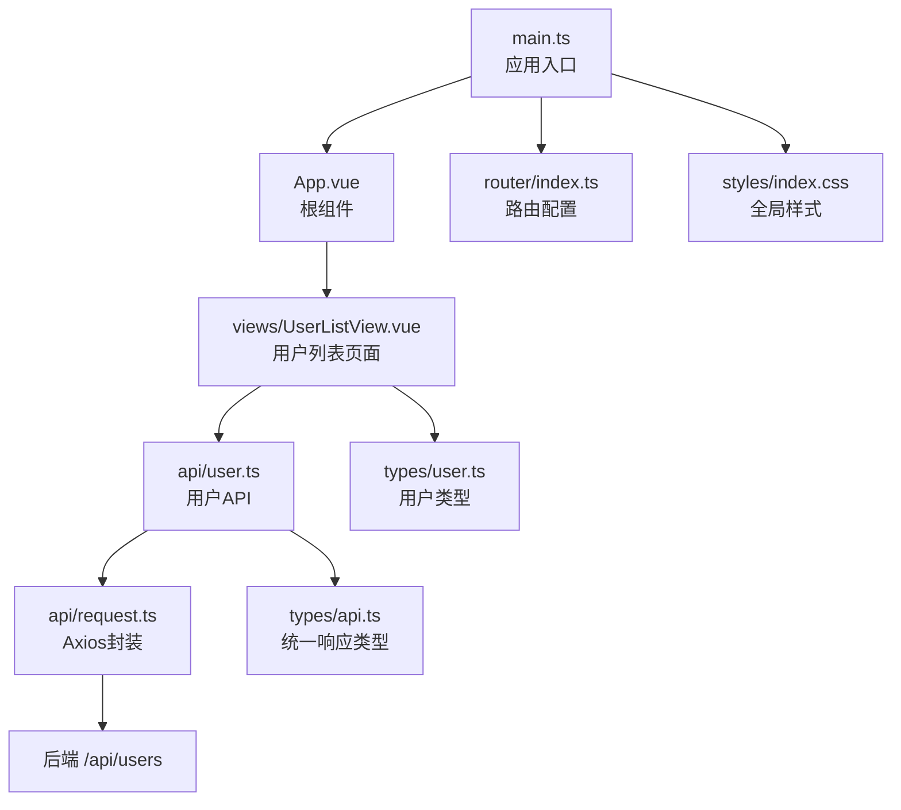
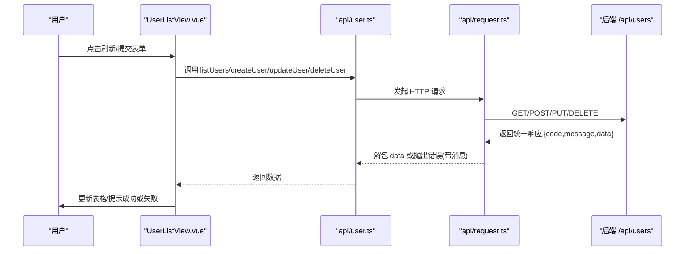
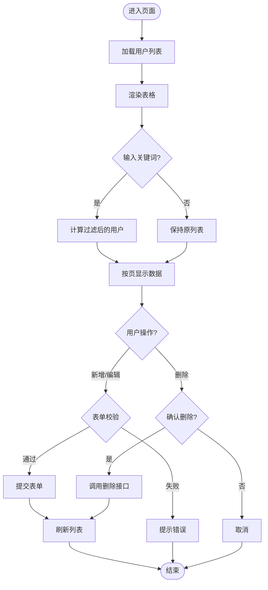
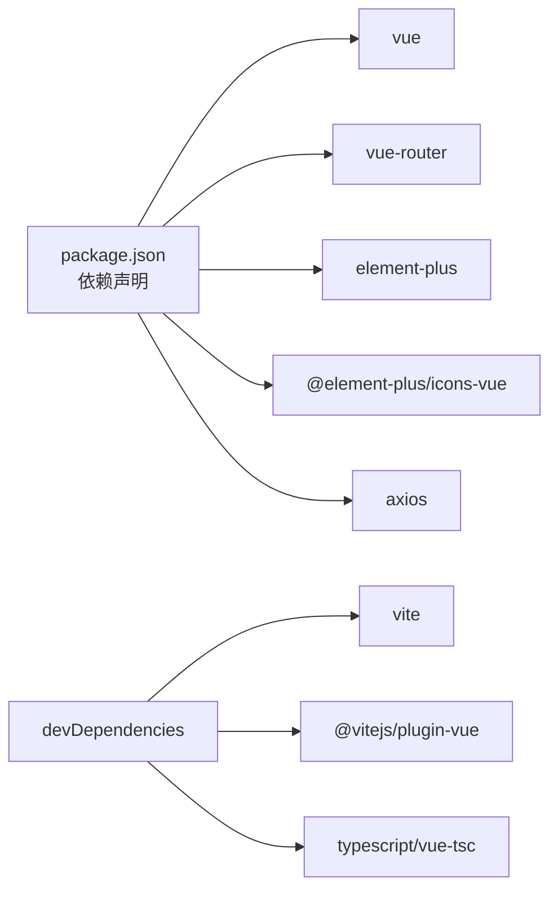

# 前端架构

<cite>
**本文引用的文件**
- [frontend/src/main.ts](file://frontend/src/main.ts)
- [frontend/src/App.vue](file://frontend/src/App.vue)
- [frontend/src/router/index.ts](file://frontend/src/router/index.ts)
- [frontend/vite.config.ts](file://frontend/vite.config.ts)
- [frontend/src/api/request.ts](file://frontend/src/api/request.ts)
- [frontend/src/api/user.ts](file://frontend/src/api/user.ts)
- [frontend/src/views/UserListView.vue](file://frontend/src/views/UserListView.vue)
- [frontend/src/types/api.ts](file://frontend/src/types/api.ts)
- [frontend/src/types/user.ts](file://frontend/src/types/user.ts)
- [frontend/src/styles/index.css](file://frontend/src/styles/index.css)
- [frontend/package.json](file://frontend/package.json)
- [frontend/tsconfig.json](file://frontend/tsconfig.json)
</cite>

## 目录
1. [简介](#简介)
2. [项目结构](#项目结构)
3. [核心组件](#核心组件)
4. [架构总览](#架构总览)
5. [详细组件分析](#详细组件分析)
6. [依赖关系分析](#依赖关系分析)
7. [性能考虑](#性能考虑)
8. [故障排查指南](#故障排查指南)
9. [结论](#结论)
10. [附录](#附录)

## 简介
本项目是一个基于 Vue 3 Composition API 与 TypeScript 的前端应用，采用 Vite 作为构建工具，Element Plus 作为 UI 组件库，Vue Router 进行路由管理，Axios 封装前后端通信。整体遵循“单文件组件 + 模块化 API + 类型安全”的现代前端工程化实践，提供用户列表的增删改查能力，并与 Spring Boot 后端通过 RESTful API 交互。

## 项目结构
前端代码位于 frontend 目录下，核心目录组织如下：
- src/main.ts：应用入口，负责创建 Vue 实例、注册插件（Element Plus、Router）、挂载根组件。
- src/App.vue：根组件，仅包含路由视图出口。
- src/router/index.ts：路由定义，包含首页重定向、用户列表页懒加载以及通配符重定向。
- src/api/request.ts：Axios 实例封装，统一 baseURL、超时、响应拦截与错误提示。
- src/api/user.ts：用户相关 API 接口函数，使用泛型保证返回数据结构类型安全。
- src/views/UserListView.vue：用户列表页面，实现搜索、分页、新增/编辑/删除等完整业务逻辑。
- src/types/api.ts、src/types/user.ts：统一的响应结构与领域模型类型定义。
- src/styles/index.css：全局样式初始化。
- vite.config.ts：Vite 配置，包含别名、开发服务器端口与代理设置。
- package.json：脚本命令与依赖声明。
- tsconfig.json：TypeScript 编译选项与路径映射。

图表来源
- [frontend/src/main.ts:1-22](file://frontend/src/main.ts#L1-L22)
- [frontend/src/App.vue:1-4](file://frontend/src/App.vue#L1-L4)
- [frontend/src/router/index.ts:1-23](file://frontend/src/router/index.ts#L1-L23)
- [frontend/src/views/UserListView.vue:1-278](file://frontend/src/views/UserListView.vue#L1-L278)
- [frontend/src/api/user.ts:1-29](file://frontend/src/api/user.ts#L1-L29)
- [frontend/src/api/request.ts:1-26](file://frontend/src/api/request.ts#L1-L26)
- [frontend/src/types/user.ts:1-16](file://frontend/src/types/user.ts#L1-L16)
- [frontend/src/types/api.ts:1-7](file://frontend/src/types/api.ts#L1-L7)

章节来源
- [frontend/src/main.ts:1-22](file://frontend/src/main.ts#L1-L22)
- [frontend/src/App.vue:1-4](file://frontend/src/App.vue#L1-L4)
- [frontend/src/router/index.ts:1-23](file://frontend/src/router/index.ts#L1-L23)
- [frontend/vite.config.ts:1-25](file://frontend/vite.config.ts#L1-L25)
- [frontend/src/api/request.ts:1-26](file://frontend/src/api/request.ts#L1-L26)
- [frontend/src/api/user.ts:1-29](file://frontend/src/api/user.ts#L1-L29)
- [frontend/src/views/UserListView.vue:1-278](file://frontend/src/views/UserListView.vue#L1-L278)
- [frontend/src/types/api.ts:1-7](file://frontend/src/types/api.ts#L1-L7)
- [frontend/src/types/user.ts:1-16](file://frontend/src/types/user.ts#L1-L16)
- [frontend/src/styles/index.css:1-15](file://frontend/src/styles/index.css#L1-L15)
- [frontend/package.json:1-26](file://frontend/package.json#L1-L26)
- [frontend/tsconfig.json:1-28](file://frontend/tsconfig.json#L1-L28)

## 核心组件
- 应用入口 main.ts
  - 创建 Vue 应用实例并挂载到 #app。
  - 全局注册 Element Plus 图标组件集合。
  - 注册 Vue Router 与 Element Plus（含中文语言包）。
  - 引入全局样式。
- 根组件 App.vue
  - 仅包含 <router-view />，作为所有页面的渲染容器。
- 路由 index.ts
  - 使用 createWebHistory 模式。
  - 定义首页重定向至 /users。
  - 用户列表页采用动态导入实现懒加载。
  - 通配符路由重定向回 /users，避免 404。
- Axios 请求封装 request.ts
  - 统一 baseURL 为 /api，设置超时时间。
  - 响应拦截器自动解包 response.data，并在错误时弹出消息提示。
- API 层 user.ts
  - 暴露 listUsers、getUser、createUser、updateUser、deleteUser 等方法。
  - 使用泛型 ApiResponse<T> 确保返回数据类型的静态检查。
- 页面 UserListView.vue
  - 基于 Element Plus 表格、表单、对话框、分页等组件实现用户管理界面。
  - 使用 Composition API 的状态管理与计算属性实现搜索与前端分页。
  - 调用 API 层完成数据的获取与变更，并通过 ElMessage/ElMessageBox 提供交互反馈。

章节来源
- [frontend/src/main.ts:1-22](file://frontend/src/main.ts#L1-L22)
- [frontend/src/App.vue:1-4](file://frontend/src/App.vue#L1-L4)
- [frontend/src/router/index.ts:1-23](file://frontend/src/router/index.ts#L1-L23)
- [frontend/src/api/request.ts:1-26](file://frontend/src/api/request.ts#L1-L26)
- [frontend/src/api/user.ts:1-29](file://frontend/src/api/user.ts#L1-L29)
- [frontend/src/views/UserListView.vue:1-278](file://frontend/src/views/UserListView.vue#L1-L278)

## 架构总览
本应用采用分层清晰的架构：
- 表现层：以单文件组件为主，组合式 API 组织状态与逻辑。
- 路由层：集中式路由配置，支持懒加载与重定向。
- 服务层：Axios 封装 + API 模块，屏蔽网络细节与错误处理。
- 类型层：统一的响应结构与领域模型，贯穿 API 与组件。
- 构建与运行：Vite 提供开发体验与生产构建，TS 保障类型安全。

图表来源
- [frontend/src/views/UserListView.vue:148-235](file://frontend/src/views/UserListView.vue#L148-L235)
- [frontend/src/api/user.ts:5-28](file://frontend/src/api/user.ts#L5-L28)
- [frontend/src/api/request.ts:8-25](file://frontend/src/api/request.ts#L8-L25)

## 详细组件分析

### 应用入口 main.ts
- 职责：创建应用、注册插件、挂载根组件。
- 关键点：
  - 全局注册 Element Plus 图标，便于在任意组件中使用。
  - 注册 Vue Router，启用 History 模式。
  - 注册 Element Plus 并传入中文本地化配置。
  - 引入全局样式，确保基础布局一致。

章节来源
- [frontend/src/main.ts:1-22](file://frontend/src/main.ts#L1-L22)

### 根组件 App.vue
- 职责：提供路由出口，承载页面内容。
- 设计：极简结构，专注于路由渲染，利于扩展多页面布局。

章节来源
- [frontend/src/App.vue:1-4](file://frontend/src/App.vue#L1-L4)

### 路由配置 index.ts
- 路由策略：
  - 首页重定向到 /users，聚焦主功能。
  - 用户列表页使用动态导入实现按需加载，减少首屏体积。
  - 通配符路由重定向到 /users，提升用户体验。
- 导航守卫：当前未配置全局前置/后置守卫；可在后续接入鉴权、埋点等逻辑。

章节来源
- [frontend/src/router/index.ts:1-23](file://frontend/src/router/index.ts#L1-L23)

### Axios 请求封装 request.ts
- 统一 baseURL 与超时，降低重复配置。
- 响应拦截器：
  - 成功：直接返回 response.data，简化上层调用。
  - 失败：从后端统一响应中取 message，或使用默认错误信息，并通过 ElMessage.error 提示。
- 类型安全：结合 ApiResponse<T> 泛型，使上层 API 调用具备强类型约束。

章节来源
- [frontend/src/api/request.ts:1-26](file://frontend/src/api/request.ts#L1-L26)
- [frontend/src/types/api.ts:1-7](file://frontend/src/types/api.ts#L1-L7)

### API 接口 user.ts
- 方法划分：查询列表、查询详情、新增、更新、删除。
- 类型安全：每个方法均使用 ApiResponse<T> 泛型，确保返回值结构一致且可被 TS 校验。
- 耦合度：仅依赖 request 实例，保持低耦合与高内聚。

章节来源
- [frontend/src/api/user.ts:1-29](file://frontend/src/api/user.ts#L1-L29)
- [frontend/src/types/user.ts:1-16](file://frontend/src/types/user.ts#L1-L16)

### 页面 UserListView.vue
- 功能要点：
  - 数据获取：onMounted 触发列表加载，loading 控制表格加载态。
  - 搜索过滤：computed 根据关键词过滤姓名/邮箱。
  - 前端分页：根据 page/pageSize 计算当前页数据，监听过滤结果变化自动调整页码。
  - 表单验证：使用 Element Plus Form 规则进行必填与格式校验。
  - 操作反馈：成功/失败通过 ElMessage 提示，删除前通过 ElMessageBox 二次确认。
- 组件树组织：
  - el-container/el-header/el-main 构建页面骨架。
  - el-card 包裹工具栏与表格。
  - el-dialog 承载新增/编辑表单。
  - el-pagination 提供分页控件。

图表来源
- [frontend/src/views/UserListView.vue:125-235](file://frontend/src/views/UserListView.vue#L125-L235)

章节来源
- [frontend/src/views/UserListView.vue:1-278](file://frontend/src/views/UserListView.vue#L1-L278)

## 依赖关系分析
- 运行时依赖：
  - vue、vue-router、element-plus、@element-plus/icons-vue、axios。
- 开发依赖：
  - vite、@vitejs/plugin-vue、typescript、vue-tsc、@types/node。
- 构建与类型：
  - Vite 提供快速开发与构建，配合 @ 路径别名简化导入。
  - TypeScript 严格模式开启，路径映射 @/* -> src/*，增强可维护性。

图表来源
- [frontend/package.json:1-26](file://frontend/package.json#L1-L26)

章节来源
- [frontend/package.json:1-26](file://frontend/package.json#L1-L26)
- [frontend/tsconfig.json:1-28](file://frontend/tsconfig.json#L1-L28)

## 性能考虑
- 路由懒加载：用户列表页使用动态导入，减少首屏资源体积。
- 组件按需引入：Element Plus 图标已全局注册，但可按需引入进一步减小体积。
- 请求优化：
  - 统一 baseURL 与超时，减少重复配置与潜在阻塞。
  - 响应拦截器集中错误处理，避免重复 try/catch。
- 前端分页与过滤：对大数据量场景，建议结合后端分页以减少传输与渲染压力。
- 构建优化：
  - 生产环境可通过 Vite 的压缩、分包策略进一步优化打包体积。
  - 合理使用 @ 路径别名，提升解析效率与可读性。

[本节为通用指导，不直接分析具体文件]

## 故障排查指南
- 网络请求失败
  - 现象：页面弹窗提示“请求失败”或后端返回的错误消息。
  - 可能原因：后端不可达、跨域问题、接口路径错误、超时。
  - 定位：检查 vite.config.ts 的代理配置是否指向正确的后端地址；确认浏览器控制台 Network 中的请求路径与方法。
- 路由跳转异常
  - 现象：访问未知路径跳转到用户列表。
  - 说明：通配符路由已配置重定向，属于预期行为；如需自定义 404 页面，可在路由层添加对应组件。
- 表单校验失败
  - 现象：提交时无法通过校验。
  - 定位：检查 rules 配置与字段绑定是否正确；查看 ElForm 的 validate 回调。
- 类型错误
  - 现象：TypeScript 报错。
  - 定位：核对 types/api.ts 与 types/user.ts 的定义是否与后端契约一致；必要时调整泛型参数。

章节来源
- [frontend/src/api/request.ts:13-23](file://frontend/src/api/request.ts#L13-L23)
- [frontend/src/router/index.ts:15-18](file://frontend/src/router/index.ts#L15-L18)
- [frontend/src/views/UserListView.vue:117-123](file://frontend/src/views/UserListView.vue#L117-L123)

## 结论
该前端项目以 Vue 3 Composition API 为核心，结合 TypeScript 的类型约束与 Vite 的高效构建，形成了清晰的分层架构。通过 Axios 封装与统一响应类型，实现了类型安全的 API 调用；通过路由懒加载与组件化设计，提升了可维护性与性能。后续可扩展全局导航守卫、状态管理（如 Pinia）与国际化方案，进一步完善企业级特性。

[本节总结性内容，不直接分析具体文件]

## 附录

### Vite 构建与开发服务器配置
- 别名：@ 指向 src 目录，简化导入路径。
- 开发服务器：端口 5173，将 /api 请求代理到 http://localhost:8080，解决跨域问题。
- 插件：启用 @vitejs/plugin-vue，支持 .vue 单文件组件。

章节来源
- [frontend/vite.config.ts:1-25](file://frontend/vite.config.ts#L1-L25)

### 全局样式与主题
- 全局样式初始化字体、背景色与基础布局，确保页面一致性。
- 可通过覆盖 Element Plus 变量或引入主题定制样式。

章节来源
- [frontend/src/styles/index.css:1-15](file://frontend/src/styles/index.css#L1-L15)

### 类型契约与数据流
- ApiResponse<T>：统一后端响应结构，包含 code、message、data。
- User/UserForm：用户实体与表单模型，贯穿 API 与组件。
- 数据流：页面调用 API -> Axios 封装 -> 后端 -> 统一响应 -> 页面渲染。

章节来源
- [frontend/src/types/api.ts:1-7](file://frontend/src/types/api.ts#L1-L7)
- [frontend/src/types/user.ts:1-16](file://frontend/src/types/user.ts#L1-L16)
- [frontend/src/api/user.ts:5-28](file://frontend/src/api/user.ts#L5-L28)