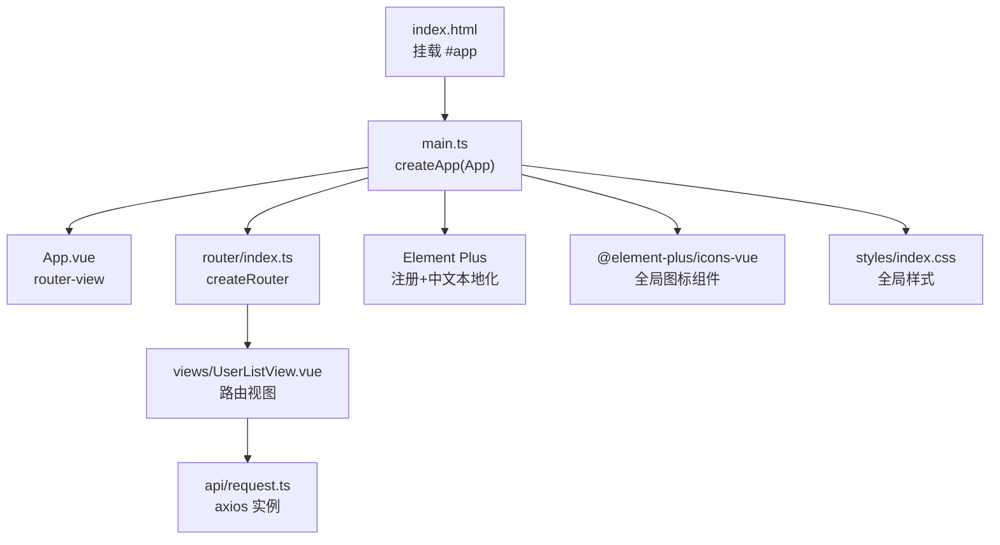
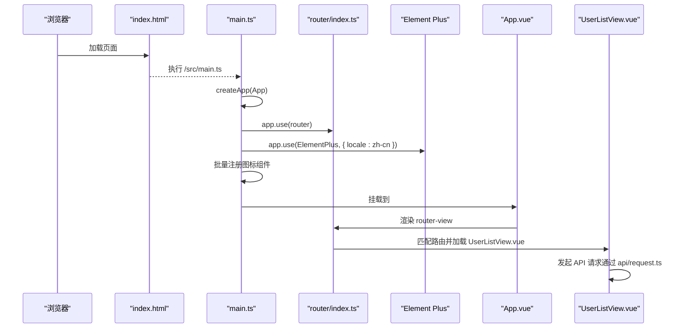
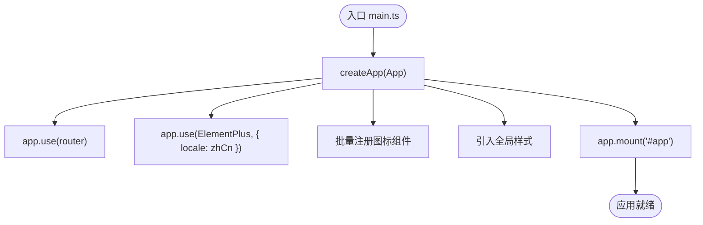
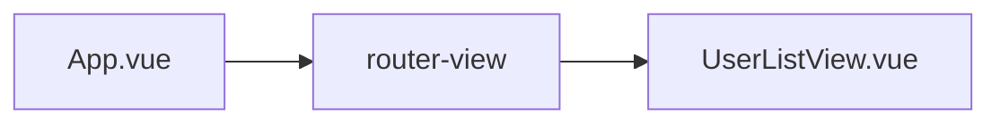
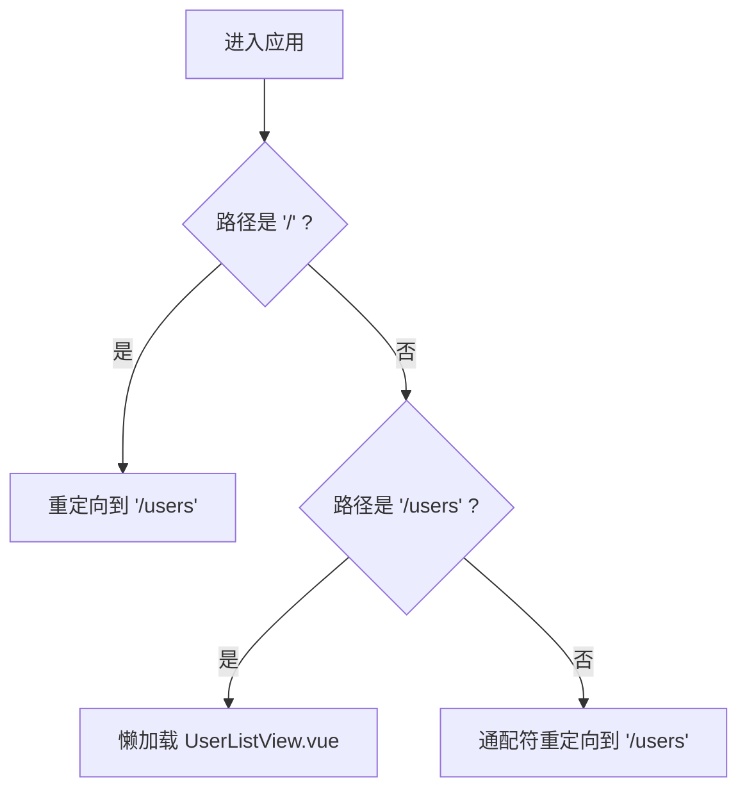
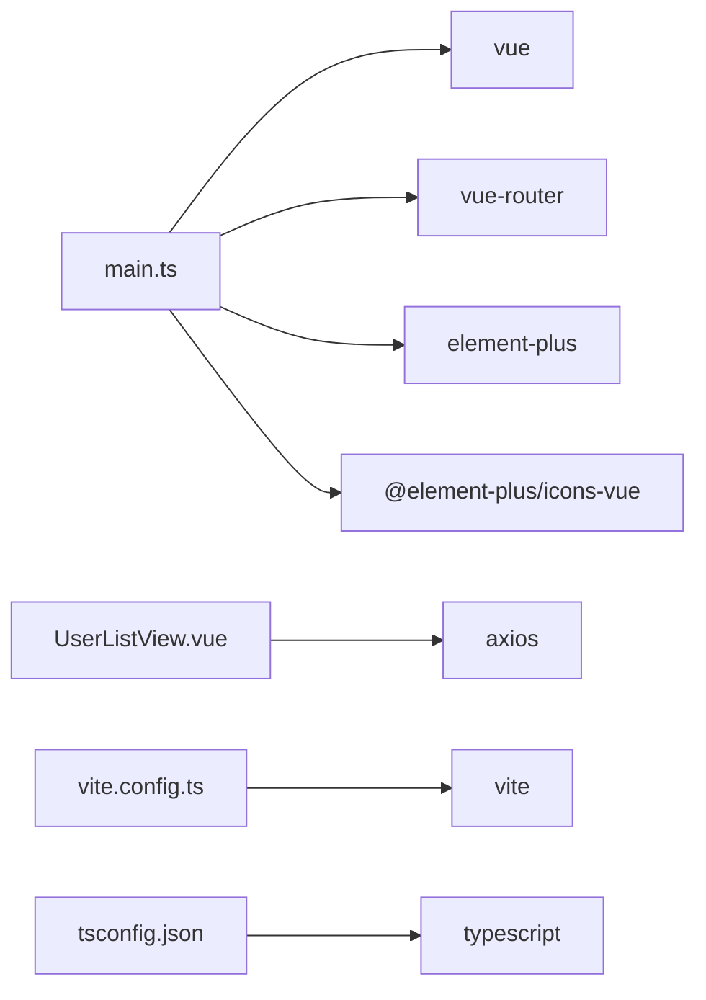

# 应用初始化

<cite>
**本文引用的文件**
- [frontend/src/main.ts](file://frontend/src/main.ts)
- [frontend/src/App.vue](file://frontend/src/App.vue)
- [frontend/src/router/index.ts](file://frontend/src/router/index.ts)
- [frontend/vite.config.ts](file://frontend/vite.config.ts)
- [frontend/package.json](file://frontend/package.json)
- [frontend/src/styles/index.css](file://frontend/src/styles/index.css)
- [frontend/src/api/request.ts](file://frontend/src/api/request.ts)
- [frontend/index.html](file://frontend/index.html)
- [frontend/tsconfig.json](file://frontend/tsconfig.json)
</cite>

## 目录
1. [简介](#简介)
2. [项目结构](#项目结构)
3. [核心组件](#核心组件)
4. [架构总览](#架构总览)
5. [详细组件分析](#详细组件分析)
6. [依赖关系分析](#依赖关系分析)
7. [性能考虑](#性能考虑)
8. [故障排查指南](#故障排查指南)
9. [结论](#结论)
10. [附录](#附录)

## 简介
本文面向 Vue 3 + Vite + TypeScript + Element Plus 的前端工程，聚焦“应用初始化”这一主题。内容覆盖入口文件 main.ts 的创建与配置、Element Plus 注册与中文本地化、全局图标批量注册、Vue Router 集成、全局样式引入；根组件 App.vue 的结构与组件树组织；启动过程中的依赖注入与插件机制；以及环境变量管理、开发环境设置、常见问题排查与性能优化建议。

## 项目结构
前端采用按功能/层次划分的目录组织：
- src/main.ts：应用入口，负责创建 Vue 实例、安装插件、挂载 DOM
- src/App.vue：根组件，仅包含路由出口
- src/router/index.ts：路由定义与懒加载
- src/styles/index.css：全局基础样式
- src/api/request.ts：基于 axios 的统一请求封装（含错误提示）
- vite.config.ts：Vite 构建与开发服务器配置（别名、代理等）
- package.json：依赖与脚本
- index.html：页面入口与挂载点
- tsconfig.json：TypeScript 编译选项与路径映射

图表来源
- [frontend/index.html:1-13](file://frontend/index.html#L1-L13)
- [frontend/src/main.ts:1-22](file://frontend/src/main.ts#L1-L22)
- [frontend/src/App.vue:1-4](file://frontend/src/App.vue#L1-L4)
- [frontend/src/router/index.ts:1-23](file://frontend/src/router/index.ts#L1-L23)
- [frontend/src/styles/index.css:1-15](file://frontend/src/styles/index.css#L1-L15)
- [frontend/src/api/request.ts:1-26](file://frontend/src/api/request.ts#L1-L26)

章节来源
- [frontend/index.html:1-13](file://frontend/index.html#L1-L13)
- [frontend/src/main.ts:1-22](file://frontend/src/main.ts#L1-L22)
- [frontend/src/App.vue:1-4](file://frontend/src/App.vue#L1-L4)
- [frontend/src/router/index.ts:1-23](file://frontend/src/router/index.ts#L1-L23)
- [frontend/src/styles/index.css:1-15](file://frontend/src/styles/index.css#L1-L15)
- [frontend/src/api/request.ts:1-26](file://frontend/src/api/request.ts#L1-L26)

## 核心组件
- 应用入口 main.ts
  - 创建 Vue 应用实例并挂载到 #app
  - 安装 Vue Router
  - 安装 Element Plus 并传入中文语言包
  - 批量注册 @element-plus/icons-vue 所有图标为全局组件
  - 引入全局样式
- 根组件 App.vue
  - 仅渲染 router-view，作为路由容器
- 路由系统 router/index.ts
  - 使用 createWebHistory 模式
  - 定义首页重定向、用户列表页、通配符兜底重定向
  - 使用动态导入实现路由级代码分割
- 全局样式 styles/index.css
  - 重置 html/body/#app 高度与边距
  - 设置字体族、背景色、文字颜色与抗锯齿
- 网络请求 api/request.ts
  - 基于 axios.create 统一 baseURL、超时
  - 响应拦截器统一处理错误消息并通过 ElMessage.error 提示

章节来源
- [frontend/src/main.ts:1-22](file://frontend/src/main.ts#L1-L22)
- [frontend/src/App.vue:1-4](file://frontend/src/App.vue#L1-L4)
- [frontend/src/router/index.ts:1-23](file://frontend/src/router/index.ts#L1-L23)
- [frontend/src/styles/index.css:1-15](file://frontend/src/styles/index.css#L1-L15)
- [frontend/src/api/request.ts:1-26](file://frontend/src/api/request.ts#L1-L26)

## 架构总览
下图展示了从 HTML 到 Vue 应用、再到路由与 UI 库的完整初始化链路。

图表来源
- [frontend/index.html:1-13](file://frontend/index.html#L1-L13)
- [frontend/src/main.ts:1-22](file://frontend/src/main.ts#L1-L22)
- [frontend/src/router/index.ts:1-23](file://frontend/src/router/index.ts#L1-L23)
- [frontend/src/App.vue:1-4](file://frontend/src/App.vue#L1-L4)
- [frontend/src/views/UserListView.vue:1-278](file://frontend/src/views/UserListView.vue#L1-L278)

## 详细组件分析

### 入口文件 main.ts：创建、插件与挂载
- 创建应用实例：调用 createApp(App) 生成应用上下文
- 插件安装顺序：
  - 先安装路由：app.use(router)，确保后续组件可访问路由能力
  - 再安装 UI 库：app.use(ElementPlus, { locale: zhCn })，启用中文本地化
- 全局图标批量注册：遍历 @element-plus/icons-vue 导出对象，将每个图标以组件名注册为全局组件，便于在模板中直接使用
- 全局样式：引入 styles/index.css，保证基础布局与字体一致
- 挂载：app.mount('#app') 将应用挂载到 index.html 中的 #app 节点

图表来源
- [frontend/src/main.ts:1-22](file://frontend/src/main.ts#L1-L22)

章节来源
- [frontend/src/main.ts:1-22](file://frontend/src/main.ts#L1-L22)

### 根组件 App.vue：结构与组件树
- 仅包含 <router-view />，作为路由出口
- 组件树扁平清晰，所有业务视图由路由驱动渲染，避免在根组件堆积逻辑

图表来源
- [frontend/src/App.vue:1-4](file://frontend/src/App.vue#L1-L4)
- [frontend/src/views/UserListView.vue:1-278](file://frontend/src/views/UserListView.vue#L1-L278)

章节来源
- [frontend/src/App.vue:1-4](file://frontend/src/App.vue#L1-L4)

### 路由系统：history 模式与懒加载
- 使用 createWebHistory 模式，适合部署在支持 history 的后端或静态托管服务
- 路由表：
  - 根路径重定向至 /users
  - /users 对应 UserListView.vue，采用动态 import 实现按需加载
  - 通配符路径重定向回 /users，提升容错体验
- 配合 Vite 的路径别名 @，简化模块引用

图表来源
- [frontend/src/router/index.ts:1-23](file://frontend/src/router/index.ts#L1-L23)

章节来源
- [frontend/src/router/index.ts:1-23](file://frontend/src/router/index.ts#L1-L23)

### Element Plus 与中文本地化
- 通过 app.use(ElementPlus, { locale: zhCn }) 完成全局注册并设置中文语言包
- 同时引入 element-plus/dist/index.css 以获取默认样式
- 中文本地化影响表单校验、分页、日期选择器等内置文案

章节来源
- [frontend/src/main.ts:1-22](file://frontend/src/main.ts#L1-L22)

### 全局图标组件批量注册
- 通过遍历 @element-plus/icons-vue 的导出键值对，将每个图标以组件名注册为全局组件
- 好处：在任意模板中可直接使用图标组件名，无需逐个 import
- 注意：批量注册会增加首屏体积，若图标使用较少可改为按需引入

章节来源
- [frontend/src/main.ts:1-22](file://frontend/src/main.ts#L1-L22)

### 全局样式与基础布局
- 重置 html/body/#app 高度与边距，确保全屏布局
- 设置字体栈与背景色，提升可读性与一致性
- 开启抗锯齿渲染，改善字体显示效果

章节来源
- [frontend/src/styles/index.css:1-15](file://frontend/src/styles/index.css#L1-L15)

### 网络请求封装与错误提示
- 基于 axios.create 创建实例，统一 baseURL 与超时时间
- 响应拦截器：
  - 成功时返回 response.data，简化上层调用
  - 失败时提取后端 message 或 fallback 错误信息，并通过 ElMessage.error 统一提示
- 与 Element Plus 的消息组件集成，提供一致的用户反馈

章节来源
- [frontend/src/api/request.ts:1-26](file://frontend/src/api/request.ts#L1-L26)

## 依赖关系分析
- 运行时依赖
  - vue：框架核心
  - vue-router：路由系统
  - element-plus：UI 组件库
  - @element-plus/icons-vue：图标库
  - axios：HTTP 客户端
- 构建与开发依赖
  - vite：构建工具
  - @vitejs/plugin-vue：Vue 单文件组件支持
  - typescript、vue-tsc：类型检查与编译
  - @types/node：Node 类型声明

图表来源
- [frontend/package.json:1-26](file://frontend/package.json#L1-L26)
- [frontend/vite.config.ts:1-25](file://frontend/vite.config.ts#L1-L25)
- [frontend/tsconfig.json:1-28](file://frontend/tsconfig.json#L1-L28)

章节来源
- [frontend/package.json:1-26](file://frontend/package.json#L1-L26)
- [frontend/vite.config.ts:1-25](file://frontend/vite.config.ts#L1-L25)
- [frontend/tsconfig.json:1-28](file://frontend/tsconfig.json#L1-L28)

## 性能考虑
- 路由级代码分割：路由组件使用动态 import，减少首屏包体
- 图标按需引入：若图标使用量不大，建议改为按需引入而非全局批量注册，降低初始体积
- 样式最小化：生产构建会自动压缩 CSS；保持全局样式精简，避免重复规则
- 请求优化：合理设置超时与重试策略；对频繁数据可使用缓存或防抖
- 构建优化：利用 Vite 的预构建与依赖优化；必要时拆分 vendor 包

[本节为通用性能建议，不直接分析具体文件]

## 故障排查指南
- 应用无法挂载
  - 检查 index.html 是否存在 id="app" 的节点
  - 确认 main.ts 已正确 mount 到该节点
- 路由无效或白屏
  - 确认已安装并使用 app.use(router)
  - 检查路由模式与部署环境是否匹配（history 模式需服务端支持）
  - 通配符重定向是否正确配置
- Element Plus 样式缺失或语言未生效
  - 确认已引入 element-plus 的样式文件
  - 确认传入的 locale 为 zhCn 且已正确导入
- 图标组件不可用
  - 确认已批量注册或按需引入对应图标
  - 检查组件名是否与图标导出名一致
- 网络请求报错
  - 检查 baseURL 与代理配置是否匹配
  - 查看响应拦截器的错误提示，定位后端返回的错误信息
  - 确认跨域与端口配置（开发服务器 proxy）

章节来源
- [frontend/index.html:1-13](file://frontend/index.html#L1-L13)
- [frontend/src/main.ts:1-22](file://frontend/src/main.ts#L1-L22)
- [frontend/src/router/index.ts:1-23](file://frontend/src/router/index.ts#L1-L23)
- [frontend/src/api/request.ts:1-26](file://frontend/src/api/request.ts#L1-L26)
- [frontend/vite.config.ts:1-25](file://frontend/vite.config.ts#L1-L25)

## 结论
本应用以 main.ts 为入口，集中完成 Vue 实例创建、插件安装与全局资源引入；App.vue 保持简洁，仅承担路由容器职责；路由采用 history 模式与懒加载，兼顾用户体验与性能；Element Plus 与中文本地化、全局图标批量注册提升了开发效率；统一的 axios 请求封装简化了错误处理。结合 Vite 的配置与 TypeScript 的类型约束，整体初始化流程清晰、可扩展性强。

[本节为总结性内容，不直接分析具体文件]

## 附录

### 应用配置与环境变量管理
- 开发服务器与代理
  - 在 vite.config.ts 中配置 server.port 与 proxy，将 /api 请求转发到后端地址，解决跨域问题
- 路径别名
  - 通过 resolve.alias 将 @ 指向 src 目录，统一模块引用方式
- TypeScript 路径映射
  - tsconfig.json 中 paths 配置与 Vite alias 保持一致，确保 IDE 与构建产物一致
- 环境变量
  - 当前工程未显式使用 .env 文件；如需区分环境，可在 vite.config.ts 中读取 import.meta.env，并按环境切换 baseURL 或开关特性

章节来源
- [frontend/vite.config.ts:1-25](file://frontend/vite.config.ts#L1-L25)
- [frontend/tsconfig.json:1-28](file://frontend/tsconfig.json#L1-L28)

### 启动过程与插件机制要点
- 依赖注入
  - Vue 应用实例通过 createApp 创建，随后通过 app.use 安装插件（如 router、Element Plus），使全局能力可用
- 插件生命周期
  - 插件在应用挂载前完成初始化，确保组件渲染时可立即使用路由、UI 组件与全局状态
- 挂载时机
  - app.mount('#app') 后，Vue 开始渲染组件树，触发路由匹配与视图加载

章节来源
- [frontend/src/main.ts:1-22](file://frontend/src/main.ts#L1-L22)