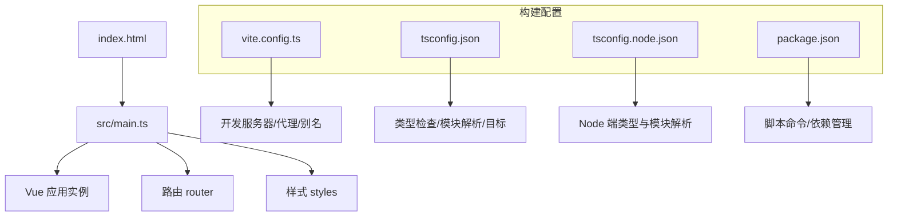
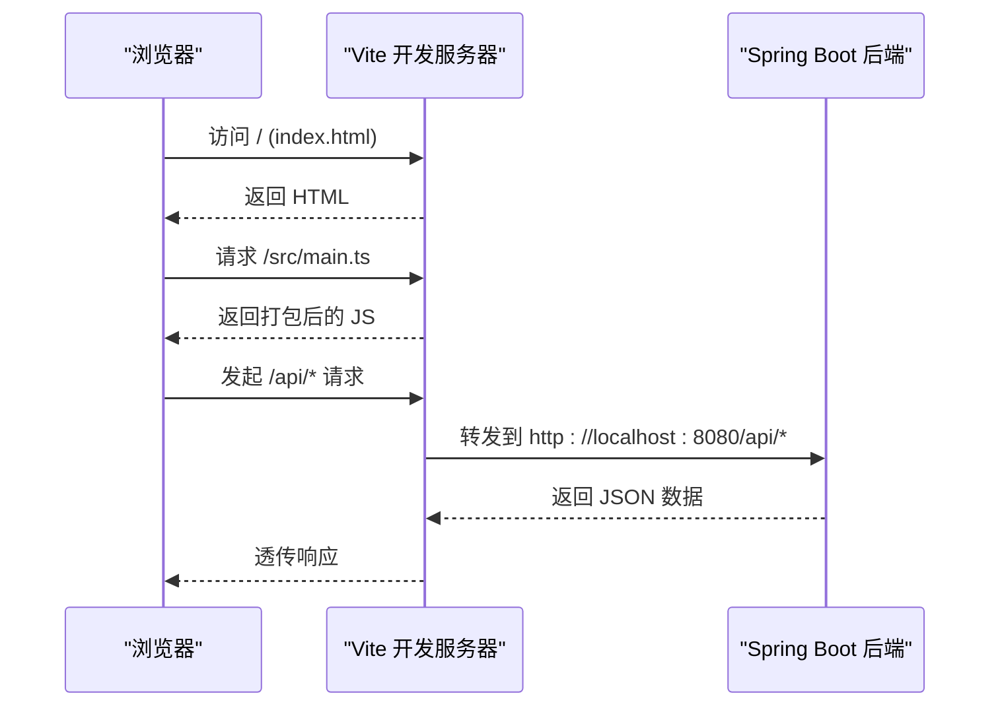
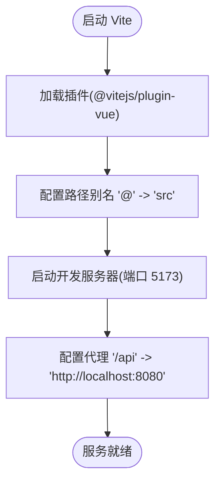
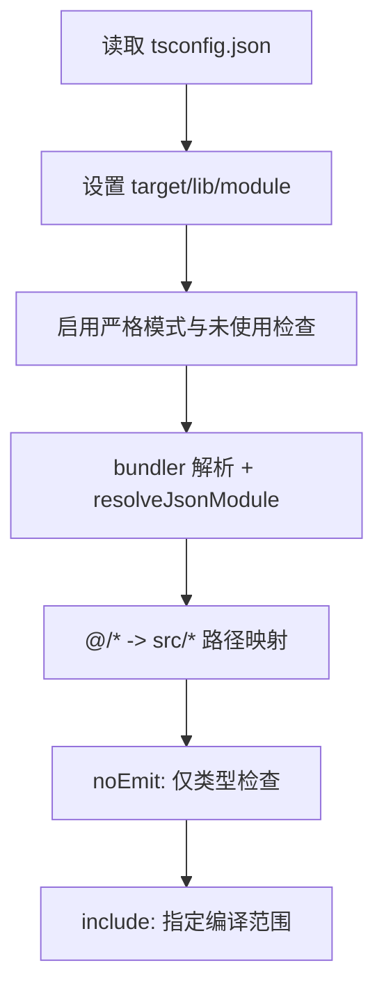
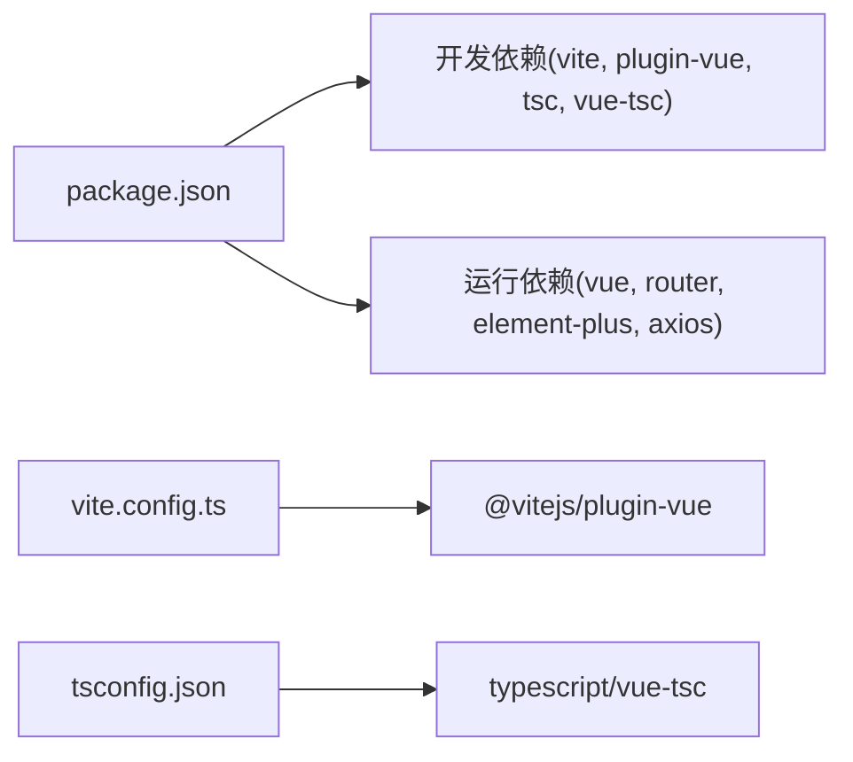

# 构建配置

<cite>
**本文引用的文件**
- [vite.config.ts](file://frontend/vite.config.ts)
- [tsconfig.json](file://frontend/tsconfig.json)
- [tsconfig.node.json](file://frontend/tsconfig.node.json)
- [package.json](file://frontend/package.json)
- [index.html](file://frontend/index.html)
- [main.ts](file://frontend/src/main.ts)
- [vite-env.d.ts](file://frontend/vite-env.d.ts)
</cite>

## 目录
1. [简介](#简介)
2. [项目结构](#项目结构)
3. [核心组件](#核心组件)
4. [架构总览](#架构总览)
5. [详细组件分析](#详细组件分析)
6. [依赖分析](#依赖分析)
7. [性能考虑](#性能考虑)
8. [故障排除指南](#故障排除指南)
9. [结论](#结论)
10. [附录](#附录)

## 简介
本文件面向前端构建配置，围绕 Vite 构建工具、TypeScript 编译与模块解析、包管理与脚本命令、构建优化策略以及开发与生产环境的差异化配置进行系统化说明。目标是帮助读者快速理解并高效调优该项目的构建流程，同时提供可操作的排错建议。

## 项目结构
前端工程采用 Vue 3 + TypeScript + Vite 的现代前端栈，入口为 index.html，应用启动由 src/main.ts 完成，Vite 配置文件位于 frontend/vite.config.ts，TypeScript 编译配置位于 frontend/tsconfig.json 与 frontend/tsconfig.node.json，包管理与脚本定义在 frontend/package.json。

图表来源
- [index.html:1-13](file://frontend/index.html#L1-L13)
- [main.ts:1-22](file://frontend/src/main.ts#L1-L22)
- [vite.config.ts:1-25](file://frontend/vite.config.ts#L1-L25)
- [tsconfig.json:1-28](file://frontend/tsconfig.json#L1-L28)
- [tsconfig.node.json:1-12](file://frontend/tsconfig.node.json#L1-L12)
- [package.json:1-26](file://frontend/package.json#L1-L26)

章节来源
- [index.html:1-13](file://frontend/index.html#L1-L13)
- [main.ts:1-22](file://frontend/src/main.ts#L1-L22)
- [vite.config.ts:1-25](file://frontend/vite.config.ts#L1-L25)
- [tsconfig.json:1-28](file://frontend/tsconfig.json#L1-L28)
- [tsconfig.node.json:1-12](file://frontend/tsconfig.node.json#L1-L12)
- [package.json:1-26](file://frontend/package.json#L1-L26)

## 核心组件
- Vite 构建配置：定义插件、路径别名、开发服务器端口与代理等。
- TypeScript 编译配置：定义目标版本、模块系统、严格模式、路径映射与包含范围。
- Node 端 TS 配置：针对 vite.config.ts 的独立编译选项。
- 包管理与脚本：定义 dev/build/preview 命令及运行时与开发时依赖。
- 应用入口与类型声明：index.html 挂载点与 Vite 客户端类型声明。

章节来源
- [vite.config.ts:1-25](file://frontend/vite.config.ts#L1-L25)
- [tsconfig.json:1-28](file://frontend/tsconfig.json#L1-L28)
- [tsconfig.node.json:1-12](file://frontend/tsconfig.node.json#L1-L12)
- [package.json:1-26](file://frontend/package.json#L1-L26)
- [index.html:1-13](file://frontend/index.html#L1-L13)
- [vite-env.d.ts:1-2](file://frontend/vite-env.d.ts#L1-L2)

## 架构总览
下图展示了从浏览器加载到应用启动的关键链路，以及开发环境下 API 请求如何被 Vite 代理转发到后端。

图表来源
- [index.html:1-13](file://frontend/index.html#L1-L13)
- [vite.config.ts:14-23](file://frontend/vite.config.ts#L14-L23)

## 详细组件分析

### Vite 构建配置（vite.config.ts）
- 插件扩展：通过引入并注册 Vue 插件，启用对 .vue 单文件组件的支持。
- 路径别名：将 @ 指向 src 目录，简化导入路径，提升可读性与可维护性。
- 开发服务器：
  - 端口：默认 5173。
  - 代理：将 /api 前缀的请求转发至 http://localhost:8080，并开启 changeOrigin 以适配跨域场景。
- 模块解析：使用 bundler 模式解析模块，配合 tsconfig.json 的 paths 实现一致的模块解析体验。

图表来源
- [vite.config.ts:1-25](file://frontend/vite.config.ts#L1-L25)

章节来源
- [vite.config.ts:1-25](file://frontend/vite.config.ts#L1-L25)

### TypeScript 编译配置（tsconfig.json）
- 目标与库：target 设置为 ES2022，lib 包含 ES2022、DOM、DOM.Iterable，确保现代语法与浏览器 API 可用。
- 模块系统：module 为 ESNext，moduleResolution 为 bundler，匹配 Vite/Rollup 的解析行为；resolveJsonModule 允许导入 JSON。
- 严格模式：strict 开启，noUnusedLocals、noUnusedParameters、noFallthroughCasesInSwitch 增强类型安全。
- 编译输出：noEmit true，表示仅做类型检查，不生成 JS；isolatedModules 保证每个文件独立编译，利于并行与增量构建。
- JSX：preserve，保留 JSX 以便后续处理。
- 路径映射：baseUrl 为根目录，paths 中 @/* 映射到 src/*，与 Vite 别名保持一致。
- 包含范围：include 覆盖 vite-env.d.ts、src 下所有文件与 .vue 文件。

图表来源
- [tsconfig.json:1-28](file://frontend/tsconfig.json#L1-L28)

章节来源
- [tsconfig.json:1-28](file://frontend/tsconfig.json#L1-L28)

### Node 端 TypeScript 配置（tsconfig.node.json）
- 专门用于 vite.config.ts 的编译与类型检查。
- types 包含 node，确保 Node 环境类型可用。
- moduleResolution 同样为 bundler，保持与主配置一致。
- noEmit true，仅做类型检查。

章节来源
- [tsconfig.node.json:1-12](file://frontend/tsconfig.node.json#L1-L12)

### 包管理与脚本命令（package.json）
- 元信息：name、version、private、type 为 module，启用 ESM。
- 脚本命令：
  - dev：启动 Vite 开发服务器。
  - build：先执行 vue-tsc --noEmit 进行类型检查，再执行 vite build 构建产物。
  - preview：本地预览构建产物。
- 依赖：
  - 运行时依赖：Vue、Element Plus、Axios、Vue Router 等。
  - 开发依赖：Vite、@vitejs/plugin-vue、TypeScript、vue-tsc、@types/node。

章节来源
- [package.json:1-26](file://frontend/package.json#L1-L26)

### 应用入口与类型声明
- index.html：定义页面标题、视口与挂载点 #app，并通过 type="module" 引入 /src/main.ts。
- main.ts：创建 Vue 应用实例，全局注册 Element Plus 图标，安装路由与 UI 库，并挂载到 #app。
- vite-env.d.ts：引用 vite/client 类型，使 Vite 提供的类型能力（如 import.meta 等）可用。

章节来源
- [index.html:1-13](file://frontend/index.html#L1-L13)
- [main.ts:1-22](file://frontend/src/main.ts#L1-L22)
- [vite-env.d.ts:1-2](file://frontend/vite-env.d.ts#L1-L2)

## 依赖分析
- 构建期依赖：
  - vite：构建与开发服务器核心。
  - @vitejs/plugin-vue：支持 .vue 单文件组件。
  - typescript、vue-tsc：类型检查与编译辅助。
  - @types/node：Node 类型支持。
- 运行期依赖：
  - vue、vue-router：框架与路由。
  - element-plus、@element-plus/icons-vue：UI 组件库与图标。
  - axios：HTTP 客户端。

图表来源
- [package.json:1-26](file://frontend/package.json#L1-L26)
- [vite.config.ts:1-25](file://frontend/vite.config.ts#L1-L25)
- [tsconfig.json:1-28](file://frontend/tsconfig.json#L1-L28)

章节来源
- [package.json:1-26](file://frontend/package.json#L1-L26)
- [vite.config.ts:1-25](file://frontend/vite.config.ts#L1-L25)
- [tsconfig.json:1-28](file://frontend/tsconfig.json#L1-L28)

## 性能考虑
- 开发环境
  - 使用 Vite 原生热更新与按需编译，提升迭代速度。
  - 合理设置路径别名减少相对路径层级，提高 IDE 导航与解析效率。
  - 使用代理避免跨域问题，减少额外配置成本。
- 构建优化
  - 当前构建脚本在 build 前先执行 vue-tsc --noEmit 进行类型检查，确保产出质量。
  - 可通过 Vite 的构建选项进一步调整代码压缩、资源分割与缓存策略（例如启用 gzip/ Brotli、拆分 vendor、长缓存文件名等）。
  - 利用 isolatedModules 与 noEmit 提升类型检查与构建的并行度。
- 缓存策略
  - 生产构建建议使用内容哈希命名，便于浏览器长期缓存。
  - 静态资源与第三方库可按需拆分，减少首屏体积。
- 监控与分析
  - 可在构建后分析产物大小与依赖关系，识别大体积依赖并进行按需引入或替换。

[本节为通用指导，不直接分析具体文件]

## 故障排除指南
- 开发服务器无法启动或端口占用
  - 现象：启动时报端口冲突。
  - 排查：确认 vite.config.ts 中的 server.port 是否与其他进程冲突，必要时修改端口。
  - 参考：[vite.config.ts:14-16](file://frontend/vite.config.ts#L14-L16)
- 代理不生效或跨域错误
  - 现象：前端调用 /api 报跨域或 404。
  - 排查：检查 server.proxy 的 target 地址与 changeOrigin 设置，确保后端服务已启动且路径匹配。
  - 参考：[vite.config.ts:16-22](file://frontend/vite.config.ts#L16-L22)
- 路径别名 @ 无效
  - 现象：IDE 或构建时报找不到模块。
  - 排查：确认 vite.config.ts 的 resolve.alias 与 tsconfig.json 的 paths 均正确配置，且 include 范围包含相关文件。
  - 参考：[vite.config.ts:9-13](file://frontend/vite.config.ts#L9-L13)、[tsconfig.json:21-24](file://frontend/tsconfig.json#L21-L24)
- 类型检查失败导致构建中断
  - 现象：npm run build 在类型检查阶段报错。
  - 排查：根据 vue-tsc 的错误提示修复类型问题；必要时临时关闭严格规则定位问题。
  - 参考：[package.json:6-9](file://frontend/package.json#L6-L9)、[tsconfig.json:16-19](file://frontend/tsconfig.json#L16-L19)
- Node 端配置类型缺失
  - 现象：vite.config.ts 中使用 Node API 时报类型错误。
  - 排查：确认 tsconfig.node.json 的 types 包含 node，并确保其 include 包含 vite.config.ts。
  - 参考：[tsconfig.node.json:1-12](file://frontend/tsconfig.node.json#L1-L12)

章节来源
- [vite.config.ts:9-22](file://frontend/vite.config.ts#L9-L22)
- [tsconfig.json:16-24](file://frontend/tsconfig.json#L16-L24)
- [tsconfig.node.json:1-12](file://frontend/tsconfig.node.json#L1-L12)
- [package.json:6-9](file://frontend/package.json#L6-L9)

## 结论
本项目基于 Vite + Vue 3 + TypeScript 构建了现代化的前端工程。通过合理的插件扩展、路径别名、开发服务器与代理配置，以及严格的 TypeScript 编译选项，实现了高效的开发与稳定的构建流程。结合包管理与脚本命令，开发者可以便捷地启动、构建与预览应用。在生产环境中，可进一步引入代码压缩、资源拆分与缓存策略以提升性能。

[本节为总结性内容，不直接分析具体文件]

## 附录
- 常用命令
  - 开发：npm run dev
  - 构建：npm run build
  - 预览：npm run preview
- 关键配置位置
  - Vite 配置：frontend/vite.config.ts
  - TypeScript 配置：frontend/tsconfig.json、frontend/tsconfig.node.json
  - 包管理：frontend/package.json
  - 入口与类型声明：frontend/index.html、frontend/vite-env.d.ts

[本节为补充信息，不直接分析具体文件]