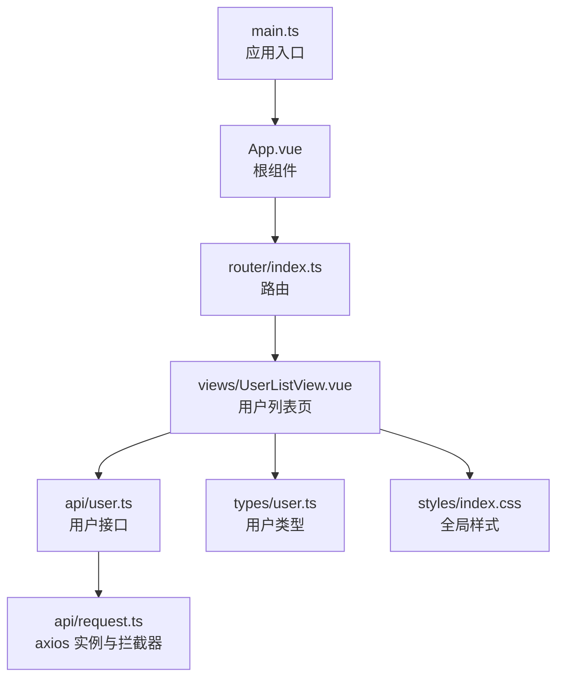
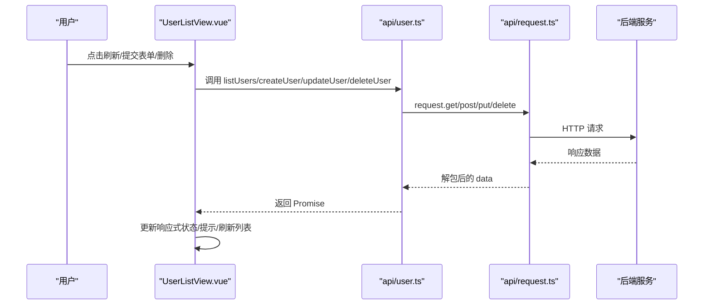
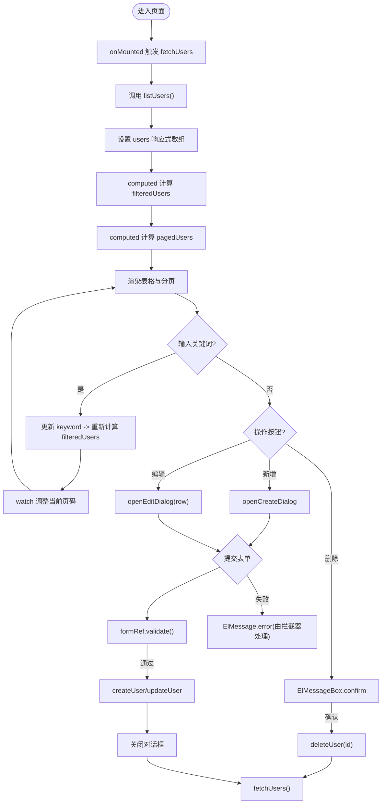
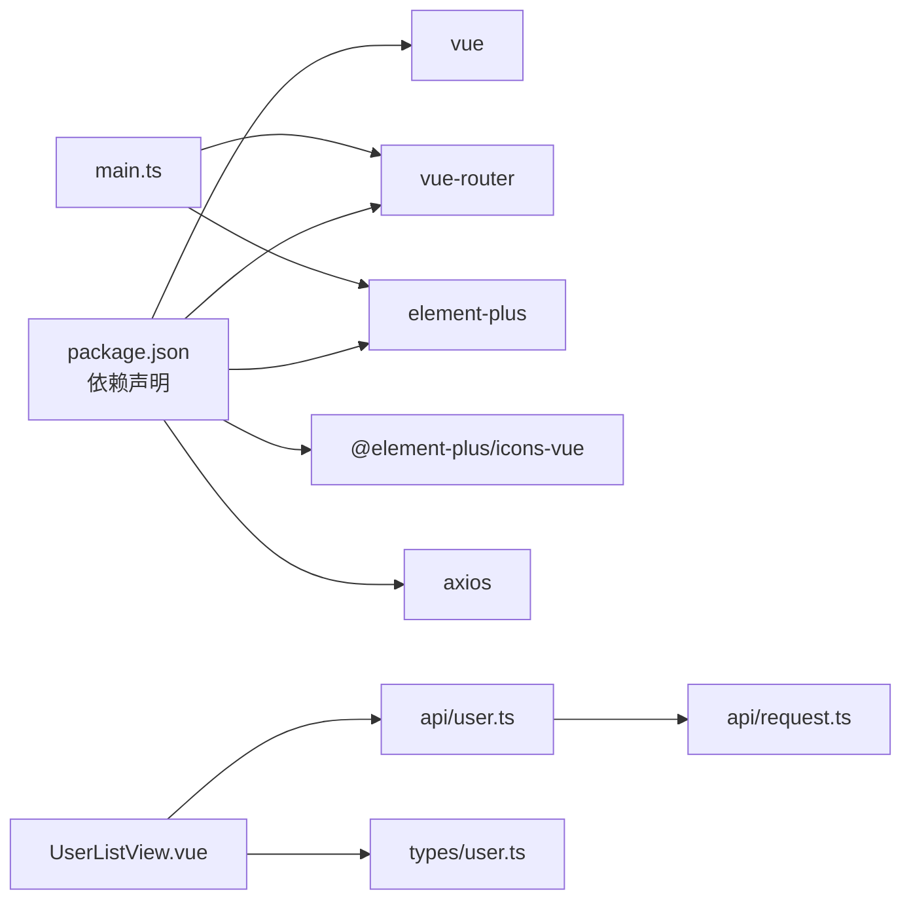

# 组件架构

<cite>
**本文引用的文件**
- [UserListView.vue](file://frontend/src/views/UserListView.vue)
- [App.vue](file://frontend/src/App.vue)
- [main.ts](file://frontend/src/main.ts)
- [user.ts](file://frontend/src/api/user.ts)
- [request.ts](file://frontend/src/api/request.ts)
- [index.ts](file://frontend/src/router/index.ts)
- [user.ts](file://frontend/src/types/user.ts)
- [api.ts](file://frontend/src/types/api.ts)
- [index.css](file://frontend/src/styles/index.css)
- [package.json](file://frontend/package.json)
</cite>

## 目录
1. [简介](#简介)
2. [项目结构](#项目结构)
3. [核心组件](#核心组件)
4. [架构总览](#架构总览)
5. [详细组件分析](#详细组件分析)
6. [依赖关系分析](#依赖关系分析)
7. [性能考虑](#性能考虑)
8. [故障排查指南](#故障排查指南)
9. [结论](#结论)
10. [附录](#附录)

## 简介
本文件面向 Vue 3 前端工程，聚焦单文件组件的组织与命名规范、职责划分与模块化设计；以 UserListView.vue 为核心，深入解析基于 Composition API 的页面实现、响应式数据管理、事件处理与用户交互；说明组件间通信模式（props、事件、provide/inject）；阐述样式管理策略（CSS 模块化、隔离与主题定制）；并给出组件复用、组合式函数开发、测试策略、性能优化与可访问性最佳实践。

## 项目结构
前端采用按功能域划分的目录组织：
- views：页面级组件（如用户列表页）
- components：可复用 UI 组件（当前仓库未包含，建议后续补充）
- api：接口封装与请求实例
- types：类型定义
- router：路由配置
- styles：全局样式
- App.vue：根组件
- main.ts：应用入口与插件注册

图表来源
- [main.ts:1-22](file://frontend/src/main.ts#L1-L22)
- [App.vue:1-4](file://frontend/src/App.vue#L1-L4)
- [index.ts:1-23](file://frontend/src/router/index.ts#L1-L23)
- [UserListView.vue:1-278](file://frontend/src/views/UserListView.vue#L1-L278)
- [user.ts:1-29](file://frontend/src/api/user.ts#L1-L29)
- [request.ts:1-26](file://frontend/src/api/request.ts#L1-L26)
- [user.ts:1-16](file://frontend/src/types/user.ts#L1-L16)
- [index.css:1-15](file://frontend/src/styles/index.css#L1-L15)

章节来源
- [main.ts:1-22](file://frontend/src/main.ts#L1-L22)
- [package.json:1-26](file://frontend/package.json#L1-L26)

## 核心组件
- 页面组件：UserListView.vue，负责用户列表展示、搜索过滤、分页、新增/编辑/删除等完整业务交互。
- 根组件：App.vue，仅承载路由视图容器。
- 应用入口：main.ts，初始化 Vue 应用、注册 Element Plus 及图标、挂载路由与全局样式。

章节来源
- [UserListView.vue:1-278](file://frontend/src/views/UserListView.vue#L1-L278)
- [App.vue:1-4](file://frontend/src/App.vue#L1-L4)
- [main.ts:1-22](file://frontend/src/main.ts#L1-L22)

## 架构总览
前端采用“页面组件 + 接口层 + 类型层”的分层架构：
- 页面层（views）：使用 Composition API 组织状态与逻辑，调用接口层获取数据，渲染 UI。
- 接口层（api）：统一 axios 实例、错误提示、返回数据结构解包。
- 类型层（types）：前后端契约的类型约束，保证编译期安全。

图表来源
- [UserListView.vue:148-235](file://frontend/src/views/UserListView.vue#L148-L235)
- [user.ts:1-29](file://frontend/src/api/user.ts#L1-L29)
- [request.ts:1-26](file://frontend/src/api/request.ts#L1-L26)

## 详细组件分析

### UserListView.vue 组件分析
该组件为典型的数据管理型页面，职责清晰：
- 数据加载：在 onMounted 中拉取用户列表，支持手动刷新。
- 搜索与过滤：通过 computed 计算 filteredUsers，基于关键字匹配姓名或邮箱。
- 前端分页：根据 page/pageSize 对过滤结果进行切片，得到 pagedUsers。
- 表单与校验：使用 reactive 构建 form，配合 FormRules 完成必填与格式校验。
- 新增/编辑/删除：打开对话框填充表单，提交时区分新增与更新；删除前二次确认。
- 交互反馈：使用 ElMessage/ElMessageBox 提供成功与确认反馈。
- 时间格式化：简单字符串处理将 ISO 时间转为本地显示格式。

图表来源
- [UserListView.vue:125-146](file://frontend/src/views/UserListView.vue#L125-L146)
- [UserListView.vue:148-235](file://frontend/src/views/UserListView.vue#L148-L235)

#### 关键实现要点
- 响应式数据
  - ref：loading、submitting、users、keyword、page、pageSize、dialogVisible、isEdit、editingId、formRef
  - reactive：form（UserForm）
  - computed：filteredUsers、pagedUsers
  - watch：监听 filteredUsers 变化，自动回退到有效页码
- 事件处理与用户交互
  - 刷新：fetchUsers
  - 搜索：v-model 绑定 keyword
  - 新增/编辑：openCreateDialog/openEditDialog，提交 handleSubmit
  - 删除：handleDelete，二次确认后调用 deleteUser
- 表单校验
  - 使用 Element Plus 的 FormInstance 与 FormRules，提交前 validate
- 外部依赖
  - Element Plus 组件与图标
  - 接口封装 user.ts
  - 类型定义 types/user.ts

章节来源
- [UserListView.vue:1-278](file://frontend/src/views/UserListView.vue#L1-L278)
- [user.ts:1-29](file://frontend/src/api/user.ts#L1-L29)
- [user.ts:1-16](file://frontend/src/types/user.ts#L1-L16)

### 组件间通信模式
- props 传递：当前页面内无子组件，未使用 props。建议在后续拆分出“用户行卡片”“用户表单”等子组件时使用 props 向下传递数据。
- 事件发射：当前页面内无子组件，未使用 $emit。建议在子组件中通过 emit 向父组件上报交互事件（如保存成功）。
- provide/inject：当前未使用。适合跨层级共享主题、语言、权限等上下文信息。可在 App.vue 或更高层提供，页面注入使用。

章节来源
- [App.vue:1-4](file://frontend/src/App.vue#L1-L4)
- [UserListView.vue:1-278](file://frontend/src/views/UserListView.vue#L1-L278)

### 样式管理策略
- 组件内样式：UserListView.vue 使用 scoped 样式，避免污染全局，便于维护。
- 全局样式：styles/index.css 定义基础重置、字体、背景色等。
- 主题定制：Element Plus 已全局引入，可通过 CSS 变量或覆盖类名进行主题定制；也可按需引入主题包。
- 模块化建议：后续可按功能域拆分样式文件，或使用 CSS Modules / CSS-in-JS 增强隔离性。

章节来源
- [UserListView.vue:238-278](file://frontend/src/views/UserListView.vue#L238-L278)
- [index.css:1-15](file://frontend/src/styles/index.css#L1-L15)
- [main.ts:1-22](file://frontend/src/main.ts#L1-L22)

### 组合式函数与组件复用
- 现状：当前页面逻辑集中在组件内部，尚未抽取为独立 composables。
- 建议：
  - useUserList：封装列表加载、搜索过滤、分页、增删改流程，返回响应式状态与方法。
  - useForm：封装表单创建、校验、重置、提交流程。
  - 将对话框与表单抽离为独立组件，通过 props/emit 与页面通信。
- 收益：提升复用度、降低耦合、便于单元测试。

[本节为概念性建议，不直接分析具体文件]

### 组件测试策略
- 单元/集成测试建议：
  - 使用 Vitest + @vue/test-utils 对组合式函数（useUserList、useForm）进行测试。
  - 对页面组件进行集成测试：模拟路由、Axios 响应、Element Plus 组件行为，验证渲染与交互。
- 断言重点：
  - 初始状态、加载态、空数据、错误态
  - 搜索过滤与分页边界
  - 表单校验规则与提交流程
  - 删除确认与成功后列表刷新

[本节为概念性建议，不直接分析具体文件]

## 依赖关系分析
- 运行时依赖
  - vue、vue-router、element-plus、@element-plus/icons-vue、axios
- 构建与类型
  - vite、typescript、vue-tsc
- 模块依赖
  - 页面组件依赖接口层与类型层
  - 接口层依赖 axios 实例与全局错误提示
  - 入口文件注册路由与 UI 库

图表来源
- [package.json:11-24](file://frontend/package.json#L11-L24)
- [main.ts:1-22](file://frontend/src/main.ts#L1-L22)
- [UserListView.vue:89-96](file://frontend/src/views/UserListView.vue#L89-L96)
- [user.ts:1-29](file://frontend/src/api/user.ts#L1-L29)
- [request.ts:1-26](file://frontend/src/api/request.ts#L1-L26)
- [user.ts:1-16](file://frontend/src/types/user.ts#L1-L16)

章节来源
- [package.json:1-26](file://frontend/package.json#L1-L26)
- [main.ts:1-22](file://frontend/src/main.ts#L1-L22)
- [UserListView.vue:89-96](file://frontend/src/views/UserListView.vue#L89-L96)

## 性能考虑
- 列表渲染
  - 使用 computed 缓存过滤与分页结果，避免重复计算。
  - 大数据量场景建议改为服务端分页与搜索。
- 网络请求
  - 合理设置超时与重试策略；对频繁请求做防抖/节流（如搜索框）。
  - 利用浏览器缓存或 SWR 策略减少重复请求。
- 组件粒度
  - 将大组件拆分为小组件，减少不必要的重渲染。
  - 合理使用 v-memo/v-once 优化静态内容。
- 资源加载
  - 按需引入 Element Plus 组件与图标，减小打包体积。
  - 图片与静态资源懒加载。

[本节提供通用指导，不直接分析具体文件]

## 故障排查指南
- 请求失败统一提示
  - 接口层 response 拦截器统一捕获错误并弹出消息，便于快速定位问题。
- 常见问题
  - 列表为空：检查后端接口是否可达、返回结构是否符合 ApiResponse<T>。
  - 表单校验不生效：确保 prop 名称与 rules 一致，且使用正确的 trigger。
  - 分页异常：确认 total 与 pageSize 计算逻辑，注意过滤后总数变化时的页码回退。
- 调试建议
  - 在浏览器 Network 面板查看请求与响应。
  - 在控制台打印关键响应式状态变化，确认 computed/watch 触发时机。

章节来源
- [request.ts:13-23](file://frontend/src/api/request.ts#L13-L23)
- [UserListView.vue:117-123](file://frontend/src/views/UserListView.vue#L117-L123)
- [UserListView.vue:141-146](file://frontend/src/views/UserListView.vue#L141-L146)

## 结论
本项目采用清晰的分层与模块化设计，页面组件聚焦业务交互，接口层统一网络与错误处理，类型层保障契约一致性。UserListView.vue 展示了基于 Composition API 的响应式数据管理与用户交互模式。后续可通过组合式函数与子组件拆分进一步提升复用性与可测试性，并结合服务端分页、按需引入与缓存策略优化性能。

[本节为总结性内容，不直接分析具体文件]

## 附录
- 路由配置：根路径重定向至 /users，动态路由兜底。
- 全局样式：基础重置与字体、背景色。
- 类型定义：用户实体与表单结构、统一响应结构。

章节来源
- [index.ts:1-23](file://frontend/src/router/index.ts#L1-L23)
- [index.css:1-15](file://frontend/src/styles/index.css#L1-L15)
- [api.ts:1-7](file://frontend/src/types/api.ts#L1-L7)
- [user.ts:1-16](file://frontend/src/types/user.ts#L1-L16)