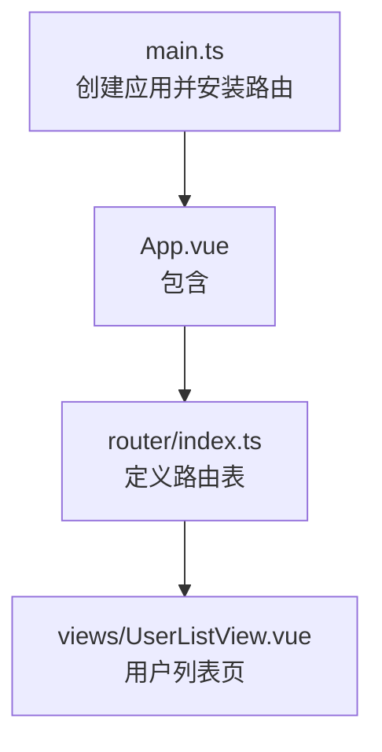
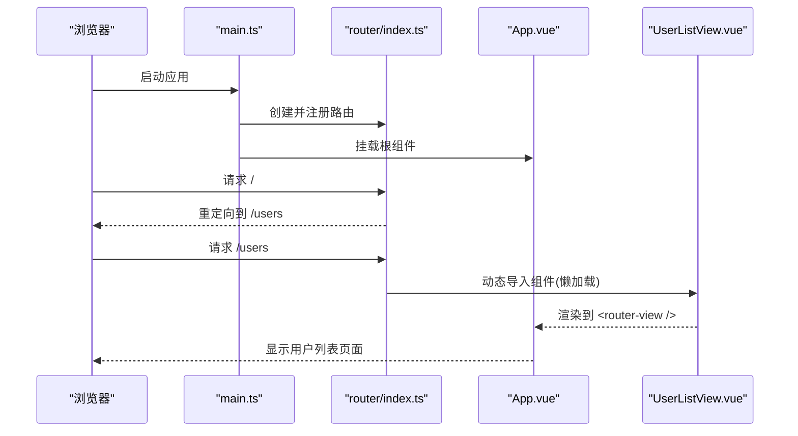
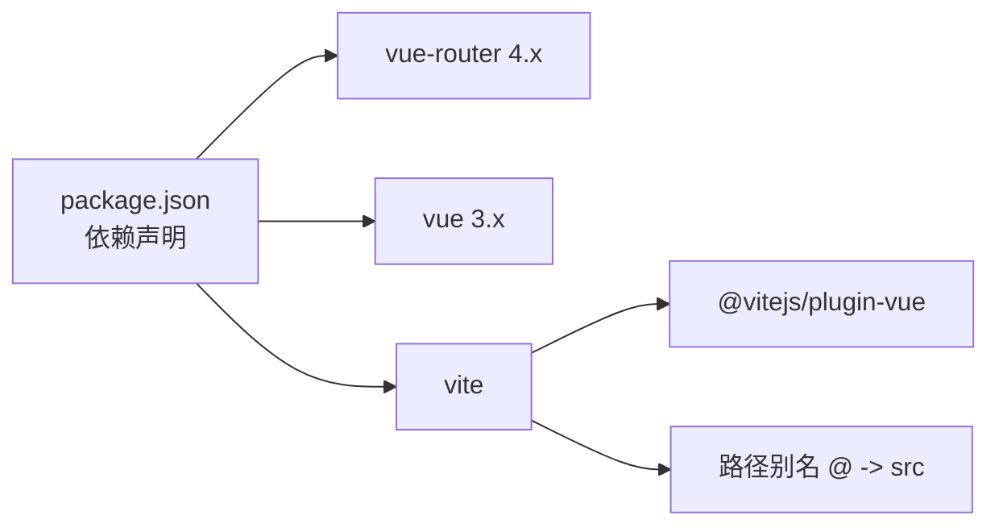

# 路由配置

<cite>
**本文引用的文件**
- [frontend/src/router/index.ts](file://frontend/src/router/index.ts)
- [frontend/src/main.ts](file://frontend/src/main.ts)
- [frontend/src/App.vue](file://frontend/src/App.vue)
- [frontend/package.json](file://frontend/package.json)
- [frontend/vite.config.ts](file://frontend/vite.config.ts)
- [frontend/src/views/UserListView.vue](file://frontend/src/views/UserListView.vue)
</cite>

## 目录
1. [简介](#简介)
2. [项目结构](#项目结构)
3. [核心组件](#核心组件)
4. [架构总览](#架构总览)
5. [详细组件分析](#详细组件分析)
6. [依赖关系分析](#依赖关系分析)
7. [性能考虑](#性能考虑)
8. [故障排查指南](#故障排查指南)
9. [结论](#结论)
10. [附录](#附录)

## 简介
本文件围绕前端 Vue Router 的路由配置进行系统化说明，重点覆盖：
- 路由定义与重定向、通配符兜底
- 页面懒加载与代码分割
- 元信息与导航守卫（当前仓库未实现，提供最佳实践）
- 编程式与声明式导航、传参与查询参数处理
- 路由状态管理与调试技巧
- 常见问题与解决方案

## 项目结构
前端采用 Vite + Vue 3 + Vue Router 4。应用入口挂载路由，根组件通过 router-view 渲染匹配到的视图。

图表来源
- [frontend/src/main.ts:11-21](file://frontend/src/main.ts#L11-L21)
- [frontend/src/App.vue:1-4](file://frontend/src/App.vue#L1-L4)
- [frontend/src/router/index.ts:3-20](file://frontend/src/router/index.ts#L3-L20)

章节来源
- [frontend/src/main.ts:1-22](file://frontend/src/main.ts#L1-L22)
- [frontend/src/App.vue:1-4](file://frontend/src/App.vue#L1-L4)
- [frontend/src/router/index.ts:1-23](file://frontend/src/router/index.ts#L1-L23)

## 核心组件
- 路由实例与历史模式：使用 createWebHistory 启用 HTML5 History 模式，便于 SEO 和书签分享。
- 路由表：
  - 根路径 / 重定向到 /users
  - /users 对应 UserList 命名路由，组件采用动态 import 实现懒加载
  - 通配符路径 /:pathMatch(.*)* 用于 404 兜底并重定向到 /users
- 应用集成：在 main.ts 中通过 app.use(router) 安装路由；App.vue 通过 <router-view /> 渲染页面。

章节来源
- [frontend/src/router/index.ts:1-23](file://frontend/src/router/index.ts#L1-L23)
- [frontend/src/main.ts:7-18](file://frontend/src/main.ts#L7-L18)
- [frontend/src/App.vue:1-4](file://frontend/src/App.vue#L1-L4)

## 架构总览
下图展示了从浏览器访问到页面渲染的完整流程，包括路由解析、组件懒加载与视图渲染。

图表来源
- [frontend/src/main.ts:11-21](file://frontend/src/main.ts#L11-L21)
- [frontend/src/router/index.ts:3-20](file://frontend/src/router/index.ts#L3-L20)
- [frontend/src/App.vue:1-4](file://frontend/src/App.vue#L1-L4)
- [frontend/src/views/UserListView.vue:1-278](file://frontend/src/views/UserListView.vue#L1-L278)

## 详细组件分析

### 路由定义与重定向
- 根路径重定向：/ 重定向至 /users，确保默认进入业务主入口。
- 命名路由：/users 设置 name 为 UserList，便于通过名称跳转与生成链接。
- 404 兜底：/:pathMatch(.*)* 捕获所有未匹配路径并重定向到 /users，避免空白页。

章节来源
- [frontend/src/router/index.ts:5-18](file://frontend/src/router/index.ts#L5-L18)

### 嵌套路由与布局
- 当前路由表为扁平结构，无嵌套路由。若需要多级菜单或布局容器，可在父路由下添加 children 数组，并在父组件中使用 <router-view /> 渲染子路由。
- 建议在公共布局组件中统一放置侧边栏、顶部导航等，并通过路由 meta 控制可见性。

[本节为概念性说明，不直接分析具体文件]

### 动态路由参数与查询参数
- 动态参数：可通过 path 中的 :id 形式定义参数，并在组件内通过 useRoute().params.id 获取。
- 查询参数：通过 ?key=value 传递，组件内通过 useRoute().query.key 读取。
- 建议：对关键参数做类型校验与空值处理，避免异常渲染。

[本节为概念性说明，不直接分析具体文件]

### 路由元信息（meta）与权限控制
- 当前路由表未使用 meta。推荐在路由项中添加 meta 字段，如 { title, roles, requiresAuth } 等，配合全局前置守卫实现鉴权与标题设置。
- 典型流程：beforeEach 中检查登录态/角色，必要时拦截跳转并提示；afterEach 中可更新文档标题或埋点。

[本节为概念性说明，不直接分析具体文件]

### 导航守卫实现与权限控制机制（最佳实践）
- 全局前置守卫 beforeEach：
  - 判断是否需要登录或特定角色
  - 白名单放行（如登录页、公开页）
  - 未授权时重定向到登录或 403
- 全局后置守卫 afterEach：
  - 设置 document.title
  - 上报埋点或统计
- 路由独享守卫 beforeEnter：
  - 针对单个路由的细粒度控制
- 组件内守卫 onBeforeRouteLeave/Update：
  - 表单离开确认、数据清理

[本节为概念性说明，不直接分析具体文件]

### 页面懒加载与代码分割优化
- 当前 /users 使用 () => import('@/views/UserListView.vue') 实现按需加载，减少首屏体积。
- 建议：
  - 将大型第三方库按需引入或使用 CDN
  - 利用 Vite 的预构建与分包策略，合理拆分 chunk
  - 对图片等资源进行压缩与懒加载

章节来源
- [frontend/src/router/index.ts:10-14](file://frontend/src/router/index.ts#L10-L14)
- [frontend/vite.config.ts:7-13](file://frontend/vite.config.ts#L7-L13)

### 编程式导航与声明式导航
- 声明式导航：<router-link to="/users"> 或 <router-link :to="{ name: 'UserList' }">，适合静态链接与菜单。
- 编程式导航：router.push({ name: 'UserList', query: { page: 1 } })，适合条件跳转、登录后跳转、表单提交后跳转等场景。
- 注意：push 返回 Promise，可 await 以等待导航完成；replace 替换历史记录。

[本节为概念性说明，不直接分析具体文件]

### 路由传参与查询参数处理（最佳实践）
- 路径参数：/users/:id，组件内通过 params 获取；注意 id 的类型转换与校验。
- 查询参数：/users?page=1&size=10，组件内通过 query 获取；常用于分页、筛选。
- 建议：
  - 对 query 做默认值与边界处理
  - 将关键查询参数同步到 URL，支持分享与刷新保持状态
  - 复杂状态考虑结合 Pinia/Vuex 管理

[本节为概念性说明，不直接分析具体文件]

### 路由状态管理（最佳实践）
- 轻量级：优先使用 URL 的 query/hash 表达可分享的状态（如搜索词、分页）。
- 中重度：使用 Pinia/Vuex 管理不可分享的全局状态（如用户信息、主题）。
- 持久化：对必要状态使用 localStorage/sessionStorage 或后端存储。

[本节为概念性说明，不直接分析具体文件]

## 依赖关系分析
- 运行时依赖：vue-router 4.x，vue 3.x
- 构建工具：vite，插件 @vitejs/plugin-vue
- 别名配置：@ 指向 src，便于模块引用

图表来源
- [frontend/package.json:11-17](file://frontend/package.json#L11-L17)
- [frontend/vite.config.ts:7-13](file://frontend/vite.config.ts#L7-L13)

章节来源
- [frontend/package.json:1-26](file://frontend/package.json#L1-L26)
- [frontend/vite.config.ts:1-25](file://frontend/vite.config.ts#L1-L25)

## 性能考虑
- 首屏优化：
  - 已对 /users 使用懒加载，进一步可按功能模块拆分路由
  - 移除不必要的第三方包或按需引入
- 网络优化：
  - 开启 Gzip/Brotli 压缩
  - 合理使用 CDN 缓存静态资源
- 渲染优化：
  - 列表大数据量时使用虚拟滚动
  - 图片懒加载与压缩

[本节提供通用指导，不直接分析具体文件]

## 故障排查指南
- 404 白屏：
  - 检查是否配置了 history 模式且服务器未正确回退到 index.html
  - 当前项目使用通配符重定向到 /users，若仍白屏请检查部署配置
- 路由不生效：
  - 确认 main.ts 中已 app.use(router)
  - 确认 App.vue 中包含 <router-view />
- 懒加载失败：
  - 检查 import 路径是否正确，别名 @ 是否生效
  - 查看浏览器控制台是否有 404 或模块加载错误
- 导航无效：
  - 编程式导航需确保目标路由存在
  - 使用 router.push 时注意异步与错误处理

章节来源
- [frontend/src/main.ts:11-18](file://frontend/src/main.ts#L11-L18)
- [frontend/src/App.vue:1-4](file://frontend/src/App.vue#L1-L4)
- [frontend/src/router/index.ts:5-18](file://frontend/src/router/index.ts#L5-L18)

## 结论
本项目已具备基础路由能力：HTML5 History 模式、根重定向、命名路由与懒加载、404 兜底。后续可扩展：
- 增加嵌套路由与布局组件
- 引入 meta 与全局守卫实现鉴权与标题管理
- 完善编程式/声明式导航与传参规范
- 结合 Pinia 进行状态管理
- 持续优化首屏与分包策略

[本节总结性内容，不直接分析具体文件]

## 附录
- 常用 API 参考（基于 vue-router 4）：
  - createRouter、createWebHistory
  - router.push、router.replace、router.back
  - useRoute、useRouter
  - 路由守卫：beforeEach、afterEach、beforeEnter、onBeforeRouteLeave
- 相关配置文件：
  - vite.config.ts 中的别名与代理配置有助于开发与联调

[本节为参考资料，不直接分析具体文件]