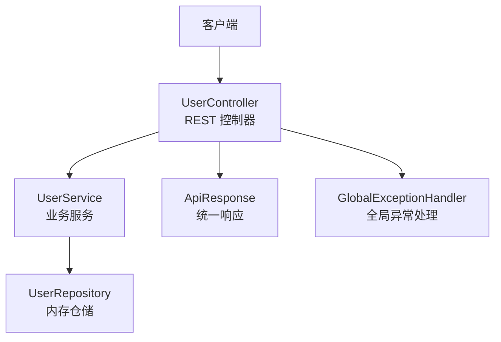
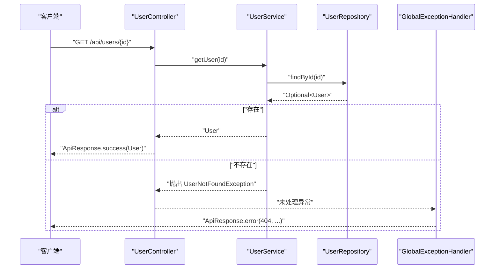
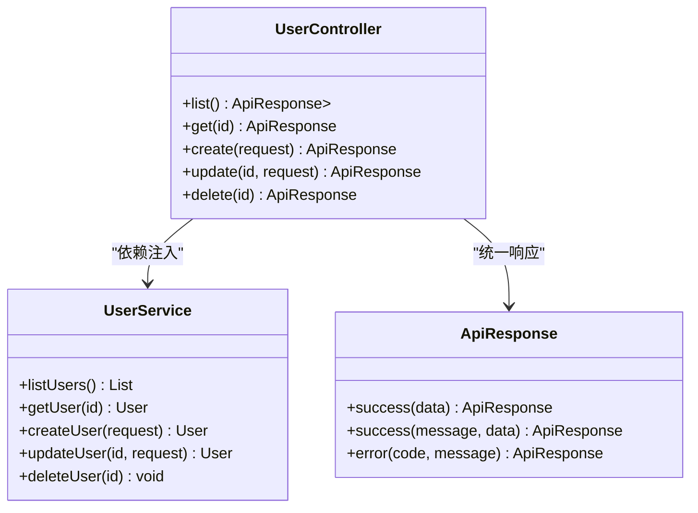
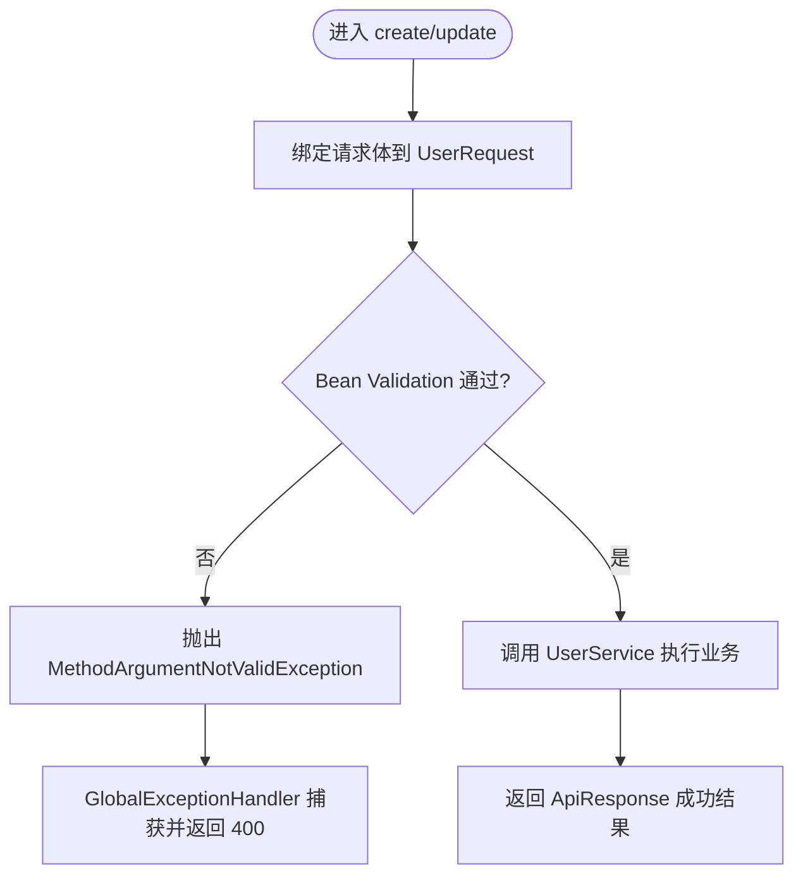
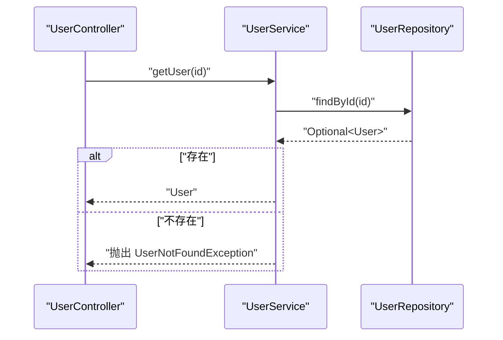
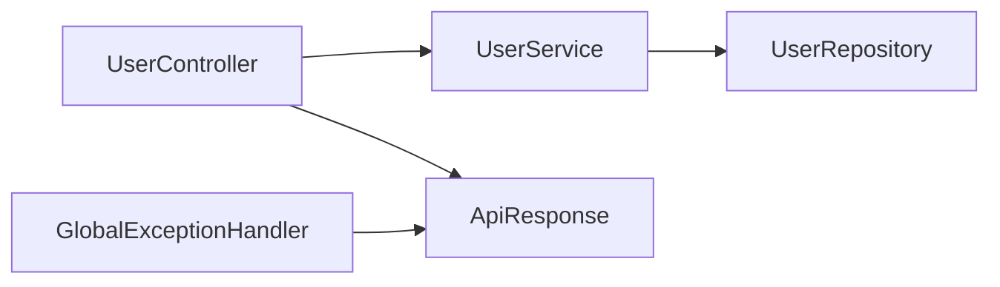

# Controller 层设计

<cite>
**本文引用的文件**
- [UserController.java](file://backend/src/main/java/com/aicoding/backend/controller/UserController.java)
- [ApiResponse.java](file://backend/src/main/java/com/aicoding/backend/dto/ApiResponse.java)
- [UserRequest.java](file://backend/src/main/java/com/aicoding/backend/dto/UserRequest.java)
- [UserService.java](file://backend/src/main/java/com/aicoding/backend/service/UserService.java)
- [UserRepository.java](file://backend/src/main/java/com/aicoding/backend/repository/UserRepository.java)
- [GlobalExceptionHandler.java](file://backend/src/main/java/com/aicoding/backend/exception/GlobalExceptionHandler.java)
- [UserNotFoundException.java](file://backend/src/main/java/com/aicoding/backend/exception/UserNotFoundException.java)
</cite>

## 目录
1. [简介](#简介)
2. [项目结构](#项目结构)
3. [核心组件](#核心组件)
4. [架构总览](#架构总览)
5. [详细组件分析](#详细组件分析)
6. [依赖关系分析](#依赖关系分析)
7. [性能与可扩展性](#性能与可扩展性)
8. [故障排查指南](#故障排查指南)
9. [结论](#结论)
10. [附录：API 端点与响应规范](#附录api-端点与响应规范)

## 简介
本技术文档聚焦于 Controller 层的设计与实践，围绕 HTTP 请求处理、参数验证、统一响应格式、与 Service 层的交互模式以及错误处理策略展开。以 UserController 为例，说明 RESTful API 的端点设计、注解使用、请求参数绑定与校验机制，并给出最佳实践建议，帮助读者在 Spring Boot 项目中构建清晰、可维护且健壮的接口层。

## 项目结构
后端采用分层架构：Controller 负责接收请求与返回响应；Service 封装业务逻辑；Repository 提供数据访问（当前为内存实现）；DTO 用于请求与响应建模；异常处理器统一将异常转换为标准响应。

图表来源
- [UserController.java:24-65](file://backend/src/main/java/com/aicoding/backend/controller/UserController.java#L24-L65)
- [UserService.java:15-56](file://backend/src/main/java/com/aicoding/backend/service/UserService.java#L15-L56)
- [UserRepository.java:16-54](file://backend/src/main/java/com/aicoding/backend/repository/UserRepository.java#L16-L54)
- [ApiResponse.java:6-23](file://backend/src/main/java/com/aicoding/backend/dto/ApiResponse.java#L6-L23)
- [GlobalExceptionHandler.java:17-56](file://backend/src/main/java/com/aicoding/backend/exception/GlobalExceptionHandler.java#L17-L56)

章节来源
- [UserController.java:24-65](file://backend/src/main/java/com/aicoding/backend/controller/UserController.java#L24-L65)
- [UserService.java:15-56](file://backend/src/main/java/com/aicoding/backend/service/UserService.java#L15-L56)
- [UserRepository.java:16-54](file://backend/src/main/java/com/aicoding/backend/repository/UserRepository.java#L16-L54)
- [ApiResponse.java:6-23](file://backend/src/main/java/com/aicoding/backend/dto/ApiResponse.java#L6-L23)
- [GlobalExceptionHandler.java:17-56](file://backend/src/main/java/com/aicoding/backend/exception/GlobalExceptionHandler.java#L17-L56)

## 核心组件
- UserController：定义 RESTful 端点，处理 HTTP 请求，调用 Service，返回 ApiResponse。
- UserService：封装用户相关业务逻辑，包括查询、创建、更新、删除，并在构造时初始化演示数据。
- UserRepository：内存版数据访问层，提供增删改查能力。
- UserRequest：请求体 DTO，使用 Bean Validation 注解进行入参校验。
- ApiResponse：统一响应结构，包含状态码、消息和数据。
- GlobalExceptionHandler：集中捕获并转换异常为统一响应。

章节来源
- [UserController.java:24-65](file://backend/src/main/java/com/aicoding/backend/controller/UserController.java#L24-L65)
- [UserService.java:15-56](file://backend/src/main/java/com/aicoding/backend/service/UserService.java#L15-L56)
- [UserRepository.java:16-54](file://backend/src/main/java/com/aicoding/backend/repository/UserRepository.java#L16-L54)
- [UserRequest.java:10-23](file://backend/src/main/java/com/aicoding/backend/dto/UserRequest.java#L10-L23)
- [ApiResponse.java:6-23](file://backend/src/main/java/com/aicoding/backend/dto/ApiResponse.java#L6-L23)
- [GlobalExceptionHandler.java:17-56](file://backend/src/main/java/com/aicoding/backend/exception/GlobalExceptionHandler.java#L17-L56)

## 架构总览
Controller 层作为对外暴露的入口，职责单一：解析请求、参数校验、委托业务、格式化响应。通过构造函数注入 UserService，避免在方法内直接 new 对象，提升可测试性与可替换性。所有成功响应统一封装为 ApiResponse，失败路径由全局异常处理器统一捕获并转为 ApiResponse。

图表来源
- [UserController.java:40-44](file://backend/src/main/java/com/aicoding/backend/controller/UserController.java#L40-L44)
- [UserService.java:35-38](file://backend/src/main/java/com/aicoding/backend/service/UserService.java#L35-L38)
- [UserRepository.java:37-42](file://backend/src/main/java/com/aicoding/backend/repository/UserRepository.java#L37-L42)
- [GlobalExceptionHandler.java:20-25](file://backend/src/main/java/com/aicoding/backend/exception/GlobalExceptionHandler.java#L20-L25)

## 详细组件分析

### UserController 设计与实现
- 类级注解
  - @RestController：声明为 REST 控制器，自动序列化返回值。
  - @RequestMapping("/api/users")：统一前缀，便于版本化与路由管理。
- 方法级注解
  - @GetMapping/@PostMapping/@PutMapping/@DeleteMapping：映射 HTTP 方法与路径。
  - @PathVariable：绑定路径参数。
  - @RequestBody + @Valid：绑定 JSON 请求体并进行 Bean Validation 校验。
  - @ResponseStatus：设置特定状态码（如创建成功返回 201）。
- 依赖注入
  - 通过构造函数注入 UserService，保证不可变依赖与易测试性。
- 响应封装
  - 所有成功响应通过 ApiResponse.success(...) 包装，保持前后端契约一致。

图表来源
- [UserController.java:24-65](file://backend/src/main/java/com/aicoding/backend/controller/UserController.java#L24-L65)
- [UserService.java:15-56](file://backend/src/main/java/com/aicoding/backend/service/UserService.java#L15-L56)
- [ApiResponse.java:6-23](file://backend/src/main/java/com/aicoding/backend/dto/ApiResponse.java#L6-L23)

章节来源
- [UserController.java:24-65](file://backend/src/main/java/com/aicoding/backend/controller/UserController.java#L24-L65)

### 请求参数绑定与验证
- 使用 @Valid 触发 Bean Validation，结合 UserRequest 中的约束注解：
  - @NotBlank：非空校验。
  - @Email：邮箱格式校验。
  - @Size：长度限制。
- 校验失败时抛出 MethodArgumentNotValidException，由全局异常处理器统一转换为 400 响应，并聚合字段错误信息。

图表来源
- [UserRequest.java:10-23](file://backend/src/main/java/com/aicoding/backend/dto/UserRequest.java#L10-L23)
- [GlobalExceptionHandler.java:27-35](file://backend/src/main/java/com/aicoding/backend/exception/GlobalExceptionHandler.java#L27-L35)
- [UserController.java:46-57](file://backend/src/main/java/com/aicoding/backend/controller/UserController.java#L46-L57)

章节来源
- [UserRequest.java:10-23](file://backend/src/main/java/com/aicoding/backend/dto/UserRequest.java#L10-L23)
- [GlobalExceptionHandler.java:27-35](file://backend/src/main/java/com/aicoding/backend/exception/GlobalExceptionHandler.java#L27-L35)
- [UserController.java:46-57](file://backend/src/main/java/com/aicoding/backend/controller/UserController.java#L46-L57)

### 与 Service 层的交互模式
- 依赖注入：通过构造函数注入 UserService，避免在 Controller 中直接实例化，提高可测试性和解耦度。
- 数据传递：Controller 仅做参数绑定与响应封装，具体业务逻辑（如是否存在、是否允许更新等）下沉至 Service。
- 异常传播：Service 在找不到资源时抛出业务异常（如 UserNotFoundException），由全局异常处理器统一捕获并转换为标准响应。

图表来源
- [UserService.java:35-38](file://backend/src/main/java/com/aicoding/backend/service/UserService.java#L35-L38)
- [UserRepository.java:37-42](file://backend/src/main/java/com/aicoding/backend/repository/UserRepository.java#L37-L42)
- [UserController.java:40-44](file://backend/src/main/java/com/aicoding/backend/controller/UserController.java#L40-L44)

章节来源
- [UserService.java:35-38](file://backend/src/main/java/com/aicoding/backend/service/UserService.java#L35-L38)
- [UserController.java:40-44](file://backend/src/main/java/com/aicoding/backend/controller/UserController.java#L40-L44)

### 统一响应格式 ApiResponse
- 结构：包含 code（状态码）、message（消息）、data（数据）。
- 便捷方法：
  - success(T data)：默认成功消息。
  - success(String message, T data)：自定义消息。
  - error(int code, String message)：错误响应。
- 使用方式：Controller 中所有成功返回均通过 ApiResponse.success(...) 包装，确保前后端契约一致。

章节来源
- [ApiResponse.java:6-23](file://backend/src/main/java/com/aicoding/backend/dto/ApiResponse.java#L6-L23)
- [UserController.java:34-64](file://backend/src/main/java/com/aicoding/backend/controller/UserController.java#L34-L64)

### 错误处理策略与最佳实践
- 参数校验失败：MethodArgumentNotValidException → 400，聚合字段错误信息。
- 请求体格式错误：HttpMessageNotReadableException → 400。
- 路径参数类型不匹配：MethodArgumentTypeMismatchException → 400。
- 业务异常：UserNotFoundException → 404。
- 兜底异常：Exception → 500。
- 最佳实践
  - 在 Controller 层只做“薄”处理：参数绑定、校验、响应封装。
  - 业务规则与异常定义放在 Service 或领域层。
  - 统一异常处理，避免在各方法中重复 try-catch。
  - 对敏感信息进行脱敏后再放入 ApiResponse.data。
  - 为不同操作设置合适的 HTTP 状态码（如创建成功 201）。

章节来源
- [GlobalExceptionHandler.java:17-56](file://backend/src/main/java/com/aicoding/backend/exception/GlobalExceptionHandler.java#L17-L56)
- [UserNotFoundException.java:6-10](file://backend/src/main/java/com/aicoding/backend/exception/UserNotFoundException.java#L6-L10)
- [UserController.java:46-64](file://backend/src/main/java/com/aicoding/backend/controller/UserController.java#L46-L64)

## 依赖关系分析
- UserController 依赖 UserService（构造函数注入）。
- UserService 依赖 UserRepository（构造函数注入）。
- 全局异常处理器依赖 ApiResponse 统一输出。
- 请求体 DTO UserRequest 使用 Bean Validation 注解驱动参数校验。

图表来源
- [UserController.java:24-65](file://backend/src/main/java/com/aicoding/backend/controller/UserController.java#L24-L65)
- [UserService.java:15-56](file://backend/src/main/java/com/aicoding/backend/service/UserService.java#L15-L56)
- [UserRepository.java:16-54](file://backend/src/main/java/com/aicoding/backend/repository/UserRepository.java#L16-L54)
- [ApiResponse.java:6-23](file://backend/src/main/java/com/aicoding/backend/dto/ApiResponse.java#L6-L23)
- [GlobalExceptionHandler.java:17-56](file://backend/src/main/java/com/aicoding/backend/exception/GlobalExceptionHandler.java#L17-L56)

章节来源
- [UserController.java:24-65](file://backend/src/main/java/com/aicoding/backend/controller/UserController.java#L24-L65)
- [UserService.java:15-56](file://backend/src/main/java/com/aicoding/backend/service/UserService.java#L15-L56)
- [UserRepository.java:16-54](file://backend/src/main/java/com/aicoding/backend/repository/UserRepository.java#L16-L54)
- [ApiResponse.java:6-23](file://backend/src/main/java/com/aicoding/backend/dto/ApiResponse.java#L6-L23)
- [GlobalExceptionHandler.java:17-56](file://backend/src/main/java/com/aicoding/backend/exception/GlobalExceptionHandler.java#L17-L56)

## 性能与可扩展性
- 性能
  - 当前 Repository 为内存实现，适合演示与快速迭代；生产环境应替换为数据库实现（JPA/MyBatis）。
  - 列表查询已按 ID 排序，避免无序返回导致前端渲染抖动。
- 可扩展性
  - 通过 Service 层抽象业务，便于后续引入缓存、事务、审计等横切关注点。
  - 统一响应与异常处理使新增接口无需重复编写错误处理逻辑。
  - 可通过分页、过滤、排序扩展 list 接口。

[本节为通用指导，不直接分析具体文件]

## 故障排查指南
- 400 参数校验失败
  - 检查请求体是否符合 UserRequest 的约束（必填、邮箱格式、长度限制）。
  - 查看全局异常处理器返回的错误消息，定位具体字段。
- 400 请求体格式错误
  - 确认 Content-Type 为 application/json，且 JSON 语法正确。
- 404 用户不存在
  - 检查路径参数 id 是否为有效数字，且该用户存在于存储中。
- 500 服务器内部错误
  - 查看日志定位未捕获异常，必要时补充更具体的业务异常。

章节来源
- [GlobalExceptionHandler.java:27-56](file://backend/src/main/java/com/aicoding/backend/exception/GlobalExceptionHandler.java#L27-L56)
- [UserNotFoundException.java:6-10](file://backend/src/main/java/com/aicoding/backend/exception/UserNotFoundException.java#L6-L10)

## 结论
Controller 层在本项目中承担“薄控制”的职责：专注于请求解析、参数校验、响应封装与异常转发。通过统一的 ApiResponse 和全局异常处理，保证了接口行为的一致性与可维护性。配合 Service 与 Repository 的分层设计，系统具备良好的扩展性与可测试性。建议在后续演进中继续遵循此模式，逐步完善分页、权限、审计等能力。

[本节为总结性内容，不直接分析具体文件]

## 附录：API 端点与响应规范
- 端点清单
  - GET /api/users：获取用户列表
  - GET /api/users/{id}：根据 ID 获取用户
  - POST /api/users：创建用户（请求体 UserRequest）
  - PUT /api/users/{id}：更新用户（请求体 UserRequest）
  - DELETE /api/users/{id}：删除用户
- 响应规范
  - 成功：code=0，message="success" 或自定义消息，data 为业务数据
  - 失败：code≠0，message 描述错误原因，data 可为 null
- 示例场景
  - 创建用户：提交合法 JSON 请求体，返回 201 与 ApiResponse<User>
  - 参数校验失败：返回 400 与聚合字段错误信息
  - 用户不存在：返回 404 与相应错误消息

章节来源
- [UserController.java:34-64](file://backend/src/main/java/com/aicoding/backend/controller/UserController.java#L34-L64)
- [ApiResponse.java:6-23](file://backend/src/main/java/com/aicoding/backend/dto/ApiResponse.java#L6-L23)
- [GlobalExceptionHandler.java:20-56](file://backend/src/main/java/com/aicoding/backend/exception/GlobalExceptionHandler.java#L20-L56)