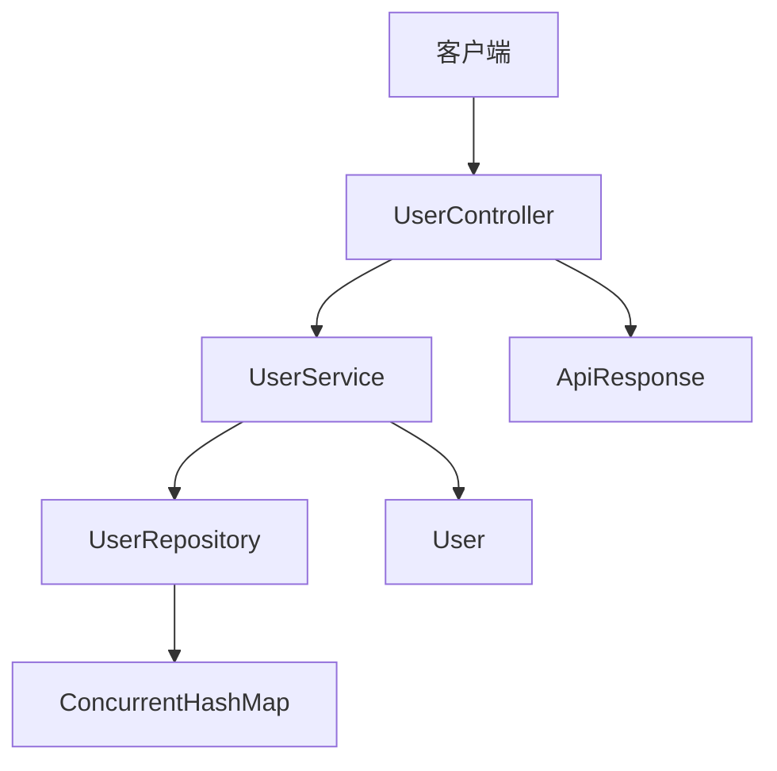
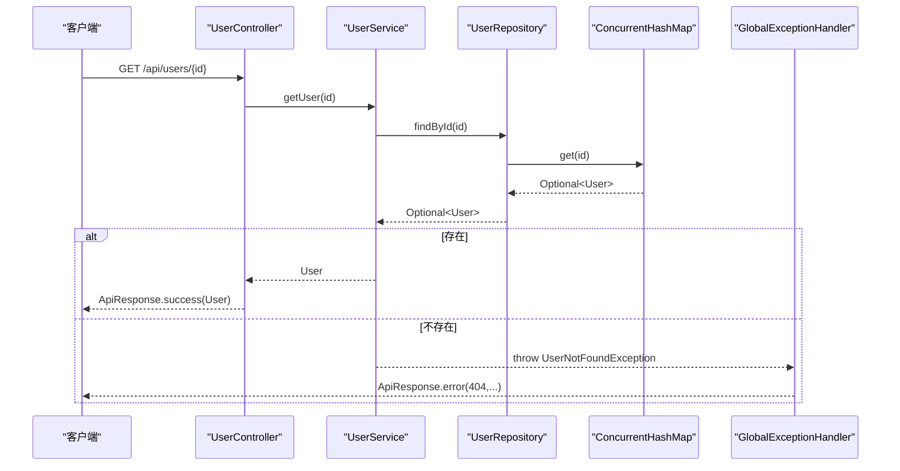
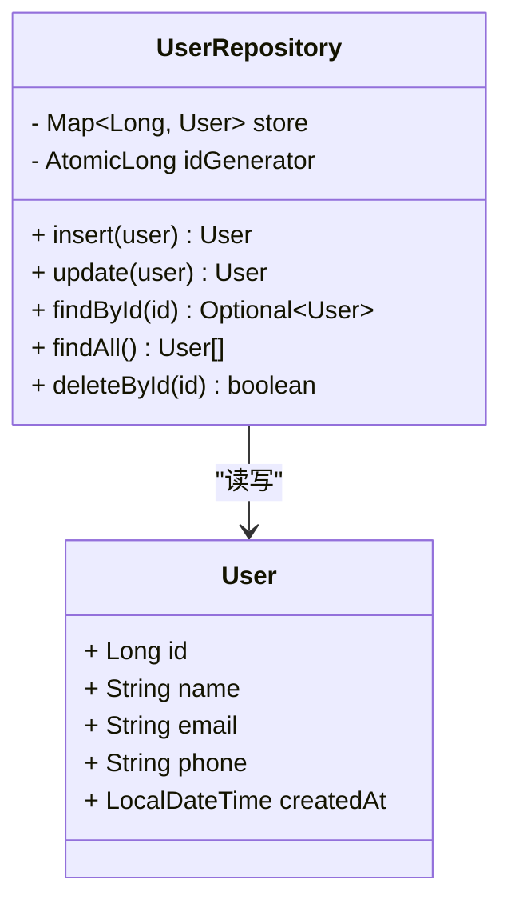
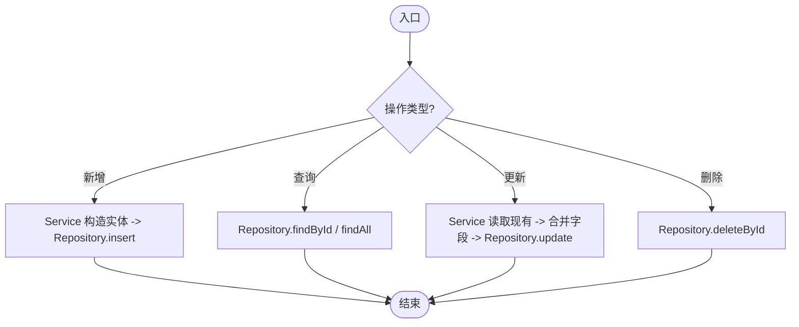
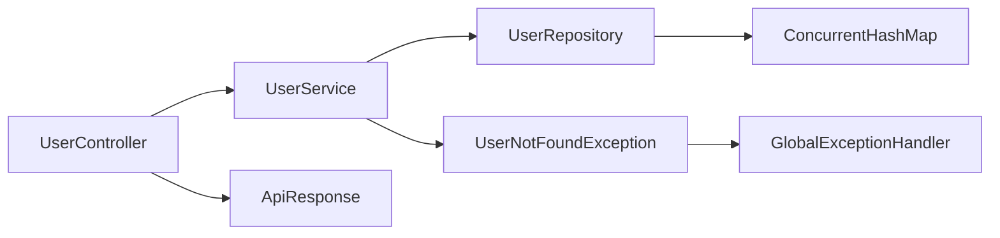

# Repository 层设计

<cite>
**本文引用的文件**
- [UserRepository.java](file://backend/src/main/java/com/aicoding/backend/repository/UserRepository.java)
- [User.java](file://backend/src/main/java/com/aicoding/backend/model/User.java)
- [UserService.java](file://backend/src/main/java/com/aicoding/backend/service/UserService.java)
- [UserController.java](file://backend/src/main/java/com/aicoding/backend/controller/UserController.java)
- [UserRequest.java](file://backend/src/main/java/com/aicoding/backend/dto/UserRequest.java)
- [ApiResponse.java](file://backend/src/main/java/com/aicoding/backend/dto/ApiResponse.java)
- [UserNotFoundException.java](file://backend/src/main/java/com/aicoding/backend/exception/UserNotFoundException.java)
- [GlobalExceptionHandler.java](file://backend/src/main/java/com/aicoding/backend/exception/GlobalExceptionHandler.java)
</cite>

## 目录
1. [简介](#简介)
2. [项目结构](#项目结构)
3. [核心组件](#核心组件)
4. [架构总览](#架构总览)
5. [详细组件分析](#详细组件分析)
6. [依赖关系分析](#依赖关系分析)
7. [性能与一致性](#性能与一致性)
8. [故障排查指南](#故障排查指南)
9. [结论](#结论)
10. [附录：从内存到数据库的迁移方案](#附录从内存到数据库的迁移方案)

## 简介
本技术文档聚焦于后端项目的 Repository 层设计与实现，重点解释数据访问抽象、内存存储实现原理、线程安全策略、数据模型映射、CRUD 封装与查询逻辑，并给出可扩展性与迁移至数据库的架构建议。该仓库采用分层架构：Controller 接收请求，Service 编排业务，Repository 负责数据访问（当前为内存实现），Model 定义实体，DTO 用于入参出参，异常处理统一返回格式。

## 项目结构
- 控制器层：提供 REST API，负责参数校验与响应包装
- 服务层：业务编排、事务边界（示例中未显式使用事务）、调用 Repository
- 仓储层：数据访问抽象，当前以内存 Map 实现
- 模型层：用户实体 record
- DTO 层：请求与响应对象
- 异常层：全局异常处理器与领域异常

图表来源
- [UserController.java:24-65](file://backend/src/main/java/com/aicoding/backend/controller/UserController.java#L24-L65)
- [UserService.java:15-56](file://backend/src/main/java/com/aicoding/backend/service/UserService.java#L15-L56)
- [UserRepository.java:16-54](file://backend/src/main/java/com/aicoding/backend/repository/UserRepository.java#L16-L54)
- [User.java:8-14](file://backend/src/main/java/com/aicoding/backend/model/User.java#L8-L14)
- [ApiResponse.java:6-23](file://backend/src/main/java/com/aicoding/backend/dto/ApiResponse.java#L6-L23)

章节来源
- [UserController.java:24-65](file://backend/src/main/java/com/aicoding/backend/controller/UserController.java#L24-L65)
- [UserService.java:15-56](file://backend/src/main/java/com/aicoding/backend/service/UserService.java#L15-L56)
- [UserRepository.java:16-54](file://backend/src/main/java/com/aicoding/backend/repository/UserRepository.java#L16-L54)

## 核心组件
- UserRepository：内存版用户仓储，提供 insert/update/findById/findAll/deleteById
- User：用户实体 record，包含 id、name、email、phone、createdAt
- UserService：业务编排，初始化演示数据，调用 Repository 完成 CRUD
- UserController：REST 接口，封装 ApiResponse
- 异常与 DTO：统一错误码与请求校验

章节来源
- [UserRepository.java:16-54](file://backend/src/main/java/com/aicoding/backend/repository/UserRepository.java#L16-L54)
- [User.java:8-14](file://backend/src/main/java/com/aicoding/backend/model/User.java#L8-L14)
- [UserService.java:15-56](file://backend/src/main/java/com/aicoding/backend/service/UserService.java#L15-L56)
- [UserController.java:24-65](file://backend/src/main/java/com/aicoding/backend/controller/UserController.java#L24-L65)
- [UserRequest.java:10-23](file://backend/src/main/java/com/aicoding/backend/dto/UserRequest.java#L10-L23)
- [ApiResponse.java:6-23](file://backend/src/main/java/com/aicoding/backend/dto/ApiResponse.java#L6-L23)

## 架构总览
下图展示了从 HTTP 请求到内存存储的完整调用链，以及异常如何被统一处理。

图表来源
- [UserController.java:40-44](file://backend/src/main/java/com/aicoding/backend/controller/UserController.java#L40-L44)
- [UserService.java:35-38](file://backend/src/main/java/com/aicoding/backend/service/UserService.java#L35-L38)
- [UserRepository.java:37-42](file://backend/src/main/java/com/aicoding/backend/repository/UserRepository.java#L37-L42)
- [UserNotFoundException.java:6-11](file://backend/src/main/java/com/aicoding/backend/exception/UserNotFoundException.java#L6-L11)
- [GlobalExceptionHandler.java:20-25](file://backend/src/main/java/com/aicoding/backend/exception/GlobalExceptionHandler.java#L20-L25)

## 详细组件分析

### UserRepository：内存仓储与线程安全
- 数据结构选择
  - 使用 ConcurrentHashMap 作为主存储，键为用户 ID，值为 User 记录，保证并发读写安全与 O(1) 平均复杂度查找
  - 使用 AtomicLong 生成自增 ID，避免并发冲突
- 关键操作
  - insert：分配新 ID，设置 createdAt，写入 Map，返回持久化后的实体
  - update：按 ID 覆盖更新，要求调用方确保记录存在
  - findById：空值保护，返回 Optional
  - findAll：过滤有效 ID，按 ID 升序排序后返回列表
  - deleteById：原子删除并返回是否成功
- 线程安全
  - ConcurrentHashMap 提供线程安全的 put/get/remove
  - AtomicLong 提供无锁递增，保证 ID 唯一性
- 扩展点
  - 可替换为数据库实现（JPA/MyBatis）而不影响上层调用
  - 可在 findAll 中加入分页、过滤条件等扩展

图表来源
- [UserRepository.java:16-54](file://backend/src/main/java/com/aicoding/backend/repository/UserRepository.java#L16-L54)
- [User.java:8-14](file://backend/src/main/java/com/aicoding/backend/model/User.java#L8-L14)

章节来源
- [UserRepository.java:16-54](file://backend/src/main/java/com/aicoding/backend/repository/UserRepository.java#L16-L54)

### 数据模型与映射关系
- 实体 User：使用 Java record 表达不可变数据模型，字段包括标识、姓名、邮箱、电话、创建时间
- 请求 DTO UserRequest：用于入参校验，包含姓名、邮箱、手机号及约束注解
- 响应 DTO ApiResponse：统一响应结构，包含状态码、消息与数据体
- 映射原则
  - Controller 仅持有 DTO，不直接暴露实体
  - Service 将 DTO 转换为实体，再交由 Repository 持久化
  - Repository 只操作实体，屏蔽存储细节

章节来源
- [User.java:8-14](file://backend/src/main/java/com/aicoding/backend/model/User.java#L8-L14)
- [UserRequest.java:10-23](file://backend/src/main/java/com/aicoding/backend/dto/UserRequest.java#L10-L23)
- [ApiResponse.java:6-23](file://backend/src/main/java/com/aicoding/backend/dto/ApiResponse.java#L6-L23)

### CRUD 封装与查询逻辑
- 新增
  - Service 构造实体并调用 Repository.insert
  - Repository 生成 ID 并落盘内存 Map
- 查询
  - 单条：findById 返回 Optional，Service 在缺失时抛出领域异常
  - 列表：findAll 返回按 ID 排序的列表
- 更新
  - Service 先读取现有记录，合并请求字段后调用 Repository.update
- 删除
  - Service 调用 Repository.deleteById，失败则抛异常

图表来源
- [UserService.java:31-55](file://backend/src/main/java/com/aicoding/backend/service/UserService.java#L31-L55)
- [UserRepository.java:22-53](file://backend/src/main/java/com/aicoding/backend/repository/UserRepository.java#L22-L53)

章节来源
- [UserService.java:31-55](file://backend/src/main/java/com/aicoding/backend/service/UserService.java#L31-L55)
- [UserRepository.java:22-53](file://backend/src/main/java/com/aicoding/backend/repository/UserRepository.java#L22-L53)

### 异常与一致性
- 领域异常：用户不存在时抛出 UserNotFoundException
- 全局异常处理：统一转换为 ApiResponse，并设置合适的 HTTP 状态码
- 一致性策略
  - 内存模式下无跨进程一致性需求，但需保证单 JVM 内并发安全
  - 通过 ConcurrentHashMap 与 AtomicLong 保障基本一致性与可见性
  - 未来迁移数据库后可引入事务与幂等策略

章节来源
- [UserNotFoundException.java:6-11](file://backend/src/main/java/com/aicoding/backend/exception/UserNotFoundException.java#L6-L11)
- [GlobalExceptionHandler.java:20-55](file://backend/src/main/java/com/aicoding/backend/exception/GlobalExceptionHandler.java#L20-L55)

## 依赖关系分析
- 控制器依赖服务层，服务层依赖仓储层，仓储层依赖内存存储
- 异常处理通过全局拦截器统一收敛
- DTO 与实体解耦，便于演进与测试

图表来源
- [UserController.java:24-65](file://backend/src/main/java/com/aicoding/backend/controller/UserController.java#L24-L65)
- [UserService.java:15-56](file://backend/src/main/java/com/aicoding/backend/service/UserService.java#L15-L56)
- [UserRepository.java:16-54](file://backend/src/main/java/com/aicoding/backend/repository/UserRepository.java#L16-L54)
- [GlobalExceptionHandler.java:17-55](file://backend/src/main/java/com/aicoding/backend/exception/GlobalExceptionHandler.java#L17-L55)

章节来源
- [UserController.java:24-65](file://backend/src/main/java/com/aicoding/backend/controller/UserController.java#L24-L65)
- [UserService.java:15-56](file://backend/src/main/java/com/aicoding/backend/service/UserService.java#L15-L56)
- [UserRepository.java:16-54](file://backend/src/main/java/com/aicoding/backend/repository/UserRepository.java#L16-L54)
- [GlobalExceptionHandler.java:17-55](file://backend/src/main/java/com/aicoding/backend/exception/GlobalExceptionHandler.java#L17-L55)

## 性能与一致性
- 时间复杂度
  - 插入/更新/删除/按 ID 查询：平均 O(1)
  - 全量查询：O(n) 遍历 + O(n log n) 排序
- 空间复杂度
  - 线性 O(n)，n 为用户数
- 并发特性
  - ConcurrentHashMap 支持高并发读与写
  - AtomicLong 提供无锁自增 ID
- 优化建议
  - 对高频全量查询增加缓存或分页
  - 对大数据集考虑分片或外部缓存
  - 引入索引或二级索引（迁移数据库后）

[本节为通用性能讨论，无需特定文件引用]

## 故障排查指南
- 常见错误
  - 用户不存在：会抛出领域异常并被全局处理器转为 404
  - 参数校验失败：返回 400，包含字段级错误信息
  - JSON 解析失败：返回 400，提示请求体格式错误
  - 路径参数类型不匹配：返回 400，提示类型不正确
- 定位步骤
  - 检查请求体是否符合 UserRequest 的约束
  - 确认路径参数是否为合法数字
  - 查看全局异常处理器返回的统一响应结构

章节来源
- [GlobalExceptionHandler.java:20-55](file://backend/src/main/java/com/aicoding/backend/exception/GlobalExceptionHandler.java#L20-L55)
- [UserRequest.java:10-23](file://backend/src/main/java/com/aicoding/backend/dto/UserRequest.java#L10-L23)

## 结论
本项目通过清晰的层次划分与 Repository 抽象，实现了内存模式下的用户数据访问。UserRepository 基于 ConcurrentHashMap 与 AtomicLong 提供了线程安全且高效的 CRUD 能力；UserService 负责业务编排与异常转换；Controller 与 DTO 保证了接口的稳定性与可维护性。整体设计具备良好的可扩展性，便于后续平滑迁移至数据库实现。

[本节为总结性内容，无需特定文件引用]

## 附录：从内存到数据库的迁移方案
- 目标
  - 保持对外接口不变，透明替换底层存储
- 步骤
  - 定义数据访问接口（如 IUserRepository），当前由 UserRepository 实现
  - 新增数据库实现（如 JpaUserRepository/MybatisUserRepository）
  - 通过 Spring 配置切换实现类（开发环境用内存，生产用数据库）
  - 迁移数据：导出内存数据并导入数据库，或启动时进行数据同步
- 注意事项
  - 事务边界：在 Service 层引入 @Transactional 管理事务
  - 幂等性：为写操作增加幂等键或唯一约束
  - 一致性：引入分布式锁或版本控制（如需跨服务）
  - 性能：添加索引、分页、查询优化
  - 监控：接入日志与指标，观察慢查询与错误率

[本节为概念性指导，无需特定文件引用]