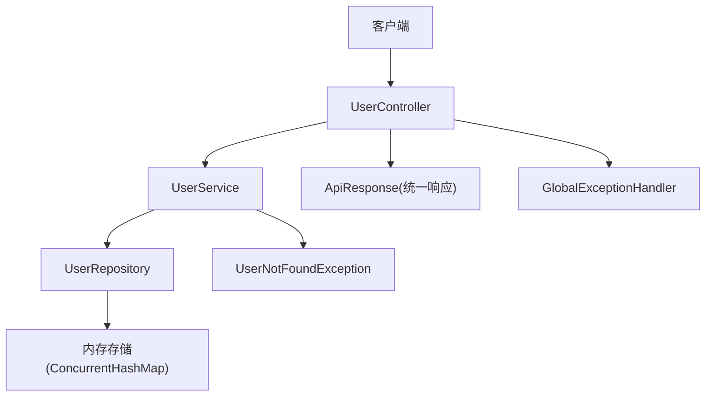
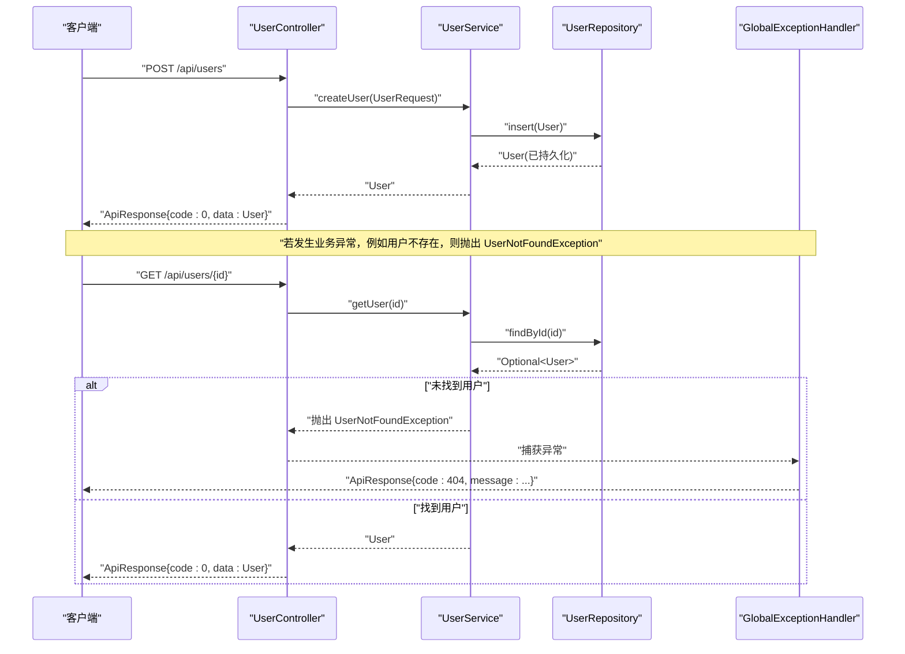
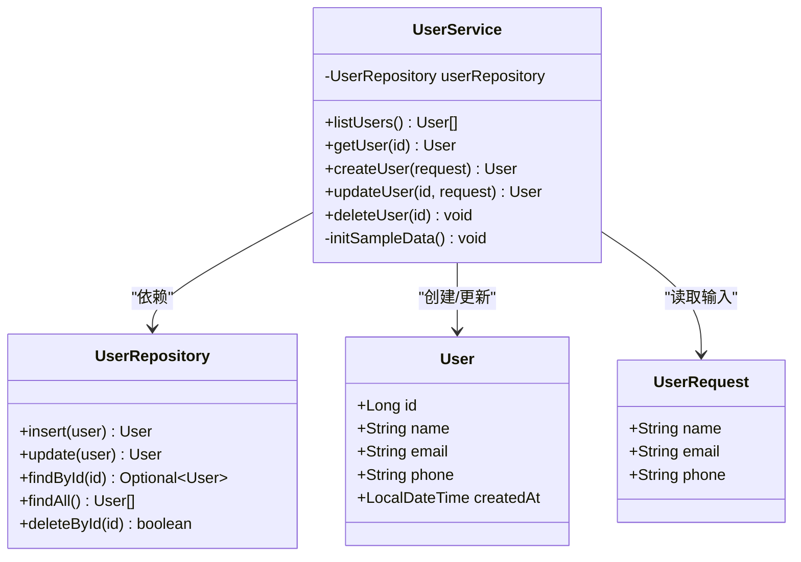
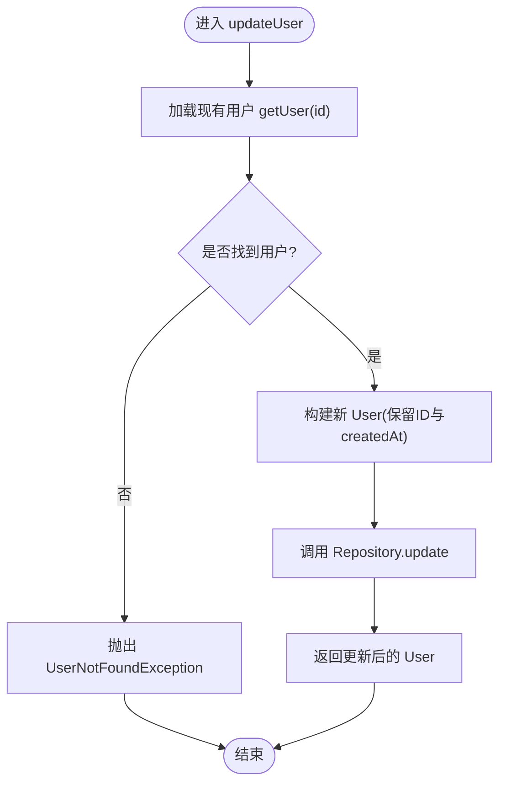
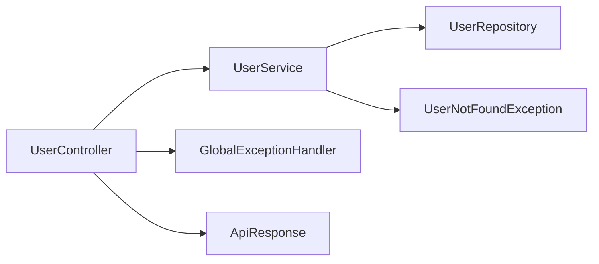

# Service 层设计

<cite>
**本文引用的文件**
- [UserService.java](file://backend/src/main/java/com/aicoding/backend/service/UserService.java)
- [UserRepository.java](file://backend/src/main/java/com/aicoding/backend/repository/UserRepository.java)
- [UserController.java](file://backend/src/main/java/com/aicoding/backend/controller/UserController.java)
- [User.java](file://backend/src/main/java/com/aicoding/backend/model/User.java)
- [UserRequest.java](file://backend/src/main/java/com/aicoding/backend/dto/UserRequest.java)
- [ApiResponse.java](file://backend/src/main/java/com/aicoding/backend/dto/ApiResponse.java)
- [UserNotFoundException.java](file://backend/src/main/java/com/aicoding/backend/exception/UserNotFoundException.java)
- [GlobalExceptionHandler.java](file://backend/src/main/java/com/aicoding/backend/exception/GlobalExceptionHandler.java)
- [BackendApplication.java](file://backend/src/main/java/com/aicoding/backend/BackendApplication.java)
- [application.yml](file://backend/src/main/resources/application.yml)
- [UserApiTest.java](file://backend/src/test/java/com/aicoding/backend/UserApiTest.java)
</cite>

## 目录
1. [简介](#简介)
2. [项目结构](#项目结构)
3. [核心组件](#核心组件)
4. [架构总览](#架构总览)
5. [详细组件分析](#详细组件分析)
6. [依赖关系分析](#依赖关系分析)
7. [性能与并发考虑](#性能与并发考虑)
8. [故障排查指南](#故障排查指南)
9. [结论](#结论)
10. [附录：接口契约与最佳实践](#附录接口契约与最佳实践)

## 简介
本技术文档聚焦于 Service 层的设计与实践，围绕业务职责、数据转换、异常处理、事务边界、可测试性与扩展性展开。以 UserService 为核心示例，说明如何通过接口抽象实现松耦合，如何与 Repository 层交互，以及如何在 Controller 到 Service 的调用链中保证一致的错误传播与响应格式。同时提供性能优化建议与并发处理注意事项，帮助在真实生产环境中落地稳健的 Service 层。

## 项目结构
后端采用分层架构：
- Controller 层：接收 HTTP 请求，参数校验，统一封装 ApiResponse 返回。
- Service 层：承载业务逻辑，负责数据模型转换、业务规则验证、异常抛出与事务管理（可扩展）。
- Repository 层：数据访问抽象，当前为内存实现，便于演示与测试；生产环境替换为数据库实现。
- Model/DTO：领域模型与传输对象分离，避免将内部实体直接暴露给外部。
- Exception：全局异常处理器统一错误响应。

图表来源
- [UserController.java:24-65](file://backend/src/main/java/com/aicoding/backend/controller/UserController.java#L24-L65)
- [UserService.java:15-56](file://backend/src/main/java/com/aicoding/backend/service/UserService.java#L15-L56)
- [UserRepository.java:16-54](file://backend/src/main/java/com/aicoding/backend/repository/UserRepository.java#L16-L54)
- [ApiResponse.java:6-23](file://backend/src/main/java/com/aicoding/backend/dto/ApiResponse.java#L6-L23)
- [UserNotFoundException.java:6-11](file://backend/src/main/java/com/aicoding/backend/exception/UserNotFoundException.java#L6-L11)
- [GlobalExceptionHandler.java:17-57](file://backend/src/main/java/com/aicoding/backend/exception/GlobalExceptionHandler.java#L17-L57)

章节来源
- [BackendApplication.java:9-14](file://backend/src/main/java/com/aicoding/backend/BackendApplication.java#L9-L14)
- [application.yml:1-11](file://backend/src/main/resources/application.yml#L1-L11)

## 核心组件
- UserService：用户业务编排者，负责创建、查询、更新、删除等业务流程，包含演示数据初始化、数据模型转换、业务异常抛出。
- UserRepository：数据访问抽象，当前使用线程安全的内存存储，提供增删改查能力。
- UserController：REST 接口入口，负责参数校验与统一响应封装。
- User / UserRequest：领域模型与请求 DTO 分离，确保输入输出清晰。
- GlobalExceptionHandler：集中处理业务异常与系统异常，统一返回 ApiResponse。
- ApiResponse：统一响应体，code=0 表示成功，非 0 表示失败。

章节来源
- [UserService.java:15-56](file://backend/src/main/java/com/aicoding/backend/service/UserService.java#L15-L56)
- [UserRepository.java:16-54](file://backend/src/main/java/com/aicoding/backend/repository/UserRepository.java#L16-L54)
- [UserController.java:24-65](file://backend/src/main/java/com/aicoding/backend/controller/UserController.java#L24-L65)
- [User.java:8-15](file://backend/src/main/java/com/aicoding/backend/model/User.java#L8-L15)
- [UserRequest.java:10-23](file://backend/src/main/java/com/aicoding/backend/dto/UserRequest.java#L10-L23)
- [ApiResponse.java:6-23](file://backend/src/main/java/com/aicoding/backend/dto/ApiResponse.java#L6-L23)
- [GlobalExceptionHandler.java:17-57](file://backend/src/main/java/com/aicoding/backend/exception/GlobalExceptionHandler.java#L17-L57)

## 架构总览
Service 层位于 Controller 与 Repository 之间，承担以下职责：
- 业务编排：组合多个 Repository 操作完成复杂流程（当前为单实体 CRUD）。
- 数据转换：将 DTO（UserRequest）转换为领域模型（User），并保留必要上下文（如创建时间）。
- 业务规则验证：在 Service 层进行跨字段或跨实体的校验（当前由注解校验前置完成，Service 可补充业务校验）。
- 异常处理：抛出领域异常（如用户不存在），由全局异常处理器统一转为 HTTP 响应。
- 事务管理：对写操作进行事务边界控制（当前为内存实现，无事务；生产环境应引入 @Transactional）。

图表来源
- [UserController.java:46-51](file://backend/src/main/java/com/aicoding/backend/controller/UserController.java#L46-L51)
- [UserService.java:40-43](file://backend/src/main/java/com/aicoding/backend/service/UserService.java#L40-L43)
- [UserRepository.java:22-29](file://backend/src/main/java/com/aicoding/backend/repository/UserRepository.java#L22-L29)
- [GlobalExceptionHandler.java:20-25](file://backend/src/main/java/com/aicoding/backend/exception/GlobalExceptionHandler.java#L20-L25)

## 详细组件分析

### UserService 实现细节
- 构造期初始化演示数据：通过 createUser 批量插入若干用户，便于快速体验 API。
- listUsers/getUser：读取列表与按 ID 查询；当用户不存在时抛出业务异常。
- createUser/updateUser：将 UserRequest 转换为 User 领域模型，设置创建时间或保留原创建时间，再交由 Repository 持久化。
- deleteUser：删除后若不存在则抛出业务异常。

图表来源
- [UserService.java:15-56](file://backend/src/main/java/com/aicoding/backend/service/UserService.java#L15-L56)
- [UserRepository.java:16-54](file://backend/src/main/java/com/aicoding/backend/repository/UserRepository.java#L16-L54)
- [User.java:8-15](file://backend/src/main/java/com/aicoding/backend/model/User.java#L8-L15)
- [UserRequest.java:10-23](file://backend/src/main/java/com/aicoding/backend/dto/UserRequest.java#L10-L23)

章节来源
- [UserService.java:25-55](file://backend/src/main/java/com/aicoding/backend/service/UserService.java#L25-L55)

### 数据模型转换逻辑
- 新增：从 UserRequest 构造 User，自动填充创建时间，再由 Repository 分配 ID。
- 更新：先获取现有用户，保留其 ID 与创建时间，仅覆盖可更新字段，再提交更新。
- 列表/详情：直接返回领域模型，避免泄露内部状态。

章节来源
- [UserService.java:40-48](file://backend/src/main/java/com/aicoding/backend/service/UserService.java#L40-L48)
- [UserRepository.java:22-35](file://backend/src/main/java/com/aicoding/backend/repository/UserRepository.java#L22-L35)

### 业务规则验证与异常处理
- 参数校验：由 Controller 层的注解校验完成（如必填、邮箱格式、长度限制），失败时由全局异常处理器返回 400。
- 业务校验：Service 层对用户存在性进行判断，不存在时抛出 UserNotFoundException。
- 异常传播：Service 抛出的业务异常被全局异常处理器捕获，统一转换为 ApiResponse，HTTP 状态码映射为 404。

图表来源
- [UserService.java:45-48](file://backend/src/main/java/com/aicoding/backend/service/UserService.java#L45-L48)
- [UserNotFoundException.java:6-11](file://backend/src/main/java/com/aicoding/backend/exception/UserNotFoundException.java#L6-L11)
- [GlobalExceptionHandler.java:20-25](file://backend/src/main/java/com/aicoding/backend/exception/GlobalExceptionHandler.java#L20-L25)

章节来源
- [UserRequest.java:10-23](file://backend/src/main/java/com/aicoding/backend/dto/UserRequest.java#L10-L23)
- [GlobalExceptionHandler.java:27-49](file://backend/src/main/java/com/aicoding/backend/exception/GlobalExceptionHandler.java#L27-L49)

### 事务管理与一致性
- 当前为内存存储，无事务语义；生产环境应将写操作（create/update/delete）包裹在事务中，确保多步操作的原子性。
- 建议在 Service 方法上添加事务注解，并在 Repository 层使用数据库事务支持，保证数据一致性。

章节来源
- [UserService.java:40-55](file://backend/src/main/java/com/aicoding/backend/service/UserService.java#L40-L55)

### 松耦合设计与可测试性
- 依赖注入：UserService 通过构造函数注入 UserRepository，便于单元测试时替换为 Mock。
- 接口抽象：当前直接使用具体类，推荐定义 IUserService 与 IUserRepository 接口，进一步解耦，提升可测试性与扩展性。
- 测试策略：结合集成测试验证端到端流程，单元层面可对 Service 进行 Mock 验证。

章节来源
- [UserController.java:28-32](file://backend/src/main/java/com/aicoding/backend/controller/UserController.java#L28-L32)
- [UserService.java:18-23](file://backend/src/main/java/com/aicoding/backend/service/UserService.java#L18-L23)
- [UserApiTest.java:30-97](file://backend/src/test/java/com/aicoding/backend/UserApiTest.java#L30-L97)

## 依赖关系分析
- Controller 依赖 Service，Service 依赖 Repository，形成单向依赖，符合分层原则。
- 异常流：Service 抛出业务异常，Controller 不捕获，交由全局异常处理器统一处理。
- 响应体：Controller 统一封装 ApiResponse，屏蔽内部数据结构差异。

图表来源
- [UserController.java:24-65](file://backend/src/main/java/com/aicoding/backend/controller/UserController.java#L24-L65)
- [UserService.java:15-56](file://backend/src/main/java/com/aicoding/backend/service/UserService.java#L15-L56)
- [UserRepository.java:16-54](file://backend/src/main/java/com/aicoding/backend/repository/UserRepository.java#L16-L54)
- [GlobalExceptionHandler.java:17-57](file://backend/src/main/java/com/aicoding/backend/exception/GlobalExceptionHandler.java#L17-L57)
- [ApiResponse.java:6-23](file://backend/src/main/java/com/aicoding/backend/dto/ApiResponse.java#L6-L23)

章节来源
- [UserApiTest.java:30-112](file://backend/src/test/java/com/aicoding/backend/UserApiTest.java#L30-L112)

## 性能与并发考虑
- 内存存储：当前使用 ConcurrentHashMap 作为数据存储，具备基本并发安全；但无持久化与索引，不适合高负载场景。
- 读多写少场景：可引入缓存层（如本地缓存或分布式缓存）以减少重复查询。
- 分页与过滤：列表接口应支持分页与条件过滤，避免一次性返回全量数据。
- 事务与锁：生产环境需引入数据库事务与行级锁，防止并发更新导致的数据不一致。
- 限流与降级：在高并发下增加限流策略与服务降级机制，保障稳定性。
- 监控与指标：记录关键接口的耗时与错误率，便于定位瓶颈。

[本节为通用指导，不直接分析具体文件]

## 故障排查指南
- 404 用户不存在：检查 Service 层是否存在用户，确认 Repository 查询逻辑与 ID 传递是否正确。
- 400 参数校验失败：检查请求体是否符合 DTO 约束，关注邮箱格式、必填项与长度限制。
- 500 服务器内部错误：查看日志定位异常堆栈，必要时增加更详细的错误信息。
- 集成测试断言失败：核对期望状态码与响应体结构，确保与全局异常处理器行为一致。

章节来源
- [GlobalExceptionHandler.java:20-57](file://backend/src/main/java/com/aicoding/backend/exception/GlobalExceptionHandler.java#L20-L57)
- [UserApiTest.java:99-112](file://backend/src/test/java/com/aicoding/backend/UserApiTest.java#L99-L112)

## 结论
Service 层在本项目中承担了业务编排、数据转换、异常抛出与可扩展的事务管理职责。通过清晰的职责划分与统一的异常处理机制，实现了良好的可维护性与可测试性。面向生产环境，建议引入接口抽象、事务管理、缓存与分页等能力，进一步提升系统的健壮性与性能。

[本节为总结，不直接分析具体文件]

## 附录：接口契约与最佳实践
- 统一响应：所有接口返回 ApiResponse，code=0 表示成功，非 0 表示失败，message 描述结果。
- 参数校验：优先使用注解校验，减少冗余代码；复杂业务规则在 Service 层补充。
- 异常规范：Service 层抛出领域异常，Controller 不吞异常，交由全局处理器统一转换。
- 数据模型：DTO 与领域模型分离，避免将内部实体直接暴露给外部。
- 可测试性：通过依赖注入与接口抽象，便于单元测试与集成测试。

章节来源
- [ApiResponse.java:6-23](file://backend/src/main/java/com/aicoding/backend/dto/ApiResponse.java#L6-L23)
- [UserRequest.java:10-23](file://backend/src/main/java/com/aicoding/backend/dto/UserRequest.java#L10-L23)
- [GlobalExceptionHandler.java:17-57](file://backend/src/main/java/com/aicoding/backend/exception/GlobalExceptionHandler.java#L17-L57)
- [UserApiTest.java:30-112](file://backend/src/test/java/com/aicoding/backend/UserApiTest.java#L30-L112)