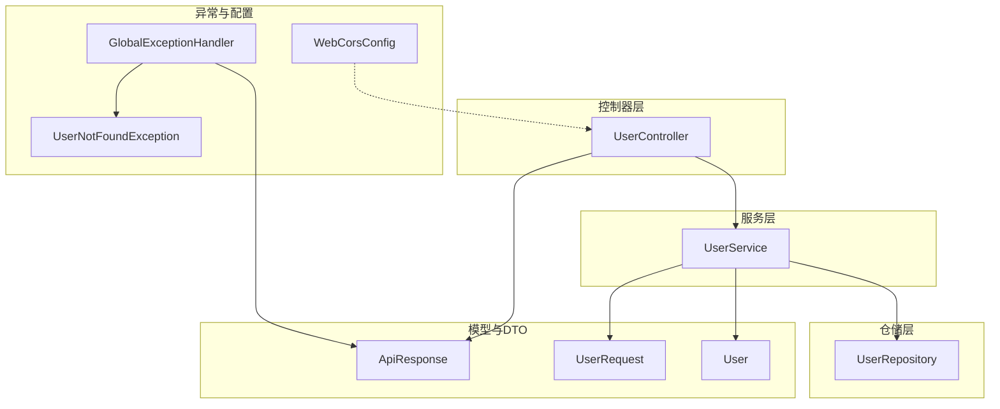
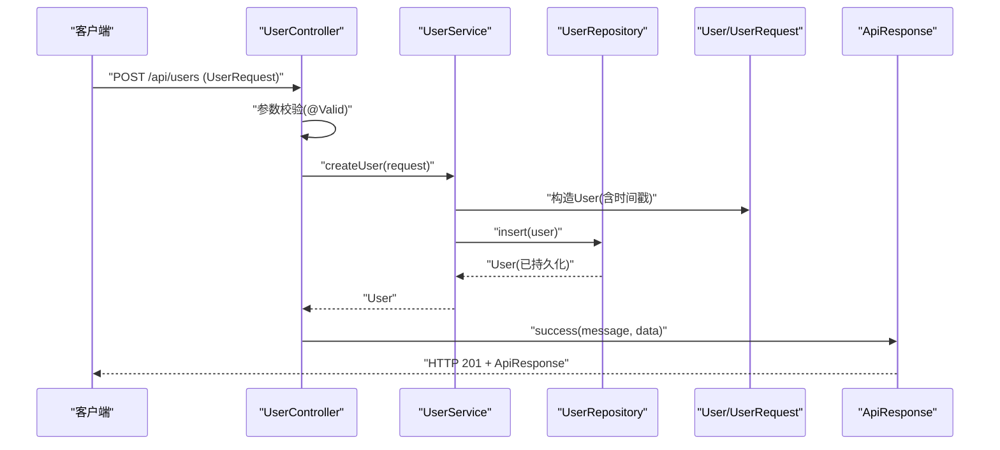
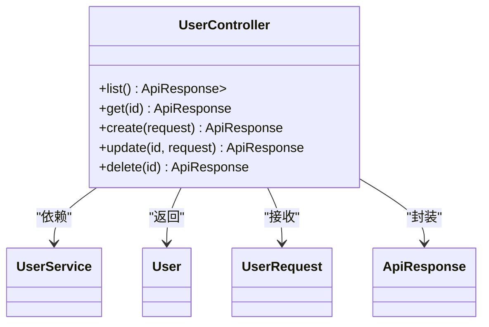
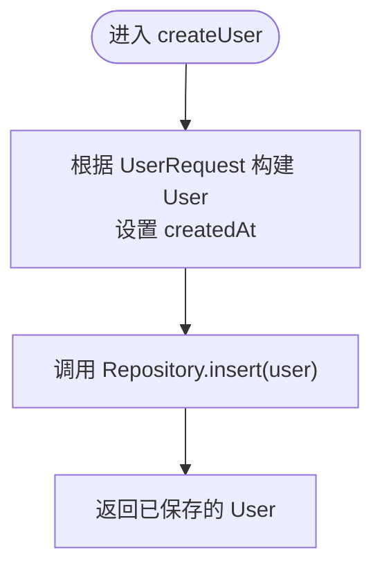
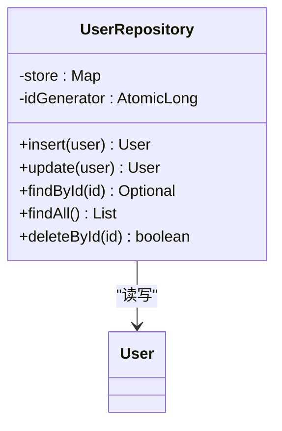
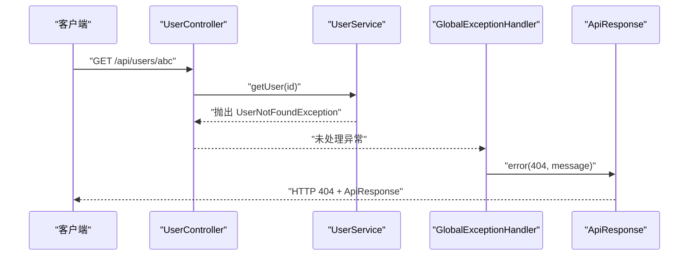
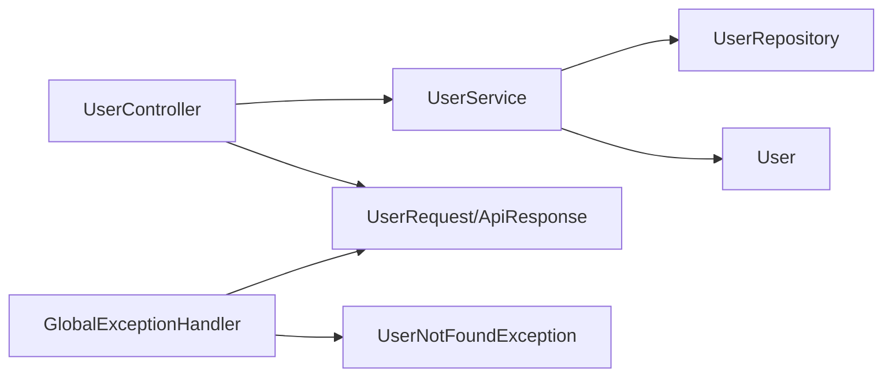

# 分层架构设计

<cite>
**本文引用的文件**
- [UserController.java](file://backend/src/main/java/com/aicoding/backend/controller/UserController.java)
- [UserService.java](file://backend/src/main/java/com/aicoding/backend/service/UserService.java)
- [UserRepository.java](file://backend/src/main/java/com/aicoding/backend/repository/UserRepository.java)
- [User.java](file://backend/src/main/java/com/aicoding/backend/model/User.java)
- [UserRequest.java](file://backend/src/main/java/com/aicoding/backend/dto/UserRequest.java)
- [ApiResponse.java](file://backend/src/main/java/com/aicoding/backend/dto/ApiResponse.java)
- [GlobalExceptionHandler.java](file://backend/src/main/java/com/aicoding/backend/exception/GlobalExceptionHandler.java)
- [UserNotFoundException.java](file://backend/src/main/java/com/aicoding/backend/exception/UserNotFoundException.java)
- [WebCorsConfig.java](file://backend/src/main/java/com/aicoding/backend/config/WebCorsConfig.java)
- [application.yml](file://backend/src/main/resources/application.yml)
- [pom.xml](file://backend/pom.xml)
</cite>

## 目录
1. [简介](#简介)
2. [项目结构](#项目结构)
3. [核心组件](#核心组件)
4. [架构总览](#架构总览)
5. [详细组件分析](#详细组件分析)
6. [依赖关系分析](#依赖关系分析)
7. [性能考虑](#性能考虑)
8. [故障排查指南](#故障排查指南)
9. [结论](#结论)
10. [附录](#附录)

## 简介
本技术文档围绕后端 Controller-Service-Repository 三层架构展开，结合用户管理功能，系统阐述各层职责、调用关系、数据流向、依赖注入与接口抽象、错误处理策略以及统一响应协议。该分层模式通过关注点分离提升可维护性与可测试性：Controller 专注 HTTP 请求与参数校验；Service 封装业务逻辑与领域规则；Repository 仅负责数据访问。通过清晰的边界与契约，便于独立演进、替换实现与单元测试。

## 项目结构
后端采用 Spring Boot 3.x 构建，模块按职责划分：
- controller：REST 控制器，定义路由、接收请求、返回统一响应
- service：业务编排与转换，协调 Repository 完成用例
- repository：数据访问抽象（当前为内存实现）
- model/dto：领域模型与传输对象
- exception：全局异常处理与业务异常
- config：跨域等横切配置
- resources：应用配置

图表来源
- [UserController.java:24-65](file://backend/src/main/java/com/aicoding/backend/controller/UserController.java#L24-L65)
- [UserService.java:15-56](file://backend/src/main/java/com/aicoding/backend/service/UserService.java#L15-L56)
- [UserRepository.java:16-54](file://backend/src/main/java/com/aicoding/backend/repository/UserRepository.java#L16-L54)
- [User.java:8-14](file://backend/src/main/java/com/aicoding/backend/model/User.java#L8-L14)
- [UserRequest.java:10-23](file://backend/src/main/java/com/aicoding/backend/dto/UserRequest.java#L10-L23)
- [ApiResponse.java:6-22](file://backend/src/main/java/com/aicoding/backend/dto/ApiResponse.java#L6-L22)
- [GlobalExceptionHandler.java:17-56](file://backend/src/main/java/com/aicoding/backend/exception/GlobalExceptionHandler.java#L17-L56)
- [UserNotFoundException.java:6-10](file://backend/src/main/java/com/aicoding/backend/exception/UserNotFoundException.java#L6-L10)
- [WebCorsConfig.java:11-22](file://backend/src/main/java/com/aicoding/backend/config/WebCorsConfig.java#L11-L22)

章节来源
- [application.yml:1-11](file://backend/src/main/resources/application.yml#L1-L11)
- [pom.xml:24-39](file://backend/pom.xml#L24-L39)

## 核心组件
- 控制器层（Controller）
  - 职责：暴露 REST API、解析路径与请求体、触发参数校验、调用 Service、包装统一响应
  - 关键能力：@Valid 参数校验、@RestController/@RequestMapping、HTTP 状态码控制
- 服务层（Service）
  - 职责：业务编排、数据转换、事务边界（可扩展）、异常抛出
  - 关键能力：构造领域对象、调用 Repository、抛出自定义业务异常
- 仓储层（Repository）
  - 职责：数据存取（CRUD），屏蔽存储细节
  - 当前实现：并发安全的内存 Map + 原子 ID 生成器；生产可替换为 JPA/MyBatis
- 数据传输与模型
  - UserRequest：入参 DTO，带 Bean Validation 注解
  - User：领域记录对象（record）
  - ApiResponse：统一响应结构（code/message/data）
- 异常与配置
  - GlobalExceptionHandler：集中捕获并转换为 ApiResponse
  - WebCorsConfig：开发环境跨域放行
  - application.yml：端口与应用名、日志级别

章节来源
- [UserController.java:24-65](file://backend/src/main/java/com/aicoding/backend/controller/UserController.java#L24-L65)
- [UserService.java:15-56](file://backend/src/main/java/com/aicoding/backend/service/UserService.java#L15-L56)
- [UserRepository.java:16-54](file://backend/src/main/java/com/aicoding/backend/repository/UserRepository.java#L16-L54)
- [UserRequest.java:10-23](file://backend/src/main/java/com/aicoding/backend/dto/UserRequest.java#L10-L23)
- [User.java:8-14](file://backend/src/main/java/com/aicoding/backend/model/User.java#L8-L14)
- [ApiResponse.java:6-22](file://backend/src/main/java/com/aicoding/backend/dto/ApiResponse.java#L6-L22)
- [GlobalExceptionHandler.java:17-56](file://backend/src/main/java/com/aicoding/backend/exception/GlobalExceptionHandler.java#L17-L56)
- [WebCorsConfig.java:11-22](file://backend/src/main/java/com/aicoding/backend/config/WebCorsConfig.java#L11-L22)
- [application.yml:1-11](file://backend/src/main/resources/application.yml#L1-L11)

## 架构总览
分层架构通过明确的职责边界降低耦合：
- Controller 不关心数据存储与业务规则，只负责协议适配
- Service 不直接操作 HTTP，专注于用例流程与领域规则
- Repository 不感知业务语义，仅提供数据访问原语

这种设计带来：
- 可维护性：变更某一层不影响其他层（如替换数据库实现）
- 可测试性：可针对 Service 进行单元测试，Mock Repository
- 可扩展性：新增用例只需扩展 Service，必要时增加 Repository 方法

图表来源
- [UserController.java:47-51](file://backend/src/main/java/com/aicoding/backend/controller/UserController.java#L47-L51)
- [UserService.java:40-43](file://backend/src/main/java/com/aicoding/backend/service/UserService.java#L40-L43)
- [UserRepository.java:23-29](file://backend/src/main/java/com/aicoding/backend/repository/UserRepository.java#L23-L29)
- [User.java:8-14](file://backend/src/main/java/com/aicoding/backend/model/User.java#L8-L14)
- [UserRequest.java:10-23](file://backend/src/main/java/com/aicoding/backend/dto/UserRequest.java#L10-L23)
- [ApiResponse.java:8-14](file://backend/src/main/java/com/aicoding/backend/dto/ApiResponse.java#L8-L14)

## 详细组件分析

### 控制器层（UserController）
- 路由设计
  - GET /api/users：查询列表
  - GET /api/users/{id}：按 ID 查询
  - POST /api/users：创建用户
  - PUT /api/users/{id}：更新用户
  - DELETE /api/users/{id}：删除用户
- 参数校验
  - 使用 @Valid 配合 UserRequest 的 Bean Validation 注解进行入参校验
- 响应封装
  - 所有成功响应通过 ApiResponse.success(...) 包装
- 依赖注入
  - 通过构造函数注入 UserService，避免字段注入带来的循环依赖风险

图表来源
- [UserController.java:24-65](file://backend/src/main/java/com/aicoding/backend/controller/UserController.java#L24-L65)
- [User.java:8-14](file://backend/src/main/java/com/aicoding/backend/model/User.java#L8-L14)
- [UserRequest.java:10-23](file://backend/src/main/java/com/aicoding/backend/dto/UserRequest.java#L10-L23)
- [ApiResponse.java:6-22](file://backend/src/main/java/com/aicoding/backend/dto/ApiResponse.java#L6-L22)

章节来源
- [UserController.java:24-65](file://backend/src/main/java/com/aicoding/backend/controller/UserController.java#L24-L65)

### 服务层（UserService）
- 业务职责
  - 初始化演示数据（启动时插入若干用户）
  - 将 UserRequest 转换为 User 领域对象
  - 调用 Repository 完成 CRUD
  - 在找不到用户或删除失败时抛出业务异常
- 数据转换
  - 构造 User 时设置 createdAt 时间戳
- 异常策略
  - 使用 UserNotFoundException 表达“资源不存在”的业务语义

图表来源
- [UserService.java:40-43](file://backend/src/main/java/com/aicoding/backend/service/UserService.java#L40-L43)
- [UserRepository.java:23-29](file://backend/src/main/java/com/aicoding/backend/repository/UserRepository.java#L23-L29)

章节来源
- [UserService.java:15-56](file://backend/src/main/java/com/aicoding/backend/service/UserService.java#L15-L56)

### 仓储层（UserRepository）
- 存储实现
  - 使用 ConcurrentHashMap 作为内存存储，AtomicLong 生成唯一 ID
  - 提供 insert/update/findById/findAll/deleteById 等基础操作
- 排序与过滤
  - findAll 对结果按 id 升序排序并过滤无效记录
- 可替换性
  - 当前为演示实现，生产可替换为 JPA/MyBatis 等持久化方案

图表来源
- [UserRepository.java:16-54](file://backend/src/main/java/com/aicoding/backend/repository/UserRepository.java#L16-L54)
- [User.java:8-14](file://backend/src/main/java/com/aicoding/backend/model/User.java#L8-L14)

章节来源
- [UserRepository.java:16-54](file://backend/src/main/java/com/aicoding/backend/repository/UserRepository.java#L16-L54)

### 数据传输与模型
- UserRequest
  - 入参 DTO，包含姓名、邮箱、手机号，并使用 Bean Validation 约束
- User
  - 领域记录对象，包含 id、name、email、phone、createdAt
- ApiResponse
  - 统一响应结构，包含 code、message、data，并提供便捷工厂方法

章节来源
- [UserRequest.java:10-23](file://backend/src/main/java/com/aicoding/backend/dto/UserRequest.java#L10-L23)
- [User.java:8-14](file://backend/src/main/java/com/aicoding/backend/model/User.java#L8-L14)
- [ApiResponse.java:6-22](file://backend/src/main/java/com/aicoding/backend/dto/ApiResponse.java#L6-L22)

### 异常处理与统一响应
- 全局异常处理器
  - 捕获用户不存在、参数校验失败、JSON 解析失败、类型不匹配及未知异常
  - 统一转换为 ApiResponse 并附带合适的 HTTP 状态码
- 业务异常
  - UserNotFoundException 用于表达“资源不存在”的业务语义

图表来源
- [GlobalExceptionHandler.java:20-25](file://backend/src/main/java/com/aicoding/backend/exception/GlobalExceptionHandler.java#L20-L25)
- [UserNotFoundException.java:6-10](file://backend/src/main/java/com/aicoding/backend/exception/UserNotFoundException.java#L6-L10)
- [UserService.java:35-38](file://backend/src/main/java/com/aicoding/backend/service/UserService.java#L35-L38)

章节来源
- [GlobalExceptionHandler.java:17-56](file://backend/src/main/java/com/aicoding/backend/exception/GlobalExceptionHandler.java#L17-L56)
- [UserNotFoundException.java:6-10](file://backend/src/main/java/com/aicoding/backend/exception/UserNotFoundException.java#L6-L10)

### 配置与运行
- 跨域配置
  - 允许本地前端开发服务器访问后端 /api/**
- 应用配置
  - 端口 8080，应用名 aicoding-backend，日志级别 info

章节来源
- [WebCorsConfig.java:11-22](file://backend/src/main/java/com/aicoding/backend/config/WebCorsConfig.java#L11-L22)
- [application.yml:1-11](file://backend/src/main/resources/application.yml#L1-L11)

## 依赖关系分析
- 依赖方向
  - Controller -> Service -> Repository
  - Controller/Service 依赖 DTO/Model
  - 全局异常处理器依赖业务异常与统一响应
- 解耦与可测试性
  - Service 通过构造函数注入 Repository，便于在单元测试中 Mock
  - Controller 通过构造函数注入 Service，便于隔离 HTTP 层测试
- 外部依赖
  - Spring Boot Web、Validation、Test
  - 运行时由 Spring 容器管理生命周期与装配

图表来源
- [UserController.java:24-65](file://backend/src/main/java/com/aicoding/backend/controller/UserController.java#L24-L65)
- [UserService.java:15-56](file://backend/src/main/java/com/aicoding/backend/service/UserService.java#L15-L56)
- [UserRepository.java:16-54](file://backend/src/main/java/com/aicoding/backend/repository/UserRepository.java#L16-L54)
- [GlobalExceptionHandler.java:17-56](file://backend/src/main/java/com/aicoding/backend/exception/GlobalExceptionHandler.java#L17-L56)
- [UserNotFoundException.java:6-10](file://backend/src/main/java/com/aicoding/backend/exception/UserNotFoundException.java#L6-L10)

章节来源
- [pom.xml:24-39](file://backend/pom.xml#L24-L39)

## 性能考虑
- 内存存储
  - 当前使用 ConcurrentHashMap，适合高并发读写的演示场景
  - 注意内存占用与数据一致性，生产应替换为数据库
- 排序与过滤
  - findAll 使用流式排序，数据量大时应考虑分页与索引
- 验证开销
  - Bean Validation 在 Controller 层执行，建议合理设置校验规则，避免过度校验
- 日志与监控
  - 可通过 application.yml 调整日志级别，结合指标与链路追踪定位瓶颈

[本节为通用指导，不直接分析具体文件]

## 故障排查指南
- 常见错误与定位
  - 参数校验失败：检查 UserRequest 上的注解与入参格式
  - JSON 解析失败：检查请求体是否为合法 JSON
  - 路径参数类型不匹配：确保 /{id} 为数字
  - 资源不存在：确认 ID 是否存在于存储
- 处理流程
  - 全局异常处理器会将异常转换为 ApiResponse，并附带合适 HTTP 状态码
  - 通过日志级别与错误消息快速定位问题

章节来源
- [GlobalExceptionHandler.java:27-56](file://backend/src/main/java/com/aicoding/backend/exception/GlobalExceptionHandler.java#L27-L56)
- [UserNotFoundException.java:6-10](file://backend/src/main/java/com/aicoding/backend/exception/UserNotFoundException.java#L6-L10)

## 结论
本项目以 Controller-Service-Repository 三层架构清晰划分职责，借助依赖注入与接口抽象实现松耦合，配合统一响应与全局异常处理形成一致的对外契约。该设计提升了代码的可维护性与可测试性，并为后续引入真实数据库、扩展业务与优化性能提供了良好基础。

[本节为总结性内容，不直接分析具体文件]

## 附录

### 各层通信协议与错误处理策略
- 请求协议
  - RESTful 风格，基于 HTTP 动词与路径
  - 请求体使用 JSON，遵循 UserRequest 的结构与校验规则
- 响应协议
  - 统一 ApiResponse 结构：code、message、data
  - 成功：code=0，message="success" 或自定义提示
  - 失败：非零 code，message 描述错误原因
- 错误处理
  - 参数校验失败：400 Bad Request
  - 资源不存在：404 Not Found
  - 请求体格式错误：400 Bad Request
  - 类型不匹配：400 Bad Request
  - 未知异常：500 Internal Server Error

章节来源
- [ApiResponse.java:6-22](file://backend/src/main/java/com/aicoding/backend/dto/ApiResponse.java#L6-L22)
- [GlobalExceptionHandler.java:20-56](file://backend/src/main/java/com/aicoding/backend/exception/GlobalExceptionHandler.java#L20-L56)

### 用户管理功能示例（端到端）
- 创建用户
  - 客户端发送 POST /api/users，携带 UserRequest
  - Controller 校验参数后调用 Service.createUser
  - Service 构造 User 并调用 Repository.insert
  - 返回 201 与 ApiResponse 包装的用户信息
- 查询用户
  - GET /api/users/{id}
  - Controller 调用 Service.getUser
  - Service 调用 Repository.findById，不存在则抛出业务异常
  - 全局异常处理器返回 404 与错误信息
- 更新用户
  - PUT /api/users/{id}
  - Controller 校验参数后调用 Service.updateUser
  - Service 获取现有用户并构造新对象，调用 Repository.update
- 删除用户
  - DELETE /api/users/{id}
  - Controller 调用 Service.deleteUser
  - Service 调用 Repository.deleteById，失败则抛出业务异常

章节来源
- [UserController.java:34-64](file://backend/src/main/java/com/aicoding/backend/controller/UserController.java#L34-L64)
- [UserService.java:31-55](file://backend/src/main/java/com/aicoding/backend/service/UserService.java#L31-L55)
- [UserRepository.java:23-53](file://backend/src/main/java/com/aicoding/backend/repository/UserRepository.java#L23-L53)
- [GlobalExceptionHandler.java:20-56](file://backend/src/main/java/com/aicoding/backend/exception/GlobalExceptionHandler.java#L20-L56)