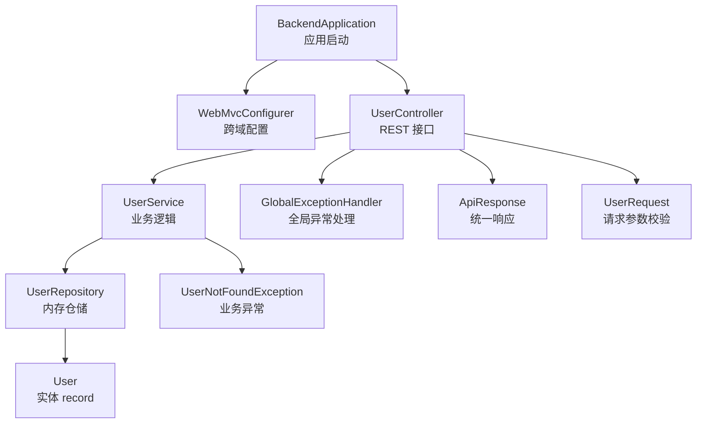
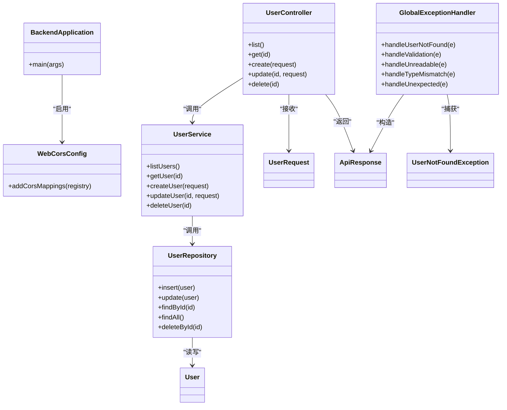
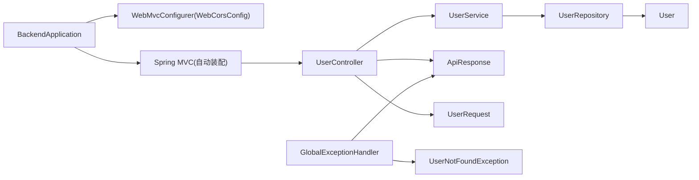
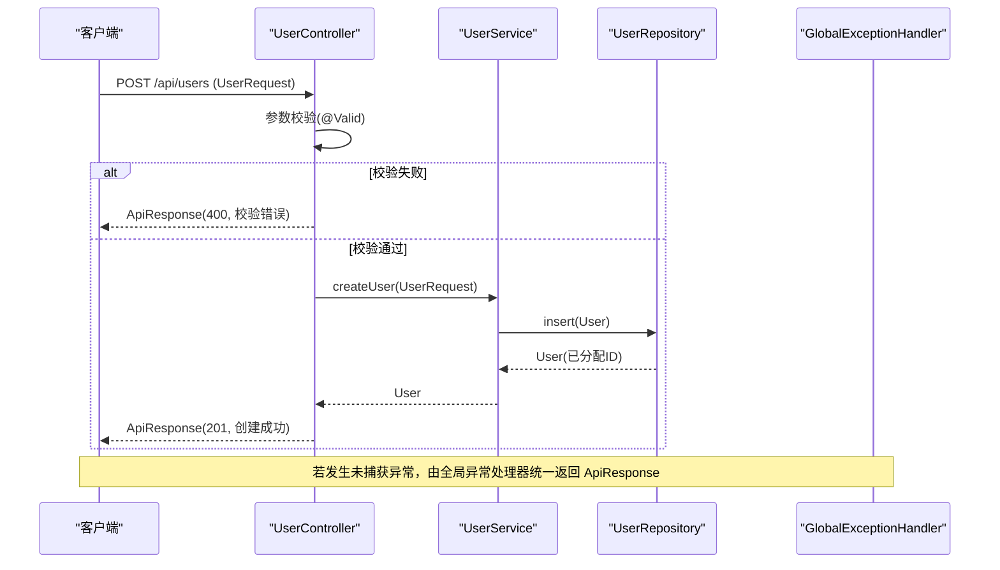

# 后端架构

<cite>
**本文引用的文件**
- [BackendApplication.java](file://backend/src/main/java/com/aicoding/backend/BackendApplication.java)
- [WebCorsConfig.java](file://backend/src/main/java/com/aicoding/backend/config/WebCorsConfig.java)
- [UserController.java](file://backend/src/main/java/com/aicoding/backend/controller/UserController.java)
- [UserService.java](file://backend/src/main/java/com/aicoding/backend/service/UserService.java)
- [UserRepository.java](file://backend/src/main/java/com/aicoding/backend/repository/UserRepository.java)
- [User.java](file://backend/src/main/java/com/aicoding/backend/model/User.java)
- [ApiResponse.java](file://backend/src/main/java/com/aicoding/backend/dto/ApiResponse.java)
- [UserRequest.java](file://backend/src/main/java/com/aicoding/backend/dto/UserRequest.java)
- [GlobalExceptionHandler.java](file://backend/src/main/java/com/aicoding/backend/exception/GlobalExceptionHandler.java)
- [UserNotFoundException.java](file://backend/src/main/java/com/aicoding/backend/exception/UserNotFoundException.java)
- [application.yml](file://backend/src/main/resources/application.yml)
- [pom.xml](file://backend/pom.xml)
- [README.md](file://README.md)
</cite>

## 目录
1. [简介](#简介)
2. [项目结构](#项目结构)
3. [核心组件](#核心组件)
4. [架构总览](#架构总览)
5. [详细组件分析](#详细组件分析)
6. [依赖关系分析](#依赖关系分析)
7. [性能与并发](#性能与并发)
8. [配置管理](#配置管理)
9. [异常处理与统一响应](#异常处理与统一响应)
10. [数据流与请求处理序列](#数据流与请求处理序列)
11. [扩展点：替换内存存储为数据库](#扩展点替换内存存储为数据库)
12. [故障排查指南](#故障排查指南)
13. [结论](#结论)

## 简介
本项目是一个基于 Spring Boot 3.x 的后端服务，提供用户管理的 REST API。采用典型的分层架构（Controller / Service / Repository），使用注解驱动开发，结合全局异常处理与统一响应格式，便于前后端分离协作。数据存储当前为内存实现（ConcurrentHashMap + AtomicLong），可平滑替换为 JPA/MyBatis 等持久化方案。

## 项目结构
后端代码按职责清晰分层：
- 启动与自动装配：BackendApplication
- Web 层：UserController、WebCorsConfig
- 业务层：UserService
- 数据访问层：UserRepository
- 领域模型与 DTO：User、UserRequest、ApiResponse
- 横切关注：GlobalExceptionHandler、UserNotFoundException
- 配置：application.yml、pom.xml

图表来源
- [BackendApplication.java:9-14](file://backend/src/main/java/com/aicoding/backend/BackendApplication.java#L9-L14)
- [WebCorsConfig.java:11-22](file://backend/src/main/java/com/aicoding/backend/config/WebCorsConfig.java#L11-L22)
- [UserController.java:24-65](file://backend/src/main/java/com/aicoding/backend/controller/UserController.java#L24-L65)
- [UserService.java:15-56](file://backend/src/main/java/com/aicoding/backend/service/UserService.java#L15-L56)
- [UserRepository.java:16-54](file://backend/src/main/java/com/aicoding/backend/repository/UserRepository.java#L16-L54)
- [User.java:8-14](file://backend/src/main/java/com/aicoding/backend/model/User.java#L8-L14)
- [ApiResponse.java:6-22](file://backend/src/main/java/com/aicoding/backend/dto/ApiResponse.java#L6-L22)
- [UserRequest.java:10-23](file://backend/src/main/java/com/aicoding/backend/dto/UserRequest.java#L10-L23)
- [GlobalExceptionHandler.java:17-56](file://backend/src/main/java/com/aicoding/backend/exception/GlobalExceptionHandler.java#L17-L56)
- [UserNotFoundException.java:6-10](file://backend/src/main/java/com/aicoding/backend/exception/UserNotFoundException.java#L6-L10)

章节来源
- [README.md:19-49](file://README.md#L19-L49)
- [pom.xml:24-39](file://backend/pom.xml#L24-L39)

## 核心组件
- 启动类 BackendApplication：通过 @SpringBootApplication 启用自动配置与组件扫描，main 方法启动应用。
- 跨域配置 WebCorsConfig：允许本地前端（Vite 默认 5173）访问 /api/** 接口，支持常用方法与凭据。
- 控制器 UserController：暴露 /api/users 的 CRUD 接口，返回统一 ApiResponse。
- 服务层 UserService：封装业务规则，初始化示例数据，调用 Repository 完成数据操作。
- 仓储层 UserRepository：内存版实现，使用 ConcurrentHashMap 存储 User，AtomicLong 生成唯一 ID。
- 模型与 DTO：User（record）、UserRequest（带校验）、ApiResponse（统一响应）。
- 异常处理：GlobalExceptionHandler 将各类异常转换为统一 ApiResponse；UserNotFoundException 表示用户不存在。

章节来源
- [BackendApplication.java:9-14](file://backend/src/main/java/com/aicoding/backend/BackendApplication.java#L9-L14)
- [WebCorsConfig.java:11-22](file://backend/src/main/java/com/aicoding/backend/config/WebCorsConfig.java#L11-L22)
- [UserController.java:24-65](file://backend/src/main/java/com/aicoding/backend/controller/UserController.java#L24-L65)
- [UserService.java:15-56](file://backend/src/main/java/com/aicoding/backend/service/UserService.java#L15-L56)
- [UserRepository.java:16-54](file://backend/src/main/java/com/aicoding/backend/repository/UserRepository.java#L16-L54)
- [User.java:8-14](file://backend/src/main/java/com/aicoding/backend/model/User.java#L8-L14)
- [UserRequest.java:10-23](file://backend/src/main/java/com/aicoding/backend/dto/UserRequest.java#L10-L23)
- [ApiResponse.java:6-22](file://backend/src/main/java/com/aicoding/backend/dto/ApiResponse.java#L6-L22)
- [GlobalExceptionHandler.java:17-56](file://backend/src/main/java/com/aicoding/backend/exception/GlobalExceptionHandler.java#L17-L56)
- [UserNotFoundException.java:6-10](file://backend/src/main/java/com/aicoding/backend/exception/UserNotFoundException.java#L6-L10)

## 架构总览
本系统遵循“注解驱动 + 分层解耦”的设计：
- Controller 仅负责接收请求、参数校验、调用 Service、包装响应。
- Service 承载业务逻辑，协调多个 Repository 或外部服务。
- Repository 屏蔽数据源细节，当前为内存存储，后续可替换为数据库。
- 全局异常处理器统一错误响应格式，提升客户端体验。
- 跨域配置确保前后端分离调试顺畅。

图表来源
- [BackendApplication.java:9-14](file://backend/src/main/java/com/aicoding/backend/BackendApplication.java#L9-L14)
- [WebCorsConfig.java:11-22](file://backend/src/main/java/com/aicoding/backend/config/WebCorsConfig.java#L11-L22)
- [UserController.java:24-65](file://backend/src/main/java/com/aicoding/backend/controller/UserController.java#L24-L65)
- [UserService.java:15-56](file://backend/src/main/java/com/aicoding/backend/service/UserService.java#L15-L56)
- [UserRepository.java:16-54](file://backend/src/main/java/com/aicoding/backend/repository/UserRepository.java#L16-L54)
- [User.java:8-14](file://backend/src/main/java/com/aicoding/backend/model/User.java#L8-L14)
- [UserRequest.java:10-23](file://backend/src/main/java/com/aicoding/backend/dto/UserRequest.java#L10-L23)
- [ApiResponse.java:6-22](file://backend/src/main/java/com/aicoding/backend/dto/ApiResponse.java#L6-L22)
- [GlobalExceptionHandler.java:17-56](file://backend/src/main/java/com/aicoding/backend/exception/GlobalExceptionHandler.java#L17-L56)
- [UserNotFoundException.java:6-10](file://backend/src/main/java/com/aicoding/backend/exception/UserNotFoundException.java#L6-L10)

## 详细组件分析

### 启动类与自动配置
- 使用 @SpringBootApplication 开启自动配置与组件扫描，无需额外 XML 配置。
- main 方法通过 SpringApplication.run 启动应用，加载 application.yml 中的端口与日志级别。
- 自动装配包括 Web MVC、验证器、异常处理等基础能力。

章节来源
- [BackendApplication.java:9-14](file://backend/src/main/java/com/aicoding/backend/BackendApplication.java#L9-L14)
- [application.yml:1-11](file://backend/src/main/resources/application.yml#L1-L11)

### 跨域配置 WebCorsConfig
- 实现 WebMvcConfigurer，注册 /api/** 的跨域策略。
- 允许的源包含本地开发服务器地址，支持 GET/POST/PUT/DELETE/OPTIONS，允许携带凭据，设置预检缓存时间。

章节来源
- [WebCorsConfig.java:11-22](file://backend/src/main/java/com/aicoding/backend/config/WebCorsConfig.java#L11-L22)

### 控制器 UserController
- 定义 /api/users 的 RESTful 接口：列表、详情、新增、更新、删除。
- 使用 @Valid 触发参数校验，结合全局异常处理器返回统一错误信息。
- 所有响应统一封装为 ApiResponse。

章节来源
- [UserController.java:24-65](file://backend/src/main/java/com/aicoding/backend/controller/UserController.java#L24-L65)

### 服务层 UserService
- 注入 UserRepository，并在构造时初始化演示数据（张三、李四、王五）。
- 业务规则：查询缺失用户抛出 UserNotFoundException；更新时保留创建时间；删除失败抛异常。

章节来源
- [UserService.java:15-56](file://backend/src/main/java/com/aicoding/backend/service/UserService.java#L15-L56)

### 仓储层 UserRepository（内存存储）
- 使用 ConcurrentHashMap 作为线程安全的内存存储。
- 使用 AtomicLong 生成自增主键，保证并发安全。
- 提供 insert/update/findById/findAll/deleteById 等方法。
- findAll 过滤有效记录并按 id 排序返回。

章节来源
- [UserRepository.java:16-54](file://backend/src/main/java/com/aicoding/backend/repository/UserRepository.java#L16-L54)

### 模型与 DTO
- User：不可变 record，包含 id、name、email、phone、createdAt。
- UserRequest：请求体 record，使用 Jakarta Validation 注解进行校验（非空、邮箱格式、长度限制）。
- ApiResponse：统一响应 record，code=0 表示成功，message 描述结果，data 承载业务数据。

章节来源
- [User.java:8-14](file://backend/src/main/java/com/aicoding/backend/model/User.java#L8-L14)
- [UserRequest.java:10-23](file://backend/src/main/java/com/aicoding/backend/dto/UserRequest.java#L10-L23)
- [ApiResponse.java:6-22](file://backend/src/main/java/com/aicoding/backend/dto/ApiResponse.java#L6-L22)

### 异常处理与统一响应
- GlobalExceptionHandler：集中处理用户不存在、参数校验失败、请求体解析错误、路径参数类型不匹配以及未知异常，均返回 ApiResponse。
- UserNotFoundException：业务异常，用于标识用户不存在场景。

章节来源
- [GlobalExceptionHandler.java:17-56](file://backend/src/main/java/com/aicoding/backend/exception/GlobalExceptionHandler.java#L17-L56)
- [UserNotFoundException.java:6-10](file://backend/src/main/java/com/aicoding/backend/exception/UserNotFoundException.java#L6-L10)

## 依赖关系分析
- 启动类依赖 Spring Boot 自动配置，加载 Web、Validation 等 Starter。
- Controller 依赖 Service 与 DTO；Service 依赖 Repository 与异常；Repository 依赖 Model。
- 全局异常处理器依赖统一响应 DTO 与业务异常。

图表来源
- [pom.xml:24-39](file://backend/pom.xml#L24-L39)
- [BackendApplication.java:9-14](file://backend/src/main/java/com/aicoding/backend/BackendApplication.java#L9-L14)
- [WebCorsConfig.java:11-22](file://backend/src/main/java/com/aicoding/backend/config/WebCorsConfig.java#L11-L22)
- [UserController.java:24-65](file://backend/src/main/java/com/aicoding/backend/controller/UserController.java#L24-L65)
- [UserService.java:15-56](file://backend/src/main/java/com/aicoding/backend/service/UserService.java#L15-L56)
- [UserRepository.java:16-54](file://backend/src/main/java/com/aicoding/backend/repository/UserRepository.java#L16-L54)
- [User.java:8-14](file://backend/src/main/java/com/aicoding/backend/model/User.java#L8-L14)
- [ApiResponse.java:6-22](file://backend/src/main/java/com/aicoding/backend/dto/ApiResponse.java#L6-L22)
- [UserRequest.java:10-23](file://backend/src/main/java/com/aicoding/backend/dto/UserRequest.java#L10-L23)
- [GlobalExceptionHandler.java:17-56](file://backend/src/main/java/com/aicoding/backend/exception/GlobalExceptionHandler.java#L17-L56)
- [UserNotFoundException.java:6-10](file://backend/src/main/java/com/aicoding/backend/exception/UserNotFoundException.java#L6-L10)

章节来源
- [pom.xml:24-39](file://backend/pom.xml#L24-L39)

## 性能与并发
- 内存存储使用 ConcurrentHashMap 提供高并发读写的线程安全容器，适合演示与轻量级场景。
- 使用 AtomicLong 生成唯一 ID，避免并发冲突。
- 列表查询通过 Stream 过滤并排序，数据量较大时可考虑分页与索引优化。
- 生产环境建议替换为数据库存储，引入连接池、事务管理与缓存策略以提升吞吐与稳定性。

[本节为通用性能讨论，不直接分析具体文件]

## 配置管理
- 应用端口与名称在 application.yml 中配置。
- 日志级别针对包 com.aicoding.backend 设置为 info。
- Maven 构建使用 spring-boot-starter-web 与 spring-boot-starter-validation，测试依赖 spring-boot-starter-test。

章节来源
- [application.yml:1-11](file://backend/src/main/resources/application.yml#L1-L11)
- [pom.xml:24-39](file://backend/pom.xml#L24-L39)

## 异常处理与统一响应
- 全局异常处理器将常见异常映射到 HTTP 状态码与 ApiResponse。
- 参数校验失败会聚合字段错误信息，便于前端提示。
- 未知异常兜底返回 500，避免泄露内部堆栈。

章节来源
- [GlobalExceptionHandler.java:17-56](file://backend/src/main/java/com/aicoding/backend/exception/GlobalExceptionHandler.java#L17-L56)
- [ApiResponse.java:6-22](file://backend/src/main/java/com/aicoding/backend/dto/ApiResponse.java#L6-L22)

## 数据流与请求处理序列
以下以“新增用户”为例展示从请求到响应的完整流程：

图表来源
- [UserController.java:47-51](file://backend/src/main/java/com/aicoding/backend/controller/UserController.java#L47-L51)
- [UserService.java:40-43](file://backend/src/main/java/com/aicoding/backend/service/UserService.java#L40-L43)
- [UserRepository.java:22-29](file://backend/src/main/java/com/aicoding/backend/repository/UserRepository.java#L22-L29)
- [GlobalExceptionHandler.java:27-42](file://backend/src/main/java/com/aicoding/backend/exception/GlobalExceptionHandler.java#L27-L42)

## 扩展点：替换内存存储为数据库
- 目标：将 UserRepository 的内存实现替换为基于 JPA/MyBatis 的数据库实现。
- 步骤建议：
  - 新增数据库依赖（如 spring-boot-starter-data-jpa、MySQL/PostgreSQL 驱动）。
  - 在 application.yml 中配置数据源、JPA/Hibernate 属性。
  - 设计数据库表结构与实体映射（或使用现有 User 实体）。
  - 实现新的 UserRepository 接口或抽象类，保持原有方法签名不变。
  - 移除或禁用内存初始化逻辑（initSampleData），改为数据迁移脚本或种子数据。
  - 增加事务管理（@Transactional）与分页、索引优化。
- 影响范围：
  - Controller 与 Service 无需改动，因为依赖的是接口/抽象契约。
  - 全局异常处理与统一响应保持不变。
  - 跨域配置与启动类无需调整。

[本节为概念性扩展指导，不直接分析具体文件]

## 故障排查指南
- 404 用户不存在：检查 Service 层是否抛出 UserNotFoundException，确认 Repository 是否存在该 ID。
- 400 参数校验失败：检查 UserRequest 的校验注解与前端传参是否符合约束。
- 400 请求体格式错误：检查 Content-Type 是否为 application/json，JSON 结构是否正确。
- 400 路径参数类型不匹配：确保 URL 中的 id 为数字类型。
- 500 服务器内部错误：查看服务端日志定位异常堆栈，必要时添加更详细的日志输出。

章节来源
- [GlobalExceptionHandler.java:20-56](file://backend/src/main/java/com/aicoding/backend/exception/GlobalExceptionHandler.java#L20-L56)
- [UserNotFoundException.java:6-10](file://backend/src/main/java/com/aicoding/backend/exception/UserNotFoundException.java#L6-L10)

## 结论
本项目采用清晰的 Spring Boot 分层架构与注解驱动开发模式，实现了用户管理的 REST API。通过统一的响应格式与全局异常处理，提升了可维护性与用户体验。内存存储便于快速演示，同时提供了明确的扩展点以替换为数据库实现。建议在生产环境中引入持久化、事务、缓存与监控能力，进一步提升系统的可靠性与性能。