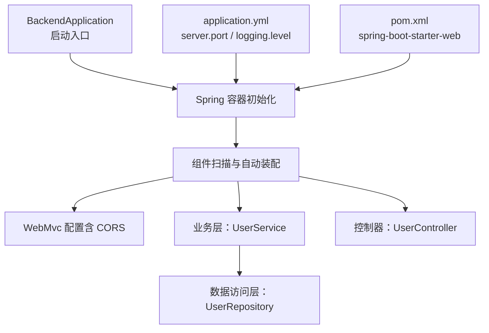
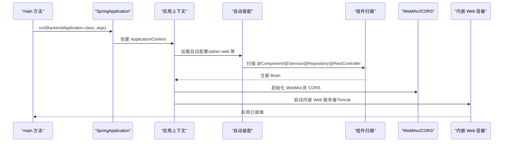
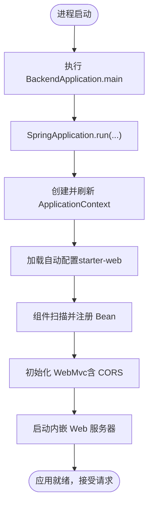
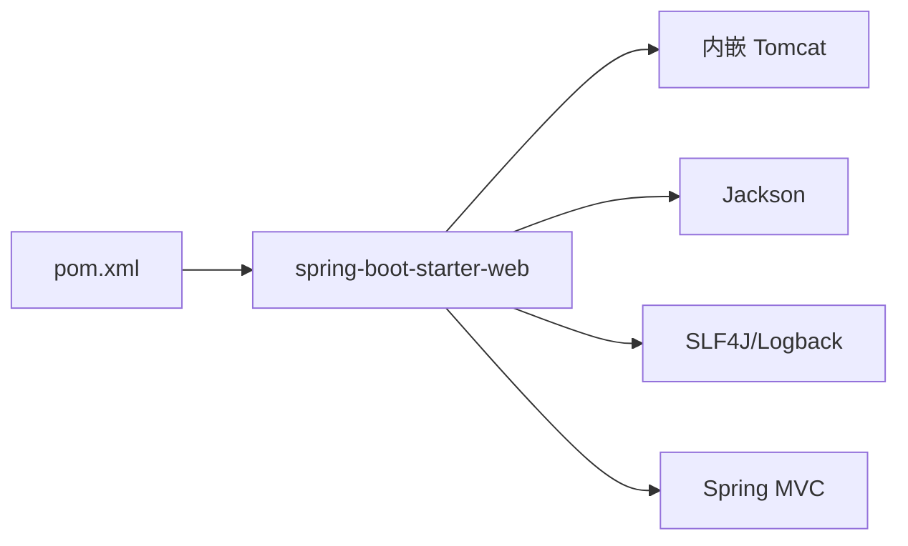
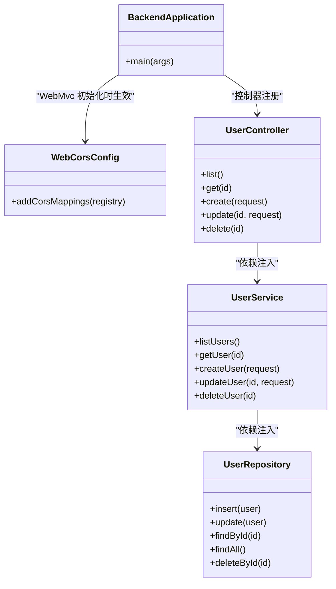

# 应用启动配置

<cite>
**本文引用的文件**
- [BackendApplication.java](file://backend/src/main/java/com/aicoding/backend/BackendApplication.java)
- [application.yml](file://backend/src/main/resources/application.yml)
- [pom.xml](file://backend/pom.xml)
- [WebCorsConfig.java](file://backend/src/main/java/com/aicoding/backend/config/WebCorsConfig.java)
- [UserController.java](file://backend/src/main/java/com/aicoding/backend/controller/UserController.java)
- [UserService.java](file://backend/src/main/java/com/aicoding/backend/service/UserService.java)
- [UserRepository.java](file://backend/src/main/java/com/aicoding/backend/repository/UserRepository.java)
</cite>

## 目录
1. [简介](#简介)
2. [项目结构](#项目结构)
3. [核心组件](#核心组件)
4. [架构总览](#架构总览)
5. [详细组件分析](#详细组件分析)
6. [依赖分析](#依赖分析)
7. [性能考虑](#性能考虑)
8. [故障排查指南](#故障排查指南)
9. [结论](#结论)
10. [附录](#附录)

## 简介
本文面向 Spring Boot 应用的启动与配置，围绕 BackendApplication 启动类、@SpringBootApplication 注解机制、自动装配原理、组件扫描与依赖注入容器初始化流程展开，并结合 application.yml 的服务器端口、应用名、日志级别等配置进行说明。同时给出从 main 方法执行到 Web 容器初始化的完整启动时序，提供自定义扩展方法与最佳实践，并总结常见启动问题的排查思路与性能优化建议。

## 项目结构
后端采用典型的分层结构：入口类位于根包下，控制器、服务、仓储分别位于对应子包；配置集中在 resources/application.yml 与 Java 配置类中；Maven 构建通过 spring-boot-starter-web 引入 Web 能力。

图表来源
- [BackendApplication.java:1-16](file://backend/src/main/java/com/aicoding/backend/BackendApplication.java#L1-L16)
- [application.yml:1-11](file://backend/src/main/resources/application.yml#L1-L11)
- [pom.xml:1-51](file://backend/pom.xml#L1-L51)
- [WebCorsConfig.java:1-24](file://backend/src/main/java/com/aicoding/backend/config/WebCorsConfig.java#L1-L24)

章节来源
- [BackendApplication.java:1-16](file://backend/src/main/java/com/aicoding/backend/BackendApplication.java#L1-L16)
- [application.yml:1-11](file://backend/src/main/resources/application.yml#L1-L11)
- [pom.xml:1-51](file://backend/pom.xml#L1-L51)

## 核心组件
- 启动类 BackendApplication：使用 @SpringBootApplication 标注，并在 main 方法中调用 SpringApplication.run，完成应用上下文创建与启动。
- 自动装配与组件扫描：由 @SpringBootApplication 触发，扫描当前包及其子包下的组件（如 @RestController、@Service、@Repository），并基于 starter 依赖启用自动配置。
- Web 配置 WebCorsConfig：实现 WebMvcConfigurer，为 /api/** 路径开启跨域支持，允许本地前端开发服务器访问。
- 配置 application.yml：定义 server.port、spring.application.name、logging.level 等关键运行时参数。
- 依赖管理 pom.xml：通过 spring-boot-starter-parent 与 spring-boot-starter-web 引入 Web 能力与默认约定。

章节来源
- [BackendApplication.java:1-16](file://backend/src/main/java/com/aicoding/backend/BackendApplication.java#L1-L16)
- [WebCorsConfig.java:1-24](file://backend/src/main/java/com/aicoding/backend/config/WebCorsConfig.java#L1-L24)
- [application.yml:1-11](file://backend/src/main/resources/application.yml#L1-L11)
- [pom.xml:1-51](file://backend/pom.xml#L1-L51)

## 架构总览
下图展示了从 main 方法执行到 Web 容器就绪的关键阶段，以及各组件之间的交互关系。

图表来源
- [BackendApplication.java:1-16](file://backend/src/main/java/com/aicoding/backend/BackendApplication.java#L1-L16)
- [WebCorsConfig.java:1-24](file://backend/src/main/java/com/aicoding/backend/config/WebCorsConfig.java#L1-L24)
- [pom.xml:1-51](file://backend/pom.xml#L1-L51)

## 详细组件分析

### 启动类与注解机制
- BackendApplication 作为唯一入口，通过 @SpringBootApplication 启用以下能力：
  - 组件扫描：默认扫描当前包及子包。
  - 自动装配：根据 classpath 上的 starter 启用对应的自动配置类。
  - 属性绑定：将 application.yml 中的配置映射到 Spring 环境。
- main 方法调用 SpringApplication.run，内部完成：
  - 创建并刷新 ApplicationContext。
  - 执行 CommandLineRunner/SmartLifecycle 等生命周期回调（如有）。
  - 启动内嵌 Web 容器并监听配置的端口。

章节来源
- [BackendApplication.java:1-16](file://backend/src/main/java/com/aicoding/backend/BackendApplication.java#L1-L16)
- [pom.xml:1-51](file://backend/pom.xml#L1-L51)

### 自动装配与组件扫描
- 由于引入了 spring-boot-starter-web，Spring Boot 自动装配会：
  - 注册 DispatcherServlet、视图解析器、消息转换器、异常处理器等。
  - 启用 WebMvc 相关默认配置。
- 组件扫描会识别并注册：
  - @RestController：UserController
  - @Service：UserService
  - @Repository：UserRepository
- 依赖注入通过构造器注入完成，例如 UserController 注入 UserService，UserService 注入 UserRepository。

章节来源
- [UserController.java:1-66](file://backend/src/main/java/com/aicoding/backend/controller/UserController.java#L1-L66)
- [UserService.java:1-57](file://backend/src/main/java/com/aicoding/backend/service/UserService.java#L1-L57)
- [UserRepository.java:1-55](file://backend/src/main/java/com/aicoding/backend/repository/UserRepository.java#L1-L55)
- [pom.xml:1-51](file://backend/pom.xml#L1-L51)

### Web 跨域配置
- WebCorsConfig 实现了 WebMvcConfigurer，对 /api/** 开放跨域：
  - 允许的源：http://localhost:5173 与 http://127.0.0.1:5173
  - 允许的 HTTP 方法：GET、POST、PUT、DELETE、OPTIONS
  - 允许携带凭据，预检缓存时间 3600 秒
- 该配置在 WebMvc 初始化阶段生效，确保前端开发服务器可正常调用后端接口。

章节来源
- [WebCorsConfig.java:1-24](file://backend/src/main/java/com/aicoding/backend/config/WebCorsConfig.java#L1-L24)

### 配置文件 application.yml
- server.port：设置内嵌 Web 服务器的监听端口（示例为 8080）。
- spring.application.name：应用名称，便于日志与监控标识。
- logging.level：设置 com.aicoding.backend 包的日志级别（示例为 info）。
- 其他常用项（未在文件中出现但可参考）：
  - server.servlet.context-path：应用上下文路径
  - server.tomcat.*：Tomcat 线程池、连接数等调优参数
  - spring.mvc.*：MVC 相关默认行为调整

章节来源
- [application.yml:1-11](file://backend/src/main/resources/application.yml#L1-L11)

### 启动流程时序（从 main 到 Web 容器）

图表来源
- [BackendApplication.java:1-16](file://backend/src/main/java/com/aicoding/backend/BackendApplication.java#L1-L16)
- [WebCorsConfig.java:1-24](file://backend/src/main/java/com/aicoding/backend/config/WebCorsConfig.java#L1-L24)
- [pom.xml:1-51](file://backend/pom.xml#L1-L51)

## 依赖分析
- 构建与运行依赖：
  - spring-boot-starter-parent：统一版本管理与插件配置。
  - spring-boot-starter-web：引入 Web 栈与内嵌 Tomcat。
  - spring-boot-starter-validation：启用参数校验（配合 @Valid）。
- 运行时依赖：
  - 内嵌 Tomcat：由 starter-web 引入，负责处理 HTTP 请求。
  - Jackson：用于 JSON 序列化/反序列化。
  - SLF4J + Logback：日志框架。

图表来源
- [pom.xml:1-51](file://backend/pom.xml#L1-L51)

章节来源
- [pom.xml:1-51](file://backend/pom.xml#L1-L51)

## 性能考虑
- 启动性能
  - 减少不必要的组件扫描范围：可通过 @SpringBootApplication(scanBasePackages=...) 精确指定扫描包，降低启动开销。
  - 延迟初始化：对非关键 Bean 使用懒加载，缩短首次启动时间。
  - 关闭不必要的自动配置：通过 exclude 或条件注解避免加载未使用的功能。
- 运行时性能
  - 合理设置 server.tomcat.threads.max/min 与 connection-timeout。
  - 控制日志级别与输出目标，避免生产环境过高的 I/O 开销。
  - 对热点接口添加缓存或分页策略，减少数据库压力。
- 内存与 GC
  - 根据部署环境调整 JVM 堆大小与 GC 策略。
  - 关注对象分配热点，避免大对象频繁创建。

[本节为通用指导，不直接分析具体文件]

## 故障排查指南
- 端口占用
  - 现象：启动时报端口被占用。
  - 排查：检查 application.yml 的 server.port 是否与已有进程冲突；必要时修改端口或停止占用进程。
- 跨域失败
  - 现象：前端控制台报 CORS 错误。
  - 排查：确认 WebCorsConfig 中 allowedOriginPatterns 包含前端地址；确认请求头与方法在允许范围内；浏览器预检请求是否成功。
- 组件未注入
  - 现象：启动时报找不到 Bean。
  - 排查：确认类上是否有 @Service/@Repository/@RestController；是否在扫描包范围内；构造器注入是否正确。
- 日志无输出或级别不对
  - 现象：看不到期望日志。
  - 排查：检查 application.yml 的 logging.level 是否覆盖到对应包；确认日志框架依赖存在。
- 启动慢
  - 现象：应用启动耗时过长。
  - 排查：定位耗时阶段（自动配置、Bean 初始化、外部资源连接）；按需禁用无关自动配置或改为懒加载。

章节来源
- [application.yml:1-11](file://backend/src/main/resources/application.yml#L1-L11)
- [WebCorsConfig.java:1-24](file://backend/src/main/java/com/aicoding/backend/config/WebCorsConfig.java#L1-L24)
- [pom.xml:1-51](file://backend/pom.xml#L1-L51)

## 结论
本项目的启动配置以最小化方式提供了 Web 服务能力：通过 @SpringBootApplication 与 starter-web 快速搭建 REST API，结合 application.yml 完成基础运行时配置，并通过 WebCorsConfig 满足前后端分离开发的跨域需求。理解启动流程、自动装配与组件扫描机制，有助于在后续扩展中精准定位问题并进行性能优化。

[本节为总结性内容，不直接分析具体文件]

## 附录

### 自定义启动配置的扩展方法
- 自定义启动参数
  - 通过命令行或环境变量覆盖 application.yml 中的配置项（如 --server.port=8081）。
- 自定义 Web 配置
  - 新增 WebMvcConfigurer 实现，注册拦截器、格式化器、消息转换器等。
- 自定义健康检查与指标
  - 引入 Actuator Starter，暴露健康与指标端点，便于运维监控。
- 多环境配置
  - 使用 application-{profile}.yml 与环境变量切换不同配置。
- 安全与认证
  - 引入 Spring Security Starter，配置授权规则与登录流程。

[本节为通用指导，不直接分析具体文件]

### 启动流程图（代码级映射）

图表来源
- [BackendApplication.java:1-16](file://backend/src/main/java/com/aicoding/backend/BackendApplication.java#L1-L16)
- [WebCorsConfig.java:1-24](file://backend/src/main/java/com/aicoding/backend/config/WebCorsConfig.java#L1-L24)
- [UserController.java:1-66](file://backend/src/main/java/com/aicoding/backend/controller/UserController.java#L1-L66)
- [UserService.java:1-57](file://backend/src/main/java/com/aicoding/backend/service/UserService.java#L1-L57)
- [UserRepository.java:1-55](file://backend/src/main/java/com/aicoding/backend/repository/UserRepository.java#L1-L55)