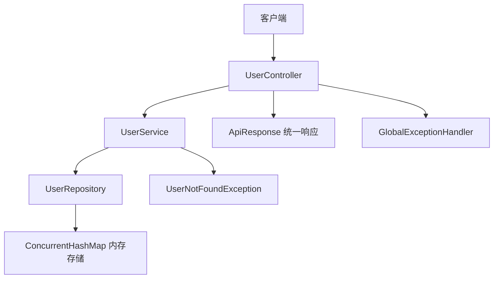
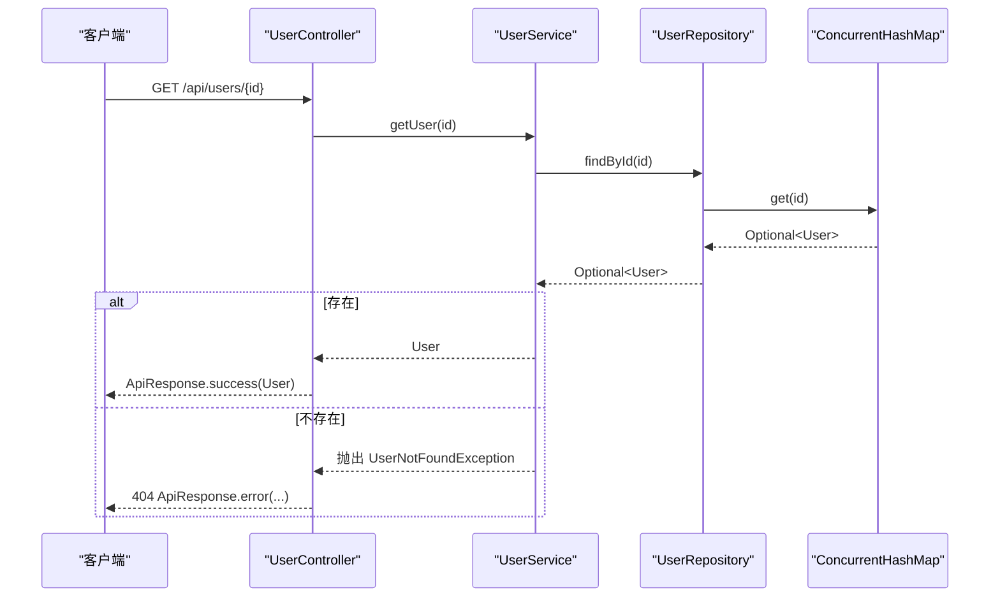
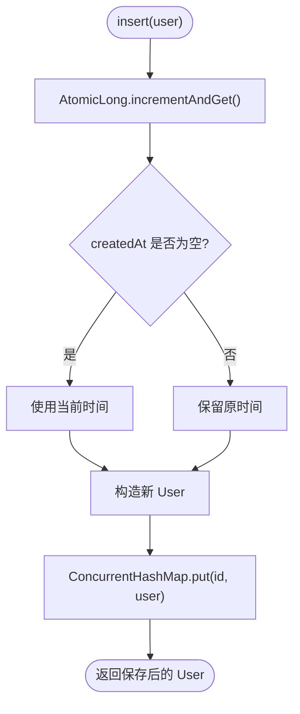
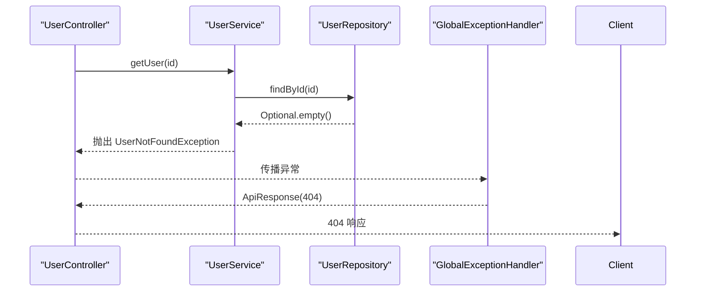
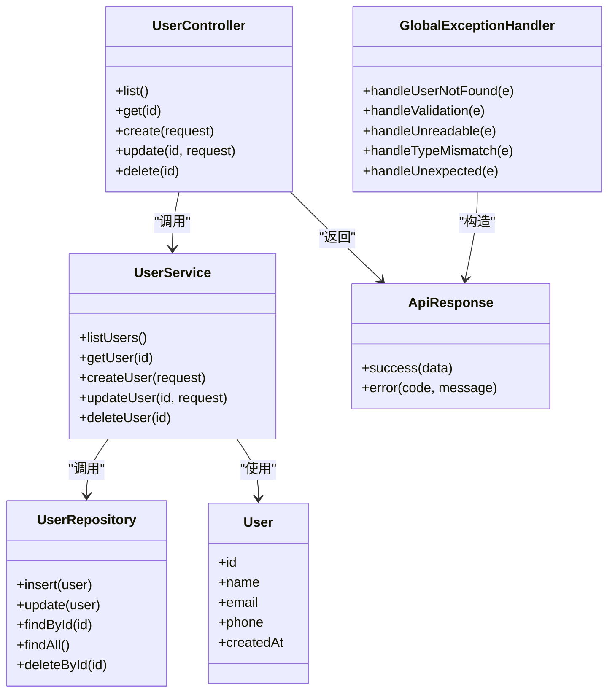

# 数据存储实现

<cite>
**本文引用的文件**
- [User.java](file://backend/src/main/java/com/aicoding/backend/model/User.java)
- [UserRepository.java](file://backend/src/main/java/com/aicoding/backend/repository/UserRepository.java)
- [UserService.java](file://backend/src/main/java/com/aicoding/backend/service/UserService.java)
- [UserController.java](file://backend/src/main/java/com/aicoding/backend/controller/UserController.java)
- [UserRequest.java](file://backend/src/main/java/com/aicoding/backend/dto/UserRequest.java)
- [ApiResponse.java](file://backend/src/main/java/com/aicoding/backend/dto/ApiResponse.java)
- [UserNotFoundException.java](file://backend/src/main/java/com/aicoding/backend/exception/UserNotFoundException.java)
- [GlobalExceptionHandler.java](file://backend/src/main/java/com/aicoding/backend/exception/GlobalExceptionHandler.java)
- [application.yml](file://backend/src/main/resources/application.yml)
- [pom.xml](file://backend/pom.xml)
</cite>

## 目录
1. [简介](#简介)
2. [项目结构](#项目结构)
3. [核心组件](#核心组件)
4. [架构总览](#架构总览)
5. [详细组件分析](#详细组件分析)
6. [依赖关系分析](#依赖关系分析)
7. [性能考虑](#性能考虑)
8. [故障排查指南](#故障排查指南)
9. [结论](#结论)
10. [附录：CRUD 示例与迁移建议](#附录crud-示例与迁移建议)

## 简介
本技术文档聚焦于后端的数据存储实现，围绕 User 实体模型、内存仓储 UserRepository、业务层 UserService 以及控制器 UserController 的协作方式展开。重点说明：
- Java Record 在实体设计中的优势与字段语义
- 基于 ConcurrentHashMap 的内存存储原理与线程安全保证
- 数据生命周期管理（创建、更新、删除）的实现细节
- 并发访问下的数据一致性与性能考量
- 从内存存储平滑迁移到持久化存储（MySQL、MongoDB）的策略
- 数据访问模式优化与缓存策略
- 完整的 CRUD 调用链与异常处理方案

## 项目结构
后端采用分层架构：
- Controller 层：暴露 REST API，负责参数校验与统一响应封装
- Service 层：编排业务流程，处理领域逻辑与异常
- Repository 层：数据访问抽象，当前为内存实现
- Model/DTO：领域模型与请求/响应数据传输对象
- Exception：全局异常处理与领域异常定义
- Config：跨域等基础配置
- 资源与构建：应用配置与依赖声明

图表来源
- [UserController.java:24-66](file://backend/src/main/java/com/aicoding/backend/controller/UserController.java#L24-L66)
- [UserService.java:15-57](file://backend/src/main/java/com/aicoding/backend/service/UserService.java#L15-L57)
- [UserRepository.java:16-55](file://backend/src/main/java/com/aicoding/backend/repository/UserRepository.java#L16-L55)
- [ApiResponse.java:6-24](file://backend/src/main/java/com/aicoding/backend/dto/ApiResponse.java#L6-L24)
- [UserNotFoundException.java:6-12](file://backend/src/main/java/com/aicoding/backend/exception/UserNotFoundException.java#L6-L12)
- [GlobalExceptionHandler.java:17-58](file://backend/src/main/java/com/aicoding/backend/exception/GlobalExceptionHandler.java#L17-L58)

章节来源
- [UserController.java:24-66](file://backend/src/main/java/com/aicoding/backend/controller/UserController.java#L24-L66)
- [application.yml:1-11](file://backend/src/main/resources/application.yml#L1-L11)
- [pom.xml:24-39](file://backend/pom.xml#L24-L39)

## 核心组件
- User 实体：使用 Java Record 定义的不可变值对象，包含 id、name、email、phone、createdAt
- UserRepository：内存版用户仓储，提供 insert/update/findById/findAll/deleteById
- UserService：业务编排，负责初始化演示数据、参数转换、异常抛出
- UserController：REST 接口，统一返回 ApiResponse
- 异常体系：UserNotFoundException + GlobalExceptionHandler 统一错误响应

章节来源
- [User.java:8-15](file://backend/src/main/java/com/aicoding/backend/model/User.java#L8-L15)
- [UserRepository.java:16-55](file://backend/src/main/java/com/aicoding/backend/repository/UserRepository.java#L16-L55)
- [UserService.java:15-57](file://backend/src/main/java/com/aicoding/backend/service/UserService.java#L15-L57)
- [UserController.java:24-66](file://backend/src/main/java/com/aicoding/backend/controller/UserController.java#L24-L66)
- [UserNotFoundException.java:6-12](file://backend/src/main/java/com/aicoding/backend/exception/UserNotFoundException.java#L6-L12)
- [GlobalExceptionHandler.java:17-58](file://backend/src/main/java/com/aicoding/backend/exception/GlobalExceptionHandler.java#L17-L58)

## 架构总览
下图展示了典型的用户查询流程，从 HTTP 请求到内存存储的完整调用链。

图表来源
- [UserController.java:40-44](file://backend/src/main/java/com/aicoding/backend/controller/UserController.java#L40-L44)
- [UserService.java:35-38](file://backend/src/main/java/com/aicoding/backend/service/UserService.java#L35-L38)
- [UserRepository.java:37-42](file://backend/src/main/java/com/aicoding/backend/repository/UserRepository.java#L37-L42)
- [GlobalExceptionHandler.java:20-25](file://backend/src/main/java/com/aicoding/backend/exception/GlobalExceptionHandler.java#L20-L25)

## 详细组件分析

### User 实体模型（Java Record）
- 使用 record 定义不可变值对象，天然具备：
  - 不可变性：字段由构造器赋值后不可修改，避免状态被意外变更
  - 自动实现 equals/hashCode/toString：简化比较与日志输出
  - 简洁语法：减少样板代码，提升可读性
- 字段业务含义：
  - id：唯一标识，主键
  - name：用户姓名
  - email：邮箱地址，用于身份识别与通知
  - phone：联系电话，可选
  - createdAt：创建时间，记录首次写入时间戳

章节来源
- [User.java:8-15](file://backend/src/main/java/com/aicoding/backend/model/User.java#L8-L15)

### UserRepository 内存存储实现
- 存储结构：
  - 使用 ConcurrentHashMap<Long, User> 作为内存数据库，key 为用户 ID
  - 使用 AtomicLong 生成自增 ID，确保并发下 ID 的唯一性
- 关键操作：
  - insert：分配新 ID，若未提供 createdAt 则使用当前时间；将新对象存入 map
  - update：按 id 覆盖旧对象
  - findById：空值保护，返回 Optional
  - findAll：过滤有效记录并按 id 排序
  - deleteById：原子删除并返回是否成功
- 线程安全与一致性：
  - ConcurrentHashMap 提供细粒度锁与无锁读，适合高并发读多写少场景
  - 所有读写均为原子操作，避免脏读
  - 注意：update 不检查存在性，调用方需保证 id 存在或自行校验
- 复杂度：
  - 单条记录的插入/查找/更新/删除平均 O(1)
  - 全量查询 O(n)，含排序开销

图表来源
- [UserRepository.java:22-29](file://backend/src/main/java/com/aicoding/backend/repository/UserRepository.java#L22-L29)

章节来源
- [UserRepository.java:16-55](file://backend/src/main/java/com/aicoding/backend/repository/UserRepository.java#L16-L55)

### UserService 业务编排
- 职责：
  - 初始化演示数据（启动时插入若干用户）
  - 将 DTO 转换为领域模型
  - 调用 Repository 完成数据访问
  - 对缺失资源抛出领域异常
- 关键点：
  - createUser：构造 User 并交由 Repository 保存
  - updateUser：先读取现有记录，再构造新对象覆盖
  - deleteUser：删除失败时抛出异常，便于上层统一处理

章节来源
- [UserService.java:15-57](file://backend/src/main/java/com/aicoding/backend/service/UserService.java#L15-L57)

### UserController REST 接口
- 路由：
  - GET /api/users：列表
  - GET /api/users/{id}：按 ID 查询
  - POST /api/users：新增
  - PUT /api/users/{id}：更新
  - DELETE /api/users/{id}：删除
- 特性：
  - 使用 @Valid 进行请求体验证
  - 统一通过 ApiResponse 包装响应
  - 删除返回 200 并携带成功消息

章节来源
- [UserController.java:24-66](file://backend/src/main/java/com/aicoding/backend/controller/UserController.java#L24-L66)
- [UserRequest.java:10-24](file://backend/src/main/java/com/aicoding/backend/dto/UserRequest.java#L10-L24)
- [ApiResponse.java:6-24](file://backend/src/main/java/com/aicoding/backend/dto/ApiResponse.java#L6-L24)

### 异常处理机制
- 领域异常：UserNotFoundException 表示资源不存在
- 全局异常处理器：
  - 捕获参数校验失败、JSON 解析失败、类型不匹配等常见错误
  - 统一返回 ApiResponse 结构与对应 HTTP 状态码
  - 兜底未知异常，防止 500 裸抛

图表来源
- [UserService.java:35-38](file://backend/src/main/java/com/aicoding/backend/service/UserService.java#L35-L38)
- [GlobalExceptionHandler.java:20-25](file://backend/src/main/java/com/aicoding/backend/exception/GlobalExceptionHandler.java#L20-L25)

章节来源
- [UserNotFoundException.java:6-12](file://backend/src/main/java/com/aicoding/backend/exception/UserNotFoundException.java#L6-L12)
- [GlobalExceptionHandler.java:17-58](file://backend/src/main/java/com/aicoding/backend/exception/GlobalExceptionHandler.java#L17-L58)

## 依赖关系分析
- 组件耦合：
  - Controller 依赖 Service，Service 依赖 Repository，符合分层解耦原则
  - 异常通过 Service 抛出，Controller 不直接感知底层实现
- 外部依赖：
  - Spring Web、Validation 提供 Web 能力与参数校验
  - 无数据库驱动，当前为纯内存实现

图表来源
- [UserController.java:24-66](file://backend/src/main/java/com/aicoding/backend/controller/UserController.java#L24-L66)
- [UserService.java:15-57](file://backend/src/main/java/com/aicoding/backend/service/UserService.java#L15-L57)
- [UserRepository.java:16-55](file://backend/src/main/java/com/aicoding/backend/repository/UserRepository.java#L16-L55)
- [User.java:8-15](file://backend/src/main/java/com/aicoding/backend/model/User.java#L8-L15)
- [ApiResponse.java:6-24](file://backend/src/main/java/com/aicoding/backend/dto/ApiResponse.java#L6-L24)
- [GlobalExceptionHandler.java:17-58](file://backend/src/main/java/com/aicoding/backend/exception/GlobalExceptionHandler.java#L17-L58)

章节来源
- [pom.xml:24-39](file://backend/pom.xml#L24-L39)

## 性能考虑
- 并发与一致性
  - ConcurrentHashMap 提供高并发读与分段写，适合热点数据频繁读取
  - 自增 ID 使用 AtomicLong，避免竞争导致重复 ID
  - 注意：update 未做存在性检查，建议在 Service 层保证前置校验
- 时间复杂度
  - 单条操作 O(1)，全量查询 O(n log n)（含排序）
- 内存占用
  - 进程重启数据丢失，仅适用于演示或小规模临时数据
- 扩展建议
  - 引入分页与过滤，降低全量查询成本
  - 对热点用户可引入本地缓存（如 Caffeine），但需注意失效策略

[本节为通用性能讨论，不直接分析具体文件]

## 故障排查指南
- 常见问题定位
  - 404 用户不存在：检查 Service 层是否抛出 UserNotFoundException，确认 Repository 是否存在该 ID
  - 400 参数校验失败：检查 UserRequest 的注解约束与入参格式
  - 400 JSON 解析失败：检查请求体是否为合法 JSON
  - 400 路径参数类型不匹配：检查 URL 中 ID 是否为数字
  - 500 服务器内部错误：查看全局异常兜底分支与日志
- 快速验证
  - 使用 curl 或 Postman 调用各端点，观察 ApiResponse 的 code 与 message
  - 结合日志级别调整，定位异常堆栈

章节来源
- [GlobalExceptionHandler.java:17-58](file://backend/src/main/java/com/aicoding/backend/exception/GlobalExceptionHandler.java#L17-L58)
- [UserNotFoundException.java:6-12](file://backend/src/main/java/com/aicoding/backend/exception/UserNotFoundException.java#L6-L12)

## 结论
本项目以轻量级内存存储实现了用户管理的完整 CRUD 能力，借助 Java Record 与 Spring 生态提供了清晰的分层与统一的异常处理。ConcurrentHashMap 与 AtomicLong 的组合保证了并发环境下的基本一致性与正确性。后续可通过替换 Repository 实现平滑迁移至 MySQL/MongoDB，并结合分页、索引与缓存进一步提升性能与可扩展性。

[本节为总结性内容，不直接分析具体文件]

## 附录：CRUD 示例与迁移建议

### 数据访问模式与缓存策略
- 读多写少场景
  - 在 Service 层增加本地缓存（如 Caffeine），设置合理过期时间与失效策略
  - 对高频查询（如按 ID 获取）优先命中缓存，未命中再查仓库
- 写多读少场景
  - 批量写入合并事务，减少 I/O 次数
  - 对全量查询改为分页+增量同步
- 一致性要求较高
  - 在 Service 层加分布式锁或乐观锁，避免并发覆盖
  - 对关键写操作加入审计日志

[本节为通用策略建议，不直接分析具体文件]

### 从内存存储迁移到持久化存储
- 目标
  - 保持对外接口不变，仅替换 Repository 实现
- 步骤
  - 定义持久化实体与映射（JPA Entity 或 MongoDB Document）
  - 新建 UserRepositoryImpl，注入 JPA Repository 或 MongoTemplate
  - 复用现有 insert/update/findById/findAll/deleteById 方法签名
  - 移除内存相关字段（ConcurrentHashMap、AtomicLong）
  - 添加数据库连接配置（application.yml）与必要索引
  - 运行集成测试，验证数据迁移与一致性
- 注意事项
  - 自增 ID 策略：数据库序列/自增列/UUID
  - 时间字段：使用数据库默认值或应用层填充
  - 事务边界：Service 层标注事务，保证写操作的原子性
  - 幂等性：更新/删除前校验存在性，避免误删

章节来源
- [application.yml:1-11](file://backend/src/main/resources/application.yml#L1-L11)
- [UserRepository.java:16-55](file://backend/src/main/java/com/aicoding/backend/repository/UserRepository.java#L16-L55)

### 完整 CRUD 调用链示例（概念性）
- 创建用户
  - 客户端发送 POST /api/users，携带 name/email/phone
  - Controller 校验并调用 Service.createUser
  - Service 构造 User 并调用 Repository.insert
  - Repository 分配 ID 并保存到内存/数据库
  - 返回 ApiResponse.success
- 查询用户
  - 客户端发送 GET /api/users/{id}
  - Service.getUser 调用 Repository.findById
  - 存在则返回，不存在抛出 UserNotFoundException
- 更新用户
  - 客户端发送 PUT /api/users/{id}
  - Service 先读取现有记录，再构造新对象并调用 Repository.update
- 删除用户
  - 客户端发送 DELETE /api/users/{id}
  - Service 调用 Repository.deleteById，失败则抛出异常

[本节为概念性流程说明，不直接分析具体文件]