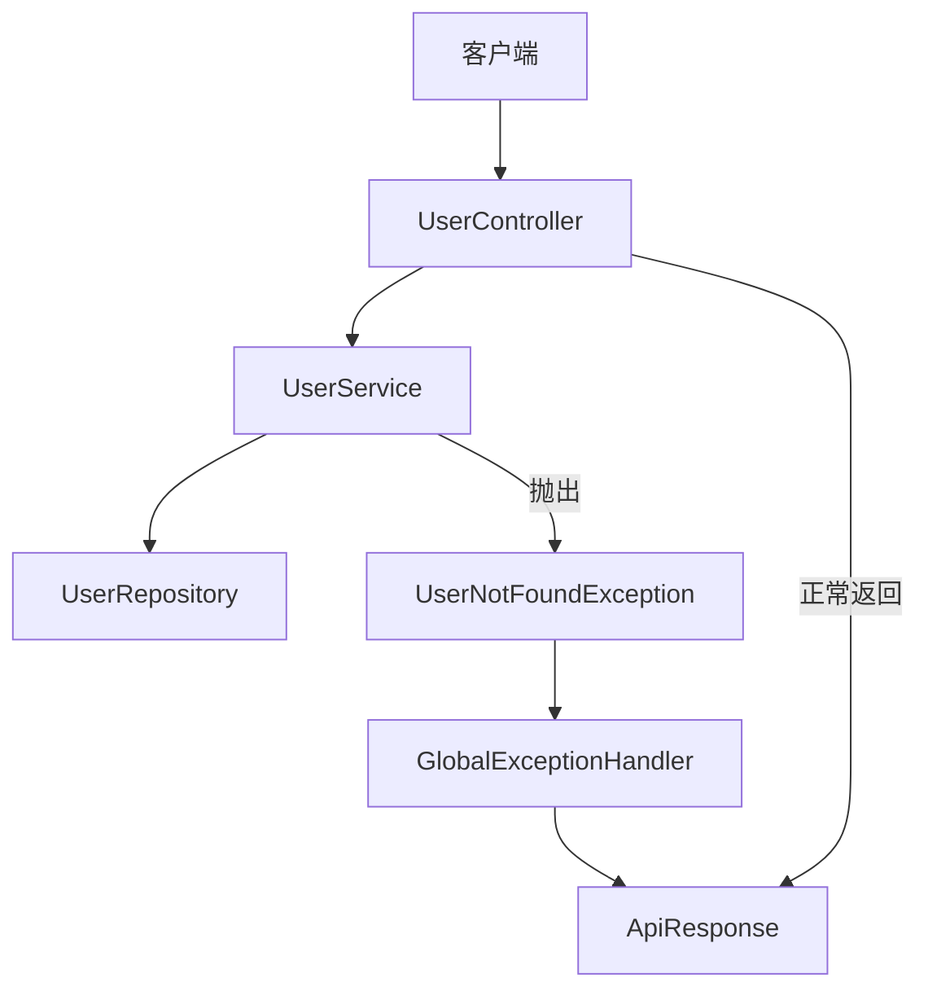
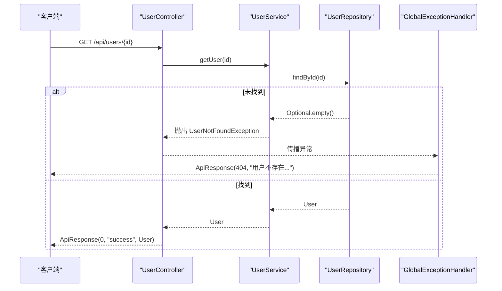
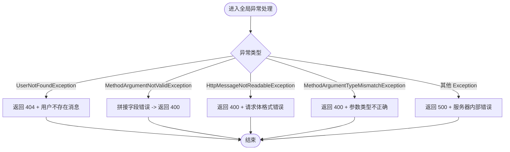
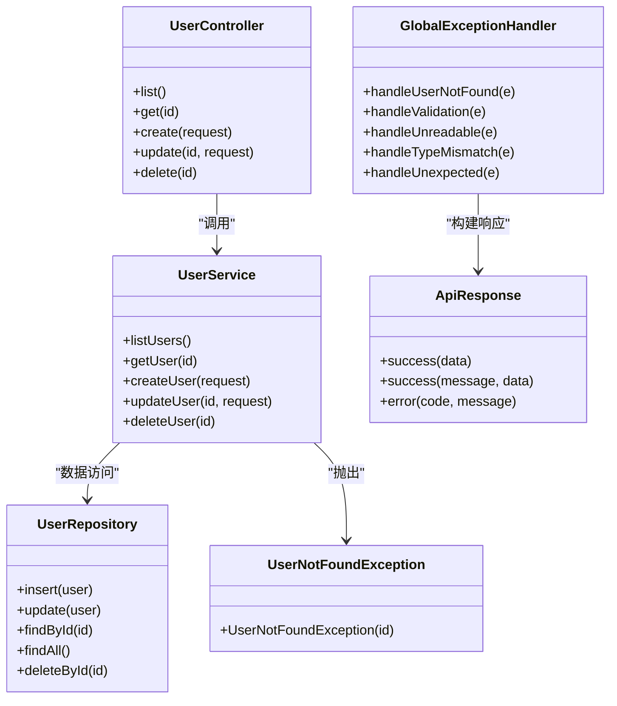
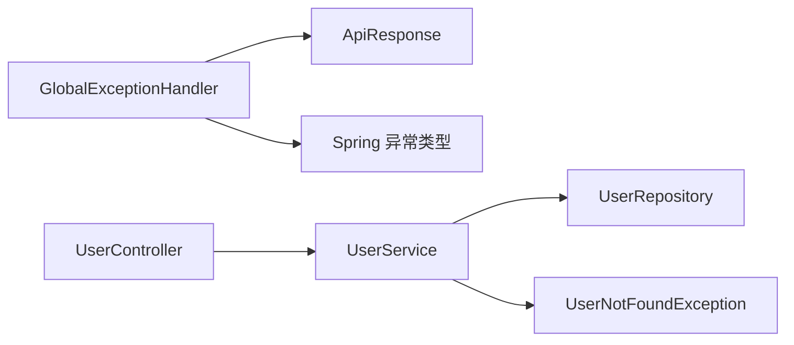

# 全局异常处理

<cite>
**本文引用的文件**
- [GlobalExceptionHandler.java](file://backend/src/main/java/com/aicoding/backend/exception/GlobalExceptionHandler.java)
- [UserNotFoundException.java](file://backend/src/main/java/com/aicoding/backend/exception/UserNotFoundException.java)
- [ApiResponse.java](file://backend/src/main/java/com/aicoding/backend/dto/ApiResponse.java)
- [UserController.java](file://backend/src/main/java/com/aicoding/backend/controller/UserController.java)
- [UserService.java](file://backend/src/main/java/com/aicoding/backend/service/UserService.java)
- [UserRequest.java](file://backend/src/main/java/com/aicoding/backend/dto/UserRequest.java)
- [UserRepository.java](file://backend/src/main/java/com/aicoding/backend/repository/UserRepository.java)
- [application.yml](file://backend/src/main/resources/application.yml)
</cite>

## 目录
1. [简介](#简介)
2. [项目结构](#项目结构)
3. [核心组件](#核心组件)
4. [架构总览](#架构总览)
5. [详细组件分析](#详细组件分析)
6. [依赖关系分析](#依赖关系分析)
7. [性能考虑](#性能考虑)
8. [故障排查指南](#故障排查指南)
9. [结论](#结论)
10. [附录](#附录)

## 简介
本技术文档围绕 Spring Boot 的全局异常处理机制展开，重点说明基于 @RestControllerAdvice 与 @ExceptionHandler 的统一异常处理设计模式。结合本项目中的 GlobalExceptionHandler、自定义异常 UserNotFoundException、统一响应体 ApiResponse，以及控制器与服务层的交互流程，系统性地阐述：
- 如何捕获并分类处理多种异常（参数校验失败、请求体解析失败、类型不匹配、业务异常等）
- 如何将异常转换为统一的错误响应格式
- 如何扩展自定义异常类型并落地最佳实践
- 如何在日志记录、错误监控与调试方面提升可观测性

## 项目结构
后端采用分层架构：
- 控制层：接收 HTTP 请求，调用服务层，返回统一响应体
- 服务层：封装业务逻辑，抛出领域异常
- 仓储层：数据访问（内存实现用于演示）
- 异常处理：全局异常处理器统一捕获并转换异常为 ApiResponse
- 配置：应用端口、日志级别等

图表来源
- [UserController.java:24-65](file://backend/src/main/java/com/aicoding/backend/controller/UserController.java#L24-L65)
- [UserService.java:15-56](file://backend/src/main/java/com/aicoding/backend/service/UserService.java#L15-L56)
- [UserRepository.java:16-54](file://backend/src/main/java/com/aicoding/backend/repository/UserRepository.java#L16-L54)
- [GlobalExceptionHandler.java:17-57](file://backend/src/main/java/com/aicoding/backend/exception/GlobalExceptionHandler.java#L17-L57)

章节来源
- [UserController.java:24-65](file://backend/src/main/java/com/aicoding/backend/controller/UserController.java#L24-L65)
- [UserService.java:15-56](file://backend/src/main/java/com/aicoding/backend/service/UserService.java#L15-L56)
- [UserRepository.java:16-54](file://backend/src/main/java/com/aicoding/backend/repository/UserRepository.java#L16-L54)
- [GlobalExceptionHandler.java:17-57](file://backend/src/main/java/com/aicoding/backend/exception/GlobalExceptionHandler.java#L17-L57)

## 核心组件
- 全局异常处理器：使用 @RestControllerAdvice 集中处理各类异常，并通过 @ExceptionHandler 映射到具体处理方法，将异常转为 ApiResponse
- 统一响应体：ApiResponse 提供 success/error 静态方法，统一 code/message/data 三字段结构
- 自定义异常：UserNotFoundException 表示用户不存在，便于在业务层明确表达领域语义
- 控制器与服务层：控制器负责入参校验与返回统一响应；服务层负责业务规则与抛出领域异常

章节来源
- [GlobalExceptionHandler.java:17-57](file://backend/src/main/java/com/aicoding/backend/exception/GlobalExceptionHandler.java#L17-L57)
- [ApiResponse.java:6-23](file://backend/src/main/java/com/aicoding/backend/dto/ApiResponse.java#L6-L23)
- [UserNotFoundException.java:6-11](file://backend/src/main/java/com/aicoding/backend/exception/UserNotFoundException.java#L6-L11)
- [UserController.java:24-65](file://backend/src/main/java/com/aicoding/backend/controller/UserController.java#L24-L65)
- [UserService.java:15-56](file://backend/src/main/java/com/aicoding/backend/service/UserService.java#L15-L56)

## 架构总览
Spring MVC 在处理请求时，若发生异常且未被控制器内局部处理，会交由全局异常处理器拦截。本项目通过 @RestControllerAdvice 注册多个 @ExceptionHandler，分别处理：
- 用户不存在：UserNotFoundException
- 参数校验失败：MethodArgumentNotValidException
- 请求体缺失或 JSON 解析失败：HttpMessageNotReadableException
- 路径参数类型不匹配：MethodArgumentTypeMismatchException
- 兜底未知异常：Exception

所有异常最终都转换为 ApiResponse 返回给客户端，保证接口响应结构一致。

图表来源
- [UserController.java:40-44](file://backend/src/main/java/com/aicoding/backend/controller/UserController.java#L40-L44)
- [UserService.java:35-38](file://backend/src/main/java/com/aicoding/backend/service/UserService.java#L35-L38)
- [UserNotFoundException.java:6-11](file://backend/src/main/java/com/aicoding/backend/exception/UserNotFoundException.java#L6-L11)
- [GlobalExceptionHandler.java:20-25](file://backend/src/main/java/com/aicoding/backend/exception/GlobalExceptionHandler.java#L20-L25)

## 详细组件分析

### 全局异常处理器 GlobalExceptionHandler
职责与策略
- 使用 @RestControllerAdvice 声明全局异常处理
- 针对不同类型的异常定义独立的 @ExceptionHandler 方法，并设置合适的 HTTP 状态码
- 将异常信息封装为 ApiResponse，确保前端/调用方以统一方式消费错误

关键处理点
- 用户不存在：返回 404，消息来自异常内容
- 参数校验失败：收集字段级错误，拼接为可读消息，返回 400
- 请求体解析失败：返回 400，提示“请求体格式错误”
- 路径参数类型不匹配：返回 400，提示“参数类型不正确”及参数名
- 兜底异常：返回 500，包含异常消息

图表来源
- [GlobalExceptionHandler.java:20-56](file://backend/src/main/java/com/aicoding/backend/exception/GlobalExceptionHandler.java#L20-L56)

章节来源
- [GlobalExceptionHandler.java:17-57](file://backend/src/main/java/com/aicoding/backend/exception/GlobalExceptionHandler.java#L17-L57)

### 自定义异常 UserNotFoundException
- 继承 RuntimeException，属于非受检异常，适合在业务层直接抛出
- 构造时携带用户 ID，便于错误定位与日志记录
- 在服务层中根据业务条件抛出，例如查询不到用户或删除失败时

使用场景
- 按 ID 查询用户不存在
- 删除用户时目标记录不存在

章节来源
- [UserNotFoundException.java:6-11](file://backend/src/main/java/com/aicoding/backend/exception/UserNotFoundException.java#L6-L11)
- [UserService.java:35-38](file://backend/src/main/java/com/aicoding/backend/service/UserService.java#L35-L38)
- [UserService.java:51-54](file://backend/src/main/java/com/aicoding/backend/service/UserService.java#L51-L54)

### 统一响应体 ApiResponse
- 使用 record 定义不可变数据结构，包含 code、message、data
- 提供 success()/success(message,data)/error(code,message) 静态工厂方法
- 在控制器成功路径与服务层返回处复用，保证前后端契约一致

在异常处理中的应用
- 所有异常分支均返回 ApiResponse.error(...)，使错误响应结构与成功响应保持一致
- 前端可通过 code 判断成功与否，通过 message 获取人类可读的错误提示

章节来源
- [ApiResponse.java:6-23](file://backend/src/main/java/com/aicoding/backend/dto/ApiResponse.java#L6-L23)
- [UserController.java:34-64](file://backend/src/main/java/com/aicoding/backend/controller/UserController.java#L34-L64)
- [GlobalExceptionHandler.java:20-56](file://backend/src/main/java/com/aicoding/backend/exception/GlobalExceptionHandler.java#L20-L56)

### 控制器与服务层协作
- 控制器使用 @Valid 对请求体进行校验，校验失败由全局异常处理器统一处理
- 控制器仅关注路由与响应包装，业务逻辑下沉至服务层
- 服务层负责业务规则与领域异常抛出，保持控制器简洁

图表来源
- [UserController.java:24-65](file://backend/src/main/java/com/aicoding/backend/controller/UserController.java#L24-L65)
- [UserService.java:15-56](file://backend/src/main/java/com/aicoding/backend/service/UserService.java#L15-L56)
- [UserRepository.java:16-54](file://backend/src/main/java/com/aicoding/backend/repository/UserRepository.java#L16-L54)
- [GlobalExceptionHandler.java:17-57](file://backend/src/main/java/com/aicoding/backend/exception/GlobalExceptionHandler.java#L17-L57)
- [ApiResponse.java:6-23](file://backend/src/main/java/com/aicoding/backend/dto/ApiResponse.java#L6-L23)
- [UserNotFoundException.java:6-11](file://backend/src/main/java/com/aicoding/backend/exception/UserNotFoundException.java#L6-L11)

章节来源
- [UserController.java:24-65](file://backend/src/main/java/com/aicoding/backend/controller/UserController.java#L24-L65)
- [UserService.java:15-56](file://backend/src/main/java/com/aicoding/backend/service/UserService.java#L15-L56)
- [UserRepository.java:16-54](file://backend/src/main/java/com/aicoding/backend/repository/UserRepository.java#L16-L54)

## 依赖关系分析
- GlobalExceptionHandler 依赖 ApiResponse 构建统一响应
- GlobalExceptionHandler 依赖 Spring 提供的异常类型进行精确匹配
- UserService 依赖 UserRepository 进行数据访问，并在业务条件不满足时抛出 UserNotFoundException
- UserController 依赖 UserService 完成业务编排，并使用 @Valid 触发参数校验异常

图表来源
- [GlobalExceptionHandler.java:17-57](file://backend/src/main/java/com/aicoding/backend/exception/GlobalExceptionHandler.java#L17-L57)
- [ApiResponse.java:6-23](file://backend/src/main/java/com/aicoding/backend/dto/ApiResponse.java#L6-L23)
- [UserService.java:15-56](file://backend/src/main/java/com/aicoding/backend/service/UserService.java#L15-L56)
- [UserRepository.java:16-54](file://backend/src/main/java/com/aicoding/backend/repository/UserRepository.java#L16-L54)
- [UserController.java:24-65](file://backend/src/main/java/com/aicoding/backend/controller/UserController.java#L24-L65)

章节来源
- [GlobalExceptionHandler.java:17-57](file://backend/src/main/java/com/aicoding/backend/exception/GlobalExceptionHandler.java#L17-L57)
- [UserService.java:15-56](file://backend/src/main/java/com/aicoding/backend/service/UserService.java#L15-L56)
- [UserController.java:24-65](file://backend/src/main/java/com/aicoding/backend/controller/UserController.java#L24-L65)

## 性能考虑
- 全局异常处理仅在异常发生时执行，正常路径无额外开销
- 参数校验失败时的错误信息拼接使用流式操作，数据量较小时性能影响可忽略
- 建议在生产环境中避免在异常处理中执行耗时 I/O 或复杂计算，保持响应快速
- 对于高频异常，建议在上层（网关/负载均衡）做限流与熔断，减少异常风暴对后端的压力

[本节为通用指导，不涉及具体文件分析]

## 故障排查指南
常见问题与定位思路
- 404 用户不存在：检查服务层是否抛出 UserNotFoundException，确认传入 ID 是否存在
- 400 参数校验失败：查看请求体是否符合 UserRequest 的约束（必填、邮箱格式、长度限制），并核对字段错误拼接结果
- 400 请求体格式错误：确认 Content-Type 与 JSON 结构正确
- 400 参数类型不匹配：检查路径参数类型是否与控制器方法签名一致
- 500 服务器内部错误：查看异常堆栈，定位具体原因

日志与监控建议
- 在 application.yml 中调整日志级别，便于观察异常堆栈与关键流程
- 建议在 GlobalExceptionHandler 的每个异常处理方法中加入结构化日志（如包含请求路径、参数、异常类名、堆栈摘要）
- 接入错误监控平台（如 Sentry、Prometheus + Alertmanager）采集异常指标与告警
- 对高优异常（如 5xx）建立告警通道，缩短故障发现与恢复时间

章节来源
- [application.yml:8-11](file://backend/src/main/resources/application.yml#L8-L11)
- [GlobalExceptionHandler.java:20-56](file://backend/src/main/java/com/aicoding/backend/exception/GlobalExceptionHandler.java#L20-L56)
- [UserRequest.java:10-23](file://backend/src/main/java/com/aicoding/backend/dto/UserRequest.java#L10-L23)

## 结论
本项目通过 @RestControllerAdvice 与 @ExceptionHandler 实现了清晰、可扩展的全局异常处理机制。配合统一响应体 ApiResponse 与领域异常 UserNotFoundException，既保证了接口契约的一致性，又提升了可维护性与可观测性。建议在生产环境中进一步完善日志记录、错误监控与告警体系，持续优化异常处理的性能与用户体验。

[本节为总结性内容，不涉及具体文件分析]

## 附录

### 扩展自定义异常类型的指南与最佳实践
- 新增业务异常类：继承 RuntimeException，携带必要上下文（如资源 ID、业务键）
- 在全局异常处理器中添加对应的 @ExceptionHandler，设置合适的 HTTP 状态码与友好消息
- 在服务层抛出新的业务异常，保持控制器简洁
- 在统一响应体中复用 error(code,message) 方法，确保前端一致性
- 为常见异常定义稳定的错误码，便于前端与监控侧识别与统计

章节来源
- [UserNotFoundException.java:6-11](file://backend/src/main/java/com/aicoding/backend/exception/UserNotFoundException.java#L6-L11)
- [GlobalExceptionHandler.java:20-56](file://backend/src/main/java/com/aicoding/backend/exception/GlobalExceptionHandler.java#L20-L56)
- [ApiResponse.java:20-22](file://backend/src/main/java/com/aicoding/backend/dto/ApiResponse.java#L20-L22)

### 统一错误响应格式规范
- code：整数，0 表示成功，非 0 表示失败
- message：字符串，面向用户的错误描述
- data：泛型，成功时为业务数据，失败时为 null

章节来源
- [ApiResponse.java:6-23](file://backend/src/main/java/com/aicoding/backend/dto/ApiResponse.java#L6-L23)