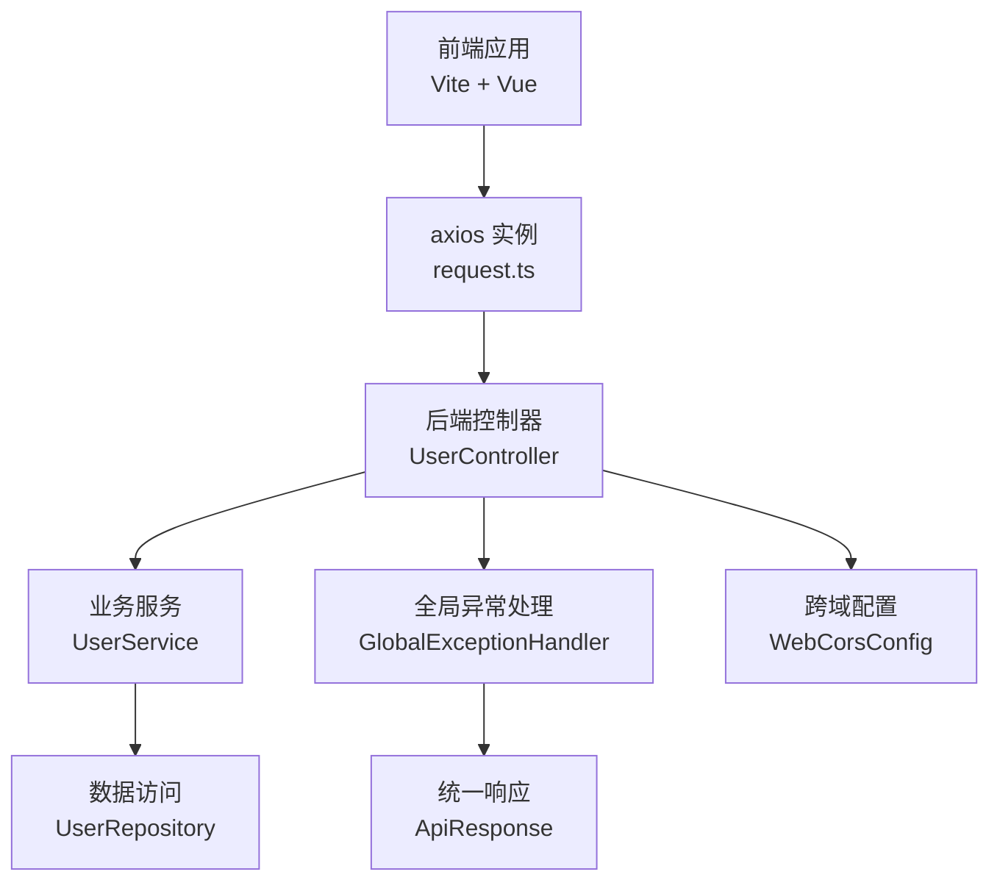
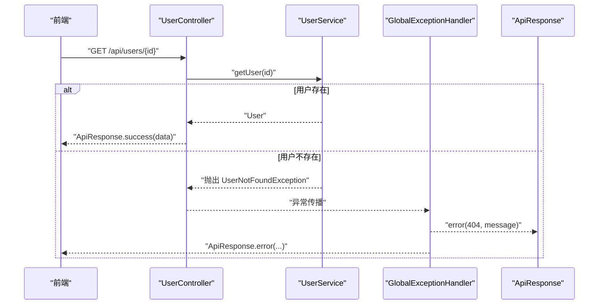
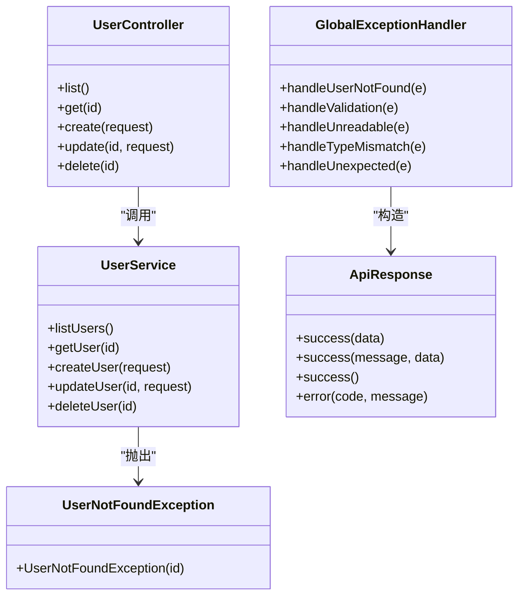

# 横切关注点

<cite>
**本文引用的文件**
- [WebCorsConfig.java](file://backend/src/main/java/com/aicoding/backend/config/WebCorsConfig.java)
- [GlobalExceptionHandler.java](file://backend/src/main/java/com/aicoding/backend/exception/GlobalExceptionHandler.java)
- [ApiResponse.java](file://backend/src/main/java/com/aicoding/backend/dto/ApiResponse.java)
- [UserNotFoundException.java](file://backend/src/main/java/com/aicoding/backend/exception/UserNotFoundException.java)
- [UserController.java](file://backend/src/main/java/com/aicoding/backend/controller/UserController.java)
- [UserService.java](file://backend/src/main/java/com/aicoding/backend/service/UserService.java)
- [UserRequest.java](file://backend/src/main/java/com/aicoding/backend/dto/UserRequest.java)
- [application.yml](file://backend/src/main/resources/application.yml)
- [request.ts](file://frontend/src/api/request.ts)
</cite>

## 目录
1. [简介](#简介)
2. [项目结构](#项目结构)
3. [核心组件](#核心组件)
4. [架构总览](#架构总览)
5. [详细组件分析](#详细组件分析)
6. [依赖关系分析](#依赖关系分析)
7. [性能与安全考量](#性能与安全考量)
8. [故障排查指南](#故障排查指南)
9. [结论](#结论)
10. [附录](#附录)

## 简介
本技术文档聚焦于横切关注点在项目中的实现与最佳实践，涵盖跨域（CORS）配置、全局异常处理、统一响应结构等。通过解耦业务逻辑与横切关注点，提升系统的可维护性、一致性与安全性。同时提供扩展自定义异常、日志记录、性能监控等常见横切需求的方案建议。

## 项目结构
后端采用分层架构：控制器负责HTTP接口，服务层封装业务逻辑，数据访问层操作数据库；横切关注点以配置类与全局处理器形式存在，不侵入业务代码。前端通过统一的请求封装与拦截器，配合后端的统一响应结构进行错误提示与数据处理。

图表来源
- [WebCorsConfig.java:1-24](file://backend/src/main/java/com/aicoding/backend/config/WebCorsConfig.java#L1-L24)
- [GlobalExceptionHandler.java:1-58](file://backend/src/main/java/com/aicoding/backend/exception/GlobalExceptionHandler.java#L1-L58)
- [ApiResponse.java:1-24](file://backend/src/main/java/com/aicoding/backend/dto/ApiResponse.java#L1-L24)
- [UserController.java:1-66](file://backend/src/main/java/com/aicoding/backend/controller/UserController.java#L1-L66)
- [UserService.java:1-57](file://backend/src/main/java/com/aicoding/backend/service/UserService.java#L1-L57)
- [request.ts:1-26](file://frontend/src/api/request.ts#L1-L26)

章节来源
- [application.yml:1-11](file://backend/src/main/resources/application.yml#L1-L11)

## 核心组件
- 跨域配置 WebCorsConfig：为本地开发环境的前端服务器开放指定路径的跨域访问，限制允许的源、方法与头部，并启用凭据与缓存时间。
- 全局异常处理 GlobalExceptionHandler：集中捕获各类异常，转换为统一 ApiResponse 格式，保证前后端交互一致性。
- 统一响应 ApiResponse：定义 code/message/data 三字段结构，提供 success/error 静态工厂方法，简化控制器返回。
- 自定义异常 UserNotFoundException：表达“用户不存在”的业务语义，便于在异常处理中精准映射到 HTTP 状态码与错误消息。

章节来源
- [WebCorsConfig.java:1-24](file://backend/src/main/java/com/aicoding/backend/config/WebCorsConfig.java#L1-L24)
- [GlobalExceptionHandler.java:1-58](file://backend/src/main/java/com/aicoding/backend/exception/GlobalExceptionHandler.java#L1-L58)
- [ApiResponse.java:1-24](file://backend/src/main/java/com/aicoding/backend/dto/ApiResponse.java#L1-L24)
- [UserNotFoundException.java:1-12](file://backend/src/main/java/com/aicoding/backend/exception/UserNotFoundException.java#L1-L12)

## 架构总览
横切关注点通过以下机制与业务解耦：
- CORS 作为 WebMvcConfigurer 配置，仅影响请求进入控制器的网络层策略，不改变业务逻辑。
- 全局异常处理使用 @RestControllerAdvice，拦截控制器抛出的异常，统一封装为 ApiResponse，避免在每个控制器重复处理错误。
- 统一响应 ApiResponse 被控制器与服务层共同消费，确保成功与失败场景的结构一致。

图表来源
- [UserController.java:34-44](file://backend/src/main/java/com/aicoding/backend/controller/UserController.java#L34-L44)
- [UserService.java:35-38](file://backend/src/main/java/com/aicoding/backend/service/UserService.java#L35-L38)
- [GlobalExceptionHandler.java:20-25](file://backend/src/main/java/com/aicoding/backend/exception/GlobalExceptionHandler.java#L20-L25)
- [ApiResponse.java:8-22](file://backend/src/main/java/com/aicoding/backend/dto/ApiResponse.java#L8-L22)

## 详细组件分析

### 跨域配置（WebCorsConfig）
- 设计目标：允许本地前端开发服务器（Vite 默认端口）访问后端 /api/** 接口，支持常用HTTP方法与携带凭据的请求。
- 关键要点：
  - allowedOriginPatterns：限定可信来源，避免开放所有域带来的安全风险。
  - allowedMethods：显式声明允许的方法，减少攻击面。
  - allowCredentials：开启凭据时，需严格限制来源，防止凭证泄露。
  - maxAge：设置预检请求缓存时间，减少浏览器预检次数，提升性能。
- 安全考虑：
  - 生产环境应基于环境变量或配置中心动态配置允许的来源，避免硬编码。
  - 结合CSRF防护、HTTPS、内容安全策略等综合安全措施。
- 性能优化：
  - 合理设置 maxAge，降低 OPTIONS 预检请求频率。
  - 对静态资源与API分别配置跨域策略，减少不必要的检查。

章节来源
- [WebCorsConfig.java:1-24](file://backend/src/main/java/com/aicoding/backend/config/WebCorsConfig.java#L1-L24)

### 全局异常处理（GlobalExceptionHandler）
- 设计模式：AOP 风格的集中式异常拦截，使用 @RestControllerAdvice 将异常处理从控制器中剥离。
- 处理范围：
  - 业务异常：如 UserNotFoundException，映射到 404 并返回统一错误结构。
  - 参数校验异常：MethodArgumentNotValidException，聚合字段错误信息。
  - 解析异常：HttpMessageNotReadableException，提示请求体格式错误。
  - 类型不匹配：MethodArgumentTypeMismatchException，提示参数类型问题。
  - 兜底异常：Exception，捕获未知错误并返回 500。
- 统一响应：所有异常均封装为 ApiResponse，便于前端统一处理与展示。
- 扩展建议：
  - 引入业务异常基类，按领域划分异常层次。
  - 增加国际化消息支持，便于多语言错误提示。
  - 结合审计日志记录异常上下文（请求ID、参数、堆栈摘要）。

章节来源
- [GlobalExceptionHandler.java:1-58](file://backend/src/main/java/com/aicoding/backend/exception/GlobalExceptionHandler.java#L1-L58)
- [UserNotFoundException.java:1-12](file://backend/src/main/java/com/aicoding/backend/exception/UserNotFoundException.java#L1-L12)
- [ApiResponse.java:8-22](file://backend/src/main/java/com/aicoding/backend/dto/ApiResponse.java#L8-L22)

### 统一响应结构（ApiResponse）
- 设计理念：code=message=data 的三段式结构，code=0 表示成功，非0表示失败；message 描述结果；data 承载业务数据。
- 使用方式：
  - 控制器直接返回 ApiResponse.success(...) 或 ApiResponse.error(...)。
  - 全局异常处理将异常转为 ApiResponse.error(...)，保持前后端契约一致。
- 优势：
  - 简化前端判断逻辑，统一错误提示与成功处理。
  - 便于网关或中间件进行统一鉴权、限流、审计。
- 扩展建议：
  - 增加 requestId 字段用于链路追踪。
  - 增加分页元数据（total、page、size）用于列表接口。
  - 针对敏感信息脱敏，避免在 message 中暴露内部细节。

章节来源
- [ApiResponse.java:1-24](file://backend/src/main/java/com/aicoding/backend/dto/ApiResponse.java#L1-L24)
- [UserController.java:34-64](file://backend/src/main/java/com/aicoding/backend/controller/UserController.java#L34-L64)

### 自定义异常与业务解耦
- 自定义异常 UserNotFoundException：表达明确的业务语义，便于在 Service 层抛出并在 Controller 层由全局异常处理器捕获。
- 解耦方式：
  - Service 层只关注业务规则与数据一致性，遇到异常即抛出。
  - Controller 层只做参数绑定与调用 Service，不处理具体错误逻辑。
  - GlobalExceptionHandler 负责将异常映射为 HTTP 状态码与统一响应。
- 最佳实践：
  - 异常命名体现业务含义，构造函数携带必要上下文（如 ID）。
  - 避免在异常中携带大量敏感信息。
  - 结合日志记录异常堆栈与请求上下文，便于定位问题。

章节来源
- [UserService.java:35-38](file://backend/src/main/java/com/aicoding/backend/service/UserService.java#L35-L38)
- [UserNotFoundException.java:1-12](file://backend/src/main/java/com/aicoding/backend/exception/UserNotFoundException.java#L1-L12)
- [GlobalExceptionHandler.java:20-25](file://backend/src/main/java/com/aicoding/backend/exception/GlobalExceptionHandler.java#L20-L25)

### 前端统一请求与错误处理
- request.ts 使用 axios.create 创建实例，统一 baseURL 与超时时间。
- 响应拦截器统一提取 response.data，并在错误时读取后端返回的 message 进行提示。
- 与后端 ApiResponse 的协作：前端期望后端返回 {code, message, data} 结构，错误时显示 message。

章节来源
- [request.ts:1-26](file://frontend/src/api/request.ts#L1-L26)
- [ApiResponse.java:1-24](file://backend/src/main/java/com/aicoding/backend/dto/ApiResponse.java#L1-L24)

## 依赖关系分析
- 控制器依赖服务层，服务层依赖数据访问层；异常与响应结构贯穿各层。
- 全局异常处理器依赖统一响应结构，确保错误输出一致。
- CORS 配置作用于 Web 层，不影响业务逻辑。

图表来源
- [UserController.java:1-66](file://backend/src/main/java/com/aicoding/backend/controller/UserController.java#L1-L66)
- [UserService.java:1-57](file://backend/src/main/java/com/aicoding/backend/service/UserService.java#L1-L57)
- [GlobalExceptionHandler.java:1-58](file://backend/src/main/java/com/aicoding/backend/exception/GlobalExceptionHandler.java#L1-L58)
- [ApiResponse.java:1-24](file://backend/src/main/java/com/aicoding/backend/dto/ApiResponse.java#L1-L24)
- [UserNotFoundException.java:1-12](file://backend/src/main/java/com/aicoding/backend/exception/UserNotFoundException.java#L1-L12)

章节来源
- [UserController.java:1-66](file://backend/src/main/java/com/aicoding/backend/controller/UserController.java#L1-L66)
- [UserService.java:1-57](file://backend/src/main/java/com/aicoding/backend/service/UserService.java#L1-L57)
- [GlobalExceptionHandler.java:1-58](file://backend/src/main/java/com/aicoding/backend/exception/GlobalExceptionHandler.java#L1-L58)

## 性能与安全考量
- 性能
  - CORS 预检缓存：通过 maxAge 减少 OPTIONS 请求，提高首屏与频繁请求性能。
  - 统一响应：减少前端分支判断，降低渲染开销。
  - 异常快速失败：尽早抛出异常并返回错误，避免无效计算。
- 安全
  - CORS 白名单：仅允许可信来源，避免任意域名访问。
  - 凭据传输：启用 allowCredentials 时需严格限制来源，并结合 HTTPS。
  - 输入校验：使用 Bean Validation 注解约束请求参数，防止注入与越权。
  - 异常信息：避免在错误消息中暴露内部实现细节或敏感数据。

[本节为通用指导，无需特定文件引用]

## 故障排查指南
- 常见问题
  - 跨域失败：检查 allowedOriginPatterns 是否包含前端实际地址；确认请求是否携带 Cookie 且 allowCredentials=true。
  - 参数校验失败：查看 MethodArgumentNotValidException 聚合的错误信息，定位字段与消息。
  - JSON 解析失败：检查请求体是否为合法 JSON，Content-Type 是否正确。
  - 类型不匹配：核对路径参数或查询参数类型是否与控制器签名一致。
- 定位步骤
  - 查看后端日志级别与输出，确认异常堆栈。
  - 使用浏览器开发者工具检查请求头与响应体。
  - 在前端拦截器中打印错误对象，确认 message 来源。

章节来源
- [GlobalExceptionHandler.java:27-56](file://backend/src/main/java/com/aicoding/backend/exception/GlobalExceptionHandler.java#L27-L56)
- [application.yml:8-11](file://backend/src/main/resources/application.yml#L8-L11)
- [request.ts:13-23](file://frontend/src/api/request.ts#L13-L23)

## 结论
本项目通过 WebCorsConfig、GlobalExceptionHandler 与 ApiResponse 实现了横切关注点的标准化与解耦。CORS 保障跨域访问的安全与可控，全局异常处理确保错误的一致性与可观测性，统一响应结构简化前后端协作。在此基础上，可通过 AOP/拦截器进一步扩展日志、监控、鉴权等横切需求，持续提升系统质量。

[本节为总结性内容，无需特定文件引用]

## 附录

### 自定义异常扩展方法
- 定义业务异常基类：统一错误码与消息格式，便于全局处理。
- 继承 RuntimeException：便于在 Service 层抛出并被全局异常处理器捕获。
- 携带上下文：如资源ID、操作类型，便于日志与审计。
- 示例参考：UserNotFoundException 的设计思路。

章节来源
- [UserNotFoundException.java:1-12](file://backend/src/main/java/com/aicoding/backend/exception/UserNotFoundException.java#L1-L12)

### 日志记录与性能监控建议
- 日志
  - 在 Service 层记录关键操作日志（开始、结束、耗时）。
  - 在异常处理中记录请求上下文（URI、参数、用户ID），但避免敏感信息。
  - 调整 application.yml 中日志级别，区分开发与生产环境。
- 监控
  - 引入指标采集（如请求耗时、错误率），对接监控系统。
  - 对热点接口添加慢查询告警。
  - 结合分布式链路追踪（TraceId）提升问题定位效率。

章节来源
- [application.yml:8-11](file://backend/src/main/resources/application.yml#L8-L11)

### 与业务逻辑的解耦说明
- 控制器仅做参数绑定与调用服务，不处理错误与跨域。
- 服务层专注业务规则与数据一致性，遇到异常即抛出。
- 横切关注点（CORS、异常、响应）集中在配置与处理器中，便于统一维护与测试。

章节来源
- [UserController.java:34-64](file://backend/src/main/java/com/aicoding/backend/controller/UserController.java#L34-L64)
- [UserService.java:31-55](file://backend/src/main/java/com/aicoding/backend/service/UserService.java#L31-L55)
- [GlobalExceptionHandler.java:20-56](file://backend/src/main/java/com/aicoding/backend/exception/GlobalExceptionHandler.java#L20-L56)