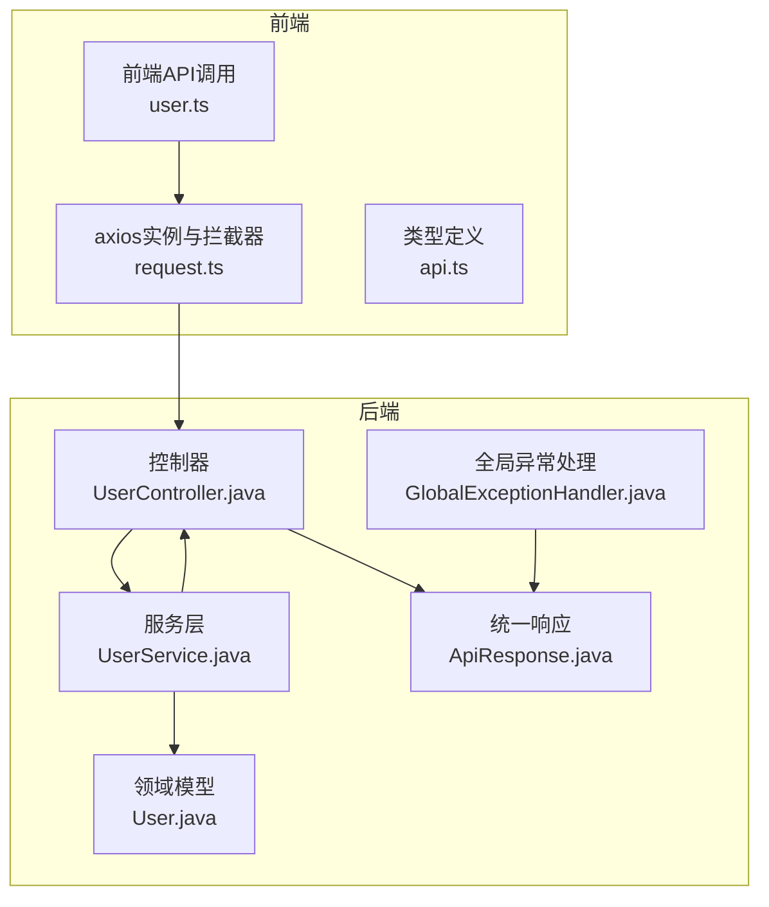
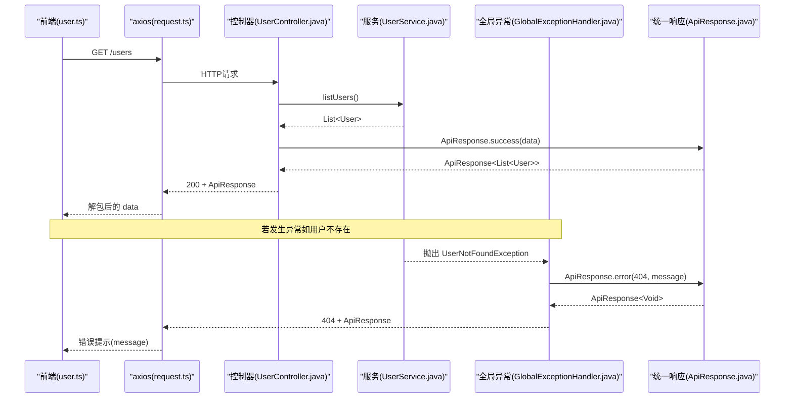
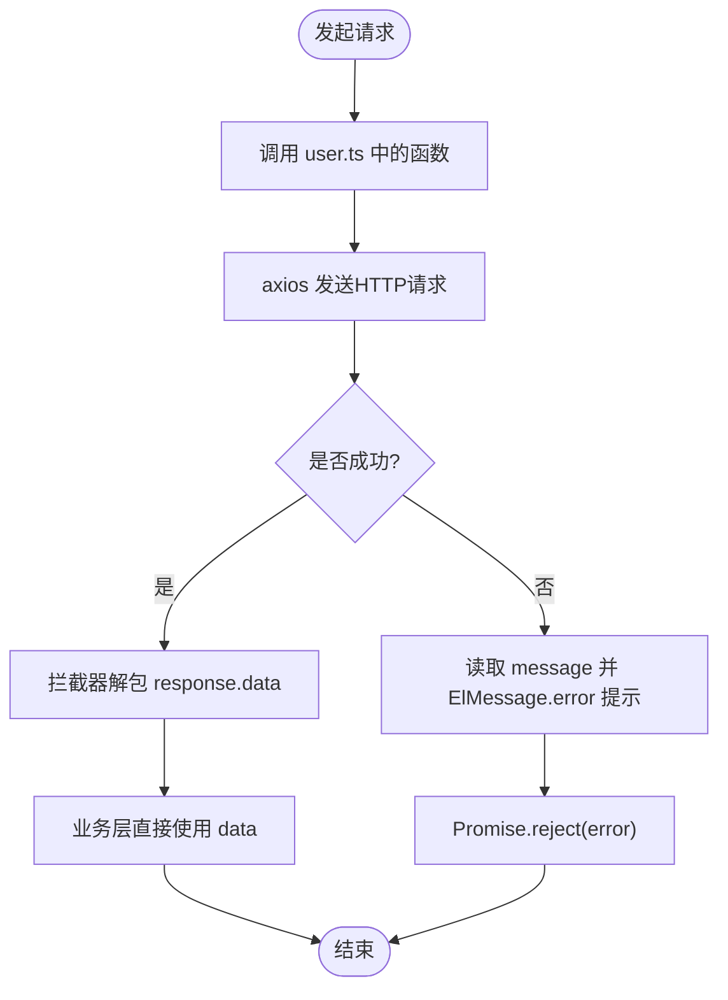
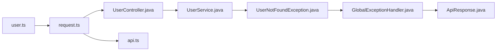

# 统一响应格式

<cite>
**本文引用的文件**
- [ApiResponse.java](file://backend/src/main/java/com/aicoding/backend/dto/ApiResponse.java)
- [api.ts](file://frontend/src/types/api.ts)
- [UserController.java](file://backend/src/main/java/com/aicoding/backend/controller/UserController.java)
- [GlobalExceptionHandler.java](file://backend/src/main/java/com/aicoding/backend/exception/GlobalExceptionHandler.java)
- [request.ts](file://frontend/src/api/request.ts)
- [user.ts](file://frontend/src/api/user.ts)
- [User.java](file://backend/src/main/java/com/aicoding/backend/model/User.java)
- [UserService.java](file://backend/src/main/java/com/aicoding/backend/service/UserService.java)
- [UserNotFoundException.java](file://backend/src/main/java/com/aicoding/backend/exception/UserNotFoundException.java)
</cite>

## 目录
1. [简介](#简介)
2. [项目结构](#项目结构)
3. [核心组件](#核心组件)
4. [架构总览](#架构总览)
5. [详细组件分析](#详细组件分析)
6. [依赖关系分析](#依赖关系分析)
7. [性能考虑](#性能考虑)
8. [故障排查指南](#故障排查指南)
9. [结论](#结论)
10. [附录](#附录)

## 简介
本技术文档围绕后端统一响应结构 ApiResponse 的设计与使用，系统阐述其设计理念、架构价值以及在前后端协作中的最佳实践。重点包括：
- 为什么需要统一的响应格式以及带来的收益
- code 状态码的含义与分类、message 消息提示设计原则、data 数据载荷的类型安全
- 成功、失败、分页等场景下的使用方式与规范
- 前端对接 TypeScript 类型定义与错误处理流程
- 版本管理与向后兼容性策略

## 项目结构
本项目采用前后端分离架构：
- 后端基于 Spring Boot，提供 RESTful API，统一通过 ApiResponse 封装响应体
- 前端基于 Vue + TypeScript，使用 axios 发起请求，并通过全局拦截器统一处理响应与错误提示
- 异常由全局处理器统一捕获并转换为 ApiResponse，保证接口返回结构一致

图表来源
- [UserController.java:24-65](file://backend/src/main/java/com/aicoding/backend/controller/UserController.java#L24-L65)
- [GlobalExceptionHandler.java:17-56](file://backend/src/main/java/com/aicoding/backend/exception/GlobalExceptionHandler.java#L17-L56)
- [ApiResponse.java:6-22](file://backend/src/main/java/com/aicoding/backend/dto/ApiResponse.java#L6-L22)
- [request.ts:8-23](file://frontend/src/api/request.ts#L8-L23)
- [api.ts:2-6](file://frontend/src/types/api.ts#L2-L6)

章节来源
- [UserController.java:24-65](file://backend/src/main/java/com/aicoding/backend/controller/UserController.java#L24-L65)
- [GlobalExceptionHandler.java:17-56](file://backend/src/main/java/com/aicoding/backend/exception/GlobalExceptionHandler.java#L17-L56)
- [ApiResponse.java:6-22](file://backend/src/main/java/com/aicoding/backend/dto/ApiResponse.java#L6-L22)
- [request.ts:8-23](file://frontend/src/api/request.ts#L8-L23)
- [api.ts:2-6](file://frontend/src/types/api.ts#L2-L6)

## 核心组件
- 统一响应结构 ApiResponse：以 record 形式定义，包含 code、message、data 三个字段，并提供 success/error 静态工厂方法，简化构造
- 全局异常处理 GlobalExceptionHandler：将业务异常、参数校验异常、JSON解析异常、类型不匹配异常等统一转为 ApiResponse
- 前端类型 api.ts：定义与后端一致的 ApiResponse<T> 泛型接口，确保类型安全
- 前端请求封装 request.ts：配置 baseURL、超时，并在响应拦截器中统一提取 data 和错误提示
- 控制器 UserController：所有接口均返回 ApiResponse<T>，体现统一响应风格

章节来源
- [ApiResponse.java:6-22](file://backend/src/main/java/com/aicoding/backend/dto/ApiResponse.java#L6-L22)
- [GlobalExceptionHandler.java:17-56](file://backend/src/main/java/com/aicoding/backend/exception/GlobalExceptionHandler.java#L17-L56)
- [api.ts:2-6](file://frontend/src/types/api.ts#L2-L6)
- [request.ts:8-23](file://frontend/src/api/request.ts#L8-L23)
- [UserController.java:34-64](file://backend/src/main/java/com/aicoding/backend/controller/UserController.java#L34-L64)

## 架构总览
统一响应格式贯穿“控制器—服务—异常—响应”的完整链路：
- 正常路径：控制器调用服务获取数据，包装为 ApiResponse.success(...) 返回
- 异常路径：服务抛出业务异常，被全局异常处理器捕获，转换为 ApiResponse.error(...) 返回
- 前端：axios 响应拦截器自动解包 response.data，并将 message 统一弹窗提示；业务侧仅关注 data

图表来源
- [UserController.java:34-64](file://backend/src/main/java/com/aicoding/backend/controller/UserController.java#L34-L64)
- [UserService.java:31-38](file://backend/src/main/java/com/aicoding/backend/service/UserService.java#L31-L38)
- [GlobalExceptionHandler.java:20-25](file://backend/src/main/java/com/aicoding/backend/exception/GlobalExceptionHandler.java#L20-L25)
- [ApiResponse.java:8-22](file://backend/src/main/java/com/aicoding/backend/dto/ApiResponse.java#L8-L22)
- [request.ts:13-23](file://frontend/src/api/request.ts#L13-L23)

## 详细组件分析

### ApiResponse 设计与类型安全
- 设计理念
  - 单一入口：所有接口返回同一结构，降低前后端契约复杂度
  - 明确语义：code=0 表示成功，非0表示失败；message 用于提示；data 承载业务数据
  - 工厂方法：success()/error() 减少样板代码，提升可读性
- 字段说明
  - code：整数状态码。当前实现约定 0 为成功，其他为非零失败码（例如 400、404、500）
  - message：字符串提示信息，面向用户或调试信息
  - data：泛型 T，承载具体业务数据；成功时可为 null（如删除操作）
- 类型安全
  - 后端使用 Java record 与泛型，编译期约束数据结构
  - 前端使用 TypeScript 接口 ApiResponse<T>，与后端保持一致，避免运行时类型错误

章节来源
- [ApiResponse.java:6-22](file://backend/src/main/java/com/aicoding/backend/dto/ApiResponse.java#L6-L22)
- [api.ts:2-6](file://frontend/src/types/api.ts#L2-L6)

### 状态码(code)含义与分类
- 成功：code = 0
- 客户端错误：code = 400（参数校验失败、请求体格式错误、参数类型不匹配）
- 资源未找到：code = 404（用户不存在）
- 服务器错误：code = 500（未知异常兜底）
- 建议扩展
  - 可引入枚举集中管理状态码，便于维护与国际化
  - 对常见业务错误定义细分码段（如 1xxx 业务码），与 HTTP 状态码解耦

章节来源
- [GlobalExceptionHandler.java:20-56](file://backend/src/main/java/com/aicoding/backend/exception/GlobalExceptionHandler.java#L20-L56)
- [ApiResponse.java:8-22](file://backend/src/main/java/com/aicoding/backend/dto/ApiResponse.java#L8-L22)

### 消息(message)设计原则
- 可读性：面向用户的友好提示，避免暴露内部堆栈
- 一致性：同类型错误保持提示风格一致
- 可定位：必要时附带关键上下文（如字段名、ID）
- 多语言：后续可通过 key 映射到 i18n 文案

章节来源
- [GlobalExceptionHandler.java:28-49](file://backend/src/main/java/com/aicoding/backend/exception/GlobalExceptionHandler.java#L28-L49)

### 数据载荷(data)的类型安全
- 后端：使用泛型 T 承载任意类型，结合 Jackson 序列化
- 前端：使用 ApiResponse<T> 泛型，配合 TS 类型推断，获得强类型体验
- 空值处理：成功时可返回 null（如删除操作），前端需做空判断

章节来源
- [UserController.java:46-64](file://backend/src/main/java/com/aicoding/backend/controller/UserController.java#L46-L64)
- [api.ts:2-6](file://frontend/src/types/api.ts#L2-L6)

### 不同业务场景的最佳实践
- 成功响应
  - 无数据：使用 success()
  - 有数据：使用 success(data) 或 success("自定义消息", data)
- 失败响应
  - 业务异常：抛出领域异常，由全局处理器转为 error(code, message)
  - 参数校验：MethodArgumentNotValidException 聚合字段错误信息
- 分页响应
  - 建议在 data 中返回分页对象，包含列表、总数、页码等信息
  - 前端根据 page/pageSize/total 计算分页控件状态
  - 注意：当前仓库未实现分页，可按此模式扩展

章节来源
- [UserController.java:34-64](file://backend/src/main/java/com/aicoding/backend/controller/UserController.java#L34-L64)
- [GlobalExceptionHandler.java:27-49](file://backend/src/main/java/com/aicoding/backend/exception/GlobalExceptionHandler.java#L27-L49)

### 前端对接指南
- 类型定义
  - 使用 ApiResponse<T> 作为接口返回值类型，确保类型安全
- 请求封装
  - axios 实例统一 baseURL 与超时
  - 响应拦截器自动解包 response.data，错误时统一弹出 message
- 调用示例
  - 列表查询、详情查询、新增、更新、删除均返回 ApiResponse<T>
  - 业务逻辑直接消费 data，无需重复判断 code

图表来源
- [request.ts:8-23](file://frontend/src/api/request.ts#L8-L23)
- [user.ts:6-28](file://frontend/src/api/user.ts#L6-L28)
- [api.ts:2-6](file://frontend/src/types/api.ts#L2-L6)

章节来源
- [request.ts:8-23](file://frontend/src/api/request.ts#L8-L23)
- [user.ts:6-28](file://frontend/src/api/user.ts#L6-L28)
- [api.ts:2-6](file://frontend/src/types/api.ts#L2-L6)

### 版本管理与向后兼容
- 现状
  - 当前 ApiResponse 结构稳定，字段简单且语义清晰
- 演进策略
  - 新增字段：优先在 data 内扩展，避免破坏现有结构
  - 变更字段：通过版本号控制（如 URL 前缀 /api/v1），旧版本继续保留
  - 废弃字段：标记弃用并给出迁移指引，保留一段时间再移除
  - 状态码：引入业务码段与枚举，避免随意修改数字含义
- 兼容性测试
  - 针对旧版前端进行回归测试，确保升级不影响既有功能

[本节为通用指导，不直接分析具体文件]

## 依赖关系分析
- 控制器依赖服务层，服务层可能抛出业务异常
- 全局异常处理器捕获异常并返回 ApiResponse
- 前端通过 axios 拦截器统一处理响应与错误
- 类型定义在前端与后端保持一致，保障端到端类型安全

图表来源
- [user.ts:6-28](file://frontend/src/api/user.ts#L6-L28)
- [request.ts:8-23](file://frontend/src/api/request.ts#L8-L23)
- [UserController.java:34-64](file://backend/src/main/java/com/aicoding/backend/controller/UserController.java#L34-L64)
- [UserService.java:31-38](file://backend/src/main/java/com/aicoding/backend/service/UserService.java#L31-L38)
- [UserNotFoundException.java:6-10](file://backend/src/main/java/com/aicoding/backend/exception/UserNotFoundException.java#L6-L10)
- [GlobalExceptionHandler.java:20-56](file://backend/src/main/java/com/aicoding/backend/exception/GlobalExceptionHandler.java#L20-L56)
- [ApiResponse.java:6-22](file://backend/src/main/java/com/aicoding/backend/dto/ApiResponse.java#L6-L22)
- [api.ts:2-6](file://frontend/src/types/api.ts#L2-L6)

章节来源
- [user.ts:6-28](file://frontend/src/api/user.ts#L6-L28)
- [request.ts:8-23](file://frontend/src/api/request.ts#L8-L23)
- [UserController.java:34-64](file://backend/src/main/java/com/aicoding/backend/controller/UserController.java#L34-L64)
- [UserService.java:31-38](file://backend/src/main/java/com/aicoding/backend/service/UserService.java#L31-L38)
- [UserNotFoundException.java:6-10](file://backend/src/main/java/com/aicoding/backend/exception/UserNotFoundException.java#L6-L10)
- [GlobalExceptionHandler.java:20-56](file://backend/src/main/java/com/aicoding/backend/exception/GlobalExceptionHandler.java#L20-L56)
- [ApiResponse.java:6-22](file://backend/src/main/java/com/aicoding/backend/dto/ApiResponse.java#L6-L22)
- [api.ts:2-6](file://frontend/src/types/api.ts#L2-L6)

## 性能考虑
- 统一响应结构本身开销极小，主要成本在网络传输与序列化
- 建议
  - 合理分页与字段裁剪，避免返回冗余数据
  - 对大对象启用压缩（gzip/br）
  - 缓存热点数据，减少数据库压力
  - 前端按需渲染，避免一次性加载过多数据

[本节为通用指导，不直接分析具体文件]

## 故障排查指南
- 常见问题
  - 参数校验失败：检查请求体结构与注解，查看 message 中的字段错误
  - JSON 解析失败：确认 Content-Type 与请求体格式正确
  - 路径参数类型不匹配：确保 ID 等参数类型与后端一致
  - 资源不存在：检查 ID 是否存在于存储层
- 定位步骤
  - 观察前端 ElMessage 提示的 message
  - 查看后端日志与异常堆栈
  - 核对 HTTP 状态码与 ApiResponse.code 的一致性

章节来源
- [GlobalExceptionHandler.java:27-56](file://backend/src/main/java/com/aicoding/backend/exception/GlobalExceptionHandler.java#L27-L56)
- [request.ts:13-23](file://frontend/src/api/request.ts#L13-L23)

## 结论
通过统一的 ApiResponse 结构，项目在前后端协作中实现了：
- 接口契约清晰、易于理解与维护
- 错误处理集中化，提升用户体验与可观测性
- 类型安全贯穿全链路，降低运行时错误概率
建议在此基础上逐步完善分页、状态码枚举、i18n 与版本管理，进一步提升系统的可扩展性与稳定性。

[本节为总结性内容，不直接分析具体文件]

## 附录
- 典型调用路径参考
  - 列表查询：GET /api/users → ApiResponse<List<User>>
  - 详情查询：GET /api/users/{id} → ApiResponse<User>
  - 新增用户：POST /api/users → ApiResponse<User>
  - 更新用户：PUT /api/users/{id} → ApiResponse<User>
  - 删除用户：DELETE /api/users/{id} → ApiResponse<Void>

章节来源
- [UserController.java:34-64](file://backend/src/main/java/com/aicoding/backend/controller/UserController.java#L34-L64)
- [user.ts:6-28](file://frontend/src/api/user.ts#L6-L28)