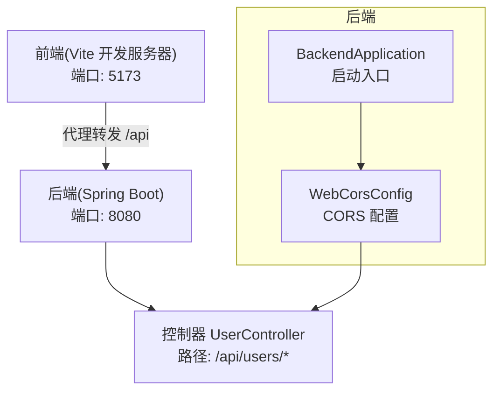
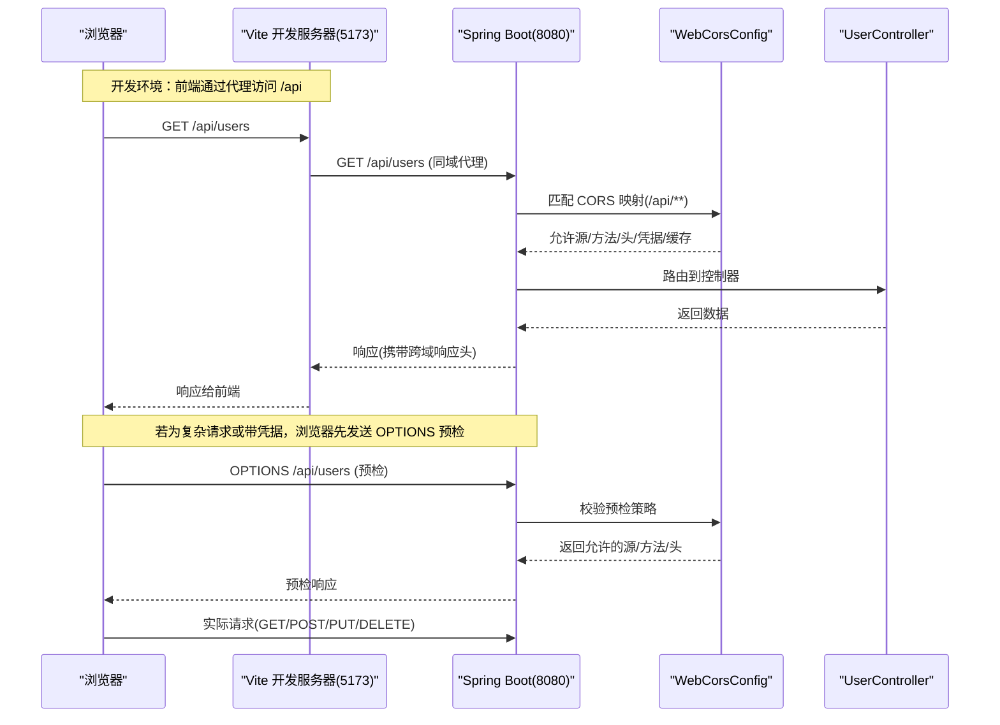
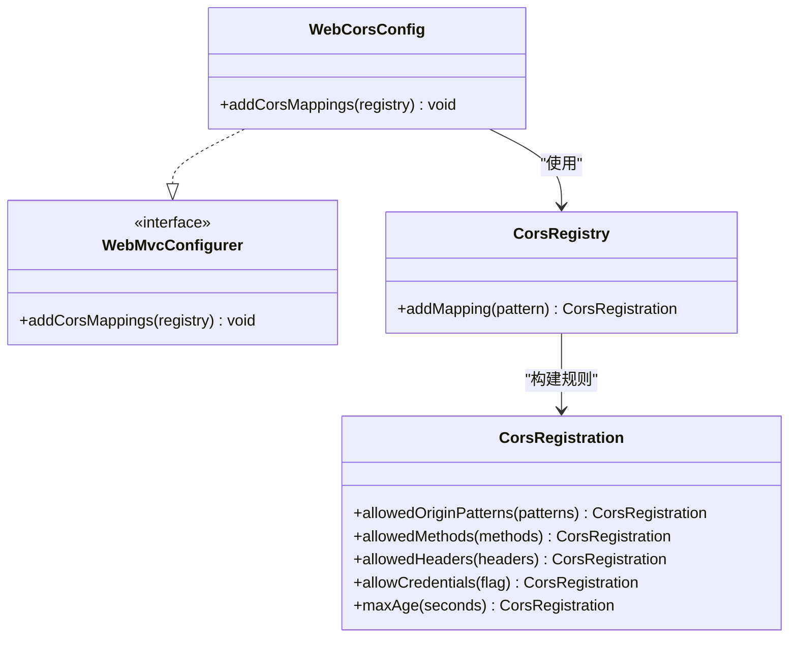
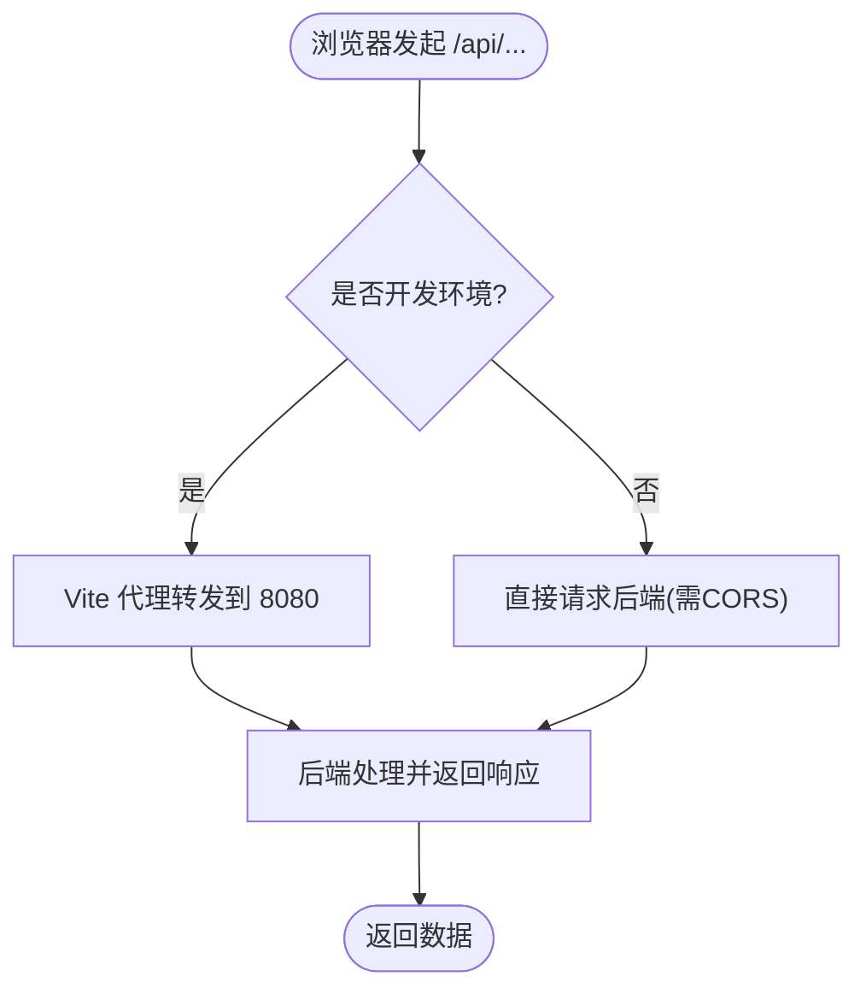
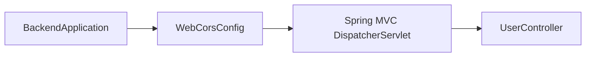

# 跨域配置

<cite>
**本文引用的文件**
- [WebCorsConfig.java](file://backend/src/main/java/com/aicoding/backend/config/WebCorsConfig.java)
- [application.yml](file://backend/src/main/resources/application.yml)
- [vite.config.ts](file://frontend/vite.config.ts)
- [UserController.java](file://backend/src/main/java/com/aicoding/backend/controller/UserController.java)
- [BackendApplication.java](file://backend/src/main/java/com/aicoding/backend/BackendApplication.java)
- [request.ts](file://frontend/src/api/request.ts)
</cite>

## 目录
1. [简介](#简介)
2. [项目结构](#项目结构)
3. [核心组件](#核心组件)
4. [架构总览](#架构总览)
5. [详细组件分析](#详细组件分析)
6. [依赖关系分析](#依赖关系分析)
7. [性能考虑](#性能考虑)
8. [故障排查指南](#故障排查指南)
9. [结论](#结论)
10. [附录](#附录)

## 简介
本技术文档围绕跨域资源共享（CORS）在 Spring Boot 后端的实现与最佳实践展开，重点解析 WebCorsConfig 类的实现机制、各配置项的安全含义与适用场景，并结合前端开发代理方案，给出开发与生产环境的差异化配置建议。同时提供常见跨域问题的定位方法与解决方案，帮助读者在生产环境中安全、稳定地启用跨域访问。

## 项目结构
后端采用 Spring Boot 应用，通过 @Configuration 类集中管理 MVC 层面的 CORS 策略；前端使用 Vite 开发服务器，并在开发环境通过代理将 /api 请求转发到后端，从而避免浏览器同源策略限制。

图表来源
- [vite.config.ts:14-22](file://frontend/vite.config.ts#L14-L22)
- [application.yml:1-2](file://backend/src/main/resources/application.yml#L1-L2)
- [WebCorsConfig.java:11-22](file://backend/src/main/java/com/aicoding/backend/config/WebCorsConfig.java#L11-L22)
- [UserController.java:24-26](file://backend/src/main/java/com/aicoding/backend/controller/UserController.java#L24-L26)
- [BackendApplication.java:9-14](file://backend/src/main/java/com/aicoding/backend/BackendApplication.java#L9-L14)

章节来源
- [application.yml:1-11](file://backend/src/main/resources/application.yml#L1-L11)
- [vite.config.ts:1-25](file://frontend/vite.config.ts#L1-L25)
- [WebCorsConfig.java:1-24](file://backend/src/main/java/com/aicoding/backend/config/WebCorsConfig.java#L1-L24)
- [UserController.java:1-66](file://backend/src/main/java/com/aicoding/backend/controller/UserController.java#L1-L66)
- [BackendApplication.java:1-16](file://backend/src/main/java/com/aicoding/backend/BackendApplication.java#L1-L16)

## 核心组件
- WebCorsConfig：基于 Spring MVC 的 CORS 配置类，实现 WebMvcConfigurer 接口并重写 addCorsMappings，定义跨域白名单、方法、头、凭据与预检缓存等策略。
- BackendApplication：Spring Boot 应用启动类，加载配置并启动服务。
- UserController：REST 控制器，暴露 /api/users 相关接口，作为跨域策略的作用目标。
- Vite 开发代理：在开发环境下将 /api 请求代理至后端，规避浏览器同源策略。

章节来源
- [WebCorsConfig.java:11-22](file://backend/src/main/java/com/aicoding/backend/config/WebCorsConfig.java#L11-L22)
- [BackendApplication.java:9-14](file://backend/src/main/java/com/aicoding/backend/BackendApplication.java#L9-L14)
- [UserController.java:24-64](file://backend/src/main/java/com/aicoding/backend/controller/UserController.java#L24-L64)
- [vite.config.ts:14-22](file://frontend/vite.config.ts#L14-L22)

## 架构总览
下图展示了从浏览器发起跨域请求到后端处理的完整流程，包括预检请求（OPTIONS）与实际请求的处理路径。

图表来源
- [WebCorsConfig.java:14-22](file://backend/src/main/java/com/aicoding/backend/config/WebCorsConfig.java#L14-L22)
- [UserController.java:34-64](file://backend/src/main/java/com/aicoding/backend/controller/UserController.java#L34-L64)
- [vite.config.ts:14-22](file://frontend/vite.config.ts#L14-L22)

## 详细组件分析

### WebCorsConfig 跨域配置详解
- 注解与作用
  - @Configuration：声明该类为配置类，由 Spring 容器加载并生效。
  - implements WebMvcConfigurer：通过重写 addCorsMappings 注册全局或路径级的 CORS 规则。
- 映射范围
  - addMapping("/api/**")：仅对以 /api 开头的路径启用 CORS 策略，缩小影响面，提升安全性。
- 关键配置项
  - allowedOriginPatterns：精确限定可接受的前端来源（如本地开发服务器的 localhost 与 127.0.0.1 的 5173 端口）。相比通配符，模式匹配更安全，避免误放行任意来源。
  - allowedMethods：显式允许 GET、POST、PUT、DELETE、OPTIONS，覆盖常用 REST 方法与预检请求。
  - allowedHeaders：允许所有请求头，便于灵活传递自定义头；生产环境建议收敛为最小必要集合。
  - allowCredentials：允许携带凭据（Cookie、Authorization 等），需与受信任的来源配合使用，防止凭据泄露。
  - maxAge：预检请求缓存时间（秒），减少重复预检开销，提高性能。
- 安全要点
  - 严格限制 allowedOriginPatterns，禁止使用 * 与敏感凭据组合。
  - 仅在必要时允许全部请求头，生产环境应最小化 allowedHeaders。
  - 结合业务鉴权与输入校验，确保即使跨域可用也不被滥用。

图表来源
- [WebCorsConfig.java:11-22](file://backend/src/main/java/com/aicoding/backend/config/WebCorsConfig.java#L11-L22)

章节来源
- [WebCorsConfig.java:1-24](file://backend/src/main/java/com/aicoding/backend/config/WebCorsConfig.java#L1-L24)

### 前端开发代理与跨域规避
- Vite 开发服务器将 /api 请求代理到 http://localhost:8080，并设置 changeOrigin，使浏览器认为请求来自同一源，从而绕过同源策略限制。
- 该方式适用于开发阶段，生产环境通常不依赖代理，而应通过服务端 CORS 或网关层统一处理。

图表来源
- [vite.config.ts:14-22](file://frontend/vite.config.ts#L14-L22)

章节来源
- [vite.config.ts:1-25](file://frontend/vite.config.ts#L1-L25)

### 控制器与接口
- UserController 暴露 /api/users 的 CRUD 接口，作为 CORS 策略作用的目标路径。
- 这些接口在开发环境通过 Vite 代理访问，在生产环境则依赖后端 CORS 配置或网关策略。

章节来源
- [UserController.java:24-64](file://backend/src/main/java/com/aicoding/backend/controller/UserController.java#L24-L64)

## 依赖关系分析
- 启动顺序
  - BackendApplication 启动 Spring 容器，加载 @Configuration 配置类。
  - WebCorsConfig 在 MVC 初始化时注册 CORS 规则，作用于匹配的 URL 路径。
- 调用链
  - 浏览器请求 -> Vite 代理(开发)或直接 -> Spring MVC -> WebCorsConfig 校验 -> 控制器处理 -> 返回响应。

图表来源
- [BackendApplication.java:9-14](file://backend/src/main/java/com/aicoding/backend/BackendApplication.java#L9-L14)
- [WebCorsConfig.java:11-22](file://backend/src/main/java/com/aicoding/backend/config/WebCorsConfig.java#L11-L22)
- [UserController.java:24-64](file://backend/src/main/java/com/aicoding/backend/controller/UserController.java#L24-L64)

章节来源
- [BackendApplication.java:1-16](file://backend/src/main/java/com/aicoding/backend/BackendApplication.java#L1-L16)
- [WebCorsConfig.java:1-24](file://backend/src/main/java/com/aicoding/backend/config/WebCorsConfig.java#L1-L24)
- [UserController.java:1-66](file://backend/src/main/java/com/aicoding/backend/controller/UserController.java#L1-L66)

## 性能考虑
- 预检缓存
  - 合理设置 maxAge 可减少浏览器重复发送 OPTIONS 预检请求，降低网络与服务器开销。
- 最小化允许范围
  - 精确的 allowedOriginPatterns 与 allowedHeaders 能减少不必要的校验与响应头计算。
- 代理与直连
  - 开发环境使用代理可降低调试成本；生产环境直连需权衡 CORS 带来的额外响应头与预检次数。

[本节为通用指导，无需特定文件引用]

## 故障排查指南
- 现象：浏览器控制台报“跨域错误”或“Access to XMLHttpRequest blocked by CORS policy”
  - 检查 allowedOriginPatterns 是否包含当前前端来源（协议+主机+端口）。
  - 确认请求是否为简单请求；复杂请求会触发预检，需确保 allowedMethods 与 allowedHeaders 满足要求。
  - 若启用 allowCredentials，确保 allowedOriginPatterns 不使用通配符，且来源完全匹配。
- 现象：开发环境正常，生产环境失败
  - 开发环境可能通过 Vite 代理规避了跨域；生产环境需正确配置 CORS 或通过网关/Nginx 统一处理。
  - 核对生产域名与 allowedOriginPatterns 是否一致。
- 现象：携带 Cookie 或 Authorization 失败
  - 检查 allowCredentials 是否开启，以及来源是否受限为具体域名而非通配符。
  - 确认前端请求已设置 withCredentials（或 axios 实例中启用凭据）。
- 现象：自定义请求头未生效
  - 确认 allowedHeaders 包含所需自定义头；生产环境建议明确列出而非使用通配符。
- 现象：OPTIONS 预检频繁
  - 调整 maxAge 增大预检缓存时间；优化前端请求以减少重复预检。

章节来源
- [WebCorsConfig.java:14-22](file://backend/src/main/java/com/aicoding/backend/config/WebCorsConfig.java#L14-L22)
- [vite.config.ts:14-22](file://frontend/vite.config.ts#L14-L22)

## 结论
- WebCorsConfig 通过精确的 origin 白名单、方法、头与凭据控制，实现了安全的跨域访问策略。
- 开发环境借助 Vite 代理简化调试；生产环境应严格限制来源并最小化权限。
- 通过合理的 maxAge 与最小化配置，可在保证安全的前提下提升性能。
- 遇到跨域问题时，优先检查来源匹配、预检策略与凭据设置，再逐步定位到网关或反向代理层。

[本节为总结性内容，无需特定文件引用]

## 附录

### 同源策略与跨域必要性
- 同源策略限制：浏览器默认阻止不同源（协议、主机、端口任一不同）之间的资源读取，保护用户数据安全。
- 跨域请求必要性：前后端分离架构下，前端与后端常部署在不同域名或端口，需要 CORS 机制协商允许跨域访问。

[本节为概念说明，无需特定文件引用]

### 环境与最佳实践
- 开发环境
  - 使用 Vite 代理将 /api 转发到后端，避免浏览器跨域限制，提升调试效率。
  - 保持 allowedOriginPatterns 仅包含本地开发地址，避免误放行。
- 生产环境
  - 严格限定 allowedOriginPatterns 为真实前端域名，禁用通配符。
  - 最小化 allowedHeaders，仅放行业务必需的请求头。
  - 谨慎启用 allowCredentials，确保来源可信并与业务鉴权配合。
  - 可结合网关/Nginx 统一处理跨域，集中策略与审计。

[本节为通用指导，无需特定文件引用]

### 常见问题速查
- 为什么预检请求失败？
  - 检查 allowedMethods 是否包含 OPTIONS，allowedHeaders 是否包含必要头。
- 为什么带 Cookie 的请求失败？
  - 确认 allowCredentials 为 true，且 allowedOriginPatterns 不为通配符。
- 为什么自定义头无效？
  - 确认 allowedHeaders 包含该头；生产环境建议显式列出。

[本节为通用指导，无需特定文件引用]