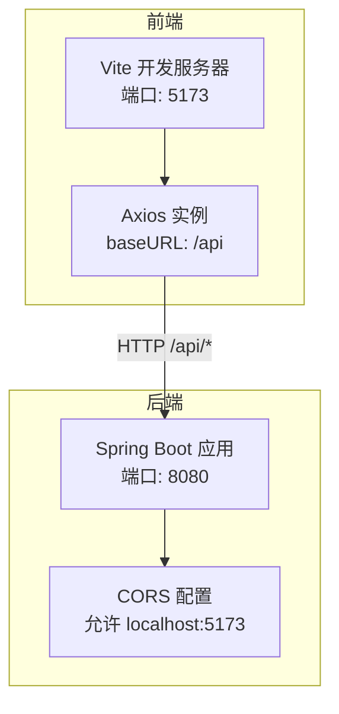
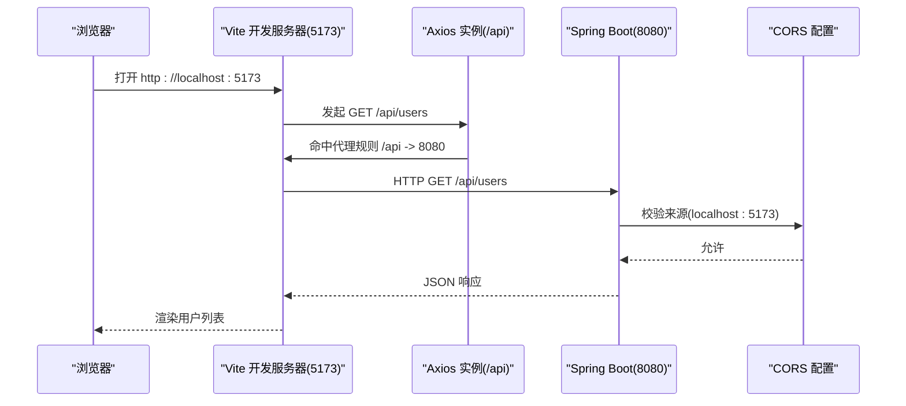
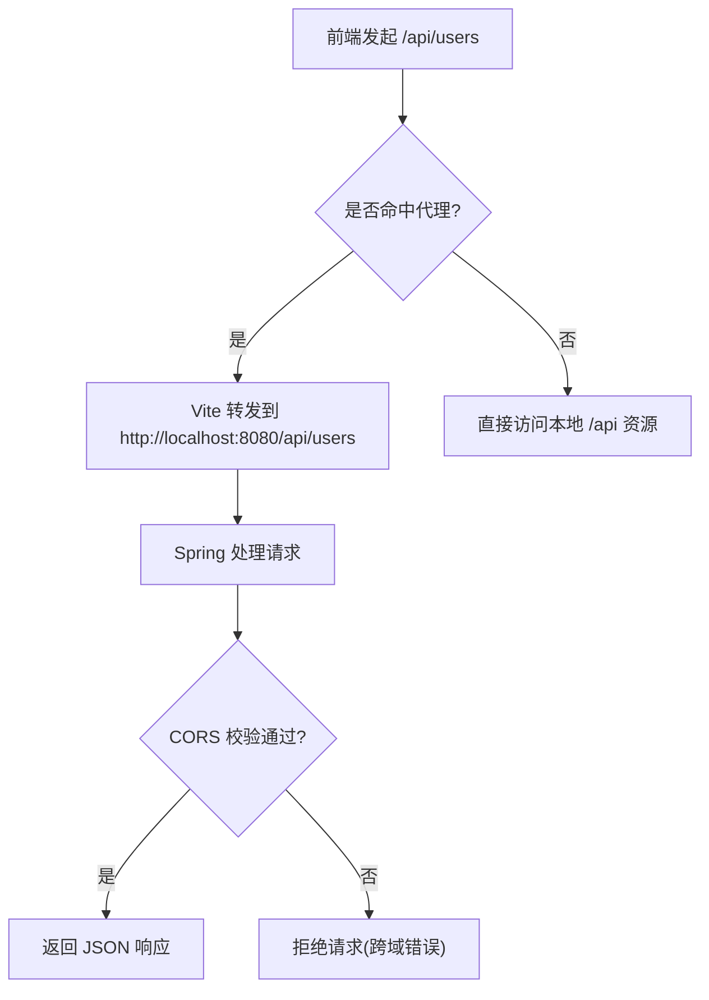
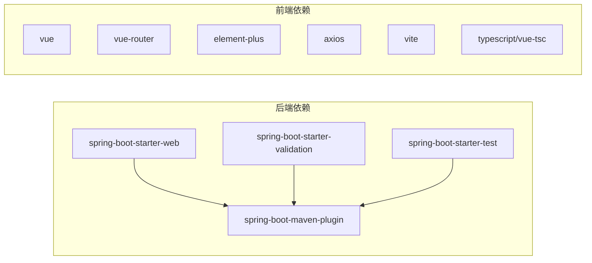

# 快速开始

<cite>
**本文引用的文件**
- [README.md](file://README.md)
- [backend/pom.xml](file://backend/pom.xml)
- [backend/src/main/resources/application.yml](file://backend/src/main/resources/application.yml)
- [backend/src/main/java/com/aicoding/backend/config/WebCorsConfig.java](file://backend/src/main/java/com/aicoding/backend/config/WebCorsConfig.java)
- [backend/src/main/java/com/aicoding/backend/BackendApplication.java](file://backend/src/main/java/com/aicoding/backend/BackendApplication.java)
- [frontend/package.json](file://frontend/package.json)
- [frontend/vite.config.ts](file://frontend/vite.config.ts)
- [frontend/src/api/request.ts](file://frontend/src/api/request.ts)
- [frontend/src/api/user.ts](file://frontend/src/api/user.ts)
</cite>

## 目录
1. [简介](#简介)
2. [项目结构](#项目结构)
3. [核心组件](#核心组件)
4. [架构总览](#架构总览)
5. [详细组件分析](#详细组件分析)
6. [依赖关系分析](#依赖关系分析)
7. [性能注意事项](#性能注意事项)
8. [故障排除指南](#故障排除指南)
9. [结论](#结论)
10. [附录](#附录)

## 简介
本项目是一个前后端分离的全栈示例，提供“用户管理”的 REST API 与对应的前端页面（CRUD 演示）。后端基于 Spring Boot 3.x + Java 21，前端基于 Vue 3 + TypeScript + Vite。通过开发服务器的代理与后端的 CORS 配置，支持前后端独立启动、联调与生产构建部署。

## 项目结构
- 后端 backend：Spring Boot 应用，默认监听 8080 端口，提供 /api/users 系列接口；使用内存存储示例数据。
- 前端 frontend：Vue 3 + TS 单页应用，默认监听 5173 端口；开发时通过 Vite 将 /api 请求代理到后端 8080。

图表来源
- [frontend/vite.config.ts:14-23](file://frontend/vite.config.ts#L14-L23)
- [frontend/src/api/request.ts:8-11](file://frontend/src/api/request.ts#L8-L11)
- [backend/src/main/resources/application.yml:1-2](file://backend/src/main/resources/application.yml#L1-L2)
- [backend/src/main/java/com/aicoding/backend/config/WebCorsConfig.java:14-22](file://backend/src/main/java/com/aicoding/backend/config/WebCorsConfig.java#L14-L22)

章节来源
- [README.md:18-49](file://README.md#L18-L49)

## 核心组件
- 后端启动类：负责启动 Spring Boot 应用。
- 跨域配置：允许前端开发服务器访问后端接口。
- 应用配置：定义服务端口与应用名称。
- 前端代理：开发时将 /api 请求转发至后端。
- Axios 封装：统一 baseURL、超时与错误提示。
- 用户 API：封装用户列表、新增、更新、删除等接口调用。

章节来源
- [backend/src/main/java/com/aicoding/backend/BackendApplication.java:9-14](file://backend/src/main/java/com/aicoding/backend/BackendApplication.java#L9-L14)
- [backend/src/main/java/com/aicoding/backend/config/WebCorsConfig.java:14-22](file://backend/src/main/java/com/aicoding/backend/config/WebCorsConfig.java#L14-L22)
- [backend/src/main/resources/application.yml:1-11](file://backend/src/main/resources/application.yml#L1-L11)
- [frontend/vite.config.ts:14-23](file://frontend/vite.config.ts#L14-L23)
- [frontend/src/api/request.ts:8-25](file://frontend/src/api/request.ts#L8-L25)
- [frontend/src/api/user.ts:5-28](file://frontend/src/api/user.ts#L5-L28)

## 架构总览
下图展示了从浏览器发起请求到后端处理的完整链路，包括前端代理与后端 CORS 放行。

图表来源
- [frontend/vite.config.ts:14-23](file://frontend/vite.config.ts#L14-L23)
- [frontend/src/api/request.ts:8-11](file://frontend/src/api/request.ts#L8-L11)
- [backend/src/main/java/com/aicoding/backend/config/WebCorsConfig.java:14-22](file://backend/src/main/java/com/aicoding/backend/config/WebCorsConfig.java#L14-L22)
- [backend/src/main/resources/application.yml:1-2](file://backend/src/main/resources/application.yml#L1-L2)

## 详细组件分析

### 环境要求与安装
- JDK 21：用于编译和运行后端。
- Maven 3.8+：用于后端构建与运行。
- Node.js 18+（推荐 20+）：用于前端构建与开发。
- npm 9+：随 Node.js 安装。

章节来源
- [README.md:51-58](file://README.md#L51-L58)

### 后端启动步骤
1. 进入后端目录并安装依赖（首次或依赖变更时执行）：
   - 命令：cd backend && mvn install
   - 说明：下载依赖并编译打包，确保 spring-boot-maven-plugin 可用。
2. 启动应用：
   - 命令：cd backend && mvn spring-boot:run
   - 预期输出：控制台显示应用已启动并监听 8080 端口（由 application.yml 配置）。
3. 验证接口：
   - 命令：curl http://localhost:8080/api/users
   - 预期：返回统一响应结构的数据。

章节来源
- [backend/pom.xml:41-48](file://backend/pom.xml#L41-L48)
- [backend/src/main/resources/application.yml:1-2](file://backend/src/main/resources/application.yml#L1-L2)
- [README.md:62-67](file://README.md#L62-L67)
- [README.md:92-112](file://README.md#L92-L112)

### 前端搭建与启动
1. 进入前端目录并安装依赖：
   - 命令：cd frontend && npm install
2. 启动开发服务器：
   - 命令：cd frontend && npm run dev
   - 预期输出：Vite 启动在 5173 端口，并在浏览器中打开应用。
3. 构建产物：
   - 命令：cd frontend && npm run build
   - 产物位置：frontend/dist

章节来源
- [frontend/package.json:6-9](file://frontend/package.json#L6-L9)
- [frontend/vite.config.ts:14-16](file://frontend/vite.config.ts#L14-L16)
- [README.md:69-75](file://README.md#L69-L75)
- [README.md:81-90](file://README.md#L81-L90)

### 前后端通信配置
- 前端代理：Vite 开发服务器将 /api 请求代理到 http://localhost:8080，避免跨域问题。
- Axios 基础路径：Axios 实例 baseURL 设置为 /api，所有用户接口以相对路径调用。
- 后端 CORS：仅允许来自 http://localhost:5173 的请求访问 /api/**。

图表来源
- [frontend/vite.config.ts:14-23](file://frontend/vite.config.ts#L14-L23)
- [frontend/src/api/request.ts:8-11](file://frontend/src/api/request.ts#L8-L11)
- [backend/src/main/java/com/aicoding/backend/config/WebCorsConfig.java:14-22](file://backend/src/main/java/com/aicoding/backend/config/WebCorsConfig.java#L14-L22)

章节来源
- [frontend/vite.config.ts:14-23](file://frontend/vite.config.ts#L14-L23)
- [frontend/src/api/request.ts:8-11](file://frontend/src/api/request.ts#L8-L11)
- [backend/src/main/java/com/aicoding/backend/config/WebCorsConfig.java:14-22](file://backend/src/main/java/com/aicoding/backend/config/WebCorsConfig.java#L14-L22)

### 生产构建与部署
- 后端打包：
  - 命令：cd backend && mvn package
  - 产物：target/backend-0.0.1-SNAPSHOT.jar
  - 运行：java -jar target/backend-0.0.1-SNAPSHOT.jar
- 前端构建：
  - 命令：cd frontend && npm run build
  - 产物：frontend/dist（可部署到静态资源服务器或 Nginx）

章节来源
- [backend/pom.xml:41-48](file://backend/pom.xml#L41-L48)
- [frontend/package.json:6-9](file://frontend/package.json#L6-L9)
- [README.md:81-90](file://README.md#L81-L90)

## 依赖关系分析
- 后端依赖：spring-boot-starter-web、spring-boot-starter-validation、spring-boot-starter-test。
- 前端依赖：vue、vue-router、element-plus、axios；开发依赖包含 vite、typescript、vue-tsc 等。
- 构建插件：spring-boot-maven-plugin 用于打包可执行 jar。

图表来源
- [backend/pom.xml:24-48](file://backend/pom.xml#L24-L48)
- [frontend/package.json:11-24](file://frontend/package.json#L11-L24)

章节来源
- [backend/pom.xml:24-48](file://backend/pom.xml#L24-L48)
- [frontend/package.json:11-24](file://frontend/package.json#L11-L24)

## 性能注意事项
- 开发阶段优先使用 Vite 代理与后端 CORS 组合，减少跨域调试成本。
- 生产环境建议将前端静态资源与后端 API 部署在同一域名下，或通过反向代理统一入口，避免额外跨域开销。
- 后端内存存储适合演示与轻量场景；生产环境应替换为持久化数据库以提升可靠性与扩展性。

[本节为通用指导，不直接分析具体文件]

## 故障排除指南
- 端口冲突
  - 现象：启动时报端口占用。
  - 解决：修改 application.yml 中的 server.port 或 vite.config.ts 中的 server.port，确保前后端端口不冲突。
- 跨域错误
  - 现象：浏览器控制台报 CORS 相关错误。
  - 排查：确认前端通过 Vite 代理访问 /api；确认后端 WebCorsConfig 允许的来源包含 http://localhost:5173。
- 接口 404
  - 现象：请求 /api/users 返回 404。
  - 排查：确认后端已启动且监听 8080；确认前端未自定义 baseURL 覆盖 /api；检查路由映射是否存在。
- 构建失败
  - 后端：检查 JDK 版本是否为 21，Maven 版本是否满足 3.8+。
  - 前端：检查 Node.js 版本是否满足 18+；清理 node_modules 后重新 npm install。

章节来源
- [backend/src/main/resources/application.yml:1-2](file://backend/src/main/resources/application.yml#L1-L2)
- [frontend/vite.config.ts:14-23](file://frontend/vite.config.ts#L14-L23)
- [backend/src/main/java/com/aicoding/backend/config/WebCorsConfig.java:14-22](file://backend/src/main/java/com/aicoding/backend/config/WebCorsConfig.java#L14-L22)
- [README.md:51-58](file://README.md#L51-L58)

## 结论
按照本指南完成环境准备、后端与前端启动、以及前后端通信配置后，即可在浏览器中访问用户管理页面并进行 CRUD 操作。生产环境下可通过 Maven 与 npm 构建产物进行部署。若遇到常见问题，可参考故障排除部分定位与解决。

[本节为总结性内容，不直接分析具体文件]

## 附录
- 常用命令速查
  - 后端启动：cd backend && mvn spring-boot:run
  - 前端开发：cd frontend && npm run dev
  - 前端构建：cd frontend && npm run build
  - 后端打包：cd backend && mvn package
  - 运行 jar：java -jar target/backend-0.0.1-SNAPSHOT.jar

章节来源
- [README.md:62-90](file://README.md#L62-L90)
- [backend/pom.xml:41-48](file://backend/pom.xml#L41-L48)
- [frontend/package.json:6-9](file://frontend/package.json#L6-L9)