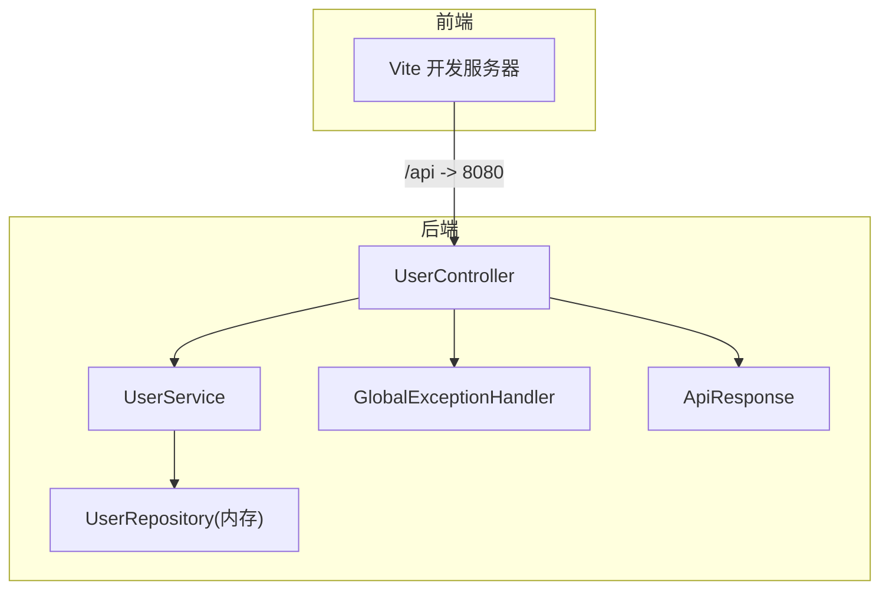
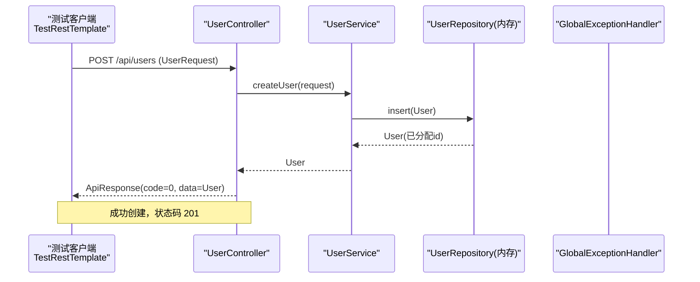
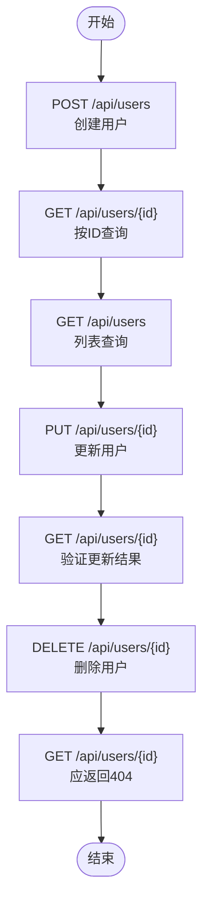
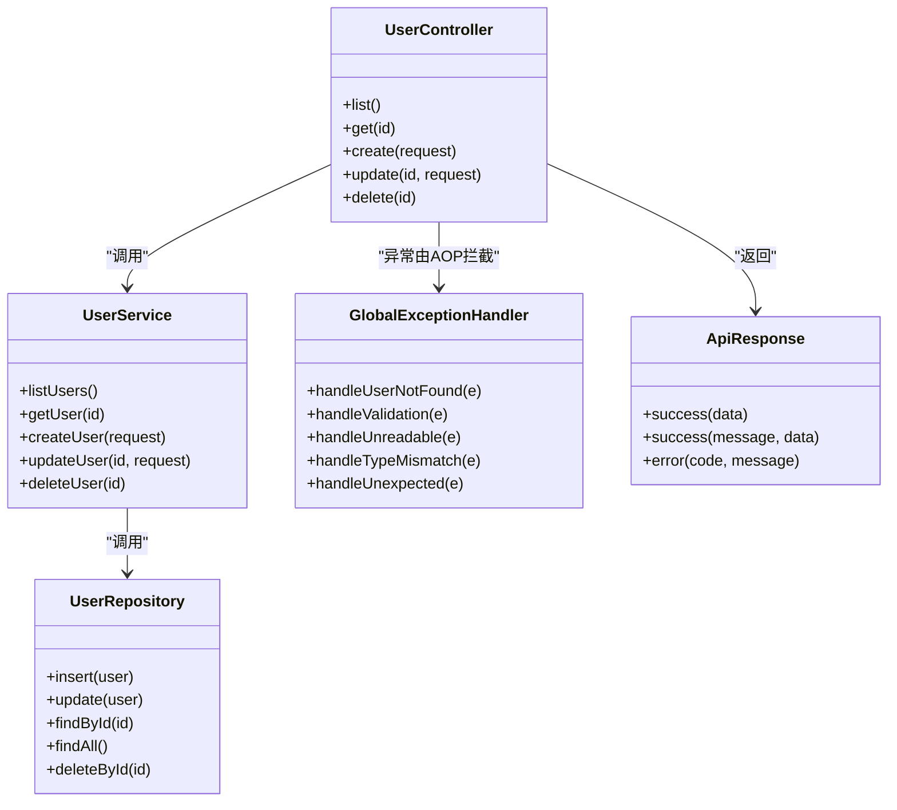
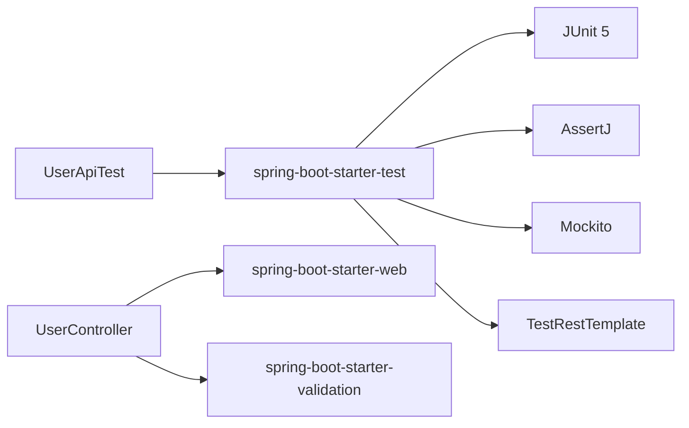

# 测试指南

<cite>
**本文引用的文件**
- [BackendApplicationTests.java](file://backend/src/test/java/com/aicoding/backend/BackendApplicationTests.java)
- [UserApiTest.java](file://backend/src/test/java/com/aicoding/backend/UserApiTest.java)
- [pom.xml](file://backend/pom.xml)
- [application.yml](file://backend/src/main/resources/application.yml)
- [UserController.java](file://backend/src/main/java/com/aicoding/backend/controller/UserController.java)
- [UserService.java](file://backend/src/main/java/com/aicoding/backend/service/UserService.java)
- [UserRepository.java](file://backend/src/main/java/com/aicoding/backend/repository/UserRepository.java)
- [ApiResponse.java](file://backend/src/main/java/com/aicoding/backend/dto/ApiResponse.java)
- [GlobalExceptionHandler.java](file://backend/src/main/java/com/aicoding/backend/exception/GlobalExceptionHandler.java)
- [UserRequest.java](file://backend/src/main/java/com/aicoding/backend/dto/UserRequest.java)
- [vite.config.ts](file://frontend/vite.config.ts)
- [package.json](file://frontend/package.json)
</cite>

## 目录
1. [简介](#简介)
2. [项目结构](#项目结构)
3. [核心组件](#核心组件)
4. [架构总览](#架构总览)
5. [详细组件分析](#详细组件分析)
6. [依赖分析](#依赖分析)
7. [性能考虑](#性能考虑)
8. [故障排查指南](#故障排查指南)
9. [结论](#结论)
10. [附录](#附录)

## 简介
本指南面向后端与前端开发者，系统化阐述本项目的测试策略与最佳实践。内容覆盖：
- 后端单元测试与集成测试的编写方法（Spring Boot、Mock、测试数据）
- 现有测试用例深度解析（应用启动冒烟测试、用户 API 集成测试）
- 测试环境配置（随机端口、内存存储隔离、数据清理机制）
- 前端测试方案（单元、组件、端到端）
- 覆盖率要求与持续集成建议
- 常见场景与模板、失败调试方法与性能测试建议
- 测试驱动开发（TDD）的实践价值

## 项目结构
本项目采用前后端分离结构：
- 后端：基于 Spring Boot 3.x，提供用户管理 REST API；使用内存仓储进行演示；包含全局异常处理与统一响应体。
- 前端：Vue 3 + Vite，开发时通过代理将 /api 请求转发到后端。

图表来源
- [UserController.java:24-65](file://backend/src/main/java/com/aicoding/backend/controller/UserController.java#L24-L65)
- [UserService.java:15-57](file://backend/src/main/java/com/aicoding/backend/service/UserService.java#L15-L57)
- [UserRepository.java:16-55](file://backend/src/main/java/com/aicoding/backend/repository/UserRepository.java#L16-L55)
- [GlobalExceptionHandler.java:17-58](file://backend/src/main/java/com/aicoding/backend/exception/GlobalExceptionHandler.java#L17-L58)
- [ApiResponse.java:6-24](file://backend/src/main/java/com/aicoding/backend/dto/ApiResponse.java#L6-L24)
- [vite.config.ts:14-23](file://frontend/vite.config.ts#L14-L23)

章节来源
- [application.yml:1-11](file://backend/src/main/resources/application.yml#L1-L11)
- [vite.config.ts:14-23](file://frontend/vite.config.ts#L14-L23)

## 核心组件
- 控制器层：暴露 /api/users 的 CRUD 接口，返回统一 ApiResponse。
- 服务层：封装业务逻辑，构造并持久化 User，负责示例数据初始化。
- 仓储层：内存 Map + AtomicLong 实现简单增删改查。
- 异常处理：统一捕获参数校验、类型不匹配、未找到等异常，映射为 ApiResponse。
- 测试：应用上下文冒烟测试与用户 API 集成测试，覆盖完整生命周期与参数校验。

章节来源
- [UserController.java:24-65](file://backend/src/main/java/com/aicoding/backend/controller/UserController.java#L24-L65)
- [UserService.java:15-57](file://backend/src/main/java/com/aicoding/backend/service/UserService.java#L15-L57)
- [UserRepository.java:16-55](file://backend/src/main/java/com/aicoding/backend/repository/UserRepository.java#L16-L55)
- [GlobalExceptionHandler.java:17-58](file://backend/src/main/java/com/aicoding/backend/exception/GlobalExceptionHandler.java#L17-L58)
- [ApiResponse.java:6-24](file://backend/src/main/java/com/aicoding/backend/dto/ApiResponse.java#L6-L24)

## 架构总览
下图展示一次“新增用户”的请求在测试环境中的调用链路与数据流转。

图表来源
- [UserController.java:46-51](file://backend/src/main/java/com/aicoding/backend/controller/UserController.java#L46-L51)
- [UserService.java:40-43](file://backend/src/main/java/com/aicoding/backend/service/UserService.java#L40-L43)
- [UserRepository.java:22-29](file://backend/src/main/java/com/aicoding/backend/repository/UserRepository.java#L22-L29)
- [ApiResponse.java:8-14](file://backend/src/main/java/com/aicoding/backend/dto/ApiResponse.java#L8-L14)

## 详细组件分析

### 后端测试策略与实践
- 测试分层
  - 单元测试：针对 Service/Repository 的纯函数式逻辑，使用 Mockito 模拟外部依赖（如数据库），关注边界条件与异常分支。
  - 集成测试：使用 @SpringBootTest(webEnvironment = RANDOM_PORT) 启动真实上下文，验证 Controller 与异常处理链路。
  - 冒烟测试：@SpringBootTest 仅加载上下文，确保应用能正常启动。
- Mock 对象的应用
  - 对 Repository 或外部依赖使用 @MockBean 或 @ExtendWith(MockitoExtension.class) 进行替换，避免真实 I/O。
  - 对 Service 内部方法调用使用 verify() 断言交互次数与参数。
- 测试数据准备
  - 使用工厂方法或夹具生成稳定、可复用的测试数据。
  - 对于内存仓储，注意每个测试用例的数据隔离与清理，避免交叉污染。
- 测试环境配置
  - 随机端口：RANDOM_PORT 避免端口冲突，便于并行执行。
  - 测试数据库隔离：当前为内存仓储，天然隔离；若切换为真实数据库，建议使用 Testcontainers 或内存库（H2）。
  - 数据清理：在每个测试后重置仓储或回滚事务，保证幂等性。

章节来源
- [UserApiTest.java:21-22](file://backend/src/test/java/com/aicoding/backend/UserApiTest.java#L21-L22)
- [BackendApplicationTests.java:9-14](file://backend/src/test/java/com/aicoding/backend/BackendApplicationTests.java#L9-L14)
- [pom.xml:24-39](file://backend/pom.xml#L24-L39)

### 现有测试用例深度解析

#### 应用启动冒烟测试（BackendApplicationTests）
- 目的：验证 Spring Boot 应用上下文能否正常加载，快速发现配置与依赖问题。
- 关键点：
  - 使用 @SpringBootTest 注解触发容器启动。
  - 空方法体即可触发上下文加载，适合 CI 的“健康检查”。

章节来源
- [BackendApplicationTests.java:9-14](file://backend/src/test/java/com/aicoding/backend/BackendApplicationTests.java#L9-L14)

#### 用户 API 集成测试（UserApiTest）
- 目标：覆盖用户全生命周期（创建、查询、更新、删除）以及参数校验错误路径。
- 关键实现要点：
  - 使用 RANDOM_PORT 启动真实 HTTP 服务，通过 TestRestTemplate 发起请求。
  - 断言 HTTP 状态码与统一响应体 code 字段，确保契约一致。
  - 先创建用户获取 id，再依次进行 GET/PUT/DELETE，最后验证删除后 GET 返回 404。
  - 构造无效请求体，断言 400 与错误信息结构。

图表来源
- [UserApiTest.java:30-97](file://backend/src/test/java/com/aicoding/backend/UserApiTest.java#L30-L97)

章节来源
- [UserApiTest.java:30-97](file://backend/src/test/java/com/aicoding/backend/UserApiTest.java#L30-L97)
- [UserApiTest.java:99-112](file://backend/src/test/java/com/aicoding/backend/UserApiTest.java#L99-L112)

### 后端代码结构与关系

图表来源
- [UserController.java:24-65](file://backend/src/main/java/com/aicoding/backend/controller/UserController.java#L24-L65)
- [UserService.java:15-57](file://backend/src/main/java/com/aicoding/backend/service/UserService.java#L15-L57)
- [UserRepository.java:16-55](file://backend/src/main/java/com/aicoding/backend/repository/UserRepository.java#L16-L55)
- [GlobalExceptionHandler.java:17-58](file://backend/src/main/java/com/aicoding/backend/exception/GlobalExceptionHandler.java#L17-L58)
- [ApiResponse.java:6-24](file://backend/src/main/java/com/aicoding/backend/dto/ApiResponse.java#L6-L24)

### 前端测试指导
- 现状：前端包中未包含测试框架与脚本。
- 推荐方案：
  - 单元测试：引入 Vitest，对工具函数、组合式函数进行断言。
  - 组件测试：引入 Vue Test Utils，对 Vue 组件渲染、事件、插槽进行测试。
  - 端到端测试：引入 Playwright/Cypress，模拟用户操作，验证路由跳转与页面行为。
  - 与后端联调：开发期通过 Vite 代理将 /api 转发至后端，E2E 测试可指向独立测试环境。
- 配置要点：
  - 在 vite.config.ts 中保持代理配置，便于本地联调。
  - 在 package.json 中添加 test 脚本，统一运行入口。

章节来源
- [vite.config.ts:14-23](file://frontend/vite.config.ts#L14-L23)
- [package.json:6-10](file://frontend/package.json#L6-L10)

## 依赖分析
- 后端测试依赖：spring-boot-starter-test 提供 JUnit 5、AssertJ、Mockito 与 TestRestTemplate。
- 运行时依赖：spring-boot-starter-web 提供 Web 能力；spring-boot-starter-validation 提供参数校验。
- 前端：Vite 构建工具，Vue 生态；当前无测试依赖。

图表来源
- [pom.xml:24-39](file://backend/pom.xml#L24-L39)
- [UserApiTest.java:1-22](file://backend/src/test/java/com/aicoding/backend/UserApiTest.java#L1-L22)

章节来源
- [pom.xml:24-39](file://backend/pom.xml#L24-L39)

## 性能考虑
- 测试执行效率
  - 使用 RANDOM_PORT 避免端口竞争，支持并行测试。
  - 对慢依赖（网络、磁盘）进行 Mock，缩短单测执行时间。
- 资源隔离
  - 内存仓储天然隔离；若使用真实数据库，建议每次测试前清理或使用事务回滚。
- 并发与稳定性
  - 避免共享可变状态；必要时在每个测试中重建被测对象或仓储实例。
- 压测建议
  - 使用 JMeter/k6 对关键接口进行压测，关注 P95/P99 延迟与错误率。
  - 结合监控指标（CPU、GC、连接池）定位瓶颈。

[本节为通用指导，无需特定文件引用]

## 故障排查指南
- 常见问题
  - 端口占用：RANDOM_PORT 可缓解；CI 中确保并行度合理。
  - 参数校验失败：检查 UserRequest 约束与输入；查看全局异常处理器返回的错误信息。
  - 404 错误：确认删除后查询是否预期；检查 ID 传递是否正确。
  - JSON 解析失败：检查请求体格式与 Content-Type。
- 调试技巧
  - 打印日志：在 Service/Controller 关键路径添加日志，观察数据流转。
  - 断点调试：在测试用例中打断点，逐步检查返回值与异常。
  - 最小化复现：抽取失败用例为独立单测，便于定位根因。
- 回归保障
  - 将典型失败场景固化为测试用例，防止回归。

章节来源
- [GlobalExceptionHandler.java:20-58](file://backend/src/main/java/com/aicoding/backend/exception/GlobalExceptionHandler.java#L20-L58)
- [UserRequest.java:10-24](file://backend/src/main/java/com/aicoding/backend/dto/UserRequest.java#L10-L24)

## 结论
本项目已具备基础的后端测试能力：应用冒烟测试与用户 API 集成测试覆盖了核心流程与异常路径。建议后续补充：
- Service/Repository 的单元测试（含 Mock）
- 更丰富的边界与异常用例
- 前端测试体系（单元、组件、E2E）
- 覆盖率阈值与 CI 门禁
- 性能测试与基准回归

[本节为总结性内容，无需特定文件引用]

## 附录

### 测试环境与配置要点
- 随机端口：集成测试使用 RANDOM_PORT，避免冲突。
- 测试数据隔离：内存仓储天然隔离；生产数据库建议 Testcontainers/H2。
- 数据清理：每个测试结束后清理仓储或回滚事务，保证幂等。
- 统一响应：所有接口返回 ApiResponse，测试断言 code 字段一致性。

章节来源
- [UserApiTest.java:21-22](file://backend/src/test/java/com/aicoding/backend/UserApiTest.java#L21-L22)
- [UserRepository.java:16-55](file://backend/src/main/java/com/aicoding/backend/repository/UserRepository.java#L16-L55)
- [ApiResponse.java:6-24](file://backend/src/main/java/com/aicoding/backend/dto/ApiResponse.java#L6-L24)

### 常见测试场景与模板
- 新增用户
  - 输入合法 UserRequest，断言 201 与 ApiResponse.code=0，data 中包含新 ID。
- 查询用户
  - 按 ID 查询存在用户，断言 200 与 data 非空。
- 更新用户
  - 修改 name/email/phone，再次查询验证变更生效。
- 删除用户
  - 删除后查询应返回 404。
- 参数校验失败
  - 传入空 name 或非法 email，断言 400 与错误消息。

章节来源
- [UserApiTest.java:30-112](file://backend/src/test/java/com/aicoding/backend/UserApiTest.java#L30-L112)
- [UserRequest.java:10-24](file://backend/src/main/java/com/aicoding/backend/dto/UserRequest.java#L10-L24)
- [GlobalExceptionHandler.java:27-35](file://backend/src/main/java/com/aicoding/backend/exception/GlobalExceptionHandler.java#L27-L35)

### 覆盖率与持续集成建议
- 覆盖率目标
  - 行覆盖率 ≥ 80%，分支覆盖率 ≥ 70%（可按模块逐步提升）。
- 报告生成
  - 后端：JaCoCo 生成覆盖率报告。
  - 前端：Vitest 输出覆盖率报告。
- CI 流水线
  - 安装依赖 → 编译 → 运行测试 → 生成覆盖率 → 上传报告 → 质量门禁（低于阈值失败）。

[本节为通用指导，无需特定文件引用]

### 调试测试失败的步骤
- 定位失败用例：查看控制台输出与堆栈。
- 缩小范围：抽取失败片段为独立单测。
- 检查依赖：确认 Mock 行为与真实实现差异。
- 对比期望：核对 ApiResponse 结构与状态码约定。
- 日志辅助：在关键路径增加日志，观察数据流。

章节来源
- [GlobalExceptionHandler.java:20-58](file://backend/src/main/java/com/aicoding/backend/exception/GlobalExceptionHandler.java#L20-L58)

### 性能测试建议
- 接口压测：对 /api/users 的创建与列表接口进行并发压测。
- 指标观测：关注 CPU、内存、GC 与线程池使用情况。
- 容量规划：根据压测结果调整资源配置与限流策略。

[本节为通用指导，无需特定文件引用]

### 测试驱动开发（TDD）实践
- 红-绿-重构循环
  - 先写失败用例（红），实现最小可用代码（绿），再重构优化（重构）。
- 价值
  - 提高设计质量、降低缺陷密度、增强文档性与可维护性。
- 在本项目中的应用
  - 为新功能先定义用例（如新增字段、新接口），再实现与完善测试。

[本节为通用指导，无需特定文件引用]