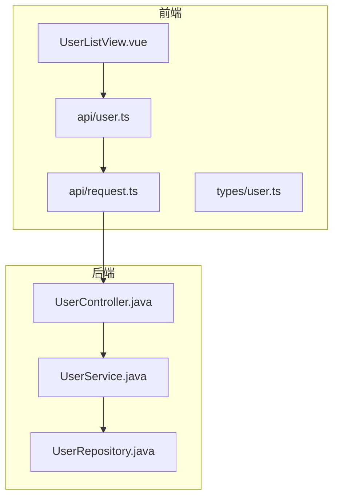
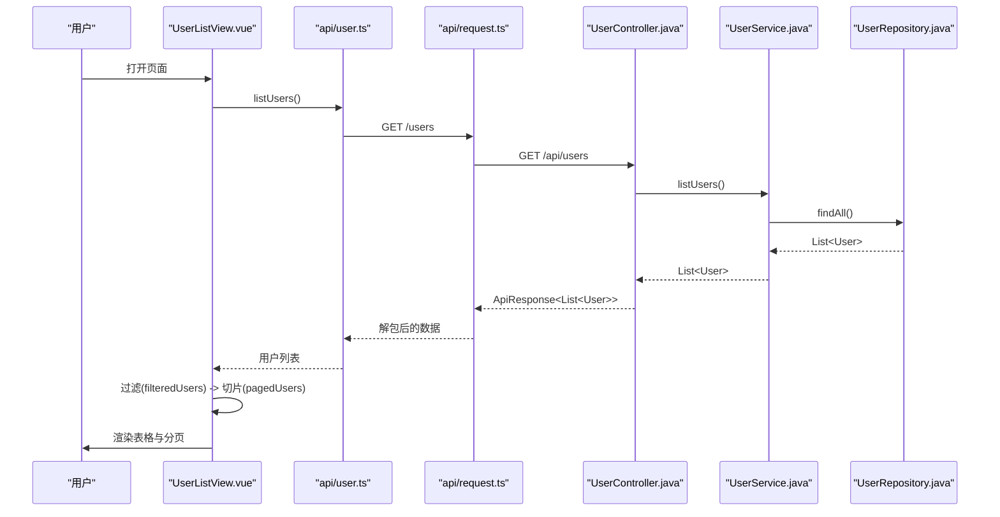
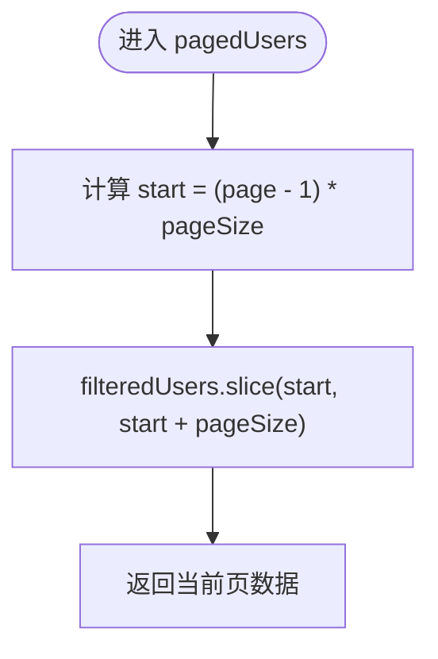
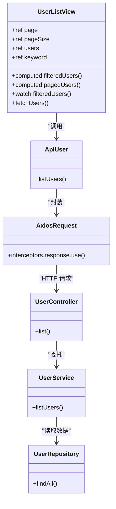
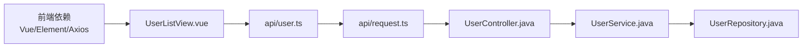

# 用户分页显示

<cite>
**本文引用的文件**
- [UserListView.vue](file://frontend/src/views/UserListView.vue)
- [user.ts](file://frontend/src/api/user.ts)
- [request.ts](file://frontend/src/api/request.ts)
- [user.ts（类型）](file://frontend/src/types/user.ts)
- [UserController.java](file://backend/src/main/java/com/aicoding/backend/controller/UserController.java)
- [UserService.java](file://backend/src/main/java/com/aicoding/backend/service/UserService.java)
- [UserRepository.java](file://backend/src/main/java/com/aicoding/backend/repository/UserRepository.java)
- [package.json](file://frontend/package.json)
</cite>

## 目录
1. [简介](#简介)
2. [项目结构](#项目结构)
3. [核心组件](#核心组件)
4. [架构总览](#架构总览)
5. [详细组件分析](#详细组件分析)
6. [依赖关系分析](#依赖关系分析)
7. [性能考虑](#性能考虑)
8. [故障排查指南](#故障排查指南)
9. [结论](#结论)
10. [附录](#附录)

## 简介
本文件围绕“用户分页显示”功能，系统性说明前端 Element Plus 分页组件的配置与使用、前端分页计算逻辑、分页状态管理、与搜索的联动、用户交互细节、性能优化策略、扩展方案（后端分页、动画与样式）、以及测试与调试技巧。该实现采用“前端分页”模式：一次性拉取全部用户数据，在浏览器端进行过滤与切片展示。

## 项目结构
- 前端（Vue 3 + TypeScript + Element Plus）
  - 视图层：用户列表页包含搜索、表格、分页等 UI。
  - API 层：封装 axios 请求与统一错误处理。
  - 类型定义：User、UserForm 等数据结构。
- 后端（Spring Boot）
  - 控制器：提供 REST 接口。
  - 服务层：业务逻辑与示例数据初始化。
  - 仓储层：内存存储演示数据，按 ID 排序返回。

图表来源
- [UserListView.vue:1-278](file://frontend/src/views/UserListView.vue#L1-L278)
- [user.ts（API）:1-29](file://frontend/src/api/user.ts#L1-L29)
- [request.ts:1-26](file://frontend/src/api/request.ts#L1-L26)
- [UserController.java:1-66](file://backend/src/main/java/com/aicoding/backend/controller/UserController.java#L1-L66)
- [UserService.java:1-57](file://backend/src/main/java/com/aicoding/backend/service/UserService.java#L1-L57)
- [UserRepository.java:1-55](file://backend/src/main/java/com/aicoding/backend/repository/UserRepository.java#L1-L55)

章节来源
- [UserListView.vue:1-278](file://frontend/src/views/UserListView.vue#L1-L278)
- [package.json:1-26](file://frontend/package.json#L1-L26)

## 核心组件
- 用户列表页（UserListView.vue）
  - 负责数据获取、搜索过滤、分页状态、表单操作与删除确认。
  - 使用 Element Plus 的 el-pagination 完成分页展示。
- API 层（api/user.ts、api/request.ts）
  - 封装 HTTP 请求，统一 baseURL、超时与错误提示。
- 类型定义（types/user.ts）
  - 定义 User、UserForm 等前后端契约。
- 后端接口（UserController.java、UserService.java、UserRepository.java）
  - 提供用户 CRUD 接口；当前未实现后端分页，返回全量数据。

章节来源
- [UserListView.vue:89-235](file://frontend/src/views/UserListView.vue#L89-L235)
- [user.ts（API）:1-29](file://frontend/src/api/user.ts#L1-L29)
- [request.ts:1-26](file://frontend/src/api/request.ts#L1-L26)
- [user.ts（类型）:1-16](file://frontend/src/types/user.ts#L1-L16)
- [UserController.java:24-65](file://backend/src/main/java/com/aicoding/backend/controller/UserController.java#L24-L65)
- [UserService.java:15-57](file://backend/src/main/java/com/aicoding/backend/service/UserService.java#L15-L57)
- [UserRepository.java:16-55](file://backend/src/main/java/com/aicoding/backend/repository/UserRepository.java#L16-L55)

## 架构总览
前端通过一次 GET /users 拉取全部用户，随后在浏览器端基于关键字过滤并切片展示。Element Plus 分页组件绑定当前页码与每页大小，并通过 total 控制总记录数。

图表来源
- [UserListView.vue:148-158](file://frontend/src/views/UserListView.vue#L148-L158)
- [user.ts（API）:6-8](file://frontend/src/api/user.ts#L6-L8)
- [request.ts:8-23](file://frontend/src/api/request.ts#L8-L23)
- [UserController.java:34-38](file://backend/src/main/java/com/aicoding/backend/controller/UserController.java#L34-L38)
- [UserService.java:31-33](file://backend/src/main/java/com/aicoding/backend/service/UserService.java#L31-L33)
- [UserRepository.java:44-49](file://backend/src/main/java/com/aicoding/backend/repository/UserRepository.java#L44-L49)

## 详细组件分析

### Element Plus 分页组件配置与使用
- 绑定项
  - current-page：当前页码，双向绑定到 page。
  - page-size：每页条数，双向绑定到 pageSize。
  - total：总记录数，绑定为 filteredUsers.length（过滤后的总数）。
  - page-sizes：可选每页条数，如 [5, 10, 20]。
  - layout：布局组合，如 total, sizes, prev, pager, next, jumper。
  - background：启用背景色样式。
- 行为
  - 切换页码或每页条数时，computed pagedUsers 会重新计算并更新表格显示。
  - 当过滤结果减少导致最大页码变小，watch 会将当前页回退到有效范围。

章节来源
- [UserListView.vue:50-59](file://frontend/src/views/UserListView.vue#L50-L59)
- [UserListView.vue:103-104](file://frontend/src/views/UserListView.vue#L103-L104)
- [UserListView.vue:125-146](file://frontend/src/views/UserListView.vue#L125-L146)

### 前端分页计算逻辑（pagedUsers 计算属性）
- 输入
  - filteredUsers：根据关键词对 users 进行姓名/邮箱模糊匹配的结果集。
  - page：当前页码（从 1 开始）。
  - pageSize：每页条数。
- 算法
  - 起始索引 start = (page - 1) * pageSize。
  - 切片 slice(start, start + pageSize) 得到当前页数据。
- 复杂度
  - 时间复杂度 O(n)（过滤）+ O(k)（切片），n 为 users 长度，k 为 pageSize。
  - 空间复杂度 O(k)，用于保存当前页切片结果。
- 边界处理
  - 当过滤后数据不足一页时，仍正确返回剩余数据。
  - 当 pageSize 增大导致最大页码减小，watch 自动将 page 调整至最后一页。

图表来源
- [UserListView.vue:134-138](file://frontend/src/views/UserListView.vue#L134-L138)

章节来源
- [UserListView.vue:125-146](file://frontend/src/views/UserListView.vue#L125-L146)

### 分页状态管理
- 当前页码 page：ref(1)，由分页组件 v-model:current-page 驱动。
- 每页大小 pageSize：ref(10)，由分页组件 v-model:page-size 驱动。
- 总记录数：使用 filteredUsers.length，随搜索变化而变化。
- 自动回退逻辑：监听 filteredUsers 变化，若当前页超过最大页码，则重置为最大页码，避免空页。

章节来源
- [UserListView.vue:103-104](file://frontend/src/views/UserListView.vue#L103-L104)
- [UserListView.vue:125-146](file://frontend/src/views/UserListView.vue#L125-L146)

### 分页与搜索集成
- 搜索关键词 keyword：v-model 绑定到输入框，支持清空。
- 过滤 computed filteredUsers：不区分大小写，匹配姓名或邮箱。
- 联动效果
  - 搜索触发 filteredUsers 变化，进而影响 pagedUsers 和 total。
  - watch 确保当过滤后数据变少时，当前页回退到有效范围。

章节来源
- [UserListView.vue:14-21](file://frontend/src/views/UserListView.vue#L14-L21)
- [UserListView.vue:125-146](file://frontend/src/views/UserListView.vue#L125-L146)

### 用户交互流程
- 页码跳转：点击页码或跳转到指定页，触发 page 变化，重新计算 pagedUsers。
- 每页条数切换：选择新的 pageSize，触发重新切片。
- 总数显示：total 始终反映 filteredUsers.length，体现搜索后的真实总数。
- 刷新数据：点击刷新按钮调用 fetchUsers，重新拉取并重置分页状态。

章节来源
- [UserListView.vue:50-59](file://frontend/src/views/UserListView.vue#L50-L59)
- [UserListView.vue:148-158](file://frontend/src/views/UserListView.vue#L148-L158)

### 数据流与组件关系图

图表来源
- [UserListView.vue:89-235](file://frontend/src/views/UserListView.vue#L89-L235)
- [user.ts（API）:1-29](file://frontend/src/api/user.ts#L1-L29)
- [request.ts:1-26](file://frontend/src/api/request.ts#L1-L26)
- [UserController.java:24-65](file://backend/src/main/java/com/aicoding/backend/controller/UserController.java#L24-L65)
- [UserService.java:15-57](file://backend/src/main/java/com/aicoding/backend/service/UserService.java#L15-L57)
- [UserRepository.java:16-55](file://backend/src/main/java/com/aicoding/backend/repository/UserRepository.java#L16-L55)

## 依赖关系分析
- 前端依赖
  - Vue 3、Element Plus、Axios、TypeScript。
  - 组件库图标 @element-plus/icons-vue。
- 后端依赖
  - Spring Boot、Jakarta Validation、并发容器与原子类用于内存仓储。
- 耦合性
  - 前端与后端通过 REST API 解耦；当前后端未提供分页参数，前端承担分页职责。
  - 类型定义集中在 types/user.ts，便于前后端契约维护。

图表来源
- [package.json:11-16](file://frontend/package.json#L11-L16)
- [UserListView.vue:89-235](file://frontend/src/views/UserListView.vue#L89-L235)
- [user.ts（API）:1-29](file://frontend/src/api/user.ts#L1-L29)
- [request.ts:1-26](file://frontend/src/api/request.ts#L1-L26)
- [UserController.java:24-65](file://backend/src/main/java/com/aicoding/backend/controller/UserController.java#L24-L65)
- [UserService.java:15-57](file://backend/src/main/java/com/aicoding/backend/service/UserService.java#L15-L57)
- [UserRepository.java:16-55](file://backend/src/main/java/com/aicoding/backend/repository/UserRepository.java#L16-L55)

章节来源
- [package.json:1-26](file://frontend/package.json#L1-L26)
- [UserListView.vue:89-235](file://frontend/src/views/UserListView.vue#L89-L235)

## 性能考虑
- 大数据集的前端分页
  - 优点：交互简单、无需后端改动。
  - 风险：一次性加载全部数据可能占用较多内存与带宽。
  - 建议：当数据量较大（例如上万级）时，优先迁移到后端分页。
- 内存与渲染优化
  - 使用 computed 缓存过滤与切片结果，避免重复计算。
  - 合理设置 pageSize，平衡翻页次数与单页渲染成本。
  - 表格列宽与固定列可减少重排开销。
- 网络与错误处理
  - 统一拦截器集中处理错误消息，提升用户体验。
  - 合理设置超时时间，避免长时间阻塞。

[本节为通用指导，不直接分析具体文件]

## 故障排查指南
- 分页异常或空白页
  - 检查 filteredUsers 是否为空，确认搜索条件是否过于严格。
  - 确认 page 与 pageSize 的值，以及 watch 是否正确回退页码。
- 数据未更新
  - 检查 fetchUsers 是否被调用，axios 响应拦截器是否抛出错误。
  - 确认后端接口路径与返回值结构是否符合预期。
- 样式或布局问题
  - 检查 pagination-wrapper 的样式是否生效。
  - 确认 Element Plus 版本与组件用法一致。

章节来源
- [UserListView.vue:125-146](file://frontend/src/views/UserListView.vue#L125-L146)
- [UserListView.vue:148-158](file://frontend/src/views/UserListView.vue#L148-L158)
- [request.ts:13-23](file://frontend/src/api/request.ts#L13-L23)

## 结论
当前实现以“前端分页”为核心，结合 Element Plus 的分页组件与 Vue 的计算属性，提供了简洁易用的用户列表分页体验。对于小规模数据场景表现良好；随着数据规模增长，建议逐步迁移至后端分页以提升性能与可扩展性。同时，可通过添加动画、自定义样式与完善测试进一步提升用户体验与稳定性。

[本节为总结性内容，不直接分析具体文件]

## 附录

### 扩展指南
- 后端分页
  - 在后端接口增加 page、pageSize、keyword 等参数，返回分页对象（含 total、list）。
  - 前端改为按需请求，移除前端过滤与切片逻辑，仅保留搜索与分页控件。
- 分页动画
  - 使用 Vue Transition 包裹表格区域，实现切换页时的淡入淡出或滑动效果。
- 自定义样式
  - 覆盖 Element Plus 分页组件 CSS 变量或类名，定制主题与布局。
- 单元测试与端到端测试
  - 针对 pagedUsers 与 filteredUsers 编写单元测试，验证边界情况。
  - 使用 Cypress 或 Playwright 模拟用户操作，验证分页与搜索联动。

[本节为概念性扩展建议，不直接分析具体文件]

### 测试用例建议
- 基础分页
  - 初始加载后，验证第一页数据数量等于 pageSize。
  - 切换到第二页，验证数据正确偏移。
- 搜索联动
  - 输入关键词后，验证 total 与 pagedUsers 数量一致。
  - 清空搜索后，恢复原始数据与页码。
- 边界情况
  - 当过滤结果为空时，验证分页组件显示为空且无报错。
  - 当 pageSize 增大导致最大页码减小，验证当前页自动回退。

[本节为测试建议，不直接分析具体文件]

### 调试技巧
- 控制台日志
  - 在 computed 与 watch 中打印关键状态，观察数据变化。
- 网络面板
  - 查看请求与响应体，确认后端返回结构与字段。
- 断点调试
  - 在 pagedUsers 与 fetchUsers 处设置断点，逐步执行定位问题。

[本节为通用调试建议，不直接分析具体文件]