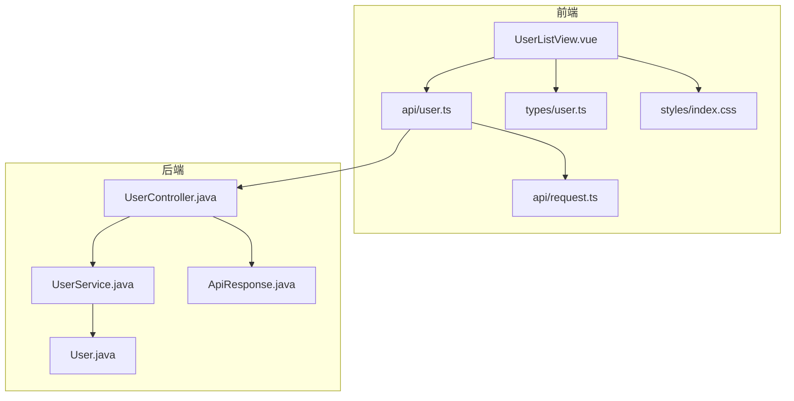
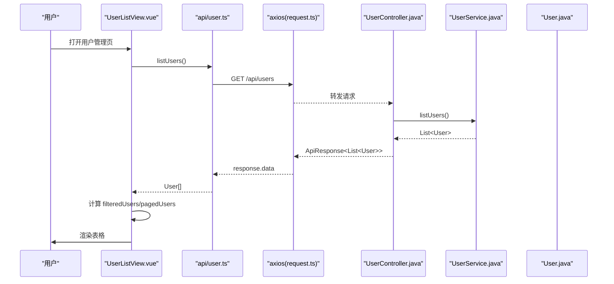
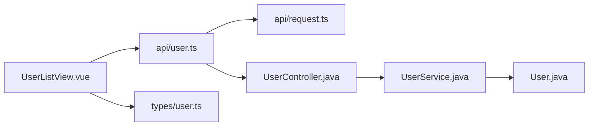

# 用户列表展示

<cite>
**本文引用的文件**
- [UserListView.vue](file://frontend/src/views/UserListView.vue)
- [user.ts（类型定义）](file://frontend/src/types/user.ts)
- [user.ts（API 封装）](file://frontend/src/api/user.ts)
- [request.ts（请求封装）](file://frontend/src/api/request.ts)
- [index.css（全局样式）](file://frontend/src/styles/index.css)
- [UserController.java](file://backend/src/main/java/com/aicoding/backend/controller/UserController.java)
- [UserService.java](file://backend/src/main/java/com/aicoding/backend/service/UserService.java)
- [User.java（后端模型）](file://backend/src/main/java/com/aicoding/backend/model/User.java)
- [ApiResponse.java](file://backend/src/main/java/com/aicoding/backend/dto/ApiResponse.java)
</cite>

## 目录
1. [简介](#简介)
2. [项目结构](#项目结构)
3. [核心组件](#核心组件)
4. [架构总览](#架构总览)
5. [详细组件分析](#详细组件分析)
6. [依赖关系分析](#依赖关系分析)
7. [性能考虑](#性能考虑)
8. [故障排查指南](#故障排查指南)
9. [结论](#结论)
10. [附录](#附录)

## 简介
本章节面向“用户列表展示”功能，聚焦前端 UserListView.vue 中的表格实现与数据流。文档将详细说明 el-table 的配置与使用、列定义与自定义渲染模板、响应式与视觉特性（边框、斑马纹）、时间格式化、空值处理策略，以及性能优化与扩展指南（虚拟滚动、懒加载、排序等）。同时给出前后端数据映射关系与接口调用流程，帮助读者快速理解并扩展该功能。

## 项目结构
- 前端采用 Vue 3 + Element Plus，用户列表页面位于 views 目录，类型定义在 types，API 封装在 api，全局样式在 styles。
- 后端采用 Spring Boot，提供 RESTful 接口，统一响应体 ApiResponse，用户实体为 record 类型。

图表来源
- [UserListView.vue:1-278](file://frontend/src/views/UserListView.vue#L1-L278)
- [user.ts（API 封装）:1-29](file://frontend/src/api/user.ts#L1-L29)
- [request.ts:1-26](file://frontend/src/api/request.ts#L1-L26)
- [user.ts（类型定义）:1-16](file://frontend/src/types/user.ts#L1-L16)
- [index.css:1-15](file://frontend/src/styles/index.css#L1-L15)
- [UserController.java:1-66](file://backend/src/main/java/com/aicoding/backend/controller/UserController.java#L1-L66)
- [UserService.java:1-57](file://backend/src/main/java/com/aicoding/backend/service/UserService.java#L1-L57)
- [User.java:1-16](file://backend/src/main/java/com/aicoding/backend/model/User.java#L1-L16)
- [ApiResponse.java:1-24](file://backend/src/main/java/com/aicoding/backend/dto/ApiResponse.java#L1-L24)

章节来源
- [UserListView.vue:1-278](file://frontend/src/views/UserListView.vue#L1-L278)
- [user.ts（API 封装）:1-29](file://frontend/src/api/user.ts#L1-L29)
- [request.ts:1-26](file://frontend/src/api/request.ts#L1-L26)
- [user.ts（类型定义）:1-16](file://frontend/src/types/user.ts#L1-L16)
- [index.css:1-15](file://frontend/src/styles/index.css#L1-L15)
- [UserController.java:1-66](file://backend/src/main/java/com/aicoding/backend/controller/UserController.java#L1-L66)
- [UserService.java:1-57](file://backend/src/main/java/com/aicoding/backend/service/UserService.java#L1-L57)
- [User.java:1-16](file://backend/src/main/java/com/aicoding/backend/model/User.java#L1-L16)
- [ApiResponse.java:1-24](file://backend/src/main/java/com/aicoding/backend/dto/ApiResponse.java#L1-L24)

## 核心组件
- 用户列表页面组件：负责数据获取、过滤、分页、表单交互与表格渲染。
- API 层：封装 HTTP 请求，统一 baseURL、超时与错误提示。
- 类型定义：约束前后端数据结构，确保类型安全。
- 后端控制器与服务：提供用户 CRUD 接口与业务逻辑。

章节来源
- [UserListView.vue:89-235](file://frontend/src/views/UserListView.vue#L89-L235)
- [user.ts（API 封装）:1-29](file://frontend/src/api/user.ts#L1-L29)
- [request.ts:1-26](file://frontend/src/api/request.ts#L1-L26)
- [user.ts（类型定义）:1-16](file://frontend/src/types/user.ts#L1-L16)
- [UserController.java:24-66](file://backend/src/main/java/com/aicoding/backend/controller/UserController.java#L24-L66)
- [UserService.java:15-57](file://backend/src/main/java/com/aicoding/backend/service/UserService.java#L15-L57)

## 架构总览
下图展示了从前端到后端的完整数据流：页面发起请求，经 axios 实例拦截器处理后到达后端控制器，服务层返回用户数据，前端接收并渲染至表格。

图表来源
- [UserListView.vue:148-158](file://frontend/src/views/UserListView.vue#L148-L158)
- [user.ts（API 封装）:6-8](file://frontend/src/api/user.ts#L6-L8)
- [request.ts:8-23](file://frontend/src/api/request.ts#L8-L23)
- [UserController.java:34-38](file://backend/src/main/java/com/aicoding/backend/controller/UserController.java#L34-L38)
- [UserService.java:31-33](file://backend/src/main/java/com/aicoding/backend/service/UserService.java#L31-L33)
- [User.java:8-14](file://backend/src/main/java/com/aicoding/backend/model/User.java#L8-L14)

## 详细组件分析

### 表格实现与列定义
- 表格容器：使用 el-table，启用 v-loading 显示加载状态，绑定 pagedUsers 作为数据源。
- 列配置：
  - ID：固定宽度居中对齐。
  - 姓名、邮箱：最小宽度自适应。
  - 手机号：自定义模板，空值显示占位符。
  - 创建时间：自定义模板，调用本地化格式化函数。
  - 操作：固定在右侧，包含编辑与删除按钮。
- 视觉特性：
  - border：启用表格边框。
  - stripe：启用斑马纹效果。
  - 响应式：通过 min-width 与固定列宽组合，在不同屏幕下保持可读性；配合分页控制每页行数，提升小屏体验。

章节来源
- [UserListView.vue:24-48](file://frontend/src/views/UserListView.vue#L24-L48)
- [index.css:1-15](file://frontend/src/styles/index.css#L1-L15)

### 数据映射与展示逻辑
- 字段映射：
  - id → ID 列
  - name → 姓名列
  - email → 邮箱列
  - phone → 手机号列（空值时显示占位符）
  - createdAt → 创建时间列（格式化后显示）
- 数据来源：
  - 前端通过 listUsers 获取后端返回的数组，存入 users 响应式变量。
  - 基于 keyword 进行前端过滤，生成 filteredUsers。
  - 基于 page 与 pageSize 计算当前页数据 pagedUsers。

章节来源
- [user.ts（类型定义）:1-16](file://frontend/src/types/user.ts#L1-L16)
- [UserListView.vue:125-138](file://frontend/src/views/UserListView.vue#L125-L138)
- [UserListView.vue:148-158](file://frontend/src/views/UserListView.vue#L148-L158)

### 时间格式化与空值处理
- 时间格式化：
  - 将 ISO 时间字符串中的 T 替换为空格，截取前 19 个字符，得到“YYYY-MM-DD HH:mm:ss”格式。
  - 若值为空，返回占位符“-”。
- 空值策略：
  - 手机号为空时显示占位符“-”，避免空白影响阅读。
  - 其他字段遵循后端返回，必要时可在模板中增加默认值。

章节来源
- [UserListView.vue:230-233](file://frontend/src/views/UserListView.vue#L230-L233)
- [UserListView.vue:28-36](file://frontend/src/views/UserListView.vue#L28-L36)

### 搜索与分页
- 搜索：
  - 支持按姓名或邮箱模糊匹配，大小写不敏感。
  - 当关键字为空时，返回全部数据。
- 分页：
  - 前端分页：根据当前页码与每页条数对过滤后的数据进行切片。
  - 监听过滤结果变化，自动回退到有效最大页码，避免空页。

章节来源
- [UserListView.vue:125-146](file://frontend/src/views/UserListView.vue#L125-L146)

### 新增/编辑/删除交互
- 新增/编辑：
  - 使用对话框承载表单，提交前进行校验（必填、邮箱格式）。
  - 根据是否编辑模式调用不同接口，成功后刷新列表。
- 删除：
  - 二次确认弹窗，确认后调用删除接口，成功后刷新列表。

章节来源
- [UserListView.vue:160-228](file://frontend/src/views/UserListView.vue#L160-L228)
- [user.ts（API 封装）:15-28](file://frontend/src/api/user.ts#L15-L28)

### 后端接口与数据模型
- 控制器：
  - 提供 GET /api/users 查询列表、POST /api/users 新增、PUT /api/users/{id} 更新、DELETE /api/users/{id} 删除。
- 服务层：
  - 维护内存示例数据，提供增删改查逻辑。
- 数据模型：
  - 用户实体包含 id、name、email、phone、createdAt。
- 统一响应：
  - 所有接口以 ApiResponse 包裹，code=0 表示成功。

章节来源
- [UserController.java:24-66](file://backend/src/main/java/com/aicoding/backend/controller/UserController.java#L24-L66)
- [UserService.java:15-57](file://backend/src/main/java/com/aicoding/backend/service/UserService.java#L15-L57)
- [User.java:8-14](file://backend/src/main/java/com/aicoding/backend/model/User.java#L8-L14)
- [ApiResponse.java:6-23](file://backend/src/main/java/com/aicoding/backend/dto/ApiResponse.java#L6-L23)

## 依赖关系分析
- 组件依赖：
  - UserListView.vue 依赖 api/user.ts 获取数据，依赖 types/user.ts 进行类型约束，依赖 Element Plus 组件与图标。
- 请求依赖：
  - request.ts 提供统一的 axios 实例与错误拦截，baseURL 指向 /api。
- 后端依赖：
  - UserController 依赖 UserService，最终访问 User 模型与持久化层。

图表来源
- [UserListView.vue:89-96](file://frontend/src/views/UserListView.vue#L89-L96)
- [user.ts（API 封装）:1-8](file://frontend/src/api/user.ts#L1-L8)
- [request.ts:1-11](file://frontend/src/api/request.ts#L1-L11)
- [user.ts（类型定义）:1-8](file://frontend/src/types/user.ts#L1-L8)
- [UserController.java:24-38](file://backend/src/main/java/com/aicoding/backend/controller/UserController.java#L24-L38)
- [UserService.java:15-33](file://backend/src/main/java/com/aicoding/backend/service/UserService.java#L15-L33)
- [User.java:8-14](file://backend/src/main/java/com/aicoding/backend/model/User.java#L8-L14)

章节来源
- [UserListView.vue:89-96](file://frontend/src/views/UserListView.vue#L89-L96)
- [user.ts（API 封装）:1-8](file://frontend/src/api/user.ts#L1-L8)
- [request.ts:1-11](file://frontend/src/api/request.ts#L1-L11)
- [user.ts（类型定义）:1-8](file://frontend/src/types/user.ts#L1-L8)
- [UserController.java:24-38](file://backend/src/main/java/com/aicoding/backend/controller/UserController.java#L24-L38)
- [UserService.java:15-33](file://backend/src/main/java/com/aicoding/backend/service/UserService.java#L15-L33)
- [User.java:8-14](file://backend/src/main/java/com/aicoding/backend/model/User.java#L8-L14)

## 性能考虑
- 前端分页：
  - 当前实现为前端分页，适合中小规模数据。对于大数据量场景，建议改为后端分页，减少首屏渲染压力。
- 虚拟滚动：
  - 如需展示大量行，可考虑使用 el-table-v2 或第三方虚拟滚动方案，仅渲染可视区域行，降低 DOM 节点数量。
- 数据懒加载：
  - 结合后端分页与按需加载，仅在切换页码或滚动到底部时拉取数据。
- 计算属性与监听：
  - 使用 computed 缓存过滤与分页结果，避免重复计算；watch 用于边界条件处理（如过滤后页码回退）。
- 网络优化：
  - 合理设置超时与重试策略；利用浏览器缓存（如 ETag）减少重复请求。
- 渲染优化：
  - 避免在模板中进行复杂计算；将耗时逻辑移至方法或计算属性。
  - 合理使用 v-show/v-if 控制非关键内容渲染。

[本节为通用性能建议，不直接分析具体代码文件]

## 故障排查指南
- 请求失败：
  - 检查 axios 拦截器是否正确捕获并提示错误信息。
  - 确认后端接口路径与 CORS 配置正确。
- 数据为空：
  - 检查后端是否初始化了示例数据或数据库是否有记录。
  - 确认前端 users 响应式变量是否正确赋值。
- 时间显示异常：
  - 确认后端返回的 createdAt 是否为 ISO 字符串格式。
  - 检查格式化函数是否被调用且参数不为空。
- 分页异常：
  - 检查过滤后的总数与页码计算逻辑，确保不会越界。
- 表单校验失败：
  - 检查 rules 配置与输入值是否符合预期。

章节来源
- [request.ts:13-23](file://frontend/src/api/request.ts#L13-L23)
- [UserService.java:25-33](file://backend/src/main/java/com/aicoding/backend/service/UserService.java#L25-L33)
- [UserListView.vue:125-146](file://frontend/src/views/UserListView.vue#L125-L146)
- [UserListView.vue:230-233](file://frontend/src/views/UserListView.vue#L230-L233)

## 结论
本功能基于 Element Plus 的 el-table 实现了用户列表的展示、搜索、分页与基本 CRUD 交互。通过类型定义与统一响应体，前后端数据契约清晰。针对大规模数据场景，建议引入后端分页与虚拟滚动以提升性能。通过合理的列定义与模板定制，可灵活扩展更多展示需求。

[本节为总结性内容，不直接分析具体代码文件]

## 附录

### 表格定制化扩展指南
- 添加新列：
  - 在 el-table-column 中新增列，设置 prop 或自定义模板。
  - 若为新字段，需在类型定义中补充，并在后端模型中保持一致。
- 调整列宽：
  - 使用 width 固定宽度，或使用 min-width 自适应。
  - 对于长文本列，可结合换行或省略号样式。
- 实现列排序：
  - 使用 sortable 属性启用排序，选择前端或后端排序策略。
  - 前端排序适用于小规模数据；大数据建议使用后端排序。
- 自定义单元格渲染：
  - 使用 #default 插槽与 row 对象，结合条件渲染与格式化函数。
- 导出与打印：
  - 可集成导出库，将表格数据转换为 Excel/PDF。
- 主题与样式：
  - 通过 CSS 变量或覆盖 Element Plus 样式实现主题定制。

[本节为概念性指导，不直接分析具体代码文件]