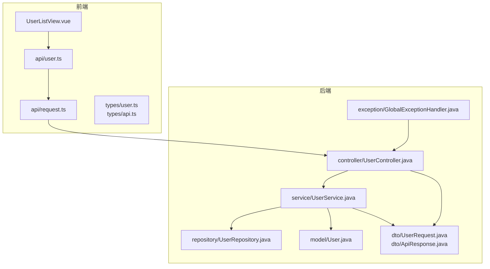
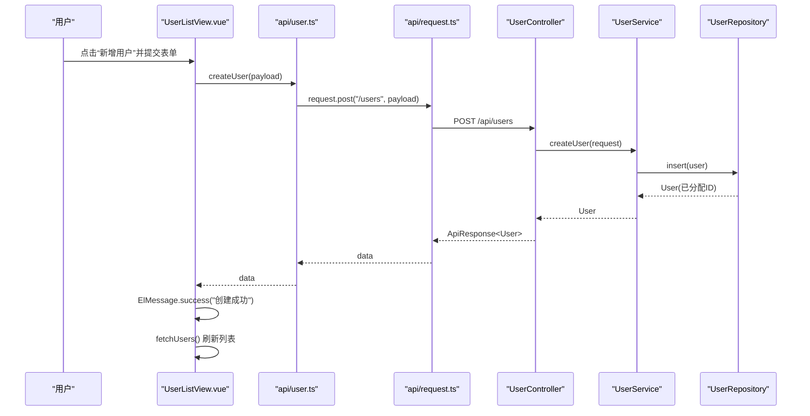
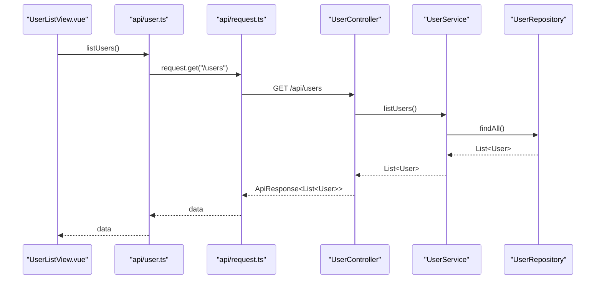
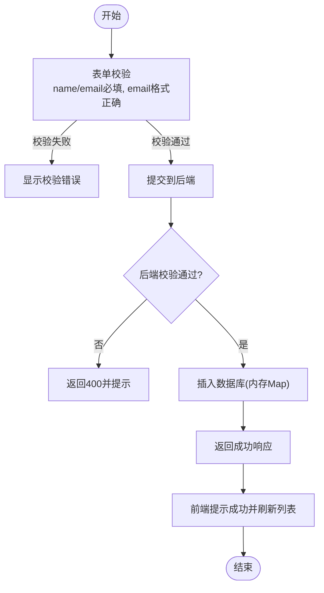
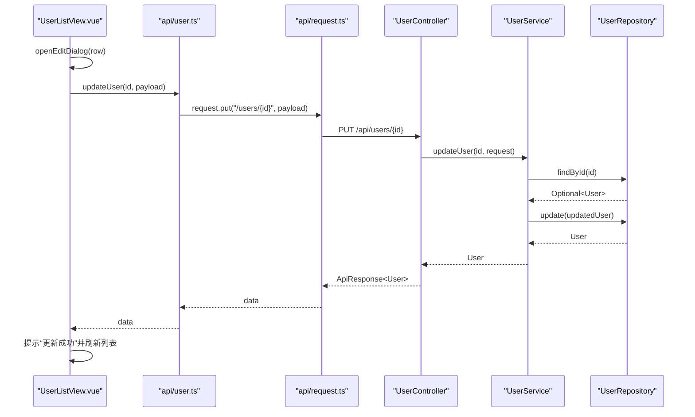
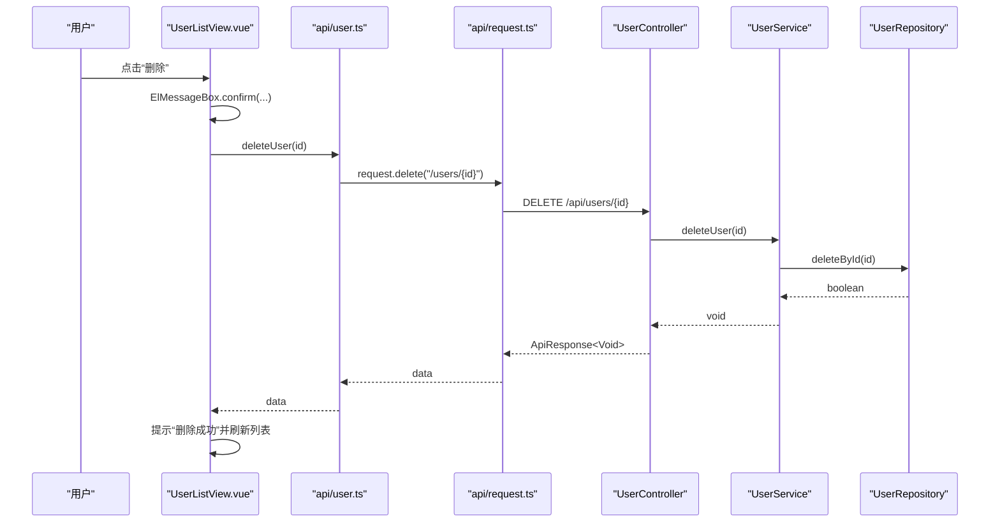
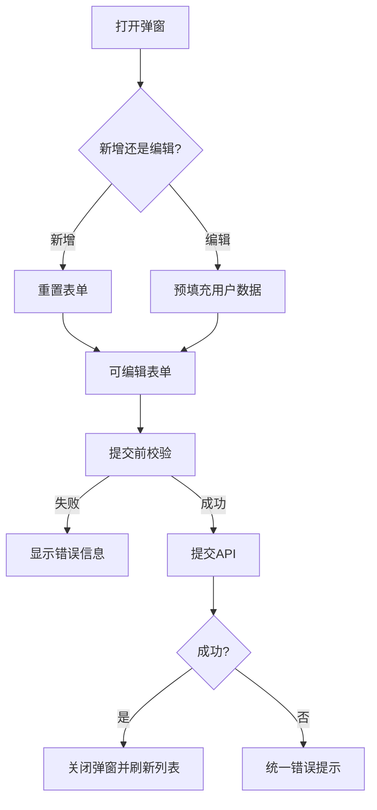
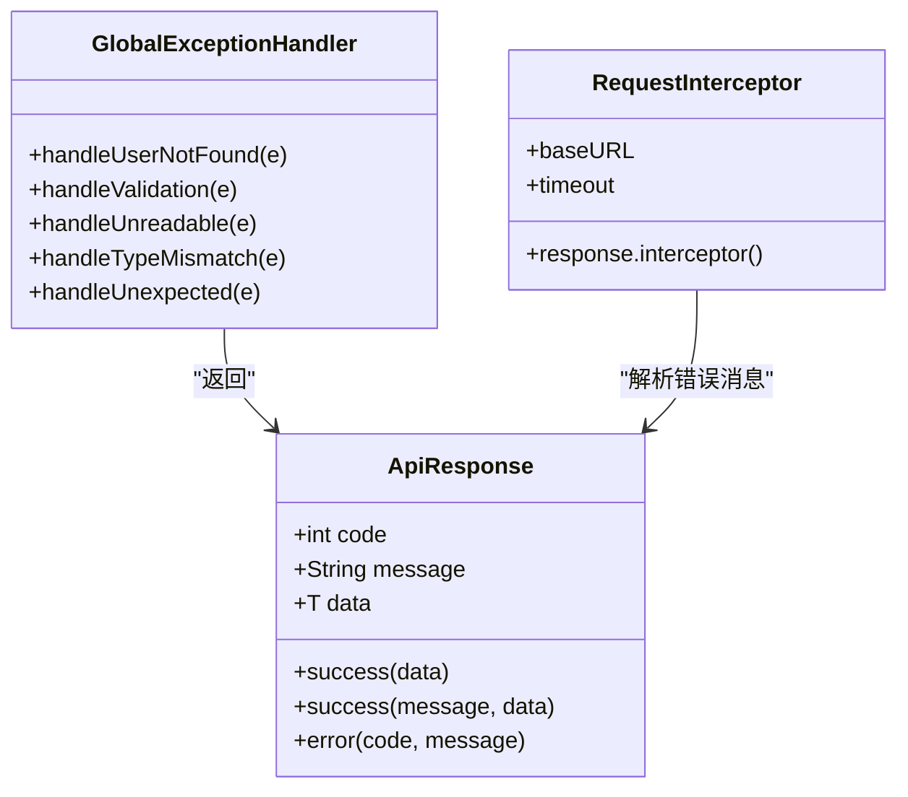
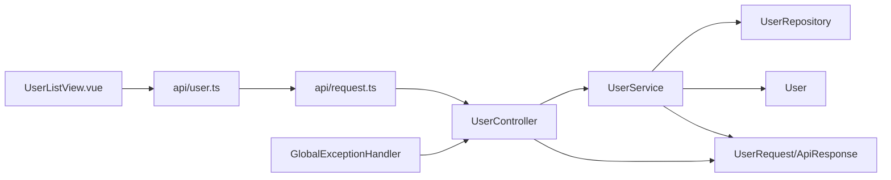

# 用户增删改查操作

<cite>
**本文引用的文件**
- [UserController.java](file://backend/src/main/java/com/aicoding/backend/controller/UserController.java)
- [UserService.java](file://backend/src/main/java/com/aicoding/backend/service/UserService.java)
- [UserRepository.java](file://backend/src/main/java/com/aicoding/backend/repository/UserRepository.java)
- [User.java](file://backend/src/main/java/com/aicoding/backend/model/User.java)
- [UserRequest.java](file://backend/src/main/java/com/aicoding/backend/dto/UserRequest.java)
- [ApiResponse.java](file://backend/src/main/java/com/aicoding/backend/dto/ApiResponse.java)
- [GlobalExceptionHandler.java](file://backend/src/main/java/com/aicoding/backend/exception/GlobalExceptionHandler.java)
- [UserNotFoundException.java](file://backend/src/main/java/com/aicoding/backend/exception/UserNotFoundException.java)
- [application.yml](file://backend/src/main/resources/application.yml)
- [UserListView.vue](file://frontend/src/views/UserListView.vue)
- [user.ts](file://frontend/src/api/user.ts)
- [request.ts](file://frontend/src/api/request.ts)
- [user.ts（类型）](file://frontend/src/types/user.ts)
- [api.ts（类型）](file://frontend/src/types/api.ts)
</cite>

## 目录
1. [简介](#简介)
2. [项目结构](#项目结构)
3. [核心组件](#核心组件)
4. [架构总览](#架构总览)
5. [详细组件分析](#详细组件分析)
6. [依赖关系分析](#依赖关系分析)
7. [性能考虑](#性能考虑)
8. [故障排查指南](#故障排查指南)
9. [结论](#结论)
10. [附录](#附录)

## 简介
本文件面向“用户管理”的完整 CRUD 实现，覆盖新增、编辑、删除、查询的业务流程与前后端交互细节。重点包括：
- 弹窗对话框的新增/编辑模式切换、表单数据绑定与校验
- 用户创建流程：表单验证、提交、成功反馈与列表刷新
- 用户编辑流程：数据预填充、修改保存与变更检测
- 用户删除流程：确认对话框、删除执行与后续处理
- API 封装：请求参数构造、响应处理与错误处理
- 前后端数据同步机制：乐观更新策略、冲突解决与一致性保证
- 扩展指南：批量操作、导入导出、操作历史
- 测试用例与异常处理策略

## 项目结构
后端采用 Spring Boot 分层架构：Controller 暴露 REST 接口，Service 承载业务逻辑，Repository 负责数据访问（内存演示），Model/DTO 定义数据结构；全局异常处理器统一错误响应。前端基于 Vue 3 + Element Plus，提供用户列表、搜索、分页、弹窗表单与删除确认等交互，并通过 axios 封装统一请求与错误提示。

图表来源
- [UserListView.vue:1-278](file://frontend/src/views/UserListView.vue#L1-L278)
- [user.ts:1-29](file://frontend/src/api/user.ts#L1-L29)
- [request.ts:1-26](file://frontend/src/api/request.ts#L1-L26)
- [UserController.java:1-66](file://backend/src/main/java/com/aicoding/backend/controller/UserController.java#L1-L66)
- [UserService.java:1-57](file://backend/src/main/java/com/aicoding/backend/service/UserService.java#L1-L57)
- [UserRepository.java:1-55](file://backend/src/main/java/com/aicoding/backend/repository/UserRepository.java#L1-L55)
- [User.java:1-16](file://backend/src/main/java/com/aicoding/backend/model/User.java#L1-L16)
- [UserRequest.java:1-25](file://backend/src/main/java/com/aicoding/backend/dto/UserRequest.java#L1-L25)
- [ApiResponse.java:1-24](file://backend/src/main/java/com/aicoding/backend/dto/ApiResponse.java#L1-L24)
- [GlobalExceptionHandler.java:1-58](file://backend/src/main/java/com/aicoding/backend/exception/GlobalExceptionHandler.java#L1-L58)

章节来源
- [application.yml:1-11](file://backend/src/main/resources/application.yml#L1-L11)

## 核心组件
- 控制器层：提供 /api/users 的 GET、POST、PUT、DELETE 接口，返回统一 ApiResponse。
- 服务层：封装用户业务逻辑，包含示例数据初始化、CRUD 调用仓储并抛出领域异常。
- 仓储层：内存 Map 存储用户，提供插入、更新、查找、删除与排序列表。
- 模型与 DTO：User 实体记录；UserRequest 用于入参校验；ApiResponse 统一响应体。
- 异常处理：全局异常处理器将校验失败、参数不匹配、未找到用户等转换为统一错误响应。
- 前端页面：用户列表、搜索过滤、分页、新增/编辑弹窗、删除确认、加载状态与消息提示。
- 前端 API 封装：axios 实例统一 baseURL、超时与错误提示；按资源划分 user.ts 方法。

章节来源
- [UserController.java:24-65](file://backend/src/main/java/com/aicoding/backend/controller/UserController.java#L24-L65)
- [UserService.java:15-56](file://backend/src/main/java/com/aicoding/backend/service/UserService.java#L15-L56)
- [UserRepository.java:16-54](file://backend/src/main/java/com/aicoding/backend/repository/UserRepository.java#L16-L54)
- [User.java:8-15](file://backend/src/main/java/com/aicoding/backend/model/User.java#L8-L15)
- [UserRequest.java:10-24](file://backend/src/main/java/com/aicoding/backend/dto/UserRequest.java#L10-L24)
- [ApiResponse.java:6-23](file://backend/src/main/java/com/aicoding/backend/dto/ApiResponse.java#L6-L23)
- [GlobalExceptionHandler.java:17-57](file://backend/src/main/java/com/aicoding/backend/exception/GlobalExceptionHandler.java#L17-L57)
- [UserListView.vue:1-278](file://frontend/src/views/UserListView.vue#L1-L278)
- [user.ts:1-29](file://frontend/src/api/user.ts#L1-L29)
- [request.ts:1-26](file://frontend/src/api/request.ts#L1-L26)

## 架构总览
下图展示一次“新增用户”的端到端调用链：前端触发提交 -> 调用封装 API -> axios 发送请求 -> 控制器接收 -> 服务层校验与持久化 -> 仓储层写入 -> 统一响应 -> 前端提示并刷新列表。

图表来源
- [UserListView.vue:183-208](file://frontend/src/views/UserListView.vue#L183-L208)
- [user.ts:15-18](file://frontend/src/api/user.ts#L15-L18)
- [request.ts:8-23](file://frontend/src/api/request.ts#L8-L23)
- [UserController.java:46-51](file://backend/src/main/java/com/aicoding/backend/controller/UserController.java#L46-L51)
- [UserService.java:40-43](file://backend/src/main/java/com/aicoding/backend/service/UserService.java#L40-L43)
- [UserRepository.java:22-29](file://backend/src/main/java/com/aicoding/backend/repository/UserRepository.java#L22-L29)

## 详细组件分析

### 用户查询（列表、详情）
- 前端：页面加载时调用 listUsers 获取数据，支持关键字过滤与前端分页。
- 后端：GET /api/users 返回列表；GET /api/users/{id} 返回单个用户，不存在抛出自定义异常。
- 数据流：前端通过 axios 发起请求，后端以 ApiResponse 包裹结果，前端在拦截器中统一处理错误。

图表来源
- [UserListView.vue:148-158](file://frontend/src/views/UserListView.vue#L148-L158)
- [user.ts:5-8](file://frontend/src/api/user.ts#L5-L8)
- [UserController.java:34-38](file://backend/src/main/java/com/aicoding/backend/controller/UserController.java#L34-L38)
- [UserService.java:31-33](file://backend/src/main/java/com/aicoding/backend/service/UserService.java#L31-L33)
- [UserRepository.java:44-49](file://backend/src/main/java/com/aicoding/backend/repository/UserRepository.java#L44-L49)

章节来源
- [UserListView.vue:125-158](file://frontend/src/views/UserListView.vue#L125-L158)
- [user.ts:5-13](file://frontend/src/api/user.ts#L5-L13)
- [UserController.java:34-44](file://backend/src/main/java/com/aicoding/backend/controller/UserController.java#L34-L44)
- [UserService.java:31-38](file://backend/src/main/java/com/aicoding/backend/service/UserService.java#L31-L38)
- [UserRepository.java:37-49](file://backend/src/main/java/com/aicoding/backend/repository/UserRepository.java#L37-L49)

### 用户新增
- 前端弹窗：新增模式下 isEdit=false，清空表单；提交前进行表单校验（必填、邮箱格式）。
- 数据提交：构造 UserForm 后调用 createUser，成功后显示成功消息并关闭弹窗，最后刷新列表。
- 后端校验：使用 Bean Validation 注解校验 name、email、phone；校验失败由全局异常处理器返回 400。
- 持久化：Service 组装 User 并调用 Repository.insert，自动分配 ID 与创建时间。

图表来源
- [UserListView.vue:117-123](file://frontend/src/views/UserListView.vue#L117-L123)
- [UserListView.vue:183-208](file://frontend/src/views/UserListView.vue#L183-L208)
- [UserRequest.java:10-24](file://backend/src/main/java/com/aicoding/backend/dto/UserRequest.java#L10-L24)
- [GlobalExceptionHandler.java:27-35](file://backend/src/main/java/com/aicoding/backend/exception/GlobalExceptionHandler.java#L27-L35)
- [UserService.java:40-43](file://backend/src/main/java/com/aicoding/backend/service/UserService.java#L40-L43)
- [UserRepository.java:22-29](file://backend/src/main/java/com/aicoding/backend/repository/UserRepository.java#L22-L29)

章节来源
- [UserListView.vue:160-208](file://frontend/src/views/UserListView.vue#L160-L208)
- [user.ts:15-18](file://frontend/src/api/user.ts#L15-L18)
- [UserController.java:46-51](file://backend/src/main/java/com/aicoding/backend/controller/UserController.java#L46-L51)
- [UserService.java:40-43](file://backend/src/main/java/com/aicoding/backend/service/UserService.java#L40-L43)
- [UserRequest.java:10-24](file://backend/src/main/java/com/aicoding/backend/dto/UserRequest.java#L10-L24)
- [GlobalExceptionHandler.java:27-35](file://backend/src/main/java/com/aicoding/backend/exception/GlobalExceptionHandler.java#L27-L35)

### 用户编辑
- 弹窗模式切换：isEdit=true 时标题为“编辑用户”，并预填充当前用户信息。
- 数据绑定：表单字段双向绑定 form.name/email/phone，提交时去除首尾空白。
- 变更检测：通过 editingId 区分新增与编辑；提交时根据模式调用 updateUser。
- 后端更新：Service 先查询现有用户，再构造新对象并调用 update；若用户不存在则抛异常。

图表来源
- [UserListView.vue:166-173](file://frontend/src/views/UserListView.vue#L166-L173)
- [UserListView.vue:183-208](file://frontend/src/views/UserListView.vue#L183-L208)
- [user.ts:20-23](file://frontend/src/api/user.ts#L20-L23)
- [UserController.java:53-57](file://backend/src/main/java/com/aicoding/backend/controller/UserController.java#L53-L57)
- [UserService.java:45-49](file://backend/src/main/java/com/aicoding/backend/service/UserService.java#L45-L49)
- [UserRepository.java:31-35](file://backend/src/main/java/com/aicoding/backend/repository/UserRepository.java#L31-L35)

章节来源
- [UserListView.vue:166-208](file://frontend/src/views/UserListView.vue#L166-L208)
- [user.ts:20-23](file://frontend/src/api/user.ts#L20-L23)
- [UserController.java:53-57](file://backend/src/main/java/com/aicoding/backend/controller/UserController.java#L53-L57)
- [UserService.java:45-49](file://backend/src/main/java/com/aicoding/backend/service/UserService.java#L45-L49)
- [UserRepository.java:31-35](file://backend/src/main/java/com/aicoding/backend/repository/UserRepository.java#L31-L35)

### 用户删除
- 确认对话框：调用 ElMessageBox.confirm 二次确认，避免误删。
- 删除执行：确认后调用 deleteUser，成功后提示并刷新列表。
- 后端删除：Service 调用 deleteById，若不存在抛自定义异常；全局异常处理器返回 404。

图表来源
- [UserListView.vue:210-228](file://frontend/src/views/UserListView.vue#L210-L228)
- [user.ts:25-28](file://frontend/src/api/user.ts#L25-L28)
- [UserController.java:59-64](file://backend/src/main/java/com/aicoding/backend/controller/UserController.java#L59-L64)
- [UserService.java:51-55](file://backend/src/main/java/com/aicoding/backend/service/UserService.java#L51-L55)
- [UserRepository.java:51-53](file://backend/src/main/java/com/aicoding/backend/repository/UserRepository.java#L51-L53)

章节来源
- [UserListView.vue:210-228](file://frontend/src/views/UserListView.vue#L210-L228)
- [user.ts:25-28](file://frontend/src/api/user.ts#L25-L28)
- [UserController.java:59-64](file://backend/src/main/java/com/aicoding/backend/controller/UserController.java#L59-L64)
- [UserService.java:51-55](file://backend/src/main/java/com/aicoding/backend/service/UserService.java#L51-L55)
- [GlobalExceptionHandler.java:20-25](file://backend/src/main/java/com/aicoding/backend/exception/GlobalExceptionHandler.java#L20-L25)

### 弹窗对话框与表单交互
- 模式切换：isEdit 控制标题与行为；editingId 标识编辑目标。
- 数据绑定：form 使用 reactive 绑定输入框；重置时清空字段与校验状态。
- 校验规则：name/email 必填，email 格式校验；提交前调用 validate。
- 交互反馈：loading 与 submitting 控制按钮状态；成功/失败消息提示。

图表来源
- [UserListView.vue:64-86](file://frontend/src/views/UserListView.vue#L64-L86)
- [UserListView.vue:117-123](file://frontend/src/views/UserListView.vue#L117-L123)
- [UserListView.vue:160-181](file://frontend/src/views/UserListView.vue#L160-L181)
- [UserListView.vue:183-208](file://frontend/src/views/UserListView.vue#L183-L208)

章节来源
- [UserListView.vue:64-208](file://frontend/src/views/UserListView.vue#L64-L208)

### API 封装与错误处理
- 前端请求：axios.create 设置 baseURL=/api 与超时；响应拦截器统一解包 response.data 并在错误时弹出 ElMessage.error。
- 后端响应：统一 ApiResponse(code, message, data)，成功 code=0；全局异常处理器将各类异常转为 ApiResponse。
- 类型定义：前端 types 定义 User、UserForm 与 ApiResponse，确保类型安全。

图表来源
- [ApiResponse.java:6-23](file://backend/src/main/java/com/aicoding/backend/dto/ApiResponse.java#L6-L23)
- [GlobalExceptionHandler.java:17-57](file://backend/src/main/java/com/aicoding/backend/exception/GlobalExceptionHandler.java#L17-L57)
- [request.ts:8-23](file://frontend/src/api/request.ts#L8-L23)
- [api.ts:1-7](file://frontend/src/types/api.ts#L1-L7)

章节来源
- [request.ts:1-26](file://frontend/src/api/request.ts#L1-L26)
- [api.ts:1-7](file://frontend/src/types/api.ts#L1-L7)
- [ApiResponse.java:1-24](file://backend/src/main/java/com/aicoding/backend/dto/ApiResponse.java#L1-L24)
- [GlobalExceptionHandler.java:1-58](file://backend/src/main/java/com/aicoding/backend/exception/GlobalExceptionHandler.java#L1-L58)

### 前后端数据同步机制
- 乐观更新策略：当前实现采用“提交成功后刷新列表”的方式，保证最终一致性；适合无并发冲突场景。
- 冲突解决：若未来存在多人同时编辑同一用户，可在 Service 层引入版本号或时间戳比较，冲突时返回特定码并提示用户重新加载。
- 一致性保证：后端仓储为内存 Map，单进程内一致；生产环境替换为数据库事务，确保读写一致性与回滚。

[本节为概念性说明，不直接分析具体文件]

### 扩展指南
- 批量操作：可增加批量删除/批量启用接口，前端多选行后调用批量 API，后端使用事务批量处理。
- 导入导出：增加 CSV/Excel 导入接口与导出接口，服务端校验数据并批量入库；前端提供上传与下载按钮。
- 操作历史：记录关键操作的审计日志（谁在何时做了什么），便于追溯与合规。
- 权限控制：结合角色与资源权限，限制敏感操作（如删除）的可见性与可执行性。

[本节为概念性说明，不直接分析具体文件]

## 依赖关系分析
- 控制器依赖服务，服务依赖仓储与模型；DTO 用于入参与响应包装；异常处理器集中处理异常。
- 前端页面依赖 API 模块，API 模块依赖 axios 实例；类型定义贯穿前后端契约。

图表来源
- [UserListView.vue:1-278](file://frontend/src/views/UserListView.vue#L1-L278)
- [user.ts:1-29](file://frontend/src/api/user.ts#L1-L29)
- [request.ts:1-26](file://frontend/src/api/request.ts#L1-L26)
- [UserController.java:1-66](file://backend/src/main/java/com/aicoding/backend/controller/UserController.java#L1-L66)
- [UserService.java:1-57](file://backend/src/main/java/com/aicoding/backend/service/UserService.java#L1-L57)
- [UserRepository.java:1-55](file://backend/src/main/java/com/aicoding/backend/repository/UserRepository.java#L1-L55)
- [User.java:1-16](file://backend/src/main/java/com/aicoding/backend/model/User.java#L1-L16)
- [UserRequest.java:1-25](file://backend/src/main/java/com/aicoding/backend/dto/UserRequest.java#L1-L25)
- [ApiResponse.java:1-24](file://backend/src/main/java/com/aicoding/backend/dto/ApiResponse.java#L1-L24)
- [GlobalExceptionHandler.java:1-58](file://backend/src/main/java/com/aicoding/backend/exception/GlobalExceptionHandler.java#L1-L58)

章节来源
- [UserController.java:1-66](file://backend/src/main/java/com/aicoding/backend/controller/UserController.java#L1-L66)
- [UserService.java:1-57](file://backend/src/main/java/com/aicoding/backend/service/UserService.java#L1-L57)
- [UserRepository.java:1-55](file://backend/src/main/java/com/aicoding/backend/repository/UserRepository.java#L1-L55)
- [UserListView.vue:1-278](file://frontend/src/views/UserListView.vue#L1-L278)
- [user.ts:1-29](file://frontend/src/api/user.ts#L1-L29)
- [request.ts:1-26](file://frontend/src/api/request.ts#L1-L26)

## 性能考虑
- 前端分页与过滤：当前使用前端分页与关键字过滤，适合中小规模数据；大数据量建议改为后端分页与搜索。
- 网络优化：合理设置超时与重试策略；对频繁读取的列表可考虑缓存。
- 后端存储：内存 Map 仅用于演示；生产环境应使用数据库索引与连接池，提升查询与写入性能。
- 并发安全：内存 Map 使用 ConcurrentHashMap 保证基本并发安全；生产环境需考虑事务隔离级别与锁策略。

[本节为通用性能建议，不直接分析具体文件]

## 故障排查指南
- 参数校验失败：检查前端表单规则与后端 @NotBlank/@Email/@Size 注解；查看全局异常处理器返回的错误信息。
- 用户不存在：删除或更新时若 ID 无效，会抛出 UserNotFoundException，前端通过统一错误提示。
- JSON 解析错误：请求体格式不正确会导致 HttpMessageNotReadableException，检查前端提交的字段名与类型。
- 路径参数类型不匹配：例如传入非数字 ID，会触发类型不匹配异常，检查 URL 参数类型。
- 网络错误：axios 拦截器统一捕获并提示；检查 baseURL、跨域配置与服务端口。

章节来源
- [GlobalExceptionHandler.java:20-57](file://backend/src/main/java/com/aicoding/backend/exception/GlobalExceptionHandler.java#L20-L57)
- [UserNotFoundException.java:6-11](file://backend/src/main/java/com/aicoding/backend/exception/UserNotFoundException.java#L6-L11)
- [request.ts:13-23](file://frontend/src/api/request.ts#L13-L23)

## 结论
该用户管理系统实现了完整的 CRUD 流程，前后端职责清晰、错误处理统一、交互友好。通过表单校验、确认对话框与统一响应结构，保证了用户体验与系统健壮性。建议在后续迭代中引入后端分页与搜索、并发冲突处理、审计日志与权限控制，以提升可扩展性与安全性。

[本节为总结性内容，不直接分析具体文件]

## 附录
- 环境变量与配置：后端服务端口与日志级别在 application.yml 中配置。
- 类型契约：前端 types 与后端 DTO 共同定义数据契约，确保前后端一致。
- 测试建议：
  - 单元测试：针对 Service 层编写新增、更新、删除与查询的断言。
  - 接口测试：使用 Postman 或集成测试验证各接口的正常与异常分支。
  - 前端测试：对弹窗交互、表单校验与消息提示进行单元与集成测试。

章节来源
- [application.yml:1-11](file://backend/src/main/resources/application.yml#L1-L11)
- [user.ts（类型）:1-16](file://frontend/src/types/user.ts#L1-L16)
- [api.ts（类型）:1-7](file://frontend/src/types/api.ts#L1-L7)