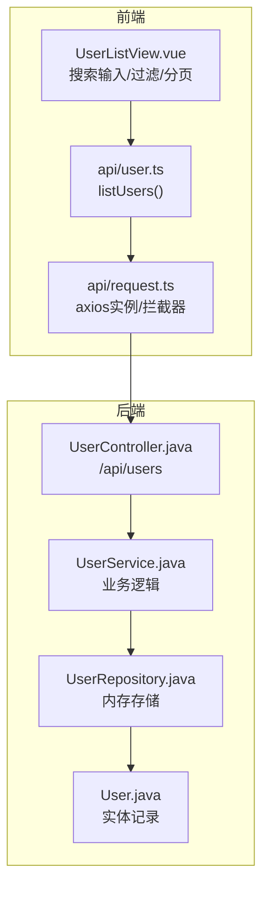
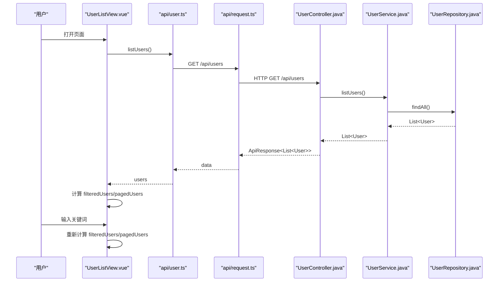
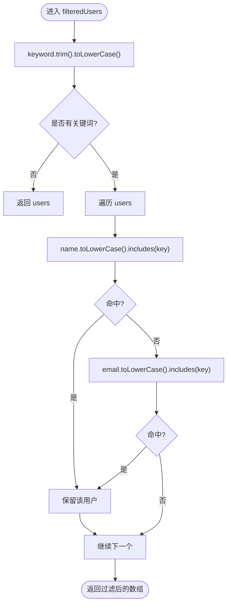
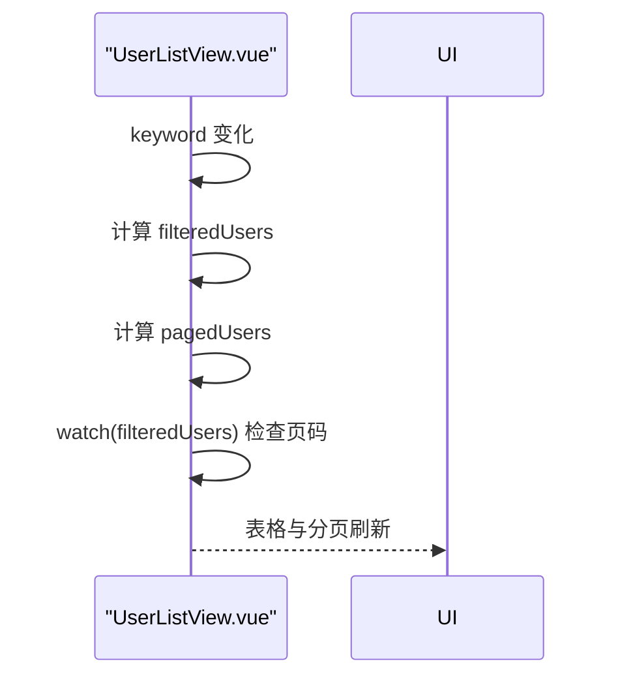
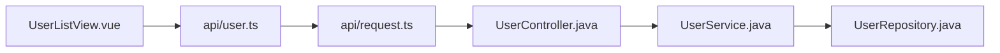

# 用户搜索过滤

<cite>
**本文引用的文件**
- [UserListView.vue](file://frontend/src/views/UserListView.vue)
- [user.ts](file://frontend/src/api/user.ts)
- [request.ts](file://frontend/src/api/request.ts)
- [user.ts（类型定义）](file://frontend/src/types/user.ts)
- [api.ts（类型定义）](file://frontend/src/types/api.ts)
- [UserController.java](file://backend/src/main/java/com/aicoding/backend/controller/UserController.java)
- [UserService.java](file://backend/src/main/java/com/aicoding/backend/service/UserService.java)
- [UserRepository.java](file://backend/src/main/java/com/aicoding/backend/repository/UserRepository.java)
- [User.java（后端模型）](file://backend/src/main/java/com/aicoding/backend/model/User.java)
</cite>

## 目录
1. [简介](#简介)
2. [项目结构](#项目结构)
3. [核心组件](#核心组件)
4. [架构总览](#架构总览)
5. [详细组件分析](#详细组件分析)
6. [依赖关系分析](#依赖关系分析)
7. [性能考虑](#性能考虑)
8. [故障排查指南](#故障排查指南)
9. [结论](#结论)
10. [附录：扩展指南](#附录扩展指南)

## 简介
本文件聚焦前端“用户搜索过滤”功能，系统性说明实时搜索的实现机制、关键词监听与过滤算法、computed 属性 filteredUsers 的工作原理、大小写不敏感匹配策略、搜索与分页的协同更新、用户体验设计要点，以及后续扩展方向（新增搜索字段、高级条件、后端集成）。

## 项目结构
前端采用 Vue 3 + Element Plus 的单页应用；后端为 Spring Boot REST API。用户列表页面通过 API 获取数据，并在前端完成关键字过滤与分页展示。

图表来源
- [UserListView.vue:1-278](file://frontend/src/views/UserListView.vue#L1-L278)
- [user.ts:1-29](file://frontend/src/api/user.ts#L1-L29)
- [request.ts:1-26](file://frontend/src/api/request.ts#L1-L26)
- [UserController.java:1-66](file://backend/src/main/java/com/aicoding/backend/controller/UserController.java#L1-L66)
- [UserService.java:1-57](file://backend/src/main/java/com/aicoding/backend/service/UserService.java#L1-L57)
- [UserRepository.java:1-55](file://backend/src/main/java/com/aicoding/backend/repository/UserRepository.java#L1-L55)
- [User.java:1-16](file://backend/src/main/java/com/aicoding/backend/model/User.java#L1-L16)

章节来源
- [UserListView.vue:1-278](file://frontend/src/views/UserListView.vue#L1-L278)
- [user.ts:1-29](file://frontend/src/api/user.ts#L1-L29)
- [request.ts:1-26](file://frontend/src/api/request.ts#L1-L26)
- [UserController.java:1-66](file://backend/src/main/java/com/aicoding/backend/controller/UserController.java#L1-L66)
- [UserService.java:1-57](file://backend/src/main/java/com/aicoding/backend/service/UserService.java#L1-L57)
- [UserRepository.java:1-55](file://backend/src/main/java/com/aicoding/backend/repository/UserRepository.java#L1-L55)
- [User.java:1-16](file://backend/src/main/java/com/aicoding/backend/model/User.java#L1-L16)

## 核心组件
- 搜索输入框：绑定 keyword，支持 clearable 清空、前缀图标 Search、占位提示“按姓名 / 邮箱搜索”。
- 过滤计算：computed filteredUsers 基于 keyword 对 users 进行多字段模糊匹配。
- 分页计算：computed pagedUsers 基于 page 和 pageSize 从 filteredUsers 中切片。
- 状态联动：watch filteredUsers 自动回退到有效页码，避免空页。
- 数据获取：onMounted 调用 listUsers 拉取全量数据，用于前端过滤与分页。

章节来源
- [UserListView.vue:14-21](file://frontend/src/views/UserListView.vue#L14-L21)
- [UserListView.vue:125-146](file://frontend/src/views/UserListView.vue#L125-L146)
- [UserListView.vue:148-158](file://frontend/src/views/UserListView.vue#L148-L158)

## 架构总览
前端在页面挂载时请求后端接口获取用户列表，随后在前端完成关键字过滤与分页。搜索关键词变化会触发 computed 重新计算，并联动分页状态，保证结果始终可显示。

图表来源
- [UserListView.vue:148-158](file://frontend/src/views/UserListView.vue#L148-L158)
- [user.ts:6-8](file://frontend/src/api/user.ts#L6-L8)
- [request.ts:8-23](file://frontend/src/api/request.ts#L8-L23)
- [UserController.java:34-38](file://backend/src/main/java/com/aicoding/backend/controller/UserController.java#L34-L38)
- [UserService.java:31-33](file://backend/src/main/java/com/aicoding/backend/service/UserService.java#L31-L33)
- [UserRepository.java:44-49](file://backend/src/main/java/com/aicoding/backend/repository/UserRepository.java#L44-L49)

## 详细组件分析

### 搜索输入框配置与事件流
- 使用 v-model 双向绑定 keyword，实现实时响应。
- 启用 clearable，点击清空按钮将 keyword 置为空，触发 computed 恢复全量数据。
- 占位符提示“按姓名 / 邮箱搜索”，明确可搜索字段范围。
- 前缀图标 Search 提升识别度。

章节来源
- [UserListView.vue:14-21](file://frontend/src/views/UserListView.vue#L14-L21)

### 关键词监听与过滤算法
- 过滤入口：computed filteredUsers。
- 大小写不敏感：先将 keyword 转为小写；再将 user.name 与 user.email 分别转小写后做包含判断。
- 多字段匹配：满足 name 或 email 任一包含即命中。
- 无关键词时直接返回原始 users，避免不必要的过滤开销。

图表来源
- [UserListView.vue:125-132](file://frontend/src/views/UserListView.vue#L125-L132)

章节来源
- [UserListView.vue:125-132](file://frontend/src/views/UserListView.vue#L125-L132)

### computed 属性 filteredUsers 工作原理
- 依赖 keyword 与 users 两个响应式源，任一变化都会重新计算。
- 计算复杂度 O(N)，N 为用户总数；适合中小规模数据的前端过滤。
- 与分页解耦：先过滤再分页，确保分页统计基于过滤结果。

章节来源
- [UserListView.vue:125-132](file://frontend/src/views/UserListView.vue#L125-L132)

### 大小写不敏感搜索的实现
- 统一将关键词与目标字段转换为小写后再比较，避免大小写差异导致漏匹配。
- 适用于中英文混合场景（英文部分遵循大小写规则，中文不受影响）。

章节来源
- [UserListView.vue:125-132](file://frontend/src/views/UserListView.vue#L125-L132)

### 搜索结果的实时更新机制
- 每次 keyword 变化都会触发 computed 重新计算，进而更新 pagedUsers。
- watch filteredUsers 会在过滤结果长度变化时，自动校验当前页码是否越界，必要时回退到最后一页，避免空页。

图表来源
- [UserListView.vue:125-146](file://frontend/src/views/UserListView.vue#L125-L146)

章节来源
- [UserListView.vue:125-146](file://frontend/src/views/UserListView.vue#L125-L146)

### 搜索状态与分页状态的协调工作
- 分页基于 filteredUsers 的长度作为 total，确保分页控件与实际数据一致。
- 当过滤结果减少导致当前页超出范围时，watch 自动将 page 调整至最大有效页。
- 用户切换页码或每页条数时，基于最新 filteredUsers 切片，保证一致性。

章节来源
- [UserListView.vue:50-58](file://frontend/src/views/UserListView.vue#L50-L58)
- [UserListView.vue:134-146](file://frontend/src/views/UserListView.vue#L134-L146)

### 用户体验设计
- 清空按钮：clearable 一键清空关键词，快速恢复全量列表。
- 搜索提示：占位符明确可搜索字段，降低学习成本。
- 无结果状态：当 filteredUsers 为空时，表格自然显示为空，配合分页 total 为 0，直观反馈。
- 加载态：列表区域使用 v-loading，提升交互感知。

章节来源
- [UserListView.vue:14-21](file://frontend/src/views/UserListView.vue#L14-L21)
- [UserListView.vue:24-48](file://frontend/src/views/UserListView.vue#L24-L48)
- [UserListView.vue:50-58](file://frontend/src/views/UserListView.vue#L50-L58)

## 依赖关系分析
- 前端视图依赖 api/user.ts 提供的 listUsers 方法。
- api/user.ts 依赖 request.ts 的 axios 实例，统一 baseURL、超时与错误处理。
- 后端 UserController 暴露 /api/users 接口，委托 UserService 执行业务。
- UserService 通过 UserRepository 访问内存存储，返回排序后的用户列表。

图表来源
- [UserListView.vue:95-96](file://frontend/src/views/UserListView.vue#L95-L96)
- [user.ts:1-8](file://frontend/src/api/user.ts#L1-L8)
- [request.ts:1-26](file://frontend/src/api/request.ts#L1-L26)
- [UserController.java:1-66](file://backend/src/main/java/com/aicoding/backend/controller/UserController.java#L1-L66)
- [UserService.java:1-57](file://backend/src/main/java/com/aicoding/backend/service/UserService.java#L1-L57)
- [UserRepository.java:1-55](file://backend/src/main/java/com/aicoding/backend/repository/UserRepository.java#L1-L55)

章节来源
- [UserListView.vue:95-96](file://frontend/src/views/UserListView.vue#L95-L96)
- [user.ts:1-8](file://frontend/src/api/user.ts#L1-L8)
- [request.ts:1-26](file://frontend/src/api/request.ts#L1-L26)
- [UserController.java:1-66](file://backend/src/main/java/com/aicoding/backend/controller/UserController.java#L1-L66)
- [UserService.java:1-57](file://backend/src/main/java/com/aicoding/backend/service/UserService.java#L1-L57)
- [UserRepository.java:1-55](file://backend/src/main/java/com/aicoding/backend/repository/UserRepository.java#L1-L55)

## 性能考虑
- 前端过滤复杂度 O(N)，适合中小数据量；若用户量增长，建议引入防抖以减少频繁重算。
- 大数组优化建议：
  - 防抖：对 keyword 变更加防抖，降低高频输入时的计算压力。
  - 索引化：对常用字段建立倒排索引或使用 Trie/后缀树加速包含匹配。
  - 虚拟滚动：结合长列表虚拟化渲染，减少 DOM 节点数量。
  - 后端搜索：将关键字与分页参数传入后端，在服务端执行 SQL LIKE/全文检索，减轻前端负担。
- 当前实现已具备基础性能保障：无关键词时直接返回原数组，避免多余过滤。

[本节提供通用指导，不直接分析具体代码]

## 故障排查指南
- 搜索无结果：
  - 确认 keyword 是否为空字符串或仅空白字符；trim 已去除首尾空格。
  - 检查用户数据是否存在 name/email 字段缺失或为空的情况。
- 分页异常：
  - 若过滤后数据变少，watch 会自动回退到最后一页；如仍出现空页，检查 pageSize 与 total 的计算逻辑。
- 网络错误：
  - request.ts 已统一捕获错误并提示；检查后端服务是否启动、路由是否正确。
- 大小写问题：
  - 已统一转小写匹配；若需区分大小写，可移除 toLowerCase 转换。

章节来源
- [UserListView.vue:125-146](file://frontend/src/views/UserListView.vue#L125-L146)
- [request.ts:13-23](file://frontend/src/api/request.ts#L13-L23)

## 结论
该搜索功能以简洁的前端方案实现了实时、多字段、大小写不敏感的模糊搜索，并与分页状态良好协同。对于小规模数据表现稳定；随着数据规模增长，可通过防抖、索引化、虚拟滚动或后端搜索进一步优化体验与性能。

[本节为总结性内容，不直接分析具体代码]

## 附录：扩展指南
- 添加更多搜索字段：
  - 在 filteredUsers 中加入 phone 等字段的 includes 判断，保持 toLowerCase 转换。
  - 如需精确匹配某字段，可在条件分支中单独处理。
- 实现高级搜索条件：
  - 增加筛选器（如手机号段、创建时间范围），组合多个布尔条件。
  - 将筛选条件封装为函数，便于复用与测试。
- 集成后端搜索 API：
  - 在 listUsers 中追加 query 参数，由后端执行数据库级搜索。
  - 前端改为服务端分页，total 来自后端响应，避免前端全量数据。
  - 注意缓存与去抖，避免频繁请求。
- 无障碍与可访问性：
  - 为搜索框添加 aria-label，增强屏幕阅读器支持。
  - 无结果时给出明确提示文案，提升可用性。

[本节为扩展建议，不直接分析具体代码]