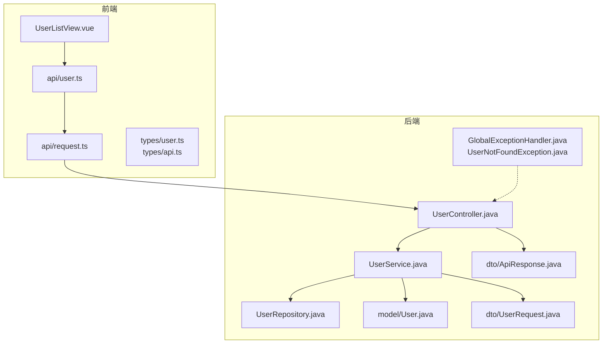
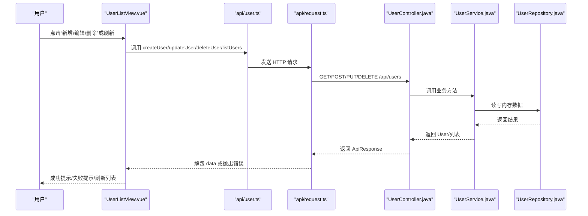
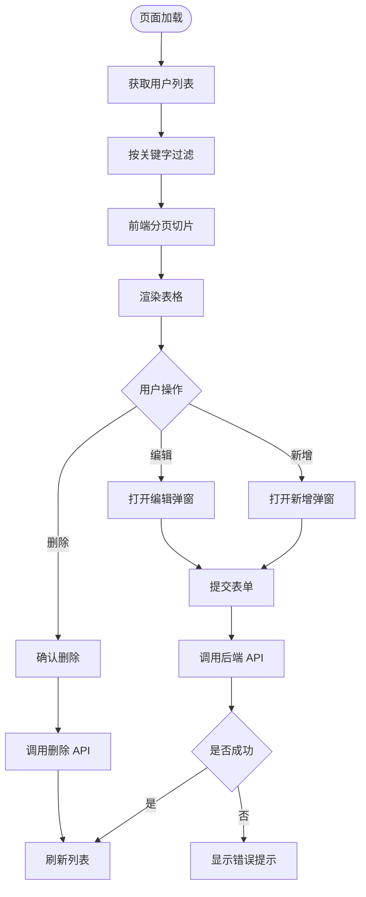
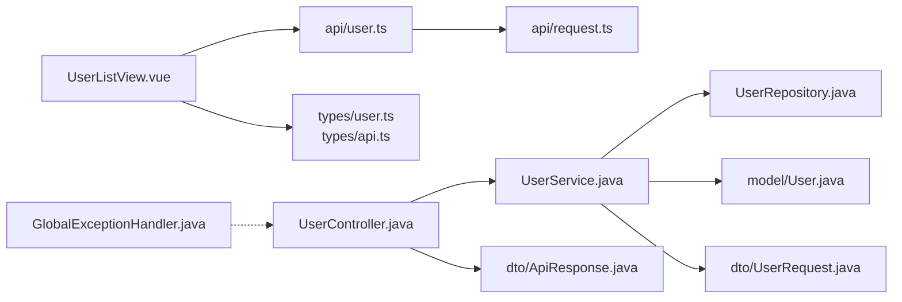

# 用户管理功能

<cite>
**本文引用的文件**
- [UserListView.vue](file://frontend/src/views/UserListView.vue)
- [user.ts](file://frontend/src/api/user.ts)
- [request.ts](file://frontend/src/api/request.ts)
- [user.ts（类型）](file://frontend/src/types/user.ts)
- [api.ts（类型）](file://frontend/src/types/api.ts)
- [UserController.java](file://backend/src/main/java/com/aicoding/backend/controller/UserController.java)
- [UserService.java](file://backend/src/main/java/com/aicoding/backend/service/UserService.java)
- [UserRepository.java](file://backend/src/main/java/com/aicoding/backend/repository/UserRepository.java)
- [User.java](file://backend/src/main/java/com/aicoding/backend/model/User.java)
- [UserRequest.java](file://backend/src/main/java/com/aicoding/backend/dto/UserRequest.java)
- [ApiResponse.java](file://backend/src/main/java/com/aicoding/backend/dto/ApiResponse.java)
- [GlobalExceptionHandler.java](file://backend/src/main/java/com/aicoding/backend/exception/GlobalExceptionHandler.java)
- [UserNotFoundException.java](file://backend/src/main/java/com/aicoding/backend/exception/UserNotFoundException.java)
- [UserApiTest.java](file://backend/src/test/java/com/aicoding/backend/UserApiTest.java)
</cite>

## 目录
1. [简介](#简介)
2. [项目结构](#项目结构)
3. [核心组件](#核心组件)
4. [架构总览](#架构总览)
5. [详细组件分析](#详细组件分析)
6. [依赖关系分析](#依赖关系分析)
7. [性能考虑](#性能考虑)
8. [故障排查指南](#故障排查指南)
9. [结论](#结论)
10. [附录：扩展与测试](#附录：扩展与测试)

## 简介
本模块实现了一个完整的用户管理功能，涵盖前端用户列表展示、搜索过滤、分页显示、表单验证与交互，以及后端 REST API 的增删改查。前后端通过统一的响应结构与 axios 拦截器进行数据同步，提供乐观更新体验与一致的错误提示。后端使用内存仓储进行演示数据的初始化与生命周期管理，便于快速验证与调试。

## 项目结构
前端采用 Vue 3 + Element Plus 构建用户界面；后端基于 Spring Boot 提供 RESTful API；中间层通过 axios 封装请求与统一错误处理；后端以内存 Map 作为临时数据存储，便于演示与测试。

图表来源
- [UserListView.vue:1-278](file://frontend/src/views/UserListView.vue#L1-L278)
- [user.ts:1-29](file://frontend/src/api/user.ts#L1-L29)
- [request.ts:1-26](file://frontend/src/api/request.ts#L1-L26)
- [UserController.java:1-66](file://backend/src/main/java/com/aicoding/backend/controller/UserController.java#L1-L66)
- [UserService.java:1-57](file://backend/src/main/java/com/aicoding/backend/service/UserService.java#L1-L57)
- [UserRepository.java:1-55](file://backend/src/main/java/com/aicoding/backend/repository/UserRepository.java#L1-L55)
- [User.java:1-16](file://backend/src/main/java/com/aicoding/backend/model/User.java#L1-L16)
- [UserRequest.java:1-25](file://backend/src/main/java/com/aicoding/backend/dto/UserRequest.java#L1-L25)
- [ApiResponse.java:1-24](file://backend/src/main/java/com/aicoding/backend/dto/ApiResponse.java#L1-L24)
- [GlobalExceptionHandler.java:1-58](file://backend/src/main/java/com/aicoding/backend/exception/GlobalExceptionHandler.java#L1-L58)
- [UserNotFoundException.java:1-12](file://backend/src/main/java/com/aicoding/backend/exception/UserNotFoundException.java#L1-L12)

章节来源
- [UserListView.vue:1-278](file://frontend/src/views/UserListView.vue#L1-L278)
- [UserController.java:1-66](file://backend/src/main/java/com/aicoding/backend/controller/UserController.java#L1-L66)

## 核心组件
- 前端页面：UserListView.vue 负责用户列表渲染、搜索过滤、分页、弹窗表单与交互。
- 前端 API 层：user.ts 暴露 CRUD 方法；request.ts 提供 axios 实例与统一错误处理。
- 后端控制器：UserController.java 定义 REST 路由并调用服务层。
- 后端服务：UserService.java 实现业务逻辑、数据校验与持久化编排。
- 内存仓储：UserRepository.java 使用并发 Map 存储用户实体，提供插入、更新、查询、删除。
- 数据模型：User.java、UserRequest.java、ApiResponse.java 定义前后端数据结构与统一响应。
- 异常处理：GlobalExceptionHandler.java 将各类异常转换为统一 ApiResponse。

章节来源
- [UserListView.vue:1-278](file://frontend/src/views/UserListView.vue#L1-L278)
- [user.ts:1-29](file://frontend/src/api/user.ts#L1-L29)
- [request.ts:1-26](file://frontend/src/api/request.ts#L1-L26)
- [UserController.java:1-66](file://backend/src/main/java/com/aicoding/backend/controller/UserController.java#L1-L66)
- [UserService.java:1-57](file://backend/src/main/java/com/aicoding/backend/service/UserService.java#L1-L57)
- [UserRepository.java:1-55](file://backend/src/main/java/com/aicoding/backend/repository/UserRepository.java#L1-L55)
- [User.java:1-16](file://backend/src/main/java/com/aicoding/backend/model/User.java#L1-L16)
- [UserRequest.java:1-25](file://backend/src/main/java/com/aicoding/backend/dto/UserRequest.java#L1-L25)
- [ApiResponse.java:1-24](file://backend/src/main/java/com/aicoding/backend/dto/ApiResponse.java#L1-L24)
- [GlobalExceptionHandler.java:1-58](file://backend/src/main/java/com/aicoding/backend/exception/GlobalExceptionHandler.java#L1-L58)

## 架构总览
前后端通过 RESTful API 通信，前端使用 axios 发起请求，后端返回统一 ApiResponse。服务层负责业务规则与数据持久化，仓储层提供内存级数据存取。全局异常处理器统一捕获并格式化错误信息。

图表来源
- [UserListView.vue:148-235](file://frontend/src/views/UserListView.vue#L148-L235)
- [user.ts:1-29](file://frontend/src/api/user.ts#L1-L29)
- [request.ts:1-26](file://frontend/src/api/request.ts#L1-L26)
- [UserController.java:34-64](file://backend/src/main/java/com/aicoding/backend/controller/UserController.java#L34-L64)
- [UserService.java:31-55](file://backend/src/main/java/com/aicoding/backend/service/UserService.java#L31-L55)
- [UserRepository.java:22-53](file://backend/src/main/java/com/aicoding/backend/repository/UserRepository.java#L22-L53)

## 详细组件分析

### 前端页面：UserListView.vue
- 数据展示：使用表格列展示 ID、姓名、邮箱、手机号、创建时间，并提供操作列用于编辑与删除。
- 搜索过滤：基于关键字对姓名和邮箱进行前端过滤，实时计算 filteredUsers。
- 分页显示：前端分页，根据当前页码与每页条数从过滤后的数据中切片得到 pagedUsers。
- 表单验证：Element Plus 表单规则校验必填项与邮箱格式，提交前执行 validate。
- 用户交互：新增/编辑弹窗复用同一表单，关闭时重置；删除前弹出确认框；成功后刷新列表。
- 数据流：onMounted 加载列表；提交后调用对应 API；错误由 axios 拦截器统一提示。

图表来源
- [UserListView.vue:125-146](file://frontend/src/views/UserListView.vue#L125-L146)
- [UserListView.vue:148-235](file://frontend/src/views/UserListView.vue#L148-L235)

章节来源
- [UserListView.vue:1-278](file://frontend/src/views/UserListView.vue#L1-L278)

### 前端 API 层：user.ts 与 request.ts
- user.ts：封装 listUsers、getUser、createUser、updateUser、deleteUser 五个方法，分别映射到后端 /api/users 相关路径。
- request.ts：创建 axios 实例，设置 baseURL 与超时；响应拦截器自动解包 response.data；错误时读取后端 message 并统一 ElMessage.error 提示。

章节来源
- [user.ts:1-29](file://frontend/src/api/user.ts#L1-L29)
- [request.ts:1-26](file://frontend/src/api/request.ts#L1-L26)

### 后端控制器：UserController.java
- 路由定义：GET /api/users（列表）、GET /api/users/{id}（详情）、POST /api/users（新增）、PUT /api/users/{id}（更新）、DELETE /api/users/{id}（删除）。
- 参数校验：使用 @Valid 注解触发 Bean Validation。
- 响应包装：所有接口返回 ApiResponse<T> 统一结构。

章节来源
- [UserController.java:24-64](file://backend/src/main/java/com/aicoding/backend/controller/UserController.java#L24-L64)

### 后端服务：UserService.java
- 职责：编排用户数据的创建、查询、更新、删除；在构造时初始化示例数据。
- 业务逻辑：
  - 列表：返回全部用户。
  - 详情：不存在则抛出自定义异常。
  - 新增：构造 User 实体并插入。
  - 更新：先获取现有用户，再替换字段并保存。
  - 删除：不存在则抛出自定义异常。
- 数据持久化：委托 UserRepository 完成内存存储。

章节来源
- [UserService.java:15-55](file://backend/src/main/java/com/aicoding/backend/service/UserService.java#L15-L55)

### 内存仓储：UserRepository.java
- 存储结构：ConcurrentHashMap<Long, User> 保证线程安全。
- 自增 ID：AtomicLong 生成唯一 ID。
- 方法说明：
  - insert：分配 ID 与创建时间，写入 Map。
  - update：覆盖指定 ID 的用户记录。
  - findById/findAll：支持空 ID 处理与排序输出。
  - deleteById：移除记录并返回是否成功。
- 生命周期：应用启动时由 UserService 构造阶段注入并初始化示例数据。

章节来源
- [UserRepository.java:16-53](file://backend/src/main/java/com/aicoding/backend/repository/UserRepository.java#L16-L53)
- [UserService.java:20-29](file://backend/src/main/java/com/aicoding/backend/service/UserService.java#L20-L29)

### 数据模型与统一响应
- User.java：用户实体，包含 id、name、email、phone、createdAt。
- UserRequest.java：新增/更新请求体，包含 name、email、phone 及校验约束。
- ApiResponse.java：统一响应结构 code/message/data，提供 success/error 静态工厂。

章节来源
- [User.java:8-15](file://backend/src/main/java/com/aicoding/backend/model/User.java#L8-L15)
- [UserRequest.java:10-23](file://backend/src/main/java/com/aicoding/backend/dto/UserRequest.java#L10-L23)
- [ApiResponse.java:6-22](file://backend/src/main/java/com/aicoding/backend/dto/ApiResponse.java#L6-L22)

### 异常处理：GlobalExceptionHandler.java 与 UserNotFoundException.java
- 全局异常处理：
  - 用户不存在：返回 404 与消息。
  - 参数校验失败：聚合字段错误信息，返回 400。
  - JSON 解析失败：返回 400。
  - 路径参数类型不匹配：返回 400。
  - 兜底异常：返回 500。
- 自定义异常：UserNotFoundException 携带用户 ID 信息。

章节来源
- [GlobalExceptionHandler.java:17-56](file://backend/src/main/java/com/aicoding/backend/exception/GlobalExceptionHandler.java#L17-L56)
- [UserNotFoundException.java:6-10](file://backend/src/main/java/com/aicoding/backend/exception/UserNotFoundException.java#L6-L10)

## 依赖关系分析
- 前端依赖：
  - UserListView.vue 依赖 api/user.ts 提供的接口方法与 types/user.ts 的类型定义。
  - api/user.ts 依赖 api/request.ts 的 axios 实例与 types/api.ts 的统一响应类型。
- 后端依赖：
  - UserController 依赖 UserService 与 DTO/Model。
  - UserService 依赖 UserRepository 与 Model/DTO。
  - GlobalExceptionHandler 依赖 ApiResponse 与自定义异常。

图表来源
- [UserListView.vue:89-97](file://frontend/src/views/UserListView.vue#L89-L97)
- [user.ts:1-29](file://frontend/src/api/user.ts#L1-L29)
- [request.ts:1-26](file://frontend/src/api/request.ts#L1-L26)
- [UserController.java:24-64](file://backend/src/main/java/com/aicoding/backend/controller/UserController.java#L24-L64)
- [UserService.java:15-55](file://backend/src/main/java/com/aicoding/backend/service/UserService.java#L15-L55)
- [UserRepository.java:16-53](file://backend/src/main/java/com/aicoding/backend/repository/UserRepository.java#L16-L53)
- [User.java:8-15](file://backend/src/main/java/com/aicoding/backend/model/User.java#L8-L15)
- [UserRequest.java:10-23](file://backend/src/main/java/com/aicoding/backend/dto/UserRequest.java#L10-L23)
- [ApiResponse.java:6-22](file://backend/src/main/java/com/aicoding/backend/dto/ApiResponse.java#L6-L22)
- [GlobalExceptionHandler.java:17-56](file://backend/src/main/java/com/aicoding/backend/exception/GlobalExceptionHandler.java#L17-L56)

## 性能考虑
- 前端分页为客户端分页，适合中小规模数据；若数据量增大，建议改为服务端分页以减少传输与计算开销。
- 搜索过滤为全量字符串匹配，可在大数据集上引入防抖与更高效的索引策略。
- 后端内存存储为单进程内并发 Map，具备较高吞吐但无持久化；生产环境应替换为数据库实现。
- 统一响应与拦截器减少重复代码，提升可维护性。

## 故障排查指南
- 前端错误提示：axios 拦截器会读取后端 ApiResponse.message 并统一 ElMessage.error 提示；若未显示，检查网络请求与后端返回结构。
- 参数校验失败：后端会返回 400 与字段错误信息；检查 UserRequest 的校验注解与前端输入。
- 用户不存在：访问不存在的 ID 会返回 404；检查传入 ID 是否正确。
- 列表为空：确认服务构造时已初始化示例数据；检查内存仓储是否被清空。
- 调试技巧：
  - 浏览器开发者工具 Network 面板查看请求与响应。
  - 后端日志关注异常堆栈与参数绑定错误。
  - 单元测试 UserApiTest 可用于回归验证完整生命周期。

章节来源
- [request.ts:13-22](file://frontend/src/api/request.ts#L13-L22)
- [GlobalExceptionHandler.java:20-56](file://backend/src/main/java/com/aicoding/backend/exception/GlobalExceptionHandler.java#L20-L56)
- [UserApiTest.java:30-112](file://backend/src/test/java/com/aicoding/backend/UserApiTest.java#L30-L112)

## 结论
该用户管理模块实现了前后端分离的完整 CRUD 流程，具备清晰的层次划分、统一的数据结构与错误处理机制。前端提供友好的交互与即时反馈，后端通过内存仓储快速演示业务逻辑。整体易于扩展与维护，适合在真实项目中替换持久化层并增强功能。

## 附录：扩展与测试

### 功能扩展指南
- 添加新字段：
  - 前端：在 UserForm 类型与表单中添加字段，并在表格列中展示。
  - 后端：在 UserRequest 与 User 实体中添加字段，必要时增加校验规则。
  - 内存仓储：insert/update 时需包含新字段。
- 改进搜索算法：
  - 前端：引入防抖与大小写无关的模糊匹配；大数据集可考虑服务端搜索。
  - 后端：在服务层增加关键词过滤逻辑，或使用数据库全文检索。
- 增强用户体验：
  - 前端：增加加载骨架屏、操作成功/失败的 Toast、批量操作等。
  - 后端：增加分页与排序接口，减少单次响应体积。

### 测试用例与调试
- 集成测试：UserApiTest 覆盖了新增、查询、更新、删除与参数校验场景，可作为回归基准。
- 本地调试：
  - 前端：使用浏览器控制台与 Network 面板定位问题。
  - 后端：通过断点与日志观察请求处理链路。
- 常见问题：
  - 跨域：确保后端 CORS 配置允许前端域名。
  - 端口冲突：修改后端或前端开发服务器端口。
  - 数据不同步：确认提交成功后调用了列表刷新。

章节来源
- [UserApiTest.java:30-112](file://backend/src/test/java/com/aicoding/backend/UserApiTest.java#L30-L112)
- [UserListView.vue:148-235](file://frontend/src/views/UserListView.vue#L148-L235)
- [UserService.java:20-29](file://backend/src/main/java/com/aicoding/backend/service/UserService.java#L20-L29)
- [UserRepository.java:22-53](file://backend/src/main/java/com/aicoding/backend/repository/UserRepository.java#L22-L53)