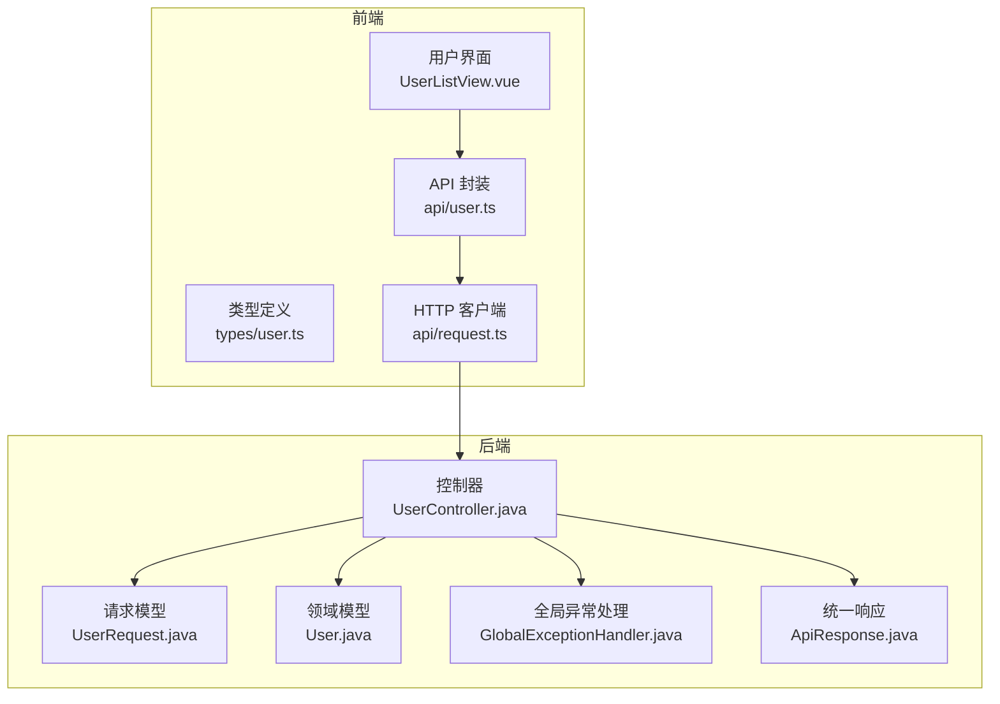
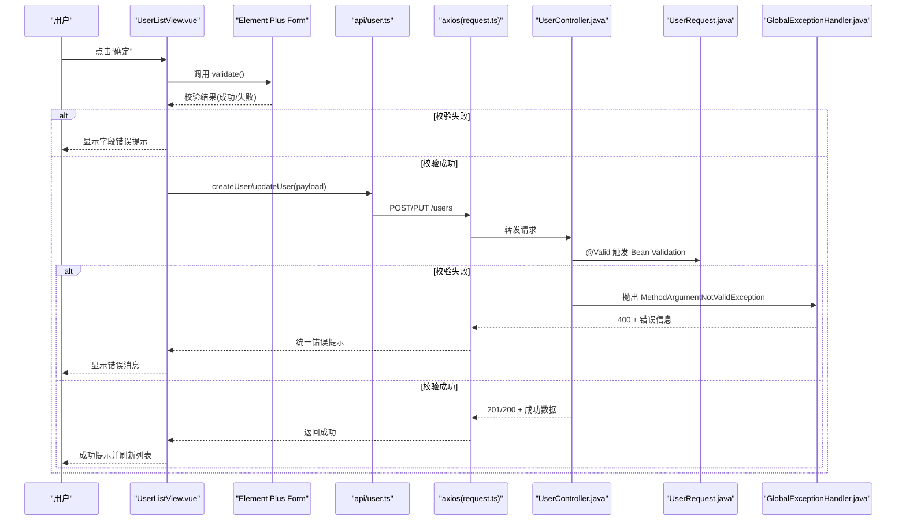
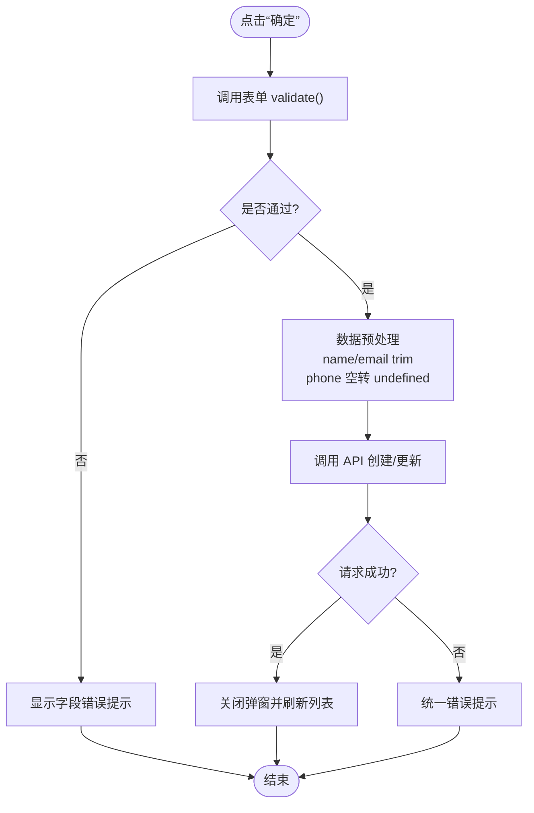
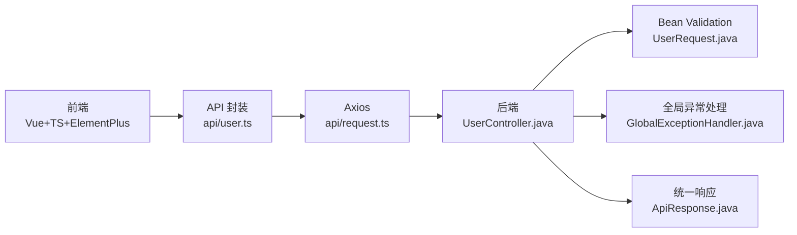

# 用户表单验证

<cite>
**本文引用的文件**
- [UserListView.vue](file://frontend/src/views/UserListView.vue)
- [user.ts](file://frontend/src/types/user.ts)
- [user.ts](file://frontend/src/api/user.ts)
- [request.ts](file://frontend/src/api/request.ts)
- [UserRequest.java](file://backend/src/main/java/com/aicoding/backend/dto/UserRequest.java)
- [User.java](file://backend/src/main/java/com/aicoding/backend/model/User.java)
- [UserController.java](file://backend/src/main/java/com/aicoding/backend/controller/UserController.java)
- [ApiResponse.java](file://backend/src/main/java/com/aicoding/backend/dto/ApiResponse.java)
- [GlobalExceptionHandler.java](file://backend/src/main/java/com/aicoding/backend/exception/GlobalExceptionHandler.java)
- [package.json](file://frontend/package.json)
</cite>

## 目录
1. [简介](#简介)
2. [项目结构](#项目结构)
3. [核心组件](#核心组件)
4. [架构总览](#架构总览)
5. [详细组件分析](#详细组件分析)
6. [依赖关系分析](#依赖关系分析)
7. [性能考虑](#性能考虑)
8. [故障排查指南](#故障排查指南)
9. [结论](#结论)
10. [附录](#附录)

## 简介
本文件围绕“用户表单验证”主题，系统化梳理前端基于 Element Plus 的表单规则、触发器与错误提示，以及后端基于 Bean Validation 的数据校验。文档覆盖：
- 表单数据结构 UserForm 的设计与类型定义（必填、可选、长度限制）
- 内置验证规则的使用（必填、邮箱格式等）与自定义扩展点
- 表单状态管理（表单引用、验证状态、提交状态）
- 用户交互体验（实时反馈、错误消息、重置）
- 提交流程（数据预处理、验证执行、错误处理）
- 扩展指南（自定义校验器、异步校验、第三方库集成）
- 测试策略与常见问题解决方案

## 项目结构
本项目采用前后端分离架构：
- 前端：Vue 3 + TypeScript + Element Plus，负责用户列表展示、新增/编辑弹窗表单、表单验证与 API 调用
- 后端：Spring Boot REST API，使用 Jakarta Bean Validation 对请求体进行参数校验，统一异常处理并返回 ApiResponse

图表来源
- [UserListView.vue:1-87](file://frontend/src/views/UserListView.vue#L1-L87)
- [user.ts:1-16](file://frontend/src/types/user.ts#L1-L16)
- [user.ts:1-29](file://frontend/src/api/user.ts#L1-L29)
- [request.ts:1-26](file://frontend/src/api/request.ts#L1-L26)
- [UserController.java:24-66](file://backend/src/main/java/com/aicoding/backend/controller/UserController.java#L24-L66)
- [UserRequest.java:1-25](file://backend/src/main/java/com/aicoding/backend/dto/UserRequest.java#L1-L25)
- [User.java:1-16](file://backend/src/main/java/com/aicoding/backend/model/User.java#L1-L16)
- [GlobalExceptionHandler.java:17-58](file://backend/src/main/java/com/aicoding/backend/exception/GlobalExceptionHandler.java#L17-L58)
- [ApiResponse.java:1-24](file://backend/src/main/java/com/aicoding/backend/dto/ApiResponse.java#L1-L24)

章节来源
- [UserListView.vue:1-87](file://frontend/src/views/UserListView.vue#L1-L87)
- [package.json:1-26](file://frontend/package.json#L1-L26)

## 核心组件
- 前端表单视图：包含表格、搜索、分页、新增/编辑弹窗与表单；通过 Element Plus 的 el-form、el-form-item 实现字段级验证与错误提示
- 类型定义：User 表示后端返回实体，UserForm 表示新增/编辑提交的表单数据
- API 层：封装增删改查接口，统一 baseURL 与超时配置，并在响应拦截器中统一错误提示
- 后端控制器：提供 RESTful 接口，使用 @Valid 触发 Bean Validation 校验
- 后端校验模型：使用注解声明必填、邮箱格式、长度限制等规则
- 全局异常处理：将校验失败、JSON 解析错误、类型不匹配等异常转换为统一 ApiResponse

章节来源
- [UserListView.vue:71-85](file://frontend/src/views/UserListView.vue#L71-L85)
- [user.ts:1-16](file://frontend/src/types/user.ts#L1-L16)
- [user.ts:1-29](file://frontend/src/api/user.ts#L1-L29)
- [request.ts:1-26](file://frontend/src/api/request.ts#L1-L26)
- [UserController.java:46-57](file://backend/src/main/java/com/aicoding/backend/controller/UserController.java#L46-L57)
- [UserRequest.java:10-23](file://backend/src/main/java/com/aicoding/backend/dto/UserRequest.java#L10-L23)
- [GlobalExceptionHandler.java:27-35](file://backend/src/main/java/com/aicoding/backend/exception/GlobalExceptionHandler.java#L27-L35)

## 架构总览
下图展示了从用户操作到后端校验再到错误回显的完整链路。

图表来源
- [UserListView.vue:183-208](file://frontend/src/views/UserListView.vue#L183-L208)
- [user.ts:15-23](file://frontend/src/api/user.ts#L15-L23)
- [request.ts:13-23](file://frontend/src/api/request.ts#L13-L23)
- [UserController.java:46-57](file://backend/src/main/java/com/aicoding/backend/controller/UserController.java#L46-L57)
- [UserRequest.java:10-23](file://backend/src/main/java/com/aicoding/backend/dto/UserRequest.java#L10-L23)
- [GlobalExceptionHandler.java:27-35](file://backend/src/main/java/com/aicoding/backend/exception/GlobalExceptionHandler.java#L27-L35)

## 详细组件分析

### 前端表单与验证（UserListView.vue）
- 表单结构与绑定
  - 使用 el-form 绑定 model 与 rules，并通过 ref 获取表单实例以调用 validate/resetFields
  - 表单项通过 prop 关联规则，支持 maxlength 控制输入长度
- 规则定义与触发器
  - 姓名：必填，失焦时触发
  - 邮箱：必填，失焦时触发；同时启用内置 email 类型校验，在失焦和变更时触发
- 状态管理
  - formRef：表单实例引用，用于手动触发验证与重置
  - submitting：提交按钮 loading 状态
  - dialogVisible/isEdit/editingId：控制弹窗可见性与编辑模式
- 用户交互
  - 打开弹窗时根据编辑/新增填充表单
  - 关闭弹窗时重置表单字段
  - 提交前执行 validate，通过后进行数据预处理（trim、phone 空值处理），再调用 API
  - 成功后关闭弹窗并刷新列表
- 错误提示
  - 字段级错误由 Element Plus 自动渲染
  - 网络或服务器错误由 axios 响应拦截器统一提示

图表来源
- [UserListView.vue:183-208](file://frontend/src/views/UserListView.vue#L183-L208)
- [UserListView.vue:117-123](file://frontend/src/views/UserListView.vue#L117-L123)
- [UserListView.vue:175-181](file://frontend/src/views/UserListView.vue#L175-L181)

章节来源
- [UserListView.vue:71-85](file://frontend/src/views/UserListView.vue#L71-L85)
- [UserListView.vue:110-123](file://frontend/src/views/UserListView.vue#L110-L123)
- [UserListView.vue:160-181](file://frontend/src/views/UserListView.vue#L160-L181)
- [UserListView.vue:183-208](file://frontend/src/views/UserListView.vue#L183-L208)

### 数据类型设计（types/user.ts）
- User：后端返回的用户实体，包含 id、name、email、phone（可为空）、createdAt
- UserForm：新增/编辑提交的表单数据，name 与 email 为必填字符串，phone 为可选字符串
- 该类型约束了前端表单数据的结构，确保后续 API 调用与后端 DTO 的一致性

章节来源
- [user.ts:1-16](file://frontend/src/types/user.ts#L1-L16)

### API 层封装（api/user.ts）
- 提供 listUsers、getUser、createUser、updateUser、deleteUser 五个方法
- 所有方法均基于统一的 request 实例，自动携带 baseURL 与超时配置
- 返回值类型为 ApiResponse<T>，便于前端统一处理成功/失败

章节来源
- [user.ts:1-29](file://frontend/src/api/user.ts#L1-L29)

### HTTP 客户端与错误处理（api/request.ts）
- 统一 baseURL 与 timeout
- 响应拦截器：成功时直接返回 response.data；失败时提取 message 并通过 ElMessage.error 统一提示
- 保证上层业务无需重复处理通用错误逻辑

章节来源
- [request.ts:1-26](file://frontend/src/api/request.ts#L1-L26)

### 后端控制器与校验入口（UserController.java）
- 提供 GET/POST/PUT/DELETE 接口
- 新增与更新接口使用 @Valid 触发对 UserRequest 的校验
- 成功时返回 ApiResponse.success(...)，失败由全局异常处理器统一处理

章节来源
- [UserController.java:24-66](file://backend/src/main/java/com/aicoding/backend/controller/UserController.java#L24-L66)

### 后端校验模型（UserRequest.java）
- name：@NotBlank、@Size(max=50)
- email：@NotBlank、@Email、@Size(max=100)
- phone：@Size(max=20)，可选
- 这些注解定义了服务端强制校验规则，与前端规则形成双重保障

章节来源
- [UserRequest.java:10-23](file://backend/src/main/java/com/aicoding/backend/dto/UserRequest.java#L10-L23)

### 领域模型（User.java）
- 记录用户持久化字段：id、name、email、phone、createdAt
- 作为服务层与数据库之间的数据传输载体

章节来源
- [User.java:1-16](file://backend/src/main/java/com/aicoding/backend/model/User.java#L1-L16)

### 统一响应与异常处理（ApiResponse.java、GlobalExceptionHandler.java）
- ApiResponse：统一 code/message/data 结构，提供 success/error 静态工厂方法
- GlobalExceptionHandler：
  - 参数校验失败：MethodArgumentNotValidException -> 400，拼接字段错误信息
  - JSON 解析失败：HttpMessageNotReadableException -> 400
  - 路径参数类型不匹配：MethodArgumentTypeMismatchException -> 400
  - 兜底异常：Exception -> 500
- 前端通过 axios 响应拦截器统一捕获并提示错误

章节来源
- [ApiResponse.java:1-24](file://backend/src/main/java/com/aicoding/backend/dto/ApiResponse.java#L1-L24)
- [GlobalExceptionHandler.java:17-58](file://backend/src/main/java/com/aicoding/backend/exception/GlobalExceptionHandler.java#L17-L58)

## 依赖关系分析
- 前端依赖
  - Vue 3 与 TypeScript 构建应用
  - Element Plus 提供表单、消息、对话框等 UI 能力
  - Axios 发起 HTTP 请求
- 后端依赖
  - Spring Boot Web 与 Validation 提供 REST 与参数校验
  - 统一响应与异常处理贯穿整个控制器层

图表来源
- [package.json:11-16](file://frontend/package.json#L11-L16)
- [user.ts:1-29](file://frontend/src/api/user.ts#L1-L29)
- [request.ts:1-26](file://frontend/src/api/request.ts#L1-L26)
- [UserController.java:24-66](file://backend/src/main/java/com/aicoding/backend/controller/UserController.java#L24-L66)
- [UserRequest.java:10-23](file://backend/src/main/java/com/aicoding/backend/dto/UserRequest.java#L10-L23)
- [GlobalExceptionHandler.java:17-58](file://backend/src/main/java/com/aicoding/backend/exception/GlobalExceptionHandler.java#L17-L58)
- [ApiResponse.java:1-24](file://backend/src/main/java/com/aicoding/backend/dto/ApiResponse.java#L1-L24)

章节来源
- [package.json:11-16](file://frontend/package.json#L11-L16)

## 性能考虑
- 前端
  - 表单验证触发器选择 blur/change，避免过度频繁校验影响性能
  - 提交前一次性 validate，减少多次无效请求
  - 列表分页与过滤在前端完成，降低后端压力
- 后端
  - 使用 Bean Validation 在服务端做最终校验，避免脏数据入库
  - 统一异常处理减少分支判断开销
  - 合理设置超时时间，避免长连接占用资源

## 故障排查指南
- 表单无法提交
  - 检查表单 ref 是否正确绑定，validate 是否被调用
  - 检查 rules 中字段 prop 是否与表单 v-model 一致
- 字段错误未显示
  - 确认 el-form-item 的 prop 与 rules 中的键名一致
  - 确认 trigger 是否设置为 blur/change，必要时改为 immediate 或 focus
- 后端返回 400
  - 查看 GlobalExceptionHandler 的错误拼接信息，定位具体字段
  - 核对前端提交数据是否符合 UserRequest 的注解约束
- 网络请求失败
  - 检查 axios 响应拦截器是否统一提示错误
  - 确认 baseURL 与后端路由是否一致
- 弹窗关闭后表单状态残留
  - 确保在 @closed 回调中调用 resetFields 并清空本地字段

章节来源
- [UserListView.vue:175-181](file://frontend/src/views/UserListView.vue#L175-L181)
- [UserListView.vue:183-208](file://frontend/src/views/UserListView.vue#L183-L208)
- [request.ts:13-23](file://frontend/src/api/request.ts#L13-L23)
- [GlobalExceptionHandler.java:27-35](file://backend/src/main/java/com/aicoding/backend/exception/GlobalExceptionHandler.java#L27-L35)

## 结论
本项目通过“前端 Element Plus 表单验证 + 后端 Bean Validation”的双重校验机制，实现了健壮的用户表单验证流程。前端负责即时反馈与用户体验优化，后端确保数据合法性与一致性。统一的响应与异常处理使得错误提示清晰可控，便于维护与扩展。

## 附录

### 表单规则与字段说明
- 姓名（name）
  - 必填，最大长度 50
  - 前端：blur 触发必填校验
  - 后端：@NotBlank、@Size(max=50)
- 邮箱（email）
  - 必填，最大长度 100，需符合邮箱格式
  - 前端：blur/change 触发必填与 email 类型校验
  - 后端：@NotBlank、@Email、@Size(max=100)
- 手机号（phone）
  - 可选，最大长度 20
  - 前端：maxlength 限制输入长度
  - 后端：@Size(max=20)

章节来源
- [UserListView.vue:117-123](file://frontend/src/views/UserListView.vue#L117-L123)
- [UserRequest.java:10-23](file://backend/src/main/java/com/aicoding/backend/dto/UserRequest.java#L10-L23)

### 表单状态管理要点
- 表单引用：formRef 用于 validate/resetFields
- 提交状态：submitting 控制按钮 loading
- 弹窗状态：dialogVisible/isEdit/editingId 控制新增/编辑模式与数据回填
- 重置策略：关闭弹窗时重置表单并清空编辑标识

章节来源
- [UserListView.vue:110-115](file://frontend/src/views/UserListView.vue#L110-L115)
- [UserListView.vue:160-181](file://frontend/src/views/UserListView.vue#L160-L181)

### 提交流程与错误处理
- 数据预处理：trim 去除首尾空格，phone 为空时转为 undefined
- 验证执行：调用 validate，失败则中断提交
- 错误处理：后端校验失败返回 400，前端统一提示；网络错误由 axios 拦截器提示

章节来源
- [UserListView.vue:183-208](file://frontend/src/views/UserListView.vue#L183-L208)
- [request.ts:13-23](file://frontend/src/api/request.ts#L13-L23)
- [GlobalExceptionHandler.java:27-35](file://backend/src/main/java/com/aicoding/backend/exception/GlobalExceptionHandler.java#L27-L35)

### 扩展指南
- 添加自定义验证器（前端）
  - 在 rules 中为字段添加自定义 validator 函数，实现复杂业务规则
  - 可结合 async-validator 的能力实现异步校验
- 实现异步验证（前端）
  - 在 validator 中返回 Promise，根据异步结果 resolve/reject
  - 注意防抖与取消重复请求
- 集成第三方验证库（前端）
  - 引入如 zod/yup 等库，在提交前对 form 数据进行校验，再将错误映射为 Element Plus 规则
- 后端扩展
  - 在 UserRequest 中添加更多注解或使用自定义 ConstraintValidator
  - 在 GlobalExceptionHandler 中细化错误信息输出

[本节为概念性指导，不直接分析具体代码文件]

### 测试策略
- 单元测试
  - 前端：对表单规则与数据处理函数进行断言
  - 后端：对 Controller 与 Service 进行 Mock 测试，覆盖校验失败场景
- 集成测试
  - 端到端测试：模拟用户操作，验证表单提交、错误提示与数据更新
- 边界用例
  - 超长输入、非法邮箱、空值、特殊字符等

[本节为概念性指导，不直接分析具体代码文件]