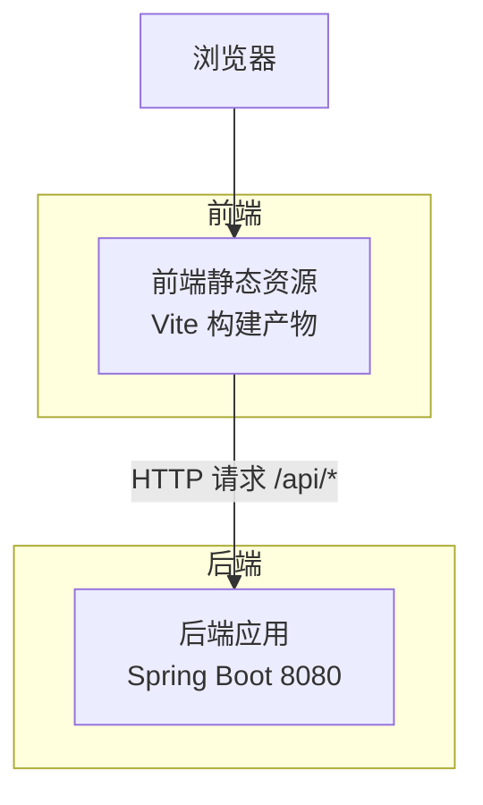
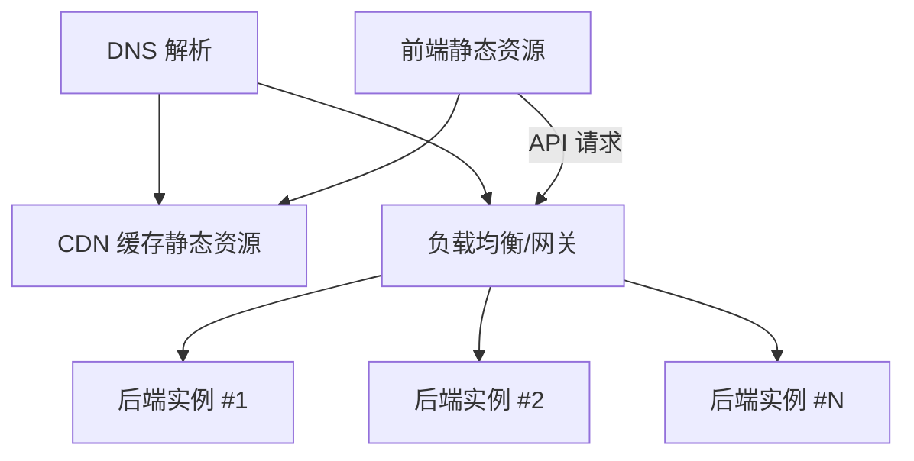
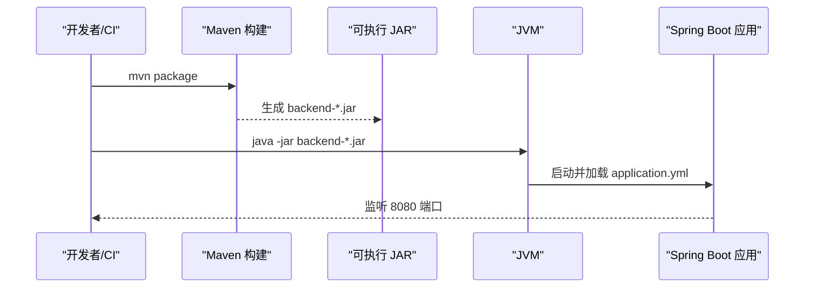
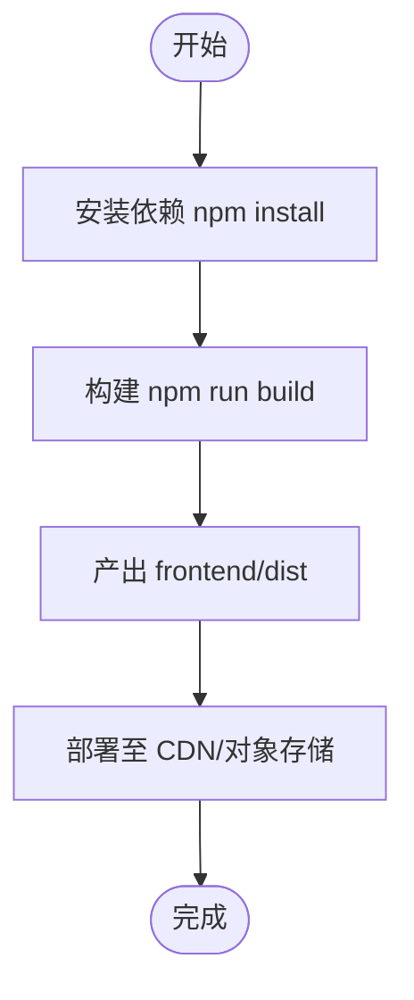
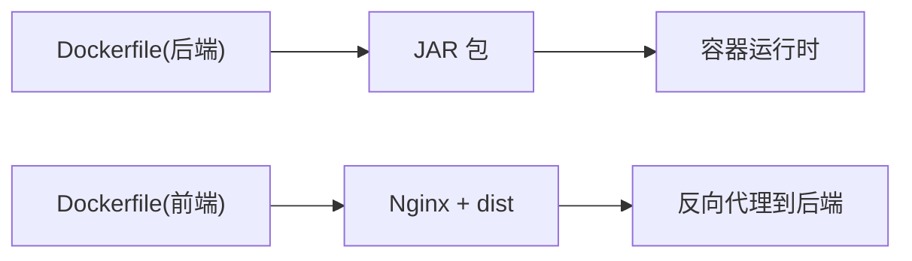
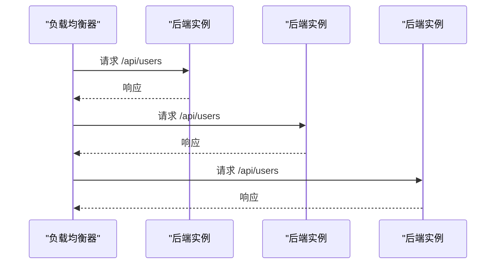
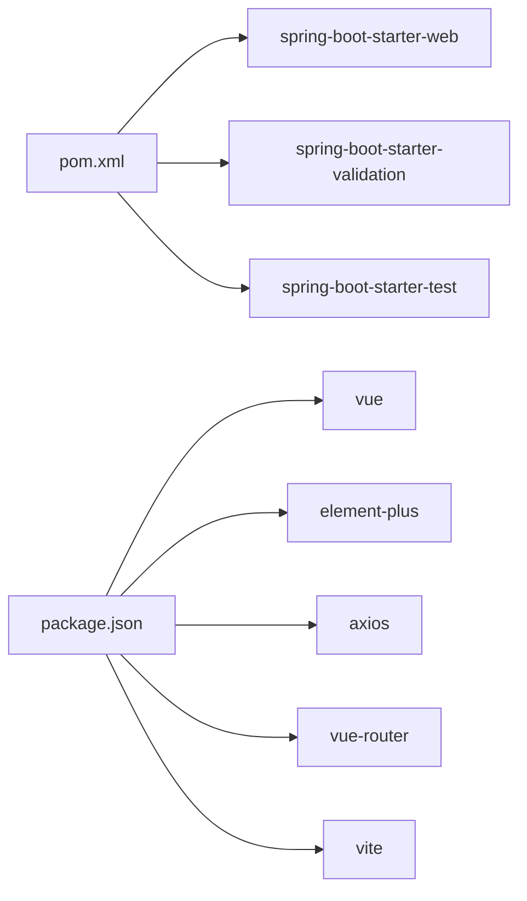

# 部署指南

<cite>
**本文引用的文件**
- [backend/pom.xml](file://backend/pom.xml)
- [backend/src/main/resources/application.yml](file://backend/src/main/resources/application.yml)
- [backend/src/main/java/com/aicoding/backend/BackendApplication.java](file://backend/src/main/java/com/aicoding/backend/BackendApplication.java)
- [backend/src/main/java/com/aicoding/backend/config/WebCorsConfig.java](file://backend/src/main/java/com/aicoding/backend/config/WebCorsConfig.java)
- [backend/src/main/java/com/aicoding/backend/controller/UserController.java](file://backend/src/main/java/com/aicoding/backend/controller/UserController.java)
- [frontend/package.json](file://frontend/package.json)
- [frontend/vite.config.ts](file://frontend/vite.config.ts)
- [frontend/src/api/request.ts](file://frontend/src/api/request.ts)
- [README.md](file://README.md)
</cite>

## 目录
1. [简介](#简介)
2. [项目结构](#项目结构)
3. [核心组件](#核心组件)
4. [架构总览](#架构总览)
5. [详细组件分析](#详细组件分析)
6. [依赖关系分析](#依赖关系分析)
7. [性能考虑](#性能考虑)
8. [故障排查指南](#故障排查指南)
9. [结论](#结论)
10. [附录](#附录)

## 简介
本指南面向生产环境，提供该前后端分离项目的完整部署方案。内容涵盖：后端 Maven 构建与 JAR 运行、环境变量配置；前端生产构建与静态资源优化、CDN 部署；Docker 容器化与镜像编排；多实例高可用、负载均衡与健康检查；监控与日志收集；主流云平台（AWS、Azure、阿里云）的部署步骤；安全基线与性能调优建议；回滚策略与版本管理最佳实践。

## 项目结构
该项目采用前后端分离架构：
- 后端：Spring Boot 3.x + Java 21，Maven 构建，默认端口 8080，提供 /api/users REST API。
- 前端：Vue 3 + TypeScript + Vite，开发时通过代理访问后端，生产构建产物位于 frontend/dist。

**图表来源**
- [backend/src/main/java/com/aicoding/backend/controller/UserController.java:24-65](file://backend/src/main/java/com/aicoding/backend/controller/UserController.java#L24-L65)
- [frontend/vite.config.ts:14-23](file://frontend/vite.config.ts#L14-L23)
- [frontend/src/api/request.ts:8-11](file://frontend/src/api/request.ts#L8-L11)

**章节来源**
- [README.md:1-124](file://README.md#L1-L124)
- [backend/pom.xml:1-51](file://backend/pom.xml#L1-L51)
- [frontend/package.json:1-26](file://frontend/package.json#L1-L26)

## 核心组件
- 后端启动类：定义 Spring Boot 应用入口。
- CORS 配置：允许开发期前端跨域访问。
- 用户控制器：暴露 /api/users 的 CRUD 接口。
- 前端请求封装：统一 baseURL、超时与错误提示。
- 构建配置：Maven 打包插件、Vite 构建脚本与代理配置。

**章节来源**
- [backend/src/main/java/com/aicoding/backend/BackendApplication.java:1-16](file://backend/src/main/java/com/aicoding/backend/BackendApplication.java#L1-L16)
- [backend/src/main/java/com/aicoding/backend/config/WebCorsConfig.java:1-24](file://backend/src/main/java/com/aicoding/backend/config/WebCorsConfig.java#L1-L24)
- [backend/src/main/java/com/aicoding/backend/controller/UserController.java:24-65](file://backend/src/main/java/com/aicoding/backend/controller/UserController.java#L24-L65)
- [frontend/src/api/request.ts:1-26](file://frontend/src/api/request.ts#L1-L26)
- [backend/pom.xml:41-48](file://backend/pom.xml#L41-L48)
- [frontend/package.json:6-9](file://frontend/package.json#L6-L9)
- [frontend/vite.config.ts:14-23](file://frontend/vite.config.ts#L14-L23)

## 架构总览
生产环境推荐架构：
- 反向代理/网关（如 Nginx/云厂商 LB）将域名流量分发到后端实例。
- 多实例后端横向扩展，会话无状态或共享。
- 前端静态资源托管至对象存储/CDN，减少源站压力。
- 集中式日志与指标采集，配合告警。

[此图为概念性架构图，不直接映射具体源码文件]

## 详细组件分析

### 后端构建与部署（Maven + JAR）
- 构建目标：使用 spring-boot-maven-plugin 生成可执行 JAR。
- 运行方式：java -jar 启动，默认端口 8080，可通过环境变量覆盖。
- 关键配置：application.yml 中定义了服务名、端口与日志级别。

**图表来源**
- [backend/pom.xml:41-48](file://backend/pom.xml#L41-L48)
- [backend/src/main/resources/application.yml:1-11](file://backend/src/main/resources/application.yml#L1-L11)
- [backend/src/main/java/com/aicoding/backend/BackendApplication.java:1-16](file://backend/src/main/java/com/aicoding/backend/BackendApplication.java#L1-L16)

**章节来源**
- [backend/pom.xml:1-51](file://backend/pom.xml#L1-L51)
- [backend/src/main/resources/application.yml:1-11](file://backend/src/main/resources/application.yml#L1-L11)
- [README.md:81-90](file://README.md#L81-L90)

### 环境变量与外部化配置
- 端口与环境：可通过环境变量覆盖 server.port、spring.application.name、日志级别等。
- 建议：在 CI/CD 或平台环境中以环境变量注入敏感信息（如未来接入数据库密码）。
- 当前默认：application.yml 已设置端口与服务名，可直接运行。

**章节来源**
- [backend/src/main/resources/application.yml:1-11](file://backend/src/main/resources/application.yml#L1-L11)

### 前端构建与优化（Vite）
- 构建命令：npm run build 输出至 dist 目录。
- 开发代理：vite.config.ts 将 /api 请求代理到后端，便于联调。
- 生产部署：将 dist 静态资源上传至 CDN 或对象存储，并在反向代理中指向后端 API。

**图表来源**
- [frontend/package.json:6-9](file://frontend/package.json#L6-L9)
- [frontend/vite.config.ts:14-23](file://frontend/vite.config.ts#L14-L23)

**章节来源**
- [frontend/package.json:1-26](file://frontend/package.json#L1-L26)
- [frontend/vite.config.ts:1-25](file://frontend/vite.config.ts#L1-L25)
- [frontend/src/api/request.ts:8-11](file://frontend/src/api/request.ts#L8-L11)

### Docker 容器化部署
- 后端镜像：基于 JDK 21 精简镜像，复制 JAR 并暴露 8080 端口。
- 前端镜像：基于 Nginx，将 dist 复制到站点目录，并配置反向代理到后端。
- 编排建议：使用 Compose 或平台编排服务拉起多实例，结合健康检查与滚动更新。

[本节为通用容器化指导，未直接引用仓库中的 Dockerfile]

### 负载均衡与高可用
- 多实例：同一后端服务部署多个副本，由负载均衡器分发流量。
- 会话共享：当前实现无状态，适合水平扩展；若后续引入会话需使用 Redis 等共享存储。
- 健康检查：对后端 /api 根路径或自定义健康端点配置探针，剔除异常实例。

[此图为概念性流程，不直接映射具体源码文件]

### 监控与日志收集
- 应用指标：可在后端集成指标采集（如 Micrometer），暴露指标端点供监控系统抓取。
- 日志收集：将应用日志输出到标准输出或文件，由日志采集器统一收集并检索。
- 告警机制：基于错误率、延迟、可用性阈值设置告警规则。

[本节为通用监控建议，未直接引用仓库中的监控代码]

### 云平台部署要点
- AWS：ECS/EKS 或 Elastic Beanstalk 部署后端；S3+CloudFront 托管前端静态资源；ALB/NLB 做负载均衡。
- Azure：App Service 或 AKS 部署后端；Azure Blob Storage + CDN 托管前端；Application Gateway 做负载均衡。
- 阿里云：ACK/SAE 部署后端；OSS + CDN 托管前端；ALB 做负载均衡。

[本节为通用平台指引，不直接引用仓库源码]

## 依赖关系分析
后端依赖 Spring Web、Validation 与测试依赖；前端依赖 Vue、Element Plus、Axios、Vite 及类型工具。

**图表来源**
- [backend/pom.xml:24-39](file://backend/pom.xml#L24-L39)
- [frontend/package.json:11-24](file://frontend/package.json#L11-L24)

**章节来源**
- [backend/pom.xml:1-51](file://backend/pom.xml#L1-L51)
- [frontend/package.json:1-26](file://frontend/package.json#L1-L26)

## 性能考虑
- 后端
  - 合理设置 JVM 堆大小与 GC 参数，避免频繁 Full GC。
  - 启用连接池与线程池优化（如 Tomcat 线程数、连接数）。
  - 针对热点接口添加缓存层（如本地缓存或分布式缓存）。
- 前端
  - 开启 Gzip/Brotli 压缩，启用 HTTP 缓存头。
  - 拆分路由与懒加载，减少首屏体积。
  - 静态资源上 CDN，降低网络延迟。
- 整体
  - 使用 HTTPS，启用 HSTS。
  - 限制请求频率，防止滥用。
  - 容量规划与弹性伸缩策略。

[本节为通用性能建议，不直接引用仓库源码]

## 故障排查指南
- 启动失败
  - 检查端口占用与权限；确认 application.yml 配置正确。
  - 查看 JVM 启动日志与系统日志定位异常。
- 接口报错
  - 核对请求路径与方法；检查 CORS 配置是否匹配生产域名。
  - 查看后端日志与前端控制台错误信息。
- 前端无法访问 API
  - 生产环境确保前端 baseURL 指向正确的域名或网关路径。
  - 检查反向代理规则与跨域策略。

**章节来源**
- [backend/src/main/resources/application.yml:1-11](file://backend/src/main/resources/application.yml#L1-L11)
- [backend/src/main/java/com/aicoding/backend/config/WebCorsConfig.java:14-22](file://backend/src/main/java/com/aicoding/backend/config/WebCorsConfig.java#L14-L22)
- [frontend/src/api/request.ts:8-23](file://frontend/src/api/request.ts#L8-L23)

## 结论
本项目采用前后端分离架构，后端基于 Spring Boot 提供 REST API，前端基于 Vue 3 + Vite 构建。生产部署建议通过反向代理与负载均衡提升可用性，使用 CDN 加速静态资源，结合容器化与编排实现弹性伸缩与快速发布。配合完善的监控与日志体系，保障系统稳定运行。

[本节为总结性内容，不直接引用仓库源码]

## 附录

### 后端构建与运行清单
- 构建：mvn package 生成可执行 JAR。
- 运行：java -jar target/backend-*.jar。
- 配置：通过环境变量覆盖端口、应用名与日志级别。

**章节来源**
- [backend/pom.xml:41-48](file://backend/pom.xml#L41-L48)
- [backend/src/main/resources/application.yml:1-11](file://backend/src/main/resources/application.yml#L1-L11)
- [README.md:81-90](file://README.md#L81-L90)

### 前端构建与部署清单
- 构建：npm run build 产出 dist。
- 部署：将 dist 上传至 CDN/对象存储，配置域名与缓存策略。
- 联调：开发环境通过 vite.config.ts 代理 /api 到后端。

**章节来源**
- [frontend/package.json:6-9](file://frontend/package.json#L6-L9)
- [frontend/vite.config.ts:14-23](file://frontend/vite.config.ts#L14-L23)
- [frontend/src/api/request.ts:8-11](file://frontend/src/api/request.ts#L8-L11)

### 安全基线检查清单
- 强制 HTTPS，关闭不必要的端口。
- 最小权限原则运行应用进程。
- 定期更新依赖与基础镜像。
- 输入校验与输出编码，防范常见注入漏洞。
- 敏感信息通过环境变量或密钥管理服务注入。

[本节为通用安全建议，不直接引用仓库源码]

### 回滚策略与版本管理
- 版本化：为每次发布打标签，保留历史 JAR 与前端构建产物。
- 灰度发布：先小流量验证，再全量发布。
- 快速回滚：保留上一版本镜像/JAR，一键切换。
- 数据兼容：变更接口与数据结构时保持向后兼容。

[本节为通用版本管理建议，不直接引用仓库源码]