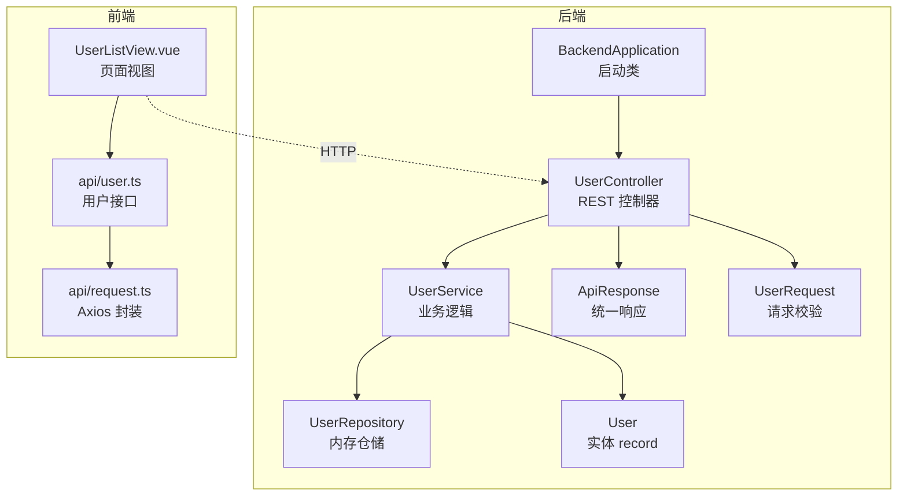
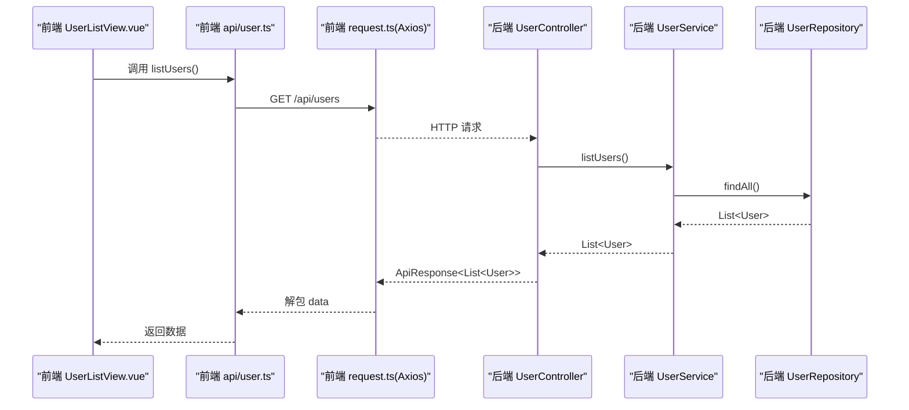
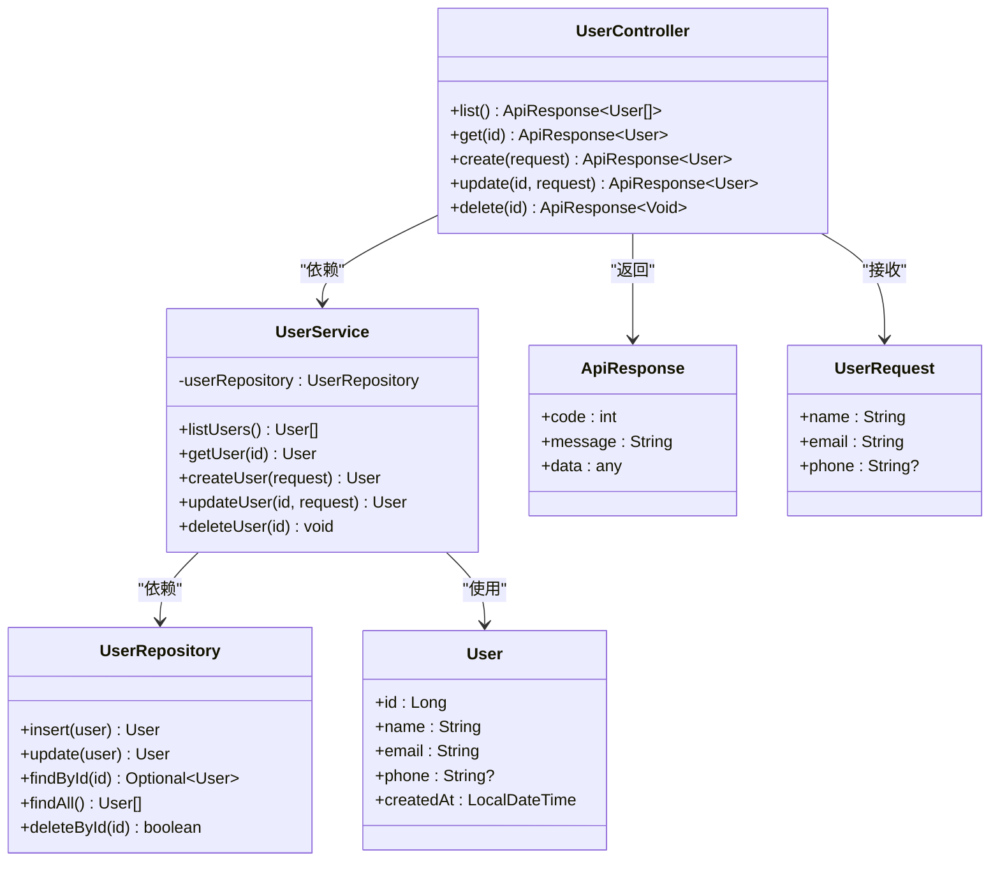
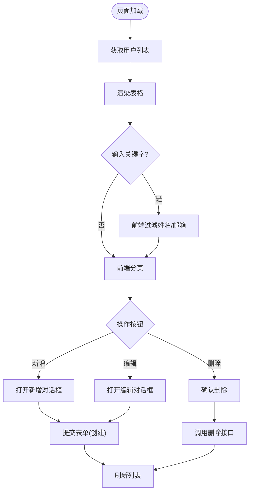
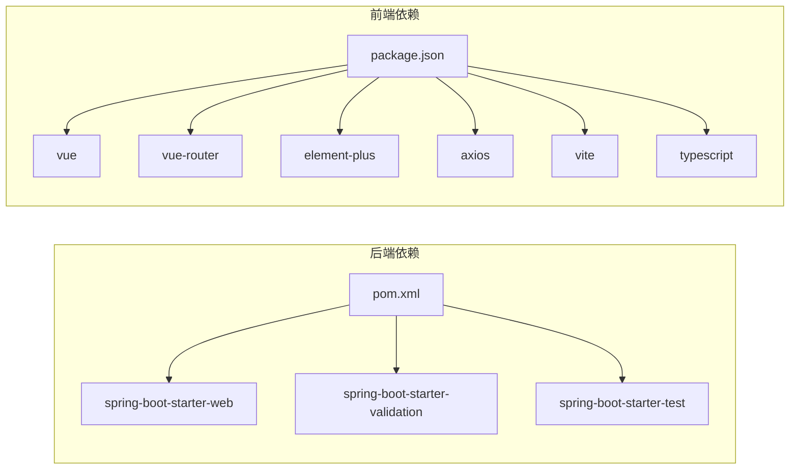

# 项目概述

<cite>
**本文引用的文件**
- [README.md](file://README.md)
- [pom.xml](file://backend/pom.xml)
- [application.yml](file://backend/src/main/resources/application.yml)
- [BackendApplication.java](file://backend/src/main/java/com/aicoding/backend/BackendApplication.java)
- [UserController.java](file://backend/src/main/java/com/aicoding/backend/controller/UserController.java)
- [UserService.java](file://backend/src/main/java/com/aicoding/backend/service/UserService.java)
- [UserRepository.java](file://backend/src/main/java/com/aicoding/backend/repository/UserRepository.java)
- [User.java](file://backend/src/main/java/com/aicoding/backend/model/User.java)
- [ApiResponse.java](file://backend/src/main/java/com/aicoding/backend/dto/ApiResponse.java)
- [UserRequest.java](file://backend/src/main/java/com/aicoding/backend/dto/UserRequest.java)
- [package.json](file://frontend/package.json)
- [request.ts](file://frontend/src/api/request.ts)
- [user.ts](file://frontend/src/api/user.ts)
- [UserListView.vue](file://frontend/src/views/UserListView.vue)
- [user.ts（类型定义）](file://frontend/src/types/user.ts)
</cite>

## 目录
1. [简介](#简介)
2. [项目结构](#项目结构)
3. [核心组件](#核心组件)
4. [架构总览](#架构总览)
5. [详细组件分析](#详细组件分析)
6. [依赖关系分析](#依赖关系分析)
7. [性能考量](#性能考量)
8. [故障排查指南](#故障排查指南)
9. [结论](#结论)
10. [附录：快速开始](#附录快速开始)

## 简介
本项目是一个前后端分离的“用户管理系统”示例，提供完整的用户 CRUD 能力与响应式前端界面。后端基于 Spring Boot 3.x，使用内存存储实现数据持久化；前端基于 Vue 3 + TypeScript，采用 Vite 构建、Element Plus UI 组件库与 Axios 请求封装。项目遵循 RESTful API 设计原则与分层架构模式，便于初学者理解全栈开发流程，也为有经验的开发者提供可扩展的基础骨架。

## 项目结构
仓库采用前后端分离的组织方式：
- backend：Spring Boot 应用，暴露 /api/users 系列接口，端口默认 8080。
- frontend：Vue 3 + TypeScript 单页应用，通过 Vite 启动开发服务器，端口默认 5173，并将 /api 请求代理到后端。

图表来源
- [BackendApplication.java:1-16](file://backend/src/main/java/com/aicoding/backend/BackendApplication.java#L1-L16)
- [UserController.java:1-66](file://backend/src/main/java/com/aicoding/backend/controller/UserController.java#L1-L66)
- [UserService.java:1-57](file://backend/src/main/java/com/aicoding/backend/service/UserService.java#L1-L57)
- [UserRepository.java:1-55](file://backend/src/main/java/com/aicoding/backend/repository/UserRepository.java#L1-L55)
- [User.java:1-16](file://backend/src/main/java/com/aicoding/backend/model/User.java#L1-L16)
- [ApiResponse.java:1-24](file://backend/src/main/java/com/aicoding/backend/dto/ApiResponse.java#L1-L24)
- [UserRequest.java:1-25](file://backend/src/main/java/com/aicoding/backend/dto/UserRequest.java#L1-L25)
- [UserListView.vue:1-278](file://frontend/src/views/UserListView.vue#L1-L278)
- [user.ts（API）:1-29](file://frontend/src/api/user.ts#L1-L29)
- [request.ts:1-26](file://frontend/src/api/request.ts#L1-L26)

章节来源
- [README.md:18-49](file://README.md#L18-L49)
- [application.yml:1-11](file://backend/src/main/resources/application.yml#L1-L11)

## 核心组件
- 启动入口：Spring Boot 应用启动类负责装配与启动 Web 容器。
- 控制器层：定义 RESTful 路由，接收请求并调用服务层。
- 服务层：编排业务逻辑，包含示例数据初始化与异常抛出。
- 仓储层：内存级数据存储，提供增删改查操作。
- 模型与 DTO：用户实体 record 与请求参数对象，配合 Bean Validation 进行入参校验。
- 统一响应：标准化返回结构，便于前端解析。
- 前端视图：表格展示、搜索过滤、分页、弹窗表单、删除确认等交互。
- 前端网络层：Axios 实例统一 baseURL、超时与错误提示。

章节来源
- [BackendApplication.java:1-16](file://backend/src/main/java/com/aicoding/backend/BackendApplication.java#L1-L16)
- [UserController.java:1-66](file://backend/src/main/java/com/aicoding/backend/controller/UserController.java#L1-L66)
- [UserService.java:1-57](file://backend/src/main/java/com/aicoding/backend/service/UserService.java#L1-L57)
- [UserRepository.java:1-55](file://backend/src/main/java/com/aicoding/backend/repository/UserRepository.java#L1-L55)
- [User.java:1-16](file://backend/src/main/java/com/aicoding/backend/model/User.java#L1-L16)
- [ApiResponse.java:1-24](file://backend/src/main/java/com/aicoding/backend/dto/ApiResponse.java#L1-L24)
- [UserRequest.java:1-25](file://backend/src/main/java/com/aicoding/backend/dto/UserRequest.java#L1-L25)
- [UserListView.vue:1-278](file://frontend/src/views/UserListView.vue#L1-L278)
- [request.ts:1-26](file://frontend/src/api/request.ts#L1-L26)

## 架构总览
系统采用典型的前后端分离与分层架构：
- 前后端分离：前端通过 HTTP 调用后端 REST API，跨域由后端配置支持，开发时前端将 /api 请求代理至后端。
- 分层架构：Controller → Service → Repository，职责清晰，易于扩展为数据库访问。
- RESTful 设计：资源以 /api/users 为中心，使用 GET/POST/PUT/DELETE 表达不同操作。
- 统一响应：后端统一 ApiResponse 包装，前端 axios 拦截器统一处理错误提示。

图表来源
- [UserListView.vue:148-158](file://frontend/src/views/UserListView.vue#L148-L158)
- [user.ts（API）:5-8](file://frontend/src/api/user.ts#L5-L8)
- [request.ts:8-25](file://frontend/src/api/request.ts#L8-L25)
- [UserController.java:34-38](file://backend/src/main/java/com/aicoding/backend/controller/UserController.java#L34-L38)
- [UserService.java:31-33](file://backend/src/main/java/com/aicoding/backend/service/UserService.java#L31-L33)
- [UserRepository.java:44-49](file://backend/src/main/java/com/aicoding/backend/repository/UserRepository.java#L44-L49)

## 详细组件分析

### 后端：控制器与服务
- 控制器职责：映射 REST 路由，接收并校验请求体，调用服务层，返回统一响应。
- 服务职责：组装业务逻辑，初始化演示数据，按 ID 查询或更新/删除用户，缺失时抛出业务异常。
- 仓储职责：基于 ConcurrentHashMap 的内存存储，提供插入、更新、查找、列表排序与删除。

图表来源
- [UserController.java:24-65](file://backend/src/main/java/com/aicoding/backend/controller/UserController.java#L24-L65)
- [UserService.java:15-56](file://backend/src/main/java/com/aicoding/backend/service/UserService.java#L15-L56)
- [UserRepository.java:16-54](file://backend/src/main/java/com/aicoding/backend/repository/UserRepository.java#L16-L54)
- [User.java:8-14](file://backend/src/main/java/com/aicoding/backend/model/User.java#L8-L14)
- [ApiResponse.java:6-23](file://backend/src/main/java/com/aicoding/backend/dto/ApiResponse.java#L6-L23)
- [UserRequest.java:10-23](file://backend/src/main/java/com/aicoding/backend/dto/UserRequest.java#L10-L23)

章节来源
- [UserController.java:1-66](file://backend/src/main/java/com/aicoding/backend/controller/UserController.java#L1-L66)
- [UserService.java:1-57](file://backend/src/main/java/com/aicoding/backend/service/UserService.java#L1-L57)
- [UserRepository.java:1-55](file://backend/src/main/java/com/aicoding/backend/repository/UserRepository.java#L1-L55)
- [User.java:1-16](file://backend/src/main/java/com/aicoding/backend/model/User.java#L1-L16)
- [ApiResponse.java:1-24](file://backend/src/main/java/com/aicoding/backend/dto/ApiResponse.java#L1-L24)
- [UserRequest.java:1-25](file://backend/src/main/java/com/aicoding/backend/dto/UserRequest.java#L1-L25)

### 前端：视图与网络层
- 视图层：使用 Element Plus 表格、分页、对话框与表单，实现搜索过滤、前端分页、新增/编辑/删除等交互。
- 网络层：Axios 实例统一 baseURL 与超时时间，响应拦截器统一解包 data 并在失败时弹出错误消息。
- 类型定义：TS 接口描述用户实体与表单字段，保证前后端数据结构一致。

图表来源
- [UserListView.vue:125-158](file://frontend/src/views/UserListView.vue#L125-L158)
- [UserListView.vue:160-228](file://frontend/src/views/UserListView.vue#L160-L228)
- [user.ts（API）:5-28](file://frontend/src/api/user.ts#L5-L28)
- [request.ts:8-25](file://frontend/src/api/request.ts#L8-L25)

章节来源
- [UserListView.vue:1-278](file://frontend/src/views/UserListView.vue#L1-278)
- [user.ts（API）:1-29](file://frontend/src/api/user.ts#L1-L29)
- [request.ts:1-26](file://frontend/src/api/request.ts#L1-L26)
- [user.ts（类型定义）:1-16](file://frontend/src/types/user.ts#L1-L16)

## 依赖关系分析
- 后端依赖：Spring Boot Web、Validation 与测试 starter；通过 Maven 插件构建可执行 Jar。
- 前端依赖：Vue 3、Vue Router、Element Plus、Axios、Vite、TypeScript 等。
- 运行时配置：后端端口 8080，应用名与日志级别在 application.yml 中配置。

图表来源
- [pom.xml:24-48](file://backend/pom.xml#L24-L48)
- [package.json:11-24](file://frontend/package.json#L11-L24)
- [application.yml:1-11](file://backend/src/main/resources/application.yml#L1-L11)

章节来源
- [pom.xml:1-51](file://backend/pom.xml#L1-L51)
- [package.json:1-26](file://frontend/package.json#L1-L26)
- [application.yml:1-11](file://backend/src/main/resources/application.yml#L1-L11)

## 性能考量
- 内存存储：使用 ConcurrentHashMap 与原子自增 ID，适合演示与轻量场景；生产环境建议替换为数据库实现以获得持久化与并发控制。
- 列表排序：仓储层对结果集按 ID 排序，避免前端重复排序开销。
- 前端分页：当前为前端分页，适用于中小数据集；大数据量时可改为服务端分页。
- 请求优化：Axios 统一 baseURL 与超时，减少重复配置；可结合缓存策略提升列表读取性能。

[本节为通用指导，不直接分析具体文件]

## 故障排查指南
- 跨域问题：后端已开启 CORS，确保前端开发服务器将 /api 代理到 8080 端口。
- 请求失败：Axios 响应拦截器会提取后端统一响应的 message 并弹窗提示；检查后端日志与接口路径。
- 数据为空：服务启动时会写入示例数据；若内存被清空或服务重启后未初始化，请检查服务构造器中的初始化逻辑。
- 端口冲突：后端默认 8080，前端默认 5173；如端口占用，修改 application.yml 或 vite 配置。

章节来源
- [request.ts:8-25](file://frontend/src/api/request.ts#L8-L25)
- [UserService.java:20-29](file://backend/src/main/java/com/aicoding/backend/service/UserService.java#L20-L29)
- [application.yml:1-11](file://backend/src/main/resources/application.yml#L1-L11)

## 结论
该项目以最小可行方案展示了前后端分离的用户管理功能，涵盖 RESTful API、统一响应、内存存储、响应式界面与基础校验。其分层清晰、职责明确，便于在此基础上扩展数据库访问、权限控制、更多页面与更复杂的业务流程。

[本节为总结性内容，不直接分析具体文件]

## 附录：快速开始
- 环境要求：JDK 21、Maven 3.8+、Node.js 18+（推荐 20+）、npm 9+。
- 启动后端：进入 backend 目录，运行 Maven 启动命令，服务监听 8080 端口。
- 启动前端：进入 frontend 目录，安装依赖并运行开发服务器，浏览器访问 5173 端口。
- 生产构建：后端打包为可执行 Jar；前端构建产物位于 dist 目录。

章节来源
- [README.md:51-90](file://README.md#L51-L90)